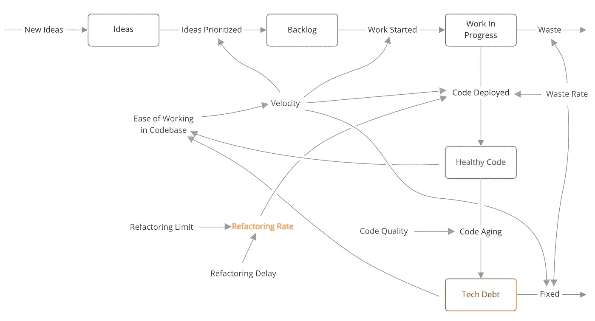
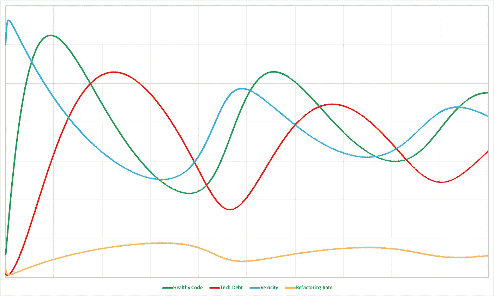
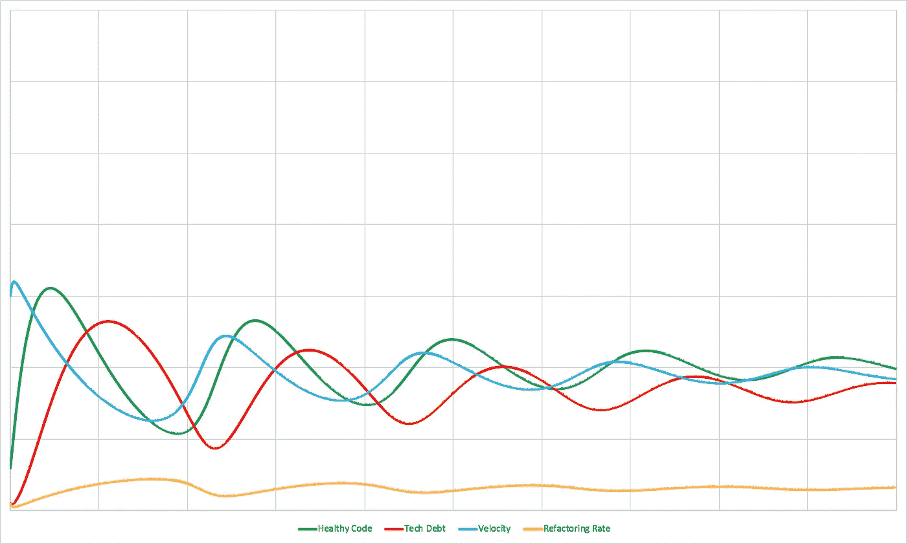
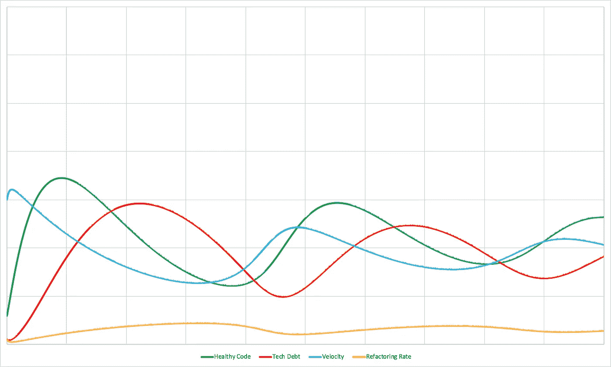
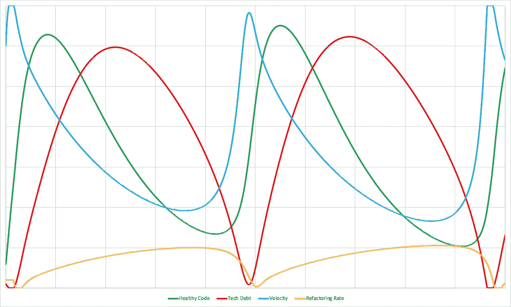
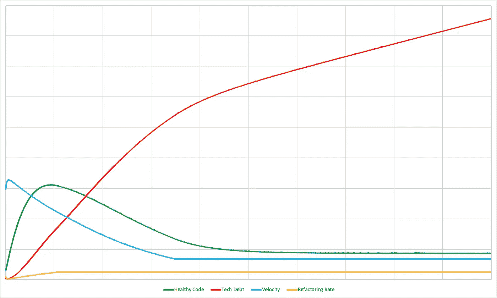

# 软件机器是如何工作的

> 原文：<https://medium.com/swlh/how-the-software-machine-works-6265b30c0fc0>

## 理解健康团队和快乐代码的系统动力学方法

管理技术项目和团队充满了艰难的决策和不完善的信息。

你应该优先考虑速度还是质量？

你应该解决技术债务还是专注于新功能？

你应该建造还是购买？

这些决定很少是直截了当的，也从来不容易。在一个地方做出的决定可能会在其他地方产生意想不到的重大后果。在选项之间导航是一种平衡行为，即使是我们当中最有经验的人也很难做到。但是做出这些选择——更重要的是，传达这些选择——是至关重要的。

一般来说，人们依靠直觉，或者更糟，最好的 Practices™️，来帮助他们做决定并证明他们的决定是正确的。但是这些方法充其量都是折中的办法。他们试图回答*我们应该做什么*但是他们完全忽略了*我们为什么要做*。

谈论替代方案很容易——每个人都可能在关于满足节奏和测试覆盖率的辩论中被绊倒。谈论决策背后的推理和决策的后果(*我们为什么要这么做)*要难得多。

参考最佳 Practices™️是一个便宜的捷径。

但是采取这种“因为我告诉过你”的方法会把那些最需要理解决策的人拒之门外。它会让决策变得武断，让做出决策的团队显得不合作和敌对。

但是一些公司不容忍“因为我告诉过你”的逃避。相反，他们推动团队相互理解。当这种情况发生时，信任、透明度和跨职能领域的合作增加了，一切似乎都运转良好。

技术团队和非技术团队之间的沟通差距很大，而且越来越大。这对每个相关人员来说都是巨大的情感和生产力消耗。解决这个问题对我们团队、组织和产品的健康会比任何数量的敏捷研讨会、企业交流会或设计思维研讨会更有帮助。

我尝试过用很多方法来弥合沟通的鸿沟。有些工作得很好，有些则不太好。到目前为止，我最喜欢的方法来自系统动力学领域。

# 系统动态学

麻省理工学院教授杰伊·福雷斯特在 20 世纪 50 年代发展了系统动力学领域。接受过电气工程师培训，但在新成立的斯隆管理学院工作；Forrester 开始尝试将科学技术应用于商业问题的方法。

作为他研究的场所，Forrester 与一些大公司合作。他的目标是解决看似棘手的商业问题。他不仅成功地帮助了他合作的公司，而且在这个过程中他开发了一种理解复杂系统的新方法。这种方法现在被称为系统动力学。

Forrester 表明，与普遍观点相反，公司面临的大多数问题并不是由竞争或糟糕的经济状况等外部因素造成的。

相反，它们是由公司内部的因果关系、反馈循环、激励和关系创造的。通过帮助管理者了解他们公司的内部结构，Forrester 揭示了善意的政策实际上是如何导致他们试图避免的问题。有了新的知识，经理们改变了他们的方法，并永久地解决了问题。

# 它是如何工作的

系统动力学将两个原理结合在一起，当两个原理结合在一起时，使得复杂的系统，比如企业的内部运作，变得更容易理解。

第一个原则不需要太多解释——可视化地表示数据更容易吸收。图表比表格更好。

第二个原则来自 Forrester 的科学背景。在工程等领域，现实世界的实验运行起来可能会很昂贵、困难且耗时。在这种情况下，用数学方法模拟实验是一种廉价而快速的学习方式。模拟采用静态模型，并赋予它们即时性和生命力。

Forrester 的见解是这两个原则如何很好地相互加强和放大。将复杂系统的可视化表示结合在一起，并对其进行数学建模，可以让您看到系统如何随着时间的推移而演变。你可以发现系统中的杠杆点在哪里。您可以尝试不同的方法来改变系统的行为。

对于充满反馈回路的复杂系统(比如业务和技术)，系统动力学是一个了不起的工具。

# 建模软件系统

任何从事软件开发的人都会非常熟悉本文剩余部分中使用的模型。它探讨了代码质量、重构策略和浪费如何影响团队可以交付和维护的代码量。

*Remember, every model is wrong but some are useful. I’m sure some of you will find issues with this simplification. But for our purposes right now, it’s a good balance of accuracy, complexity, and understandability. To learn more about reading models* [click here](https://en.wikipedia.org/wiki/System_dynamics).

尽管这些权衡对于软件开发非常重要，但是它们可能很难理解——尤其是对于没有亲身经历过的人来说。系统动力学为我们提供了一种可视化和定量化描述这些权衡的方法。

首先，考虑一个健康团队的动态。

## 健康团队

*A healthy team with a good balance of speed, quality, and flexibility.*

在这个模拟中，我们有一个团队，他们从一些小级别的工作软件和很少的技术债务开始。因为他们有如此少量的债务要处理，他们的环境非常容易工作，他们能够快速发布许多新功能。他们拥有的健康、有效的代码数量急剧增长！

随着新特性的发布，团队发现他们早期的一些想法或实现并不理想。那些善意但稍有错误的想法现在成了他们不得不绕开的约束。换句话说，他们发布的一些曾经健康的代码开始变成技术债务。

随着技术债务与健康代码的比率增加，团队的速度变慢。因为这是一个具有快速反馈循环的优秀团队，他们认识到了速度的减慢，并分配了更多的时间来解决问题。

团队需要一点时间来解决积累的债务(特别是因为健康的代码在他们工作的时候会继续老化)，但是不久他们就取得了很好的进展。代码库更容易使用，速度提高，团队有更多的时间花在新特性上。他们发布下一波功能，债务增加，系统再次开始循环。

在实践中，外部冲击(新技术、新市场机会、监管变化等。)会在系统中引起大的波动。但是，如果听其自然，这是健康团队发现的自然节奏。

有时他们会发布一些新功能。其他时候，他们需要放慢速度，重新评估，然后重做。

当团队拥有健康的开发实践，如高代码质量、低优先级的反复，以及决定新特性和重构的正确平衡的能力时，这种动态就出现了。当这些输入中的任何一个发生变化时，系统的输出和效率也会发生变化。

## 低代码质量

*An otherwise healthy team producing low-quality code.*

代码质量是健康代码多快成为技术债务的重要决定因素。低质量的代码比高质量的代码老化得更快。

如果您将这个模拟与*健康团队*模拟进行比较，您会注意到两件事。

首先是周期的频率比 T2 快得多。有道理。如果代码质量较低，健康的代码将以更快的速度变成技术债务。技术债务与健康代码的比率增长得更快，团队不得不更频繁地停下来解决债务。

这种不断的转换导致了第二次冲击。在健康的代码更快地老化成技术债务，以及在新工作和重构之间不断切换之间，团队无法维持一个产品的规模。随着时间的推移，健康代码的平均水平比第一次模拟时要低得多。

如果您将此推断到公司范围的级别，这意味着具有低质量代码的组织需要更多的开发团队来支持更少的功能。

对于拥有大型技术团队但难以发布新功能的组织来说，代码质量标准可能是一个高杠杆的干预点。

## 改变优先事项

*A healthy team with a high degree of wasted work.*

构建软件需要时间。随着建设的进行，重点经常会转移。当这种情况发生时，正在进行的工作可能需要被丢弃、搁置或重做。

改变优先级是软件开发过程中很自然的一部分。但是它会引起问题，这取决于它发生的频率。如果优先级变化太频繁，就会导致混乱和大量短期的浪费工作。如果优先级变化得不够快，那么团队可能会花很长时间在低价值(或者在某些情况下有害)的项目上。没有什么比花一两年的时间开发一个在发布前就被封存的功能更让人泄气的了。

> 顺便说一下，这正是敏捷方法奏效的原因。他们通过分成小块工作并尽可能频繁地发布来保持低工作量。这样，当优先级改变时(他们应该有新的信息)，团队可以抛弃小的工作而不是大的工作。

优先级转移得太频繁和转移得不够频繁都表现出同样的方式。他们都把团队的部分工作变成了浪费。

浪费不会影响团队的工作量，但会影响投入生产的工作量百分比。这种低效率既影响了新功能的开发，也影响了解决技术债务的工作。

高度的浪费不会像其他可能出现的问题那样戏剧性地改变团队的动态。团队开发周期的形式和频率基本上没有变化。区别在于幅度——团队能够交付的工作量。

浪费 40%的五人团队还不如三人团队。而且不管团队的其他人组织的有多好，三个人根本不可能生产或者维持五个人那么多。

优先级*应该*多久改变一次取决于团队、产品和组织。

仍在寻找产品市场契合度的初创公司将比大公司的基础设施团队拥有更高的变革率。这很正常。但是如果你发现自己经常放弃工作或者做那些你知道不是最有价值的事情，这是一个很好的信号，是时候重新考虑如何以及何时改变优先事项了。

## 重构延迟

*A delay between the ease of working in a codebase changing and a team’s ability to change focus.*

系统反馈回路中的延迟使得系统更难做出理性的决策。它们通常会导致对变化反应过度或反应不足，并容易导致大的振荡。延迟是系统中不可预测行为的最大原因之一。

到目前为止，这个模型包含了一个很大的(也是有问题的)假设。它假设团队可以实时调整花费在重构上的时间。

这个假设是一个很好的抽象，使系统更容易建模和理解，但它不符合现实。从代码库开始感觉不好到团队开始着手解决潜在问题，几乎总会有一段时间的延迟。延迟的时间越长，系统的波动就越剧烈。

在上面的模拟中，增加一个相对较小的延迟会在解决科技债务的过度投资和投资不足之间产生巨大的波动。有时，新功能会尽可能快地发布，而不考虑后续后果。其他时候，科技股债务受到疯狂的攻击。团队的速度变化不定，预测团队的产出几乎是不可能的。如果你增加更多的延迟，波动会更加疯狂。

要求团队每分钟都调整他们的重构速度可能不现实。但是如果有一个大的延迟(例如，几个 sprints 值的承诺工作)抑制了团队做出快速调整，那么它可能是许多不一致的来源。与直觉相反，授权团队[拉绳子](https://en.wikipedia.org/wiki/Andon_(manufacturing))和解决债务实际上可能会使系统*更可预测。*

## 重构限制

*A team with a very permissive cap on the amount of time they can spend refactoring.*

许多团队都有有限的时间来偿还技术债务。像“花至少 70%的时间开发新功能”这样的规则非常普遍。对于高管、营销部门、销售人员和其他依靠新闻发布为生的人来说，这可能是一个非常诱人、看似合理的规则。但是，让团队专注于新功能开发可能会产生令人惊讶的长期负面后果。

当处理复杂系统时，人们通常会立即意识到一个杠杆点，但是对于向哪个方向推动它却有着完全错误的直觉。

这种模拟对重构时间的限制非常弱。只有当科技债务变得非常大时，它才会发挥作用。

这个团队没有在短期内开发新功能，也没有解决技术债务，而是继续花大量时间开发新功能。随着新特性的发布和技术债务的不偿还，团队的速度下降了。速度越慢，发布新功能和修复技术债务的时间就越长。团队一瘸一拐地前进，在无情的环境中工作，同时慢慢地削减堆积如山的技术债务。过了很长时间，他们*终于*取得了足够的进展，速度开始增加。他们将焦点转移回新的发展。他们的放松是显而易见的，但却是短暂的——一旦他们加快了新功能的开发，这个循环又开始了。

上面模拟中健康代码的平均水平比*健康团队*模拟中低得多。与直觉相反，为新功能开发预留时间实际上会减少产品中健康代码的数量。相反，它延长了团队在他们积累的技术债务的支配下花费的时间。

上面的模拟使用了一个非常弱的重构率上限。如果你限制重构更多，那么系统很快就会退化到完全失控的地步。

*A team with (surprisingly not that heavily) constrained refactoring time.*

在这个模拟中，技术债务的增长速度超过了团队偿还的速度。新功能开发慢如蜗牛。如果没有速度的底线(当受够了的人离开时，雇佣新的团队成员)，团队的产出将会下降到零。

这在组织上相当于过度捕捞到了环境崩溃的地步。这显然不是该政策的最初目标。

回顾我们储存的老掉牙的格言，有时你必须咬紧牙关，否则后果自负。

这些场景基于一个非常简化的软件团队工作模型。这个模型只有几个变量，上面的场景一次只显示一个变量发生变化。

现实世界没有这么简单。它受到外部冲击，如新的经济环境或监管变化。它与人力资源、财务和法律等平行系统相互作用。移除那些便利的限制会让难以置信的复杂关系出现。

尽管如此，无论软件团队周围的系统变得多么复杂，软件团队的核心动力仍然保持不变。健康的团队仍然在发布新功能和解决债务之间摇摆。延迟可能是有益的，也可能是有问题的，这取决于它们是如何发生的。重构(通常)是对时间的长期利用。

围绕构建软件的决策导航从来都不容易，但它不必像我们做的那样困难。

想象一个世界，技术专家和商业人士坐在一起，就速度和质量进行理性的对话。解决技术债务与构建新功能。建设还是购买。

想象一下那些团队能完成什么。

那个世界最大的障碍不是动机或欲望。大多数人真诚地希望理解对方，并向对方提出合理的要求。最大的障碍是沟通。当人们不理解他们要求的后果，或者不知道如何沟通时，就没有办法找到共同点。

我们需要一种共同的语言，这样我们就可以互相谈论 T2 而不是过去。

系统动力学虽然不是一个完整的解决方案，但却是朝着这个方向迈出的一大步。它有助于将对话锚定在比最佳实践更少教条、比观点更实在的东西上。将系统动力学模拟作为焦点，引发了我所经历过的一些最健康的辩论。

但是不要相信我的话。

走出去，尝试一下，看看会发生什么。这可能正是你下一步所需要的。

如果你有任何意见、想法、强烈反对或故事要分享，请在下面留下评论或在[推特](https://twitter.com/mvwi)上给我发短信。我很想听听你的想法。

## 这篇文章发表在 [The Startup](https://medium.com/swlh) 上，这是 Medium 最大的创业刊物，有+ 377，643 人关注。

## 订阅接收[我们的头条](http://growthsupply.com/the-startup-newsletter/)。

