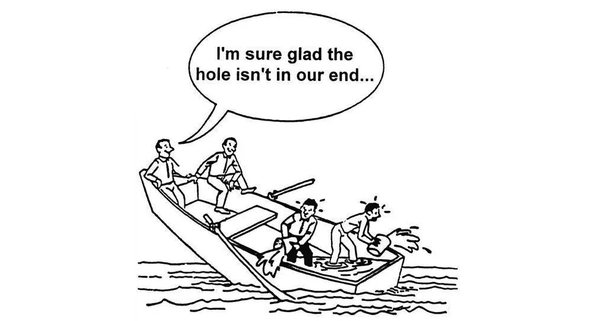

# 创业公司收入流失的 9 个地方(以及如何修复它们)

> 原文：<https://medium.com/swlh/how-the-teams-at-buffer-zapier-close-io-and-more-plugged-their-biggest-revenue-leaks-614501065aed>

## Buffer、Zapier、Close 和 more 的团队如何修复他们最大的收入漏洞

A hole anywhere in your company can sink the entire ship. Find out more at [Churn Buster](https://churnbuster.io).

当你的企业在成长时，很容易产生一种虚假的安全感。理论上一切似乎都很好。你带来了越来越多的业务，每个月的客户和收入都在增长。如果每个月都有一点点溢出锅外，谁会在乎呢？

**但事实是，如果你在任何地方泄露税收，你就是一艘沉船的船长。**

关注获取比优化更容易，因为用户获取是令人兴奋的。增加新客户似乎是增长的定义，而确保从现有用户那里获得最大价值是次要的。

但是随着你公司的成长，让这些小漏洞无人管理会带来可怕的后果。作为安德森·霍洛维茨基金的普通合伙人和优步公司前增长主管，陈楚翔在他的文章[中解释说增长越来越难](http://andrewchen.co/growth-is-getting-hard/):

> 过去，初创公司可以指望他们的竞争对手又大又笨又慢。不再是了。我们都变得越来越聪明、越来越快，包括你的竞争对手。”

高效、明智地运营公司是击败竞争对手的最快方法之一。识别和堵塞税收流失的地方是一个简单而有效的起点。

***在我们开始之前…*** *想了解留住更多客户并让您的 SaaS 公司每月赚更多钱的最简单方法吗？* [*搅动克星*](https://churnbuster.io) *可以帮忙。*

# 您的 SaaS 公司收入流失的前 9 个地方(以及如何解决它们)

很难找到关于收入流失的数字，但一些统计数据声称，由于某些类型的流失，你的 MRR 会损失高达 5%的 T21。这意味着 5 位数或更多取决于你的客户的价值。

税收流失是一个严重的问题。 **而不仅仅是为了你的底线。**

收入泄露通常是更大问题的征兆——这可能会导致您开始严重影响客户和收入。

我们采访了 7 家 SaaS 公司的创始人和领导者——从早期的初创公司到拥有数百名员工和数百万资产的老牌公司——了解他们在哪里发现了收入漏洞，以及他们是如何堵住这些漏洞的。

# 问题 1:为早期用户提供无限或终身计划

在早期，为早期客户提供特殊的“无限计划”似乎是个好主意。以相同或更低的价格提供比竞争对手更多的价值，可以带来那些非常重要的早期用户。

但是，正如 Jan Schulz-Hofen——一家在 MRR 拥有超过 10 万美元的项目管理解决方案的首席执行官和创始人——发现，当你扩大规模时，这些计划是不值得的:

*“我们之所以增加这个计划，是因为客户提出了这样的要求，他们认为额外的用户和项目不会真正增加我们的底线成本，因为它们‘只是数据库中的一些额外的行’。”*

但随着公司的发展，这些额外的线路显然成为收入流失的来源，原因如下:

1.  **更多的用户意味着更多的客户支持请求**，如果你致力于提供出色的客户支持(你应该这样做)，这可能是一个巨大的成本驱动因素。
2.  **随着使用量的增加，不收取更多费用会降低你的产品价值**
3.  **如果你不能扩大现有客户，你将永远无法实现“负流失”**——当你从升级中赚的钱大于你因流失而损失的钱时

# 解决方案:取消针对新用户的计划，让现有用户退出

"堵住漏洞的第一步是扼杀你的无限计划,"简解释道,"停止向新客户提供无限选择，然后联系你目前有这些计划的客户并向他们解释情况。"

提供一个对双方都公平的新计划，让他们继续从你的产品中获得他们需要的价值，但在你需要收取更多费用之前，对他们可以使用的数量设定一个上限。正如简解释的那样，

毕竟，没有人会合理地期望你免费工作

深入了解表面知识，了解为订阅业务留住更多客户所需的策略。

# 问题 2:给出不明确的或自定义的计划折扣

折扣和 SaaS 似乎像花生酱和果冻一样不可分割。虽然它们看起来是与新客户达成交易的好工具，但它们可能很快变得比它们的价值更令人头疼。

正如 [Close.io](https://close.io/) 首席执行官 Steli Efti [向](http://blog.close.io/b2b-sales-discounts)解释的那样:

> 虽然你可能认为给点小折扣没什么大不了的，但它们会累积起来。当你开始赚取数百万美元的收入时，这里的 2%和那里的 1%就相当于你一年赚了或亏了几十万美元。”

这不仅仅是因为你失去了额外的收入，也使得折扣成为如此严重的收入流失。正如 Steli 解释的那样，由于折扣不明确，你实际上并不知道一个顾客值多少钱。这意味着你的整个财务结构出了问题。如果一个客户升级或降级，你不会知道这意味着真正的收入或流失。

# 解决方案:向每位顾客提供相同的折扣，并确保你有所回报

解决这个漏洞不仅仅意味着取消折扣(尽管这是一个很好的起点)。相反，只有两种方式可以为顾客提供折扣:

首先，如果潜在客户*需要*，你的销售团队可以向他们提供预先批准的折扣。正如 Planio 的 Jan Schulz-Hofen 解释的那样:

> “不要因为给你的销售团队带来便利就给每个人打九折。合理计算价格，培训销售人员突出你提供的价值，而不是试图用大折扣赢得客户。”

此外，Jan 说你应该只对客户的**当前计划**提供折扣。如果他们选择改变计划的参数，折扣就会消失。试着给出额外的价值，而不是价格折扣:

> “例如，为 5 个以上的用户帐户提供年度预付款，而不是 10%的价格折扣。如果做得好，这将有助于你的现金流，让你的客户满意。”

第二，如果你真的给了折扣，确保你有所回报。让一家公司在他们的网站、博客或社交媒体上提到你，或者要求他们推荐你。关键是要让这种关系保持平衡，而不是你在流失收入，却没有任何回报。

# 问题 3:在结账过程中制造了太多的摩擦

如果你已经让客户准备好扣动扳机，你为什么要让他们为难呢？

在[最近的一项研究](https://baymard.com/lists/cart-abandonment-rate)，27%的人说“漫长而复杂的结账过程”阻止了他们购买。即使只有 7-8 个字段的表单表现更好，美国的平均在线结账流程也有将近 15 个！

对于 Teachable 的首席执行官 Ankur Nagpal 来说——一个让教师创建和销售他们自己的课程的在线平台——一个糟糕的结账过程让他们每月损失了大量收入:

> *“对我们结账产品的投资不足导致许多客户使用劣质的第三方工具绕过我们的结账。这意味着信用卡和交易费收入的损失(大约 5 位数/月)。”*

# 解决方案:减少购买后结帐和移动帐户创建的步骤

其他研究表明，调整你的结账流程有可能将转化率提高 35%以上。正如 [Zapier](https://zapier.com/) 的产品经理 Chris Geoghegan 解释的那样:

> *“你在为你的客户制造什么更难、更容易的东西？你的产品应该让你的客户生活更轻松，所以摩擦只是一个不使用产品的理由。”*

在 Teachable，他们解决这一巨大收入漏洞的方法是改善和投资他们自己的结账产品和用户流量。

*Ankur 解释道:“我们立即花了 6 个月的时间改进我们的结账方式，包括先要求付款，然后进行身份验证，扩大一键追加销售，并大幅改进代销商的功能。”。*

*这一举措让他们的大多数客户重新使用他们的结账产品，并大大提高了他们的人均收入。*

# *问题 4:没有针对不同的信用卡或国际客户优化您的支付流程*

*收入损失最快的地方是结账过程。虽然结帐服务本身的摩擦肯定是一个问题，但有时有些问题超出了您的控制范围，您仍然需要考虑。*

*例如， [SEMRush](https://www.semrush.com/) 的创始人兼首席执行官 Oleg Schegolev 解释了几年前他们是如何注意到他们的支付系统拒绝了非常好的信用卡，而这些信用卡在不同的系统中运行时可以工作。他解释道:*

> **“公司在漏斗优化和 A/B 测试上投入了大量资源，但很少有人尝试优化看似微不足道的事情，如信用卡接受率。”**

*在 [Zapier](https://zapier.com/) 公司，他们也开始发现外国客户支付有问题的问题，这产生了更多的客户支持噪音，并可能失去收入。*

# *解决方案:优化、外包和创建不同支付类型的资源*

*由于支付失败导致的收入流失或“非自愿流失”的问题比以往任何时候都更容易解决，这要归功于像[流失克星](https://churnbuster.io/)这样的服务，它可以自动处理被拒绝的卡，并努力恢复受支付失败影响的客户。*

*然而，对于面临支付处理器本地化问题的国际客户来说，解决方案就不那么明确了。对扎皮尔来说，他们的解决方案是开发资源，并使其尽可能自助。*

> *“每当我们了解到新的信息或人们在购买时可能有的问题时，我们就会创建这样一个资源，这样我们就可以让客户在未来自助服务。”*

# *问题 5:没有给成功的客户一个清晰的升级路径*

*收入流失并不意味着失去顾客。这也是因为未能让你的成功客户用你的服务做更多的事情。*

*在 Zapier，随着公司的发展，以及他们最好的客户对服务投入越来越多，他们开始越来越多地遇到这个问题。当客户达到计划限制时，他们的工作流会暂停。但是，产品经理 Chris Geoghegan 解释说，他们只是为他们提供了一个“笨重的模型”，然后将他们链接到主计划页面，而不是给他们一个清晰的升级路径。*

**“这绝对是一个摩擦点，我们让成功的客户很难更多地使用我们的产品，”*产品经理 Chris Geoghegan 解释道。*

*Close.io 首席执行官 Steli Efti 称之为“使用流失”:技术上来说，客户仍在向你付费，但他们停止使用你的产品，或出于某种原因显著改变了他们的使用。这也是他们最终会离开你的一个主要信号。*

# *解决方案:基于用户需求构建定制升级流程*

*Chris 表示，解决这些问题的关键在于了解客户是如何使用他们的服务的，并为他们提供一条明确的途径，让他们确切地了解自己想要从服务中获得什么。*

*首先，他们建立了基于使用的定价，以帮助确保客户不会为他们没有使用的服务付费。接下来，他们改变了当客户达到其当前计划的极限时的方法:*

**“我们改变了方法，不再向你展示计划清单，而是推荐你需要的最便宜的计划，以便做你当时想做的事情。”* —克里斯·纪勤，扎皮尔*

*无论你的独特问题是什么，这里的关键是要深入了解客户什么时候有问题，什么时候不能充分利用你的产品。Close.io 的 Steli 说，你应该寻找危险信号，比如客户多次访问你的定价页面，或者想办法取消他们的账户，然后制定流程，主动联系并解决他们的问题。*

> **“如果你在这些阶段更加积极主动，就有机会获得并留住客户和收入。然而，大多数成长中的初创公司并非如此。他们不是为了关注这些事情并采取行动而设立的。”**

# *问题 6:你试图成为每个人的一切*

*随着公司的成长和客户的成熟，很容易陷入让每个人都开心的困境。但是添加太多的功能会使你的核心产品变得臃肿，并使用户不清楚为什么要升级。或者更糟，导致他们搅动。*

*对于世界顶级社交媒体管理工具之一 [Buffer](https://buffer.com/app/profile/5057ed266ffb36134500001b/buffer/queue) 的团队来说，他们意识到，尽管他们提供了客户需要的大多数功能，但他们并不清楚如何在核心社交媒体发布工具之外推广他们的工具。*

*正如 Buffer 创始人兼首席执行官乔尔·加斯科因[在最近的博客文章中解释的那样:](https://open.buffer.com/buffer-product-vision/)*

> **“到目前为止，去年我们看到客户离开 Buffer 的主要原因是因为我们没有充分完成出版以外的工作。”**

# *解决方案:将功能分解成单独的产品、层或服务*

*那么，当您扩展时，如何平衡清楚您对每个特定用户的价值呢？*

*对于 Buffer 的团队来说，寻找答案始于一个长达数月的研究项目。在与用户交谈并了解他们在自己的客户之旅中所需的不同工具后，他们决定将他们的功能组合成独特的产品。*

**“我们向多产品公司* *的* [*转型的一部分是观察我们客户的需求，并意识到更广泛的产品最终会留住客户，”*Buffer UX 和客户研究员 Roy Olende 解释道。](https://open.buffer.com/buffer-product-vision/)*

*在[客户流失克星](https://churnbuster.io/)上，团队还认识到某些客户只需要他们产品的特定部分。要求他们购买他们不需要的功能可能会让他们转向别处。*

*为了解决这一收入漏洞，他们开发了一个特定的、经常被请求的功能——信用卡更新页面——成为一个独立的产品，名为 [Capture](https://churnbuster.io/capture/) 。通过这种方式，他们不会通过强迫客户购买他们的整个支付恢复和保留产品来制造摩擦，而是让那些只需要单一功能的人更容易感受到授权并成为客户。*

# *问题 7:没有以可扩展的方式处理失败的信用卡*

*当你只有几百个客户时，处理失败的信用卡似乎不是什么大事。你甚至可以自己处理它们，或者用一些基本的自动化邮件。但是一旦你成长到某个点，那些失败的支付会有严重的后果。*

*正如[流失克星](https://churnbuster.io/)的首席执行官马特·高曼解释的那样:*

> **“尤其是当你超过 50 万美元的 MRR 时，建立一个专业系统来挽回每一个可能的客户是非常重要的。原因是终身价值。”**

*具体来说，Matt 解释了如果您在一年内每月多挽回一个价值 100 美元的客户，您最终将在新 MRR 获得 1200 美元的额外收入和 7800 美元的新现金。*

*如果你在做 50 万美元或更多的 MRR？一年后，即使只有 1%的失败付款回收改善，在 MRR 和现金中也可能分别价值 6000 美元和 39000 美元。*

# *解决方案:实施严密的专业服务，以留住更多客户并延长终身价值*

*如果你已经有了一个处理失败信用卡的系统，你可以[做一些改进](https://churnbuster.io/blog/11-SaaS-retention-techniques-nobody-is-talking-about/)，比如不发送预催款电子邮件，不在每次支付重试失败时都发送电子邮件，运行更长的活动，以及将接触点问题和高价值客户都上报给你团队中的某个人来处理。*

*然而，一旦你到了一定的规模，这些基本系统仍然可能是一个巨大的收入漏洞。*

*pro 系统不仅仅是让人们了解您的恢复活动和高价值客户的表现，这些客户应该升级到您的成功团队。但它也应该允许你在没有开发者帮助的情况下不断调整和测试你的回收活动，这意味着你可以更频繁地回收更多的付款。*

# *问题 8:免费试用时间过长*

*根据来自[托坦戈](http://www.totango.com/wp-content/uploads/2012/04/2012-SaaS-Free-Trial-Freemium-Pricing-Benchmark.pdf)的调查，44%的 SaaS 公司提供免费试用他们的服务。*

*为什么不呢？它不仅降低了与潜在客户的摩擦，而且让你的客户直接看到你的价值，使他们更有可能成为付费用户。*

*然而，并不是所有的免费试用都是平等的。*

*当 [Bench](https://bench.co/) 的团队——一个面向中小企业的在线订阅记账服务——首次推出时，他们为新客户提供了 30 天的免费试用。然而，几个月后，他们意识到 30%的试验在收取服务费后的几个月内被取消了。*

**“问题是，在他们确定需要我们的服务 30 天后，他们忙于其他事情，把解决他们的会计问题放在次要位置，”【Bench 首席执行官和福布斯 30 岁以下 30 岁以下获奖者 Ian Crosby 解释道。**

> **“一旦我们开始向他们收费，他们就会取消，因为他们在为他们没有使用的东西付费。”**

# *解决方案:在试用阶段加大对客户的投资*

*Bench 的团队不再简单地免费提供服务，让客户自己尝试，而是在试用期间将他们的重点转移到更多的实践上。这意味着更强大的入职体验，同时仍然不收费，直到他们在系统中有完整的一个月的数据。*

**“我们开始手把手地指导他们将各种帐户连接到 Bench，并在他们的数据开始填充后，指导他们了解每个报告的含义。**

> **“当我们采用这种模式时，我们头 90 天的流失率下降了三分之二。”**

# *问题 9:太多不合适的客户*

*当你在发展你的公司时，你可能会觉得任何新客户都是好客户。但是从错误的人那里拿钱实际上会让你付出比你赚的更多的代价。*

*作为客户成功顾问和[十六家企业](https://sixteenventures.com/churn-bad-fit-customer)的创始人，林肯·墨菲解释道:*

> **“事实上，为不合适的客户服务的成本往往比为有成功潜力的客户服务的成本高得多。”**

*不合适的客户不仅会花费更多的成本来获取和消耗您的支持资源。但它们也会制造出令人难以置信的噪音——降低你为客户服务的能力，而这些客户可能会从这种关注中受益更多，也会更成功。*

*更糟糕的是，当那些不合适的客户流失时(他们会的)，他们会告诉你最大的竞争对手你是如何做生意的，给他们内幕消息，让你更难竞争和签下新客户。*

# *解决方案:让销售和支持人员了解不合适的客户是什么样的，并鼓励他们不要签合同*

*正如 Close.io 创始人 Steli Efti 解释的那样:*

> **“尤其是早期，转走销售很难。但再多的现金也无法弥补卖给了错误的客户。”**

*相反，Steli 说，你需要创建一个“非理想客户档案”,这样你团队中的每个人都明白并清楚地知道向谁*而不是向谁*销售。*

*Lincoln 更进一步，建议甚至在售后指标上激励销售成员，如保留、激活、扩展和参与。尽管这些超出了他们的控制范围，但它创造了一种只与正确的客户签约的责任和义务文化。不是任何人。*

*你不可能完全控制一切。随着公司的发展，你不可避免地会出现一些收入漏洞。虽然这些看起来没什么大不了的，但如果不加以控制，它们可能会对你的收入、文化甚至公司估值造成严重损害。*

*效率和保留率可能没有用户获取率那么吸引人，但它们对你的底线同样有影响。花时间去学习寻找什么，以及如何“堵塞”你的收入漏洞，从现在开始一切都会变得一帆风顺。*

# *嘿，我是乔里！*

*我帮助公司和有趣的人通过巧妙而集中的写作讲述他们的故事。想一起工作吗？在 hello@jorymackay.com 给我发邮件*

**这篇文章的一个版本最初发表在* [*博客*](https://churnbuster.io/blog/how-the-teams-at-buffer-zapier-close-and-more-plugged-their-biggest-revenue-leaks/) *上。查看更多关于流失、客户保持和建立成功的 SaaS 公司的可行建议。**

**

## *这篇文章发表在 [The Startup](https://medium.com/swlh) 上，这是 Medium 最大的创业刊物，有 308，471+人关注。*

## *在此订阅接收[我们的头条新闻](http://growthsupply.com/the-startup-newsletter/)。*

**