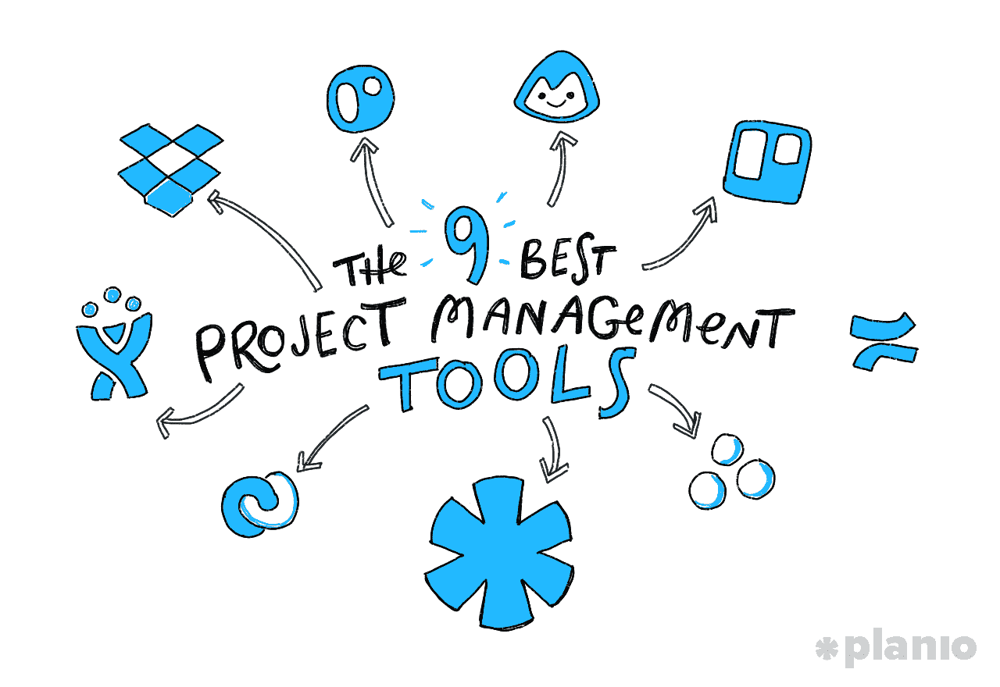
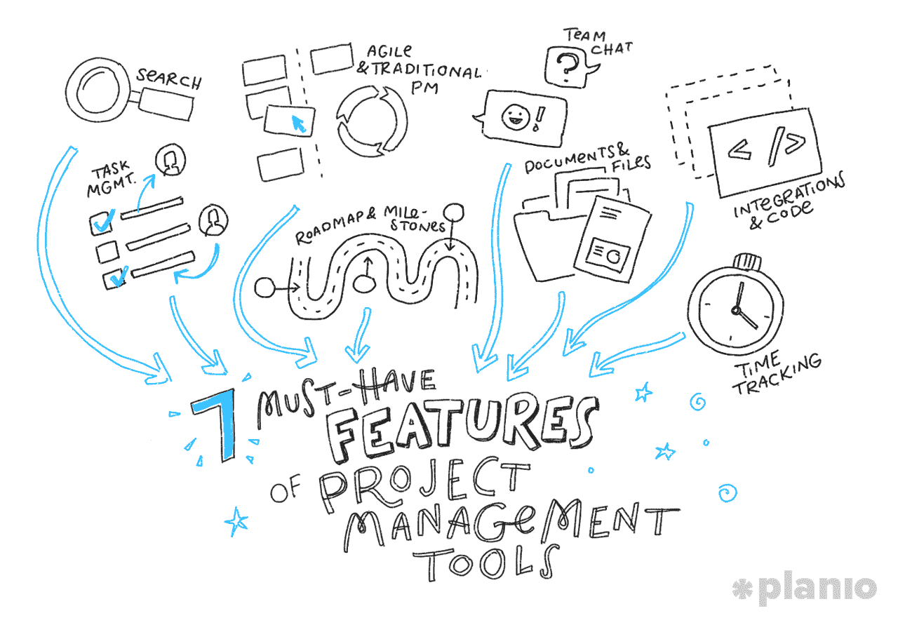

# 优步、网飞、Dropbox 等公司的团队如何成功运作项目

> 原文：<https://medium.com/swlh/how-the-teams-at-uber-netflix-dropbox-and-more-run-successful-projects-4b6b82fbce99>

## 深入了解用于构建价值十亿美元的应用程序的工具和技术

当在中工作*时，你的**项目管理工具**变得比实际项目本身还要多，你知道你有麻烦了。*

现代企业的生死取决于它们能否缩小到 30，000 英尺的高度以获取大图，然后再回到坚实的地面并投入工作。特别是对于技术团队来说，一个小失误可能会导致整个事情的失败，能够[跟踪你的项目](https://plan.io/blog/how-to-manage-a-project/)并知道下一步该做什么是至关重要的。

正如咨询师兼作家吉米·罗恩所说:“要么你主宰一天，要么一天主宰你。”没有合适的工具，感觉就像一天在用压路机碾压你。

那么，我们如何给自己一种看似超人的能力，能够一次看到项目的所有部分，并在正确的时间做出正确的决定呢？进入，全能的**项目管理工具**。

合适的项目管理工具可以让你组织你的团队做最好的工作。它可以让你计划冲刺或任务，并跟踪谁在做什么，以确保你以最有效的方式工作。简而言之，不管海浪有多高，它都能让你保持头露出水面。

但是仅仅拿起你的工具就跑是不够的。适合你的团队的项目管理工具是正确的，因为它适合你的团队。不管有多少选择，无论你选择什么，都需要有*为你工作的具体特征*。

让我们来看看全球顶级团队正在使用的一些最流行的工具，然后深入到更重要的部分:他们为什么使用它们。

# 9 个顶级技术团队及其使用的项目管理工具

要想在现代商界脱颖而出，你需要独一无二、令人兴奋。但你经营企业的方式当然不需要如此。这并不是说我们都应该跑出去复制苹果、脸书或亚马逊的做法，而是说，从伟人如何艰难完成大型项目并遵守期限和预算中获取灵感并不可耻。

“企业应该跟踪和学习他人的成功和失败，以便更好地了解和预测自己的成功和失败，”本·莫兹里奇在《意外的亿万富翁》中写道，这本书是脸书的起源，后来被改编成《社交网络》。

那么，让我们先来看看今天的一些大人物，以及他们使用什么工具来保持他们的团队走上正轨。

# 1.[优步](https://www.uber.com/)

如何跟踪全球数百万司机，为他们开发最佳工具，并管理一家 690 亿美元公司的日常运营？对于优步的技术团队来说，这一切都归结于 Asana——一种由脸书联合创始人达斯汀·莫斯科维茨创立的项目管理工具。

有了 Asana，你就能以一种清晰明了的方式完成基本的项目管理需求。这个基于网络的工具让你的每个团队创建自己的工作空间，然后用正在进行的项目和任务填充它们。每个任务都会被跟踪，用户会收到影响他们的更新和更改的通知，最终目标是确保每个任务都有一个清晰的下一步准备。

虽然 **Asana** 是一个非常强大的全方位项目管理工具，但它特别强调跟踪从项目到招聘到代码漏洞的一切，这就是为什么你会看到它也被 AirBnB 和 Pinterest 等市值十亿美元的公司的团队使用。

# 2. [CNET](https://www.cnet.com/)

《CNET》每月在全球拥有超过 2 亿的读者，是网上阅读量最高的技术新闻来源。CNET 成立于 1994 年，从少数几个以科技为主题的电视节目迅速成长为一个由评论网站、博客、视频和播客组成的在线帝国，并在 2000 年代末被 CBS 以数十亿美元的价格收购。

任何主流媒体网络都需要一个严肃的项目管理工具来维持运营。对于 CNET 来说，这就是[**Planio**](https://plan.io/)——一个极其灵活的项目管理工具，构建在 Redmine 开源项目之上，并针对技术团队进行了优化，集成了 Git 和 SVN 库、额外的安全性、团队聊天和帮助台。

CNET 内容解决方案公司的高级解决方案顾问 Luis Ferrao 解释说:“我需要确保我们的项目正在向前推进，而 Planio 的路线图视图让我可以一目了然地了解最新情况。"[我们团队现在做的一切都是按计划完成的](https://plan.io/cnet-content-solutions-delivers-global-projects-with-planio/)。这是我们主要的工作流程工具。在这个阶段，我们已经产生了成千上万的问题。”

# 3.[滴水不漏](https://dribbble.com/)

Dribbble 是设计社区最初的在线展示平台，现在拥有近 50 万个设计组合，并已成为自由设计师最大的线索和联系来源之一。为了服务一个像设计师一样挑剔的社区，Dribbble 使用 Flow 来保持他们的项目有序。

**Flow** 是专门为简单快捷而设计的，并将他们的产品描述为“介于你现在正在做的事情和昂贵的企业项目管理系统之间的中间地带。”它非常 UX，注重设计，是 Dribbble 的完美合作伙伴。

Dribbble 的产品总监 [Sarah Kuehnle](http://sarahkuehnle.com/) 解释道:“我想要一个能够很好地进行产品管理的工具(供我和我们的首席执行官使用)，但更重要的是，它能够让团队成员的日常工作变得非常简单。

“Flow 现在在后者上做得非常好，并且每天都在让产品管理/路线图方面做得更好。我也喜欢它看起来很棒，因为我整天都盯着它。”

# 4.[收纳箱](https://www.dropbox.com/)

Dropbox 拥有超过 5 亿的用户，其技术团队需要竭尽全力保持服务正常运行。他们的选择？收纳盒纸。

**Paper** (顾名思义)是作为一种内部解决方案而构建的，旨在帮助公司的项目经理捕获、组织和优先处理问题，计划冲刺，并获得正在完成的工作的实时报告。虽然不是最灵活的项目管理系统，但它允许他们快速工作，并将所有文档、文件和图像保存在一个中心位置。

Dropbox 产品经理 [DJ Chung](https://www.linkedin.com/in/djchung) 解释说:“我们需要一种方式，通过文字、图像、代码以及对其他文档和软件工具的引用来快速传达我们的想法。“纸张让我们可以自然地做到这一点。它还集成了我们日常使用的其他工具，如 Slack、InVision 和 Trello，并允许我们的团队通过内置的任务管理功能掌握项目决策和任务，该功能允许您为重要任务分配人员和截止日期。”

# 5. [Kickstarter](https://www.kickstarter.com/)

从 Kickstarter 上正在完成和推出的项目到成千上万支持者的社区，这个世界上最大的众筹平台明显强调协作。然而，为了让他们自己的团队走上正轨，Kickstarter 中的多个团队使用 Trello——一种看板风格的项目管理工具，让你创建董事会和卡片来跟踪你的项目和团队的进展。

与更强大的项目管理选项不同， **Trello** 更加基于视觉，注重清晰性，可以很容易地快速看到谁在做什么，并了解项目的任何部分在管道中的位置。在 Trello 中，每个项目或团队都被分配了一个“板”，然后你可以用装满卡片的垂直列表来填充它。随着项目的进展，每张卡片都被移到下一个列表中。

例如，如果我使用 Trello 来跟踪我在这篇博客上的进展，我可能会有“想法”、“研究”、“写作”和“发表”的列表，这样我就知道我在哪里，需要做什么。Trello 非常适合直观地跟踪您的项目，是硅谷的最爱，Medium、Buffer 和 ProductHunt 等公司也使用它来运行他们的项目。

# 6.[幽灵特工](http://www.ghostery.com/)

Ghostery 的使命是让浏览网页变得不那么糟糕。该公司的免费浏览器插件可以检测和阻止您访问的网站上的跟踪技术，以加快页面加载速度，消除混乱，保护您的数据和隐私。为了让他们的产品与不断变化的网络保持同步，Ghostery 主要使用 Roadmunk 和吉拉。

**Roadmunk** 是一个网络应用程序，可以轻松创建可视化的路线图和 Gannt 图表，而**吉拉**是一个功能丰富的敏捷项目管理工具，由 Atlassian 开发。

Ghostery 的产品管理总监 Jeremy Tillman[解释说:“我们使用 Roadmunk 来创建我们的产品路线图，这基本上是未来 6-12 个月的广泛产品战略计划。](https://www.linkedin.com/in/jrtillman/)

然而，当涉及到他们的日常项目管理时，他们会求助于吉拉。

“特别是，我们使用吉拉来创建和管理我们的产品标签，它可以是任何东西，从新功能、产品改进、错误修复或任务，”蒂尔曼解释说，他补充说，虽然他们选择吉拉是因为它的综合功能，“它可能是一个沉重的工具，其重量和有点陡峭的学习曲线可能不适合较小的团队。”

# 7. [WeWork](https://www.wework.com/)

WeWork 高达 200 亿美元的估值取决于他们能否将进步的、以数据为中心的洞察力带入租赁办公空间的经典(老实说，很无聊)世界。要做到这一点，他们需要一个项目管理工具，为他们提供跨许多不同团队的每个项目的高层次概述，以了解他们如何一起工作。他们的选择？吉拉。

吉拉是由 Atlassian 开发的功能丰富的敏捷项目管理工具。重点是清晰和协作，虽然您可以细化到每个任务，但最大的好处是更广泛地了解项目的进展。

WeWork 软件工程师 [Alex Choi](https://www.linkedin.com/in/heyalexchoi/) 解释说:“我们对项目管理工具有很多需求——给团队成员分配票证、按类型分类并标记优先级、设置状态等等。“在尝试了多种选择后，我们选择了吉拉。不是因为我们爱它，而是因为它做了我们需要的一切。”

# 8. [Groupon](https://www.groupon.com/)

尽管在过去几年中缓慢下滑，但团购网站 Groupon 曾是业内增长最快的公司之一，在推出仅 16 个月的时间里就达到了 10 亿美元的估值。今天，你可以在 Groupon 上找到数以千计的来自当地公司、制造商和度假地的折扣优惠，每年有数十亿的销售额在该网站上处理。

为了管理这种水平和数量的增长，Groupon 使用了许多不同的项目管理工具来保持有序，包括 Basecamp。Basecamp 是最早发布的项目管理软件解决方案之一，已经帮助团队超过 10 年了。虽然不一定针对技术团队进行了优化，但 Basecamp 通过将您的沟通和项目跟踪分成 HQ(主概览)、团队和最终项目，让您快速了解您正在进行的工作。Basecamp 拥有成千上万的用户，包括像 9GAG 和 Harvest 这样的公司。

# 9.[网飞](https://www.netflix.com/)

作为世界上最大的内容平台*和*生产商之一，可以肯定地说，网飞同时有很多项目需要跟踪。从委托制作价值数十亿美元的原创内容，到为世界上几乎每个国家的近 1 亿用户维护流媒体服务，网飞的团队在项目管理方面忙得不可开交。

对于他们的技术团队，他们选择了 Confluence——一款由软件制造商 Atlassian 开发的项目管理和团队协作工具。 **Confluence** 面向企业公司，旨在为您的团队增加透明度。它允许你作为一个团队创建文档，在上下文中提供反馈，并重复直到工作完成。

# 顶级技术团队如何使用他们的项目管理工具:7 个必备特性

好了，你知道了。

来自全球 9 个最佳技术团队的 9 款顶级工具。然而，通读这个列表，你可能已经开始看到一个模式。

项目管理作为一种实践已经发展了多年。所有这些工具都是过去管理者久经考验的技术的自然发展。与任何构建数字产品的人交谈，他们都会告诉你同样的事情:**工具只是工具**。重要的是你如何对待他们。

这就是为什么*顶级团队使用的*项目管理工具只是等式的一小部分。**要真正从项目管理系统中受益，你不仅需要知道使用什么，还要知道如何使用它。**

正如 Dribbble 的产品总监 Sarah Kuehnle 解释的那样:

> “我最关心工具对我的团队的影响。只要能让我的团队保持高效和愉快，我很乐意使用几乎任何东西。”

因此，让我们来看看所有这些团队都需要的顶级项目管理工具特性，以及如何在自己的公司中使用它们。

# 1.可扩展的任务管理，无论您是在构建应用程序、网站还是产品，都能发挥作用

正确的项目管理始于了解并能够立即看到每个人都在做什么，这样您就可以随着项目的进展将各个部分组合在一起。为了获得最重要的鸟瞰图，你需要一个具有[任务管理](https://plan.io/task-management/)的工具，它是有组织的，高度可配置的，并且可以随着你的公司和项目的扩展而扩展。

以下是您在任何工具中都应该注意的一些特性:

*   灵活配置和分配任务，包括设置截止日期、优先级和标记队友
*   通过基于角色的权限控制谁可以处理什么任务
*   明确由角色和项目定义的工作流程，以确保合适的人员知道该做什么，并且能够完成他们的工作

# 2.针对敏捷和传统项目管理的灵活规划

你的工具也不应该限制你管理项目的方式。无论你是使用 Scrum 和看板进行敏捷开发，还是使用更传统的瀑布模型和甘特图进行顺序计划，你的软件都不应该决定你如何工作。

寻找一个工具，它能给你一个快速的方法来设计和跟踪 sprints(或者你将按顺序完成的任务)，以及一个可视化的方法来查看你的项目进度，比如看板风格的板。

# 3.跟踪进度的清晰透明的里程碑

当著名的管理顾问 Peter Drucker 说“什么被度量，什么就被改进”的时候，他就像是在谈论项目管理软件的未来。为了确保你在进步和成长，你需要[清楚地看到你已经达到的项目里程碑](https://plan.io/project-management/)以及跟踪问题的能力，这样你就可以在走得太远之前纠正方向。

寻找可以让你为你的项目建立一个更大的“路线图”并跟踪关键里程碑的工具。通过这种方式，您可以在项目的大环境中跟踪任务，并确保您现在所做的工作有助于实现更大的利益。

# 4.团队聊天和交流工具，在工作进行时保持协作

[沟通是协作的核心](https://plan.io/communication/)也是顺利开展项目的核心。但是上下文切换和在不同的应用程序之间来回跳转会减慢速度，或者使情况变得混乱。虽然不是每个项目管理工具都提供了好的沟通选项，但是那些确实给了你额外的好处，那就是把所有相关的对话都保持在正确的位置。

而且不要简单的找[实时聊天](https://plan.io/business-chat/)。建立知识论坛或在团队项目中发布“博客帖子”是一种很好的方式，可以在不中断工作流程的情况下更新每个人的信息。

# 5.应有尽有，轻松访问文档和文件

*“战略文件又在哪里？”*

“你能再给我发一次我们在登录页面上使用的照片吗？”

我的桌面和下载文件夹已经是一个足够可怕的地方，因为当我需要它们时，它必须去寻找关键的文档和文件。

相反，寻找一种工具，让你能够在需要的地方[上传和存储文件](https://plan.io/file-management/)，无论是附加到任务、项目、问题还是博客帖子。一旦它们启动，请确保您的工具与您的所有队友和设备同步，以确保您在需要时能够随时访问您需要的内容。

# 6.开发人员友好的集成

您可能已经注意到，在上面的部分中，某些工具更适合您的技术团队，而其他工具则更适合设计、内容或产品路线图。

虽然有理由认为这两者应该分开，但当它们分开时，很容易遗漏一些东西或误解一些信息。为了保持所有团队的透明性，找到一个适合所有人的工具，从开发人员到营销人员，这样参与项目的每个人都可以了解情况。

为了让您的项目管理环境对开发人员更加友好，请寻找与[托管的 Git 和 Subversion 库](https://plan.io/subversion-hosting-and-git-hosting/)紧密集成的工具，以及将访问权限仅限于那些知道自己在做什么的人的角色权限。

# 7.紧密的进度反馈循环和时间跟踪预测

成功的项目管理很大一部分是报告已经完成的工作。这意味着要知道你的项目处于什么阶段，任务花了多长时间，以及你是否能按时按预算完成你的里程碑。

寻找不仅能提供[精确时间跟踪](https://plan.io/time-tracking/)的工具，还能让你通过查看特定时间段的时间并根据你的估计进行映射来理解时间。如果您打算按小时向客户收费，或者希望能够向他们展示已经完成了多少工作，这也是一个必不可少的功能。

# 额外收获:当项目失去控制时，强大的搜索功能可以保持有序

有了所有这些功能，所有的团队在一个地方一起工作，东西肯定会丢失或放错地方。这就是为什么你的项目管理工具提供某种形式的[详细搜索](https://plan.io/search/)来追踪那些丢失的文件或找到关于你试图修复的问题的评论也是绝对必要的。

你的项目越大，你的搜索也需要越高级。寻找一些工具，这些工具可以让你将搜索限制在项目、日期、地点等方面

你越快找到你需要的东西，你就能越快回到建设中。

# 关于最佳项目管理工具的最终想法

这不仅仅是关于你使用哪种项目管理工具，而是*你如何*使用它。

适合您的工具具有适用于您的工作流的功能，与您的堆栈的其余部分集成，并对您的项目进度提供反馈，以便您可以将船驶向正确的方向。

虽然我们都可以从大师们使用的工具中学习，但选择一个强大的项目管理工具最终只是归结到为您的公司工作的特定功能。如果你正在考虑改变或者寻找新的东西，看看上面列出的特性，确保你选择的工具能够符合所有的条件。

*如果你正在寻找一个项目管理工具，看看* [*计划*](http://planio.com) *。你甚至可以免费上手 30 天，看看*[*Planio*](http://planio.com)*是否适合你的团队。*

# 嘿，我是乔里！

我帮助公司和有趣的人通过巧妙而集中的写作讲述他们的故事。想一起工作吗？给我发邮件到 hello@jorymackay.com

## 这个故事发表在 [The Startup](https://medium.com/swlh) 上，这是 Medium 最大的企业家出版物，拥有 284，454+人。

## 在这里订阅接收[我们的头条新闻](http://growthsupply.com/the-startup-newsletter/)。

