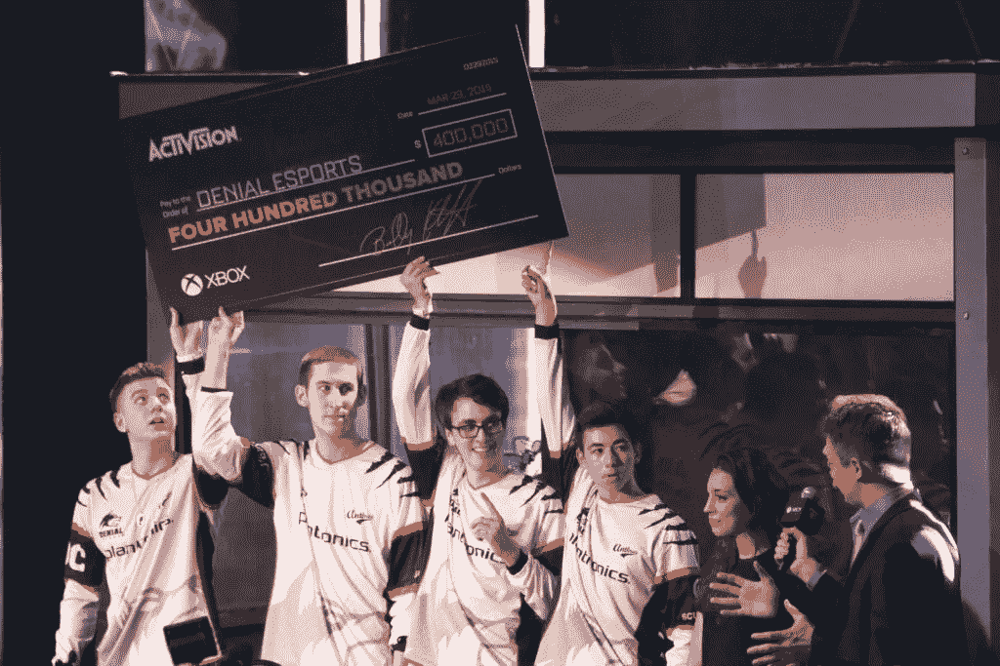

# 这些人是如何通过游戏赚钱的

> 原文：<https://medium.com/swlh/how-these-people-are-making-money-through-gaming-303b7c01c84f>

在不太遥远的过去，游戏玩家会发现通过做他们喜欢的事情来谋生是不可想象的。但现在，电子竞技行业正在蓬勃发展，他们终于可以。[据 NewZoo.com](https://bountie.io/blog/state-gaming-southeast-asia/)预测，2018 年全球电子竞技经济将达到 9.056 亿美元。

这意味着游戏玩家可能会赚更多的钱。下面让我们看看世界各地的游戏玩家是如何谋生的。

**Saahil Arora** ，他在游戏中的名字是“宇宙”**，在仅仅 67 场比赛**中，他已经赚了将近 300 万美元。这位 29 岁的职业 Dota 2 玩家是有史以来收入最高的玩家。

电子竞技正变得与篮球等大学运动不相上下。芝加哥的罗伯特·莫里斯大学是世界上第一所赞助竞技电子竞技队的大学，并提供“高达 50%学费和 50%食宿费”的奖学金。

Felix“PewDiePie”Kjellberg 严格来说并不从事电子竞技，但他通过在 YouTube 上发布游戏视频获得了利润丰厚的职业生涯。他有超过 170 亿的浏览量和 6200 万订户，是有史以来最大的 YouTuber。《福布斯》估计他的年收入为 1200 万美元。

**这反过来有助于影响电子竞技运动员获得流媒体，并从他们的高水平游戏中获得第二份收入。这就是为什么你会看到直播的最终巅峰——赚钱；你可以和德雷克这样的音乐家一起“像老板一样”演奏来赚钱。**

随着电子竞技行业的增长，将为游戏玩家创造更多的就业机会。

**暴雪在洛杉矶开设了暴雪竞技场，炉石和 Overwatch 电子竞技的高规格活动已经在这里安排好了。**还将建立一个商店，向玩家和粉丝出售装备和商品。这是一个奇妙的空间，玩家可以在这里相互交流，或者工作以获得收入。

Ho Kun Xian Street Figther

游戏玩家不再担心每月的生存问题，因为有游戏团队来赞助他们，比如足球俱乐部。新加坡游戏世界冠军冼在与雷蛇签约后得以推进自己的职业生涯。每月工资的保障使他能够专注于提高自己的技能，西安现在是全球知名的街头霸王，在锦标赛中获得 65，000 美元的收入。

*我们 Bountie 希望这些故事能激励你在游戏中追寻梦想，并以此为生。* [*要了解更多关于我们的信息，请点击这里。*](http://bountie.io/)

*最初发表于* [*bountie.io*](https://bountie.io/blog/gamers-already-making-living/)

## 这篇文章发表在 [The Startup](https://medium.com/swlh) 上，这是 Medium 最大的创业刊物，有 325，521+人关注。

## 订阅接收[我们的头条新闻](http://growthsupply.com/the-startup-newsletter/)。

