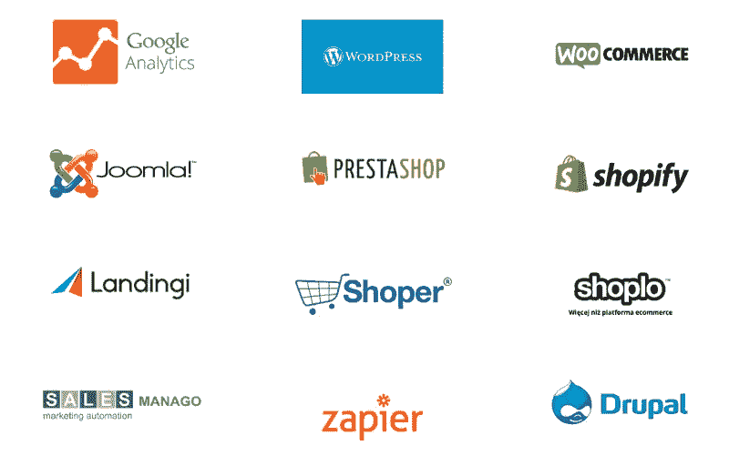

# 这款应用如何提高全球企业的转化率

> 原文：<https://medium.com/swlh/how-this-app-boosts-conversion-rates-for-global-businesses-8084d6911e5a>

通过你的网站获得线索似乎是一个简单的步骤。你创建一个网页，输入信息让你的访客知道你是谁，你提供什么服务，并为你的观众提供一个表格/联系方式来收集感兴趣的访客的数据。但是一旦你建立了你的流程，就值得用一种更普遍的方法来思考并问自己一个问题:**我的访问者中有多少比例在访问我的网站后决定注册**、购买或联系？

# 补救你的低转换率

但是你实际上如何刺激这个数字呢？**一旦访问者访问了你的网站，你如何增加他们购买产品或服务的可能性？**

有许多方法可以做到这一点。其中之一就是优化你的网站，让你的潜在客户更有可能购买。这可以在[分析应用](https://picksaas.com/analytical-tools)的帮助下完成，比如 [Hotjar](https://picksaas.com/analytical-tools/hotjar) 或 [Google Analytics](https://picksaas.com/analytical-tools/google-analytics) 。另一个是[实时聊天解决方案](https://picksaas.com/live-chats)，让你直接与你的访客联系和聊天。从访问网站的人那里得到即时回复的机会可以让你的潜在客户变成真正的客户。

然而，还有另一种方法，我们本周有幸拜访的那家公司已经找到了这种方法，多亏了维多利亚·乌曼斯卡， [CallPage](https://picksaas.com/call-back-apps/callpage) 的首席业务发展官有机会了解更多关于回电应用的信息。如果你能立即和你网站的用户在电话上交谈会怎么样？

*CallPage’s widget*

# 在 28 秒内给你的访客打电话

[CallPage](https://picksaas.com/call-back-apps/callpage) 是一家向全球客户销售其在线解决方案的国际公司。它提供了一个出现在你的网站上的小部件(不管你的访问者当前正在浏览什么子页面)，试图**收集你的访问者的电话号码**。然后，在 28 秒内，它会通过电话自动连接您和您的访客。

> “如果没有 CallPage，要给公司打电话，你必须搜索联系人选项卡，找到电话号码，输入到你的电话中，然后希望有人接听电话。使用我们的解决方案，我们减少了流程的主要部分。你输入你的电话号码，就这样，你就神奇地联系上了公司的代表。”

由于加快了这一过程，该公司让客户和网站用户的生活变得更加轻松。客户可以迅速与公司代表通话，另一方面，运营商有机会更有效地管理其电话 **呼叫**，分析它们，设置可用时间或收听呼叫录音。

# 推动 B2B 业务销售的回电解决方案

CallPage 的解决方案主要针对 B2B 业务，通过电话直接联系和达成交易仍然是常见的做法。

> “我们正在为我们的客户创造更多与他们的客户联系的机会，这对 B2B 业务尤其有价值。我们还向小型初创企业提供大的价值主张，这些企业非常依赖直接联系作为客户获取渠道。”

该解决方案的成本从每月 59 美元开始，这似乎不是一笔大的开支，尤其是对于那些需要花费大量精力来获得客户的公司来说。

> “我们为转换成本非常高的行业提供最大的价值。与您获得的好处相比，安装一个小工具的额外成本非常低，并且**走捷径接触您的客户**已经成为一种标准做法。”

# 使用您自己创建的应用程序生成销售线索

CallPage 使用许多渠道来获取其客户。其中之一是他们自己的小工具，每天能产生大约 50 个潜在客户的电话。

*“我们创造了许多有价值的内容，推动了我们的集客营销，我们开展了外发冷邮件活动，并且* ***使用我们的回电小工具通过电话与我们的访客联系*** *。然而，我们 50%的销售额是通过合作/推荐产生的，我们发现这一渠道非常有效”*

在其客户中，如 Orange、奥迪或普华永道，有许多成功的故事表明该应用程序如何为客户的成功做出了贡献。

*“有一次，我们接到大客户的电话，说:多亏了你的小工具，我才卖了一辆车，谢谢你！这样提到我们的客户非常鼓舞人心，让我们每天都在为这款产品工作，变得越来越有趣。”*

*CallPage integrations*

# 使用云应用构建全球产品

在日常工作中，该公司使用许多云应用程序，这有助于他们提高工作效率，并快速与其他团队成员沟通。

> “我们用[啄木鸟](https://picksaas.com/cold-mailing/woodpecker)进行对外营销，用 HubSpot 进行营销，用 Slack 进行沟通，用[特雷罗](https://picksaas.com/project-management/trello)进行项目管理，用[谷歌分析](https://picksaas.com/analytical-tools/google-analytics)进行网站分析。我们发现云应用在我们的日常工作中非常有用。[啄木鸟](https://picksaas.com/cold-mailing/woodpecker)对冷邮寄活动特别有用，我们的销售团队无法想象每天没有它的工作。”

您还可以轻松地将 CallPage 与其他云应用程序集成在一起，从而使安装过程变得流畅而简单。

> “我们最受欢迎的集成包括 Salesforce、HubSpot、Joomla、WooCommerce 或 Zapier。然而，最有趣的是我们与脸书 Lead Ads 的集成，让您可以自动将 FB 广告上的电话号码上传到 CallPage 系统。”

截至 2018 年 1 月，CallPage 已经为其客户产生了超过 418，000 个呼叫，并且迫不及待地在新的市场上扩张以获得更多的客户。

*在*[*picksaas.com*](http://www.picksaas.com/)*中，我们发现了帮助您发展电子商务、服务、网站、博客或其他业务的应用。我们找到并实施合适的销售、营销、分析甚至设计应用程序，以节省您的时间并增加销售额。*

*我们始终乐意帮助实施最佳应用来发展业务，您可以* [*与我们预约*](https://app.acuityscheduling.com/schedule.php?owner=14759847) *，我们将向您展示如何选择、配置、实施和使用最佳应用来满足您的特定业务需求。*

*要接收我们关于最佳应用程序的更新，以发展您的业务，您可以* [*订阅*](https://picksaas.us16.list-manage.com/subscribe/post?u=0a811ad254e7cd14718599e3a&id=bdf0cfd955) *我们的每周增长提示或关注我们的*[*Twitter*](https://twitter.com/picksaas)*。*

如果你觉得这些材料有用，我们会很高兴看到你的掌声，并希望你会喜欢其他的故事

[*我们用来提升营销效率的 5 款应用*](https://picksaas.com/blog/best-marketing-apps)

[*我们用来更好地管理公司的 5 款应用*](https://picksaas.com/blog/5-best-business-apps)

【picksaas.com】最初发表于**。**

**

## *这个故事发表在 [The Startup](https://medium.com/swlh) 上，这是 Medium 最大的企业家出版物，拥有 288，884+人。*

## *在此订阅接收[我们的头条新闻](http://growthsupply.com/the-startup-newsletter/)。*

**