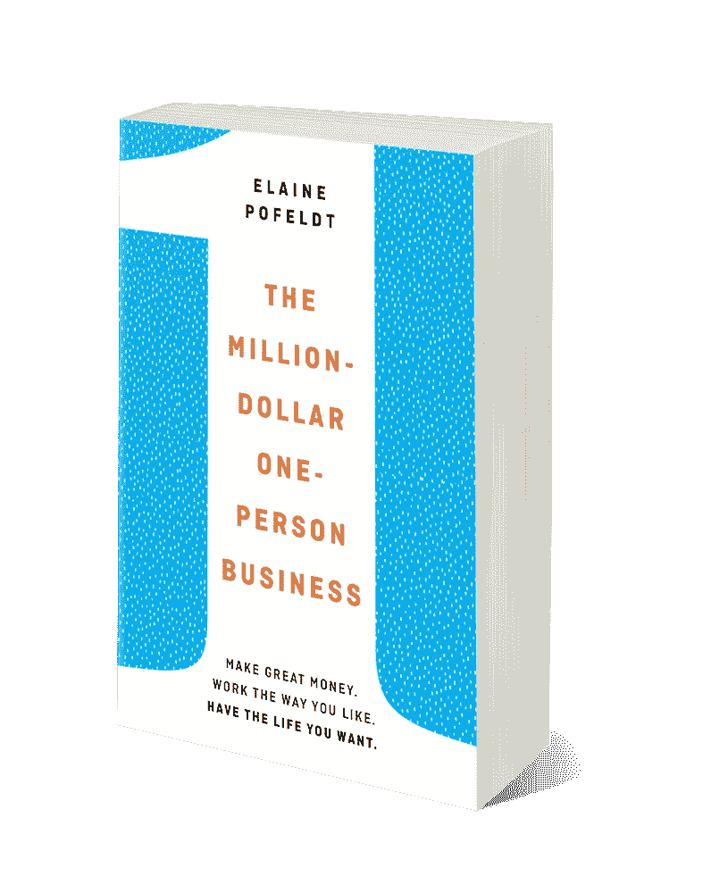

# 这位作者如何通过报道报道不足的商业故事将一个节拍变成一本书

> 原文：<https://medium.com/swlh/how-this-author-turned-a-beat-into-a-book-by-covering-underreported-business-stories-aeaac1595f65>

在 2013 年的某一天，面对她在福布斯商业专栏的截稿日期，波菲尔德发现了一个非常需要的故事。它以一个一人公司列表的形式出现，这些公司赚了 100 万到 249 万美元，并开始钻研。这份名单是按行业组织的，所以她涵盖了[在这个框架内的故事](https://www.forbes.com/sites/elainepofeldt/2013/06/29/the-rise-of-the-million-dollar-one-person-business/#41a8360b3c99)。读者喜欢这篇文章，在写作时已经有超过 200，000 的浏览量。他们想要更多。在她的编辑的鼓励下，Pofeldt 要求她的读者站出来，如果他们经营这些公司之一。

企业主们对此做出了回应，Pofeldt 开始撰写他们的成功案例。非雇员企业，即没有带薪雇员的公司，在媒体上报道相对较少。记者倾向于关注轰动一时的初创公司或大公司。有了 Pofeldt 的报道，很多企业主终于觉得自己被认可了。这种有机的兴趣是无计划的，只是由波费尔特的个人好奇心驱使的。

“这些人优先考虑他们生活中的人，回馈社会，以及除了赚钱以外的其他事情，”伊莱恩·波费尔特在谈到她的书 [*百万美元的单人生意*](https://www.amazon.com/Million-Dollar-One-Person-Business-Great-Money-ebook/dp/B06Y4V1L9D) 的灵感时说。“我认为这条信息会吸引很多人，他们会觉得，‘我到底需要多少？’"

2015 年，她最受欢迎的作品《[创业者如何在单人企业中突破 100 万美元](https://www.forbes.com/sites/elainepofeldt/2015/05/30/how-bold-entrepreneurs-are-breaking-1-million-in-one-person-businesses/#52243c76398b)》获得了超过 30 万的浏览量。这些读者中有一位名叫莱拉·坎波利的经纪人，她从中看到了出书的潜力。坎波利读了一些其他的文章，伸出了手。

坎波利的职业道德、热情和勤奋引起了波费尔特的共鸣。波费尔特聘请坎波利做她的经纪人，她领导波费尔特的书的推介、交易和营销过程。从企鹅兰登书屋拿起它的那一刻起，波菲尔德就开始工作了。

在出版之前的几年里，波费尔特采访了 30 多位企业家和 20 位专家，通过他们分享的导致他们成功的相似心态将他们的故事联系起来。其结果是，本书分享了成功企业主的故事——他们拥有不同的商业模式、风险偏好和生活方式——在雇佣员工之前，他们的收入已经达到了 100 万美元。

这本书列出了成功经营公司的实际步骤，同时启发读者，他们在工作之外仍然可以有非常活跃的生活。你可以从柔和的颜色和字体看出，它在传统的商业书籍中脱颖而出，因为它试图吸引普通的企业主。

“书籍有自己的生命。你可以用某种方式推销它，但这本书会有机地找到读者，”波菲尔德说。这本书已经在 35 个不同的播客上播出，反响不一。Pofeldt 感到兴奋的是，在她所有的工作之后，这本书似乎在自己的道路上成长。

截至 2016 年，美国有近[2500 万家非雇主企业，波菲尔德的工作有很大的市场。她将这些非雇员企业的所有者描述为成功人士，而不是没有扩大规模的失败者，而是选择以他们认为合适的方式经营公司的成功者。Pofeldt 从这些企业家那里获得了压倒性的积极回应，以至于她现在有一堆她期待报道的故事。](https://www.forbes.com/sites/elainepofeldt/2018/06/21/why-more-americans-are-breaking-1-million-in-one-person-businesses/#6ec55539616b)

“当你是一名记者时，你的工作永远不会结束，”她说。

*伊莱恩·波费尔特(Elaine Pofeldt)的最新著作《* [*《百万美元，一个人的生意*](https://www.amazon.com/Million-Dollar-One-Person-Business-Great-Money-ebook/dp/B06Y4V1L9D) *》现已面世。*

## 这篇文章发表在 [The Startup](https://medium.com/swlh) 上，这是 Medium 最大的创业刊物，拥有 358，974+人关注。

## 在此订阅接收[我们的头条新闻](http://growthsupply.com/the-startup-newsletter/)。

