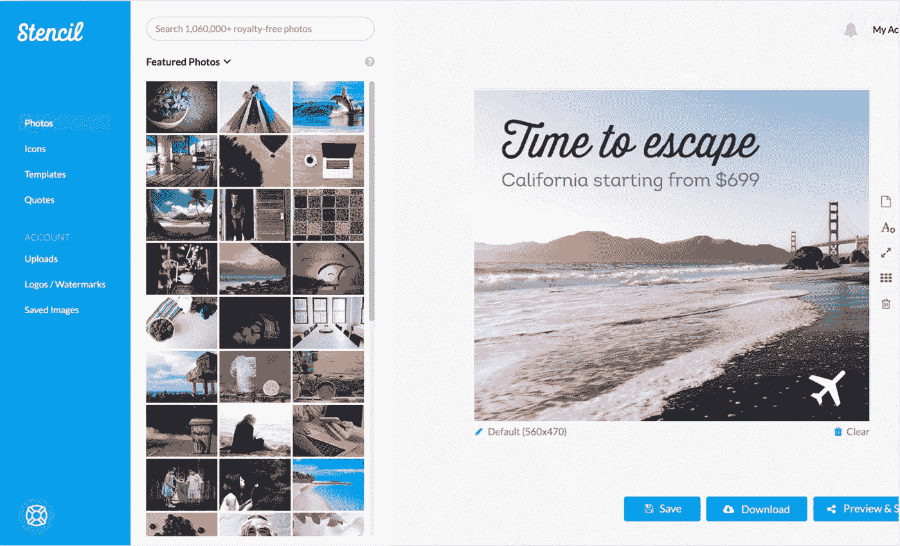

# 这款设计应用如何帮助企业成长:采访 Canva 的竞争对手

> 原文：<https://medium.com/swlh/how-this-design-app-helps-businesses-grow-an-interview-with-canvas-competitor-81ea048c9443>

我们最近有机会与 Oliver 交谈，他是 [Stencil](https://goo.gl/b5p49y) 的联合创始人，这是一个简单的设计**应用程序，旨在使图形设计对我们每一个人都是可访问的**。如果你还不知道的话，[模板](https://goo.gl/b5p49y)类似于 [Canva](https://goo.gl/c3qGeP) ，让你用简单的在线拖放应用程序创建吸引人且整洁的图形。

这对于创建设计非常有用，尤其是对于您的社交媒体渠道，因为 [Stencil](https://goo.gl/b5p49y) 可以让您选择您想要为其创建图像的特定渠道，例如脸书邮报或 Twitter header。

结果是**为我们 [picksaas](http://www.picksaas.com) 节省了大量时间**，显然对其他 Stencil 的客户也是如此。根据我们的经验，创建图形以匹配特定社交媒体的特定大小是非常耗时的，Stencil 的应用程序给了我们巨大的灵活性，不用担心一些技术解决问题。

## 谁用这个 app 做图形设计？

[Stencil](https://goo.gl/b5p49y) 专为**小型企业**设计，这些企业负担不起或不想使用专业图形设计师的服务，或者更喜欢自己制作图形。

> “我们的客户往往是小型和非常小型的企业。其中包括许多从事自由职业的数字营销人员、作家和生活教练。它通常还包括经营电子商务网站或现实世界商店的客户，他们需要一个非常易于使用的图形设计工具来创建图像。”

## 为什么客户使用 Stencil 而不是其他应用程序？

人们倾向于在图形设计中使用[模板](https://goo.gl/b5p49y)的主要原因是**使用**很简单，而且它能帮助他们**更快地完成工作**。

> “人们使用模板是因为我们努力让它简单易用。当他们使用模板时，一切都正常。网络上的其他服务倾向于更直接地与像 Photoshop 这样的工具竞争。虽然有时像 Photoshop 这样的工具是唯一能完成工作的工具，但通常像 Stencil 这样更简单的工具才是人们真正想要的。帮助他们快速为社交媒体账户、博客文章或时事通讯标题创建图片的工具。”

[Stencil](https://goo.gl/b5p49y) 除了帮助你设计帖子或图片之外，还通过简单的预览模式向客户展示他们的帖子在社交媒体上的样子，这样他们就可以确信**所有东西都是按照企业的风格**和调色板精心制作的。

这是由超过 100 万张免版税的照片和图标支持的，所以用户**不需要担心使用在线材料的法律问题**。

> “对于社交媒体，我们提供从 Stencil 直接向帐户发帖的功能。我们在人们发布图片之前，先给他们展示图片的预览。更好的是，当你使用 Stencil 时，你可以访问超过 100 万张免版税的照片和 100 万个免版税的图标。这些照片和图标可以用于任何用途，包括商业用途。通过这样做，人们可以轻松地专注于设计，而不用担心任何版权或法律问题。”

## Stencil 如何帮助全球企业发展…

有三个主要领域[Stencil](https://goo.gl/b5p49y)如何帮助其客户发展业务:

1.  它让你通过设计更好的帖子来增加你的社交媒体的影响力
2.  它**省钱**并处理与**在你的设计中使用照片/图标相关的法律问题**
3.  它节省了你使用更高级的应用程序来创建简单图形的时间。

> “最明显的增长驱动因素是，当我们的客户出于营销目的(尤其是社交媒体)使用 Stencil 创建图像时，这增加了他们的影响力。如今，视觉营销势在必行。第二是通过使用模板，你不需要担心版权或购买任何照片或图标的权利。这可能会非常昂贵和令人沮丧。最后，模板只是工作。我们不会妨碍您，因此您可以参与进来，创建您的设计，下载/发布到社交媒体上，并继续您的一天。”

[Stencil](https://goo.gl/b5p49y) 是一家很高兴看到其产品对客户业务产生实际影响的公司，因为其用户的成功故事包括**提高其电子商务商店的转化率**，当然，使他们的日常工作更加有效**。**

> **“我们每天都会收到客户的电子邮件和推文。例如，当有人给我们发电子邮件说“我花了 5 分钟用模板设计了一个图像，而我用 Photoshop 做了 2 个小时”，我们会异常高兴。我们听说过这样的故事，在他们开始使用 Stencil 来推广他们的在线商店后，他们直接看到了销售额的增长。以前，当他们的博客没有推广他们正在销售的产品的图片时，他们看到的转化率为 5%。在他们加入展示产品的图片，并在图片上加上水印和价格后，他们看到转化率跃升至 18%。”**

****

## **如果不使用商业应用，Stencil 不会发展得这么快**

**[Stencil](https://goo.gl/b5p49y) 是一家与众不同的企业，它不怕**使用其他公司提供的应用**。**

**它使用类似 [Trello](https://goo.gl/MsNoUJ) 的应用程序进行项目管理， [Campaign Monitor](https://goo.gl/MtdS25) 用于邮件自动化， [Mixpanel](https://goo.gl/5uDJCY) 或 [Segment](http://segment.com/) 用于分析，以及 [Stripe](https://stripe.com) 用于支付。**

> **“任何让我们无法改进 Stencil 的事情对我们来说都是一种干扰。我们不想担心自己跟踪统计数据或设计图标，或直接通过银行处理支付。我们使用的所有应用程序都让我们只关注 Stencil 这个平台。这让我们更容易完成工作，提供更好的客户支持，并评估我们的客户可以改进的地方。”**

***在*[*picksaas.com*](https://goo.gl/db4Mmh)*中，我们发现了帮助您发展电子商务、服务、网站、博客或其他业务的应用。我们帮助您找到合适的营销、分析甚至设计应用程序，以节省您的时间并增加销售额。要获得我们关于促进您业务发展的最佳应用的更新，您可以* [*订阅我们的每周增长提示*](https://picksaas.us16.list-manage.com/subscribe/post?u=0a811ad254e7cd14718599e3a&id=bdf0cfd955) *或关注我们的*[*Twitter*](https://twitter.com/picksaas)*。***

***您也可以* [*与我们*](https://app.acuityscheduling.com/schedule.php?owner=14759847) *预约一个简短的咨询，我们将向您展示如何配置、实施和使用最适合您特定业务需求的应用。***

***如果你觉得这份材料有用，别忘了鼓掌并查看其他故事:***

*   **[*我们用来提高营销效率的 5 款应用*](https://goo.gl/tb5ek5)**
*   **[*我们用来更好地管理公司的 5 款应用*](https://goo.gl/sQ5Xax)**
*   **[*3 类应用为你的电子商务业务做广告*](https://goo.gl/q61vg8)**
*   **[*3 款应用提升你的社交媒体营销*](https://goo.gl/fn6bxT)**
*   **[*发展咨询业务的 5 个应用*](https://goo.gl/C8AHQp)**
*   **[*云应用如何帮助这家公司在两年内拥有 1，000 名付费客户*](https://goo.gl/nQA8vT)**

****

## **这个故事发表在 [The Startup](https://medium.com/swlh) 上，这是 Medium 最大的企业家出版物，拥有 277，994+人。**

## **在这里订阅接收[我们的头条新闻](http://growthsupply.com/the-startup-newsletter/)。**

****