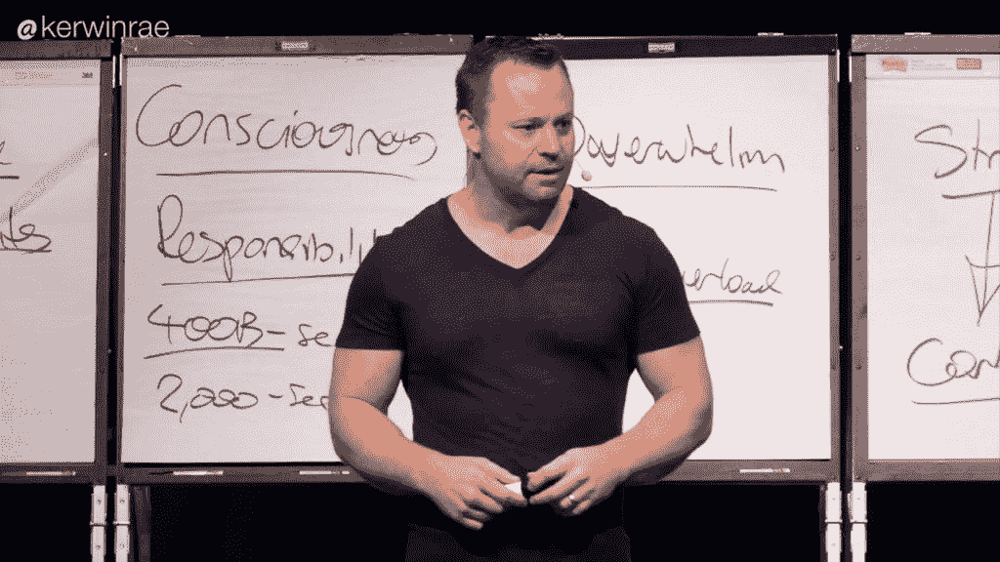
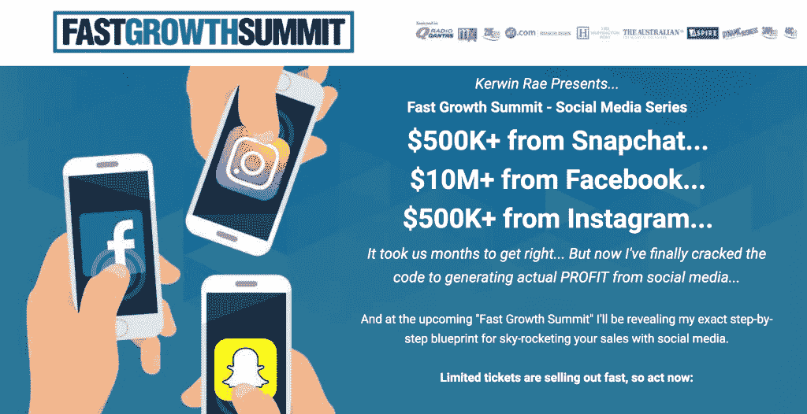

# 这位企业家如何从脸书赚到 1000 万美元

> 原文：<https://medium.com/swlh/how-this-entrepreneur-made-10-million-from-facebook-using-re-marketing-23b41696f431>

在脸书赚 1000 万美元以前是闻所未闻的。

你怎么能从社交媒体平台上赚那么多钱？

更不用说 Kerwin Rae 声称在 Snapchat、Instagram 和世界上所有其他平台上赚了几十万美元。

但是当我开始更多的观察它，它开始变得有意义了。

在过去的几个月里，我一直在研究在我的新闻订阅中出现的有影响力的人。

加里·维纳查克、萨姆·奥文斯、汤姆·沃特豪斯和凯文·雷是最近的几位。

他们似乎知道一些我不知道的事情，这开始让我很恼火。他们把它整理好了。直到我在一次工作活动中看到两位脸书广告大师解释他们是如何做到的。

另外，当我在他的活动“快速增长峰会”上见到克尔温·雷时。

令我惊讶的是，凯文和脸书大师们在脸书和其他渠道营销产品的结构完全相同。

# [快速增长峰会](https://www.fastgrowthsummit.com/)

在我回顾他们的所作所为之前，我先回顾一下强化了我已有内容的事件。

我的朋友[柯蒂斯·特雷德韦](/@CurtisTredway)在最后一刻打电话给我，告诉我澳大利亚悉尼是唯一一个没有售完的城市。我在网上看到过 Kerwin 的东西，但从来没有真正关注过。不过，我今晚有空，所以我告诉他我会去。

门票只有 47 美元，这一点很重要，因为这 47 美元的回报是无价的。我从未从任何事情中得到更多。

走进酒店大厅，已经有几百人在排队了。等着进入大厅，在那里我们会看到克文。

在这个阶段，我仍然没有太大惊小怪。我参加过一些这样的活动，所有发生的事情就是一个演讲者推销他的劣质产品两个小时，然后一小撮白痴会报名，其他人都会被激怒。

但是这次不一样。

大约 600 人汗流浃背地在大厅等候，我们终于被允许进入。天气很热，屋顶很低。

我们都坐下来，不到 10 分钟就开始了。

他们像往常一样。他现在的一个学生走了出来，给他鼓劲，让我们都兴奋起来。

一旦她完成了她的故事，如何伟大的克尔温，一些得意忘形的家伙出来发誓他的头了。我意识到那是科尔文。

他看起来和他的视频很不一样。

接下来是一个 2 小时的主题演讲，充满了与我的工作相关的可操作的见解…

[数字营销](https://jessekerema.com/master-content-writing-seo-research/)。

太他妈棒了。他给了我们如何在 Instagram、脸书和 Snapchat 上扩大销售的具体步骤。

这一切都是有意义的，它是建立在我已经知道的基础上的。

# 在 FACEBOOK 上赚了 1000 万美元

因此，事实证明，克尔温·雷伊在网上赚钱的过程与萨姆·奥文斯、泰·洛佩兹和所有其他数字影响者完全一样。

*还有一个有趣的事实，他们中的一些人使用同一个数字代理机构来管理他们的账户——***。**

*我听到很多人说你可以在几个小时内学会脸书广告。这在某种程度上是对的。任何人都可以提升一个职位，任何人都可以选择一个目标市场。但是要开发一个成功的销售漏斗，需要更多的技巧和适应能力。*

*重要的事情先来。*

# *“对话是新的线索”*

*这是克尔温指出的最重要的一点。*

*和某人开始对话是你建立关系的一种方式。有了关系，就可以卖了。*

*你开始的方式是用免费内容来回答人们的问题。*

*例如，如果有人给你发了一条脸书信息，询问他们如何规划 2019 年的目标。你可以给他们发一个链接，链接到一篇解决这个问题的博文或者一本做同样事情的电子书。*

*显然，根据你做什么，问题是不同的，但这是一个总的想法。*

*回复你收到的每一条评论，回复你收到的每一个问题/信息。*

# *收到电子邮件*

*如果你什么也得不到，这一点很难帮助你改变信仰。*

*因此，一旦你建立了这种联系，你就确定了他们的问题，你就有了可以帮助他们的内容，你就能得到他们的电子邮件。*

*不要通过脸书直接发送内容。这将意味着你浪费了一个可能的线索。*

*发这样的东西会管用:*

> *“嘿，我有一些对你有帮助的好消息。你有我可以拍摄的电子邮件吗？”*

*现在你有了他们的电子邮件，他们被添加到你的电子邮件培养漏斗中，这将最终出售他们。*

*Kerwin 说他的这个策略有 100%的转化率，因为你直接帮助了他们的问题。*

# *视频转换*

*众所周知，视觉内容在社交媒体上的参与度最高。视频是最好的。*

## *仅限垂直视频*

*要创建完美的漏斗，你需要 6-10 个 30 秒的视频。*

***必须垂直拍摄***

*原因是，大部分视图都是在手机上完成的。垂直视频占据了屏幕的大部分，这意味着人们不必将手机水平侧放。*

*这可能看起来不多，但相信我，人们会生气，不会查看你的内容。*

# *现在，让我来解释一下漏斗*

*你想开发一个漏斗，让人们给你他们的电子邮件。不是买一个产品！*

*这一般是电子书或者某种快速免费课程。*

*目标是得到一封电子邮件。然后你可以把它加入到我之前提到的培养漏斗中。或者甚至在此之前，在你的免费内容中加入 CTA 来出售它们。*

*让他们有足够的欲望去购买。*

*你需要一个视频来寻找潜在客户。这个视频是你的主要脸书广告。一旦你有了视频，并准备推广它，选择一个广泛的目标受众。*

*然后，您将设置另外 5 个 30 秒的视频，这些视频被设置为对上一个视频进行 3 秒钟观看的再营销活动。*

****请注意，只有最后一个应该有一个可点击的链接，其余的都应该给出值！****

*你最终得到的是一系列视频，人们可以看到这些视频(就像我在开始提到的影响者一样)，这导致一小部分人进入登录页面，但他们非常热情。他们很可能会转换，克尔温的数字高达 80%！*

*虽然这是一个简单的解释，但这就是你如何开发一个令人垂涎的脸书漏斗。*

*我很乐意给你一个更深入的解释，你想要设置的视频类型。*

*给我发邮件:newbarriers@gmail.com*

*虽然这只是 Kerwin 考察的 3 个平台中的一个，但也是他给出的 1000 个有价值的见解中的一个。我觉得它是所有工具中最有用的。*

*我 100%会再看一遍。感谢这个美妙的夜晚，柯文！*

***如果你喜欢这篇文章或者觉得它有帮助，按下拍手按钮给其他人看！更好的是，在你的想法上留下评论。***

**

## *这篇文章发表在 [The Startup](https://medium.com/swlh) 上，这是 Medium 最大的创业刊物，有+384，072 人关注。*

## *订阅接收[我们的头条新闻](http://growthsupply.com/the-startup-newsletter/)。*

**