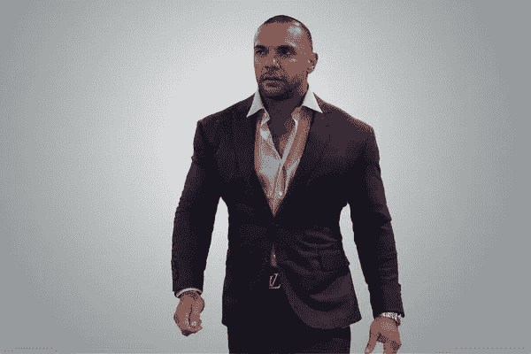

# 这位前美国海军潜水员如何建立起八位数的生意

> 原文：<https://medium.com/swlh/how-this-former-u-s-navy-diver-built-an-eight-figure-business-635b0fb6d580>

除了克里斯·卡沃利尼(Chris Cavallini)，没有多少企业家能说他们运用了在美国海军当潜水员时学到的技能，建立了一家 8 位数的企业。

他是前美国海军深海潜水员，也是营养解决方案的创始人。这是一家总部位于美国的生活方式和膳食准备公司，为希望实现健身或健康目标的人提供定制膳食。

该公司的客户范围从专业运动员到超重的中年男女，他们都希望减肥、锻炼肌肉、变得更健康。

# 拥有团队的成功

卡瓦利尼在 18 岁之前被捕过 17 次。

“我收到了最后通牒，要么坐牢 7 个月，要么参军，”他说。

“我选择了后者，军队给了我结构，教会了我纪律的重要性。”

显然，卡瓦利尼从过去的错误中吸取了教训，知道如何让他的 50 多人的团队茁壮成长。

“如果你的团队没有做你希望他们做的事情，那不是他们的错，那是你的错，”他说。

“你必须承担起责任，为他们提供培训、指导和资源，这样他们才能在个人和职业上成长，”他说。

“你必须为他们提供支持、结构、责任和持续培训，以帮助他们成为领导者。”

# 为逆境做准备

美国海军潜水员受训者必须戴着遮光面罩在池底完成一项测试。

在潜水过程中，他或她的教练游了下去，意外地关闭了他们的空气。然后，教练试图撕开空气罐，将受训者从池底猛打 15 秒。

“你必须尽可能保持冷静，然后记住你在压力下接受的所有训练，”卡瓦利尼说。

“如果你惊慌失措，试图逃出水面，很多人都这样做，你的肺部可能会过度膨胀，最终爆炸，这是一个非常现实的可能性。”

这个可怕的练习的目的是教潜水员如何应对压力，并能够在现实生活的混乱情况下采取行动，记住他们的训练，淘汰那些不能处理高压力和不利情况的虚弱候选人

“这有助于你建立信心，并帮助你学会如何在非常紧张的条件下工作，”卡瓦利尼说。

大多数企业家不会面临生死挑战，但他们会遇到逆境甚至危机，比如打错电话可能导致你失去客户，并因此损失数千甚至数万美元，或者在没有通知的情况下突然失去一名关键团队成员。

> “我们努力做好准备，所以如果有人意外倒下，我们有两个人可以站出来填补这个角色，保持势头，”卡瓦利尼说。

# 在危机中保持镇静

卡瓦利尼认为，在困难时刻保持冷静是成功创业的关键。他记得他的公司由于技术错误给客户发送了错误的订单。

几乎立刻，该公司开始收到数十封来自过敏和特殊营养需求客户的电子邮件、电话和短信。

“我决定连夜带一个团队来立即纠正这种情况。我们连续工作了 30 个小时，基本上重新准备了我们搞砸的每个人的订单。让我们付出的金钱和压力绝对超出了我们的想象，”他说。

> “当时很混乱，但这是正确的做法。通过向团队解释我们对客户的责任，每个人都同意了，”他说。“这为我们赢得了很多尊重，粉丝客户们赞不绝口，也让我们作为一个团队更加紧密。

今天，卡瓦利尼通过体育训练和自我教育投资于自己。他始终专注于提升自己，并将这一原则应用于他的营养解决方案团队，因为他的文化建立在自律和努力工作的原则之上。

卡瓦利尼说，其他企业家可以应用他的方法，他鼓励他们行动起来。“神奇的事情发生在执行过程中，我从自己犯下的错误中学到了最有价值的教训。”

**准备好提高你的生产力了吗？**

我已经创建了一个小抄，可以帮助你立即集中注意力。遵循这一点，你会取得超乎想象的成就。

[点击这里获取小抄](http://bryancollins.com/)！

## 这篇文章发表在 [The Startup](https://medium.com/swlh) 上，这是 Medium 最大的创业刊物，有+393，714 人关注。

## 订阅接收[我们的头条新闻](http://growthsupply.com/the-startup-newsletter/)。

