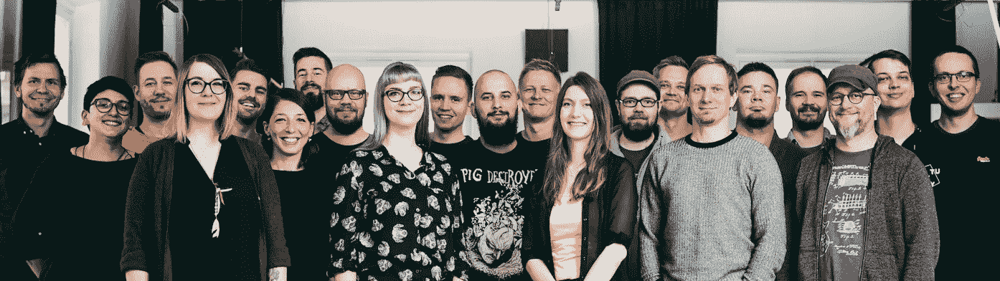

# 这家手机游戏初创公司如何通过一个简单的规则实现 5000 万次下载和 100 万次 DAU。

> 原文：<https://medium.com/swlh/how-this-mobile-gaming-startup-got-50-million-players-and-1m-dau-with-one-simple-rule-7112c7ff9708>

有一句著名的老话:

> 生活真的很简单，但是我们坚持要把它变得复杂

我们大多数人都会同意这同样适用于工作。等级制度；报告；会议；流程；工具。当然，它们都有各自的优点——**但是它们经常被过度使用，**压制了创造力、自主性以及最重要的简单性。

在 [Futureplay](http://www.futureplaygames.com) ，**简单为我们所做的一切奠定了基础。**像所有坚固的基础一样，它指导着我们的整个建造过程，从概念到原型再到开发和生产。

这是一个让我们受益匪浅的基础。我们在 2018 年结束时进入了新的高度，刚刚达到了两个巨大的公司里程碑。

> 每天都有 100 万玩家在玩我们的游戏，迄今为止，共有 5000 万人安装了我们的游戏。

这让我们都很兴奋，我们认为没有比我们如何在媒体上做出第一份贡献更好的话题了。

# **1 条规则，3 条原则**

简单源于我们唯一的公司规则:*不废话。* 其他一切都会水到渠成。

没有废话意味着没有自我。这意味着没有政治，嗯，没有废话。只是一群善良的男孩和女孩尽他们该死的最大努力来制作伟大的游戏。

三个原则指导着我们的游戏开发:

> **零层级**
> 
> **流程结果**
> 
> 每个人都可以玩

## **零层级**

冒着丢掉一个被过度使用的陈词滥调的风险，Futureplay 真的是一个大家庭。作为团队中最近加入的成员之一，我可能比我的同龄人更有资格宣扬这一点(也就是说，我不是那种典型的初创公司创始人，他会说一些没有实质内容的话，试图让更多人喜欢我们)。这确实是真的。

一个大家庭意味着我们每个人都是平等的。每个人都有自己的想法，不用担心评判或批评，而且没有合适的指挥结构。

> 每个人都用一种旨在培养责任感、生产力和创造力的自主文化来挑战和期待被挑战。

每个人都拥有公司的一小部分，所以正如你所料，大家都有决心让公司朝着正确的方向发展。

没有中层管理，就不需要报告，也不需要官僚主义。这意味着我们可以专注于重要的事情:制作优秀的游戏。

## **流程结果**

> 我们失败得快，我们学得也快。

躲在开发中，在软件发布中度过漫长的时间，这是我们觉得非常可怕的事情。

相反，我们专注于快速发布游戏和更新，并利用定量和定性的反馈来帮助我们**迭代、优化和发展。**

> [皇家战场](http://m.onelink.me/d141ae73)，我们最近的游戏，从今年一月才开始开发。我们在三月份试运行，并在六月底走向全球，不到四个月前。

现在，该游戏由负责开发的八人团队进行维护和改进，每两周更新一次，旨在保持内容新鲜，提高参与度，增加留存率。自发布以来，《皇家战场》已经有超过 1500 万玩家下载。

这是通过**快速的生产冲刺、强大的分析系统和一套清晰的 KPI 目标**(当然，是由游戏团队自己设定的)来实现的。来自社区经理的定期、结构化的反馈也大有帮助。

开发人员、艺术家和设计师在谷歌表单上工作，团队在 Slack 上的公开渠道中相互交流，并与公司其他部门交流。一切都是完全透明的，每周一在全公司的全体员工中自由分享进展和目标。

通常，那是一周中唯一的一次会议。我们认为那样更好。

## **每个人都可以玩**

> 玩的人有好东西。

你不能*强迫*创造力(我们将是第一个提倡这一点的人)，但是你可以*通过鼓励好奇心、雄心和自我发展的环境来培养*创造力。

在这里，每个星期五下午，每个人都可以从他们的常规项目中休息一下，在未来的操场上做他们想做的事情。

我们让 QA 人员构建原型，让社区经理学习日语，甚至让程序员创作音乐。

为什么？

> 因为我们相信不断学习的机会不仅有助于我们感受到价值，还会鼓励我们的思想去漫游；学习新技能，然后应用到更典型的项目中。

为了这种持久的好处，在周五损失几个小时是很小的代价。

更重要的是，我们的人按照自己的时间表来来去去。我们都有工作之外的承诺，刻板的办公室日常事务不应该妨碍这些承诺。我们在最适合我们的时候完成工作(而且我们做得很好)。这意味着早到还是晚到，取决于我们每个人。

我们为自己的原则感到自豪。但最精彩的部分呢？

我们没有停滞不前。

事实上，我们发展得相当快，**我们已经准备好让 2019 年成为我们迄今为止最大、最好的一年。**

我们很快就要离开现在的办公室(eek——过去三年它一直是我们的家),搬到新的地方——更大的地方——我们期待着欢迎更多有才华的人加入未来的 play 大家庭。

如果你喜欢你所读到的， [**你可以在这里**](http://bit.ly/Medium-Careers) 看到我们的空缺职位。我们总是很高兴收到有才华的人的申请，所以即使你找不到你的技能组合的空缺职位，也要保持联系。

现在，我们将继续做我们最擅长的事情。添加任何东西都会使事情变得过于复杂——你知道，我们喜欢让事情变得简单。

All smiles!

## 这篇文章发表在[《创业](https://medium.com/swlh)》上，这是 Medium 最大的创业刊物，有+ 380，756 人关注。

## 在这里订阅接收[我们的头条新闻](http://growthsupply.com/the-startup-newsletter/)。

