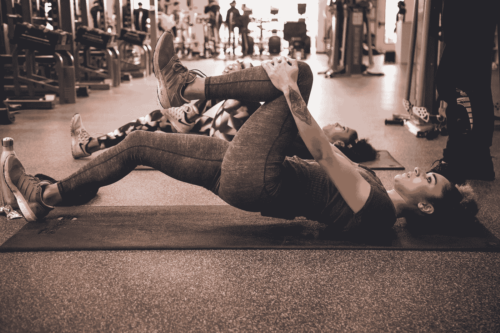

# 这位私人教练是如何从吸毒过量变成价值 120 万美元的健身公司的

> 原文：<https://medium.com/swlh/how-this-personal-trainer-went-from-drug-overdose-to-a-1-2m-fitness-business-54ea3920783f>

Photo by [Bruno Nascimento](https://unsplash.com/@bruno_nascimento?utm_source=medium&utm_medium=referral) on [Unsplash](https://unsplash.com?utm_source=medium&utm_medium=referral)

AJ Mihrzad 发现自己在 20 出头的时候经历了人生中的一段艰难时期。由于超重 60 磅，他有花栗鼠般的脸颊、背痛和情绪上的不安全感。他经常参加聚会，吸食大量毒品，一天晚上他服药过量，躺在急诊室里。

这次经历让 AJ 意识到，他需要改变自己的生活，并弄清楚自己的健康状况。他开始研究运动和营养，并在健身房进行了大量艰苦的工作，帮助他减掉了 60 磅。其他人开始注意到他在健身房的成绩，并向他寻求帮助，从而产生了他的第一批个人训练客户。

# **让 AJ 昏迷的失误**

Photo by [Benjamin Voros](https://unsplash.com/@vorosbenisop?utm_source=medium&utm_medium=referral) on [Unsplash](https://unsplash.com?utm_source=medium&utm_medium=referral)

有一天，AJ 犯了一个巨大的错误。他不小心把一种补充剂和他的赛前训练搞混了，导致他喝了相当于 3000 杯咖啡的量。他被紧急送往急诊室，在那里，医生被迫对他进行药物诱导昏迷六天。当这种情况发生时，他的心脏停止了跳动，他在家人面前被宣布死亡。谢天谢地，医生们能够使他苏醒过来。

# 人生的第二次机会

AJ 反思了发生的事情，并决定他需要在有机会的时候真正追求自己的梦想。他辞去了全职工作去追求个人训练。当时，他的个人培训收入是每月 1500 美元，需要翻倍。

仅仅通过专注于他的培训业务，他就能够实现他的目标。对他来说不幸的是，2008 年的经济衰退袭来，他的生意减少了一半，降到每月 1500 美元。AJ 以为他完蛋了。

# 直复营销初探

Photo by [Thought Catalog](https://unsplash.com/@thoughtcatalog?utm_source=medium&utm_medium=referral) on [Unsplash](https://unsplash.com?utm_source=medium&utm_medium=referral)

AJ 当时看到一个朋友从销售个人培训课程转型到销售团体训练营。AJ 问他是如何做出转变的，并向他介绍了直接回应营销。

AJ 开始阅读他能找到的所有关于这个主题的书籍，比如丹·肯尼迪、弗兰克·克恩和艾本·帕甘的作品。他还花了 5000 美元雇了一位名叫克里斯·麦库姆斯(Chris McCombs)的教练来帮助他发展业务。

克里斯给了他三条会改变他人生方向的建议。

# AJ 的收入如何从每月 1，500 美元增长到每月超过 8，000 美元

克里斯告诉 AJ 在三件事上采取行动。

1.  定个日期转到团体训练。
2.  不要以 60 美元/小时的价格销售会议，而是销售结果——为期 3-6 个月的转变。
3.  给每个人打电话，向他们提供这个团体训练计划

这些改变帮助 AJ 从每天与 5-6 个客户打交道发展到每天与 50-60 个客户打交道，并使他的收入增加到每月 8，000 美元以上。

# 缩放到六位数的倍数

Photo by [Justyn Warner](https://unsplash.com/@justynwarner?utm_source=medium&utm_medium=referral) on [Unsplash](https://unsplash.com?utm_source=medium&utm_medium=referral)

有了这个新系统，AJ 知道他需要找到杠杆和规模。他聘请了一名私人教练，这让他可以集中精力打电话，通过谷歌 Adwords 和本地搜索流量为他的项目注册用户。

这种转变帮助他成长到六位数，并最终最大限度地利用他的设施。住在纽约，租金非常昂贵，而且租用更大的设施似乎令人望而生畏。

他看到当时其他人开始创建关于营养和健身的在线课程，这让他想到了如何改变他的业务

# 达到七位数

Photo by [LinkedIn Sales Navigator](https://unsplash.com/@linkedinsalesnavigator?utm_source=medium&utm_medium=referral) on [Unsplash](https://unsplash.com?utm_source=medium&utm_medium=referral)

AJ 决定进军在线个人培训领域。他使用了与他在纽约的培训项目中使用的完全相同的生成销售线索和销售电话的系统。

他做出的改变是，他现在试图说服这些销售线索，让他们相信，注册一个 1000 美元、为期 6 个月的在线视频培训项目比亲自培训更好。这很有效，所以 AJ 决定将他所有的销售都转移到这个在线项目上，这样他就不用支付培训费或租金了。

使用这种新模式，AJ 扩大了他的广告，雇用了另一名销售人员，并开始以 1000 美元到 5000 美元的价格销售他的包装。这一转变最终帮助 AJ 将其业务扩大到 120 万美元的销售额和 90%的利润。

本专栏由 LeadQuizzes 及其播客系列《七位数之旅》为您带来。要收听 AJ Mihrzad 的整个播客采访，并从其他七位数字企业家那里获得建议和灵感， [*点击此处*](https://www.leadquizzes.com/podcast) *。*

# 请点击👏如果你喜欢或从中学到了什么。

几个掌声对帮助更多的人阅读这篇文章大有帮助！

*最初发表于*[*blog.leadquizzes.com*](https://blog.leadquizzes.com/learn-how-online-fitness-coach-aj-mihrzad-built-a-1.2m-business)*。*

## 这个故事发表在 [The Startup](https://medium.com/swlh) 上，这是 Medium 最大的创业刊物，拥有 325，521+人关注。

## 在这里订阅接收[我们的头条新闻](http://growthsupply.com/the-startup-newsletter/)。

