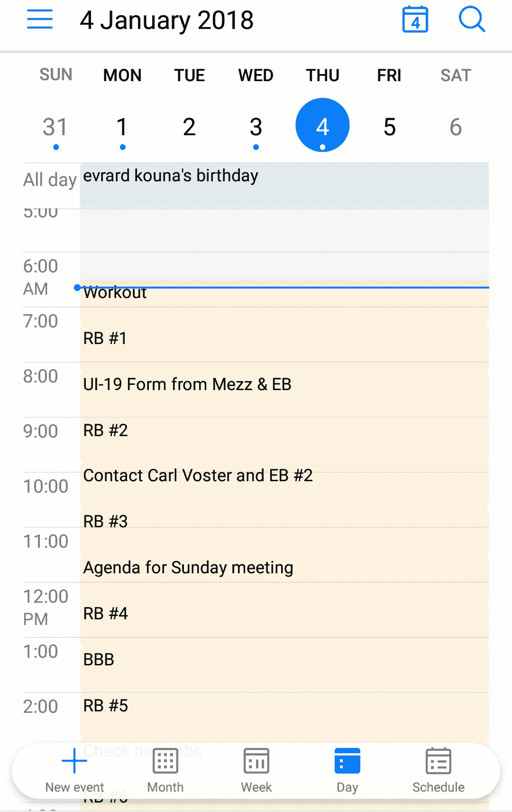

# 这个简单的公式如何帮助你每周提高 30%的工作效率

> 原文：<https://medium.com/swlh/how-this-simple-formula-can-help-you-increase-your-productivity-by-30-every-single-week-c636daada27e>

“生产力并不意味着成为一个工作狂，保持忙碌或开夜车…更重要的是要分清轻重缓急，做好规划，并全力保护你的时间。”-玛格丽塔·塔尔塔科夫斯基

我的许多亲戚、朋友和熟人不停地问我“我怎么了？”在他们审问的基础上，我对生活的看法发生了一个非常迅速和意想不到的转变。嗯，大多数时候当我不想说或解释太多的时候，我只是告诉他们谷歌一件事，或者我应该说一个名字:**布兰登·伯查德**。

我喜欢布兰登和他的作品，他是我的灵感和榜样。奇怪的是，他和我有着相似的故事，被生活境遇击倒，质疑生命的真正本质，在某一点上有自杀倾向(是的，我们并不羞于或害怕分享那一点)。但“啊哈时刻”来了，他意识到生活还可以提供更多，还有时间，他有可能**生活、爱和物质**，这已经成为他生活中一切的咒语。

我自己的“顿悟时刻”是在大约一个月前，一个朋友经过长时间的讨论后告诉我，我的生活中需要一些东西。我们的对话中有一个片段:

***我的朋友:*** *你知道此刻你的生活需要什么吗？*

**我:**什么？

***我的朋友:*** *布伦顿·伯查德*

***我:*** *他是谁？*

***我的朋友:*** *谷歌他一下*

***我:*** *请告诉我吧！*

***我的朋友:*** *只要谷歌一下他你就会看到…*

我做到了，这完全改变了我对生活的看法。感谢我的朋友(不愿透露姓名)和布兰登！

所以，让我们直奔本文的主题:

## 布兰登·伯查德的 5x50 生产率公式

“光忙是不够的。蚂蚁也是。问题是:我们在忙什么？”—亨利·大卫·梭罗

这个简单而强大的公式帮助我个人在生活中变得更有效率、更专注、更热情、更积极地参与社会活动、更有活力。布兰登的承诺是，这个公式可以帮助任何人每周提高 30%的注意力、精力和效率。我还不能支持他的说法，因为我根据我个人目前的情况和义务，在最初的公式中加入了我自己的想法。但我可以向你保证的是，如果你采纳了，哪怕只是部分采纳，你会立刻看到生活中的好处。

以下是布兰登坚持认为你必须掌握的五个领域，这样你才能感受到生活中应有的活力、快乐和进步。

1.  多睡 50 分钟:你每晚睡 7-9 个小时的时间有多长？
2.  **50 分钟晨间能量块:**你每天早上都做伸展运动或锻炼来激活你的身体吗？你的一天是从战略规划开始的，还是从回应别人的邮件、信息和要求开始的？
3.  **50 分钟分段时间:**“分段时间”是一种专注管理的方法，需要“划出”大量时间来推进或完成你生活中的一个重大项目。
4.  50 分钟休息时间:在工作或坐着的时候，你每小时至少有一次站立休息的时间吗？在那段时间里，你会移动和伸展吗？
5.  **50 分钟更新:**你每天都坚持冥想或散步吗？你可以通过什么样的练习来重新设定你每天的平和与自由，你将如何提醒自己每天练习？

# 行动呼吁

"可能会很忙——非常忙——但效率却不高."《高效人士的 7 个习惯》的作者斯蒂芬·R·柯维。

如果你想实现这个公式，并且有任何问题，欢迎在下面评论，让我们开始讨论。

你也可以直接登陆布兰登·伯查德的个人网站，阅读更多关于他和他的作品的信息。有很多免费资源可用，包括他著名的 **1 页生产力规划**和他有用的 **1 页成功指标评估**。

[https://](https://brendon.com)brendon.com

#高性能习惯#潮流秀#第一件事第一#生活至关重要

## 这个故事发表在 [The Startup](https://medium.com/swlh) 上，这是 Medium 最大的企业家出版物，拥有 281，454+人。

## 在这里订阅接收[我们的头条新闻](http://growthsupply.com/the-startup-newsletter/)。

