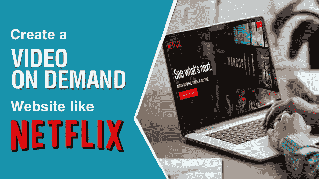

# 如何像网飞一样开始视频点播服务？

> 原文：<https://medium.com/swlh/how-to-a-start-video-on-demand-service-like-netflix-21b2a49e0103>

广播电视成为全球收视率最高的视频平台的日子已经一去不复返了。技术的进步将炒作转移到了网络世界。根据 Statista 的数据，到 2022 年，全球 32%的电视家庭将成为视频点播用户。凭借这一渗透率，VOD 服务最终将完全取代电视广播。

不是我，而是统计数据，有力地证明了这种大规模的推广。目前的收入在 2018 年为 155.89 亿美元，年增长率为 2.3%，到 2022 年市场规模将达到 170.86 亿美元。

毫无疑问，在所有这些方面，网飞在 2018 年第一季度拥有超过 750 万新客户，主导了视频点播市场。然而，我们也不应该忽视 Hulu，它在 2017 年底拥有 1700 万订户。VOD 是一个巨大的市场，每一次尝试都有可能。

事实上，视频点播是一个机会主义的利基市场，2018 年是开始自己的视频点播服务的合适时机。在此之前，让我们先了解一下网飞、亚马逊 Prime 这样的巨头是如何在这个小众领域赚到百万的。

# 网飞的商业模式

仅仅一个季度，网飞新增用户数量是 Hulu 新增用户总数的一半；2017 年初约为 6600 万，现在接近 2018 年的[8000-9000 万。网飞目前价值超过 1000 亿美元，拥有 1.18 亿用户。](https://www.recode.net/2018/1/22/16920150/netflix-q4-2017-earnings-subscribers)

他们通过深入普通人的日常生活取得了今天的成就。简单地说，网飞是订阅视频点播(SVOD)市场的早期进入者之一，他们在营销和业务扩展中应用了一些好东西。

**1。** **免费试用的订阅商业模式**

对网飞来说，这很简单。他们遵循最简单的订阅视频点播模式来创收。此外，他们提供 30 天的免费试用，在承诺付费之前提供全面试用。

下面是它的工作原理:

第一步:注册 30 天免费试用

第二步:享受无限制访问所有网飞内容，没有任何广告。

第四步:继续支付每月费用，只要你利用这项服务。

第五步:取消任何时候你想结束你的网飞访问。

**2。** **多台设备上的可访问性**

任何人(订户)都可以在任何时间通过任何设备访问网飞上的视频。无论是网络浏览器、智能手机、平板电脑还是智能电视，人们能想到的所有设备上都有应用程序和界面。他们也有 over-the-top (OTT)应用程序，可以使用 Roku、亚马逊或苹果电视设备通过普通电视播放。

**3。** **原生内容——网飞原创**

除了第三方出版商，网飞还提供独家的“网飞原创”，这是你在其他地方找不到的。获奖的节目，像《陌生的事物》和《无主之物》，是他们拥有巨大财富的一些很好的例子；这种排他性鼓励人们订阅他们的服务。

**4。** **没有广告**

由于网飞遵循订阅模式来创收，他们一直避免展示广告。完全无广告浏览使该平台适合独立出版商。这与我们在 YouTube 等平台上看到的情况相反，在这些平台上，创作者努力保持他们的内容具有广告亲和力。

# 为什么要创建像网飞这样的视频点播服务？

不难看出，一个类似的平台将面临一段艰难的时期，在市场上挑战网飞。然而，让平台如此受欢迎的不仅仅是商业模式，还有平台的功效和送达能力。

因此，如果你有一个有能力的商业计划，由一些有能力的技术支持，你总是可以与任何规模的企业竞争。比如亚马逊 Prime 和 Hulu 在市场上都有自己的空间，而且做的不错。这是一个巨大的市场。如果你的平台有能力，人们不会介意在他们的列表中增加一个服务。

# 如何开始像网飞一样的流媒体服务？

开办像网飞这样的视频流媒体服务需要做一些准备，一步一步来。应该遵守的不仅仅是技术，还有许多法律义务。所以，让我们从这里的第一步开始:

# 第一步:选择你的定位

当网飞起步时，它的利基市场几乎没有任何竞争对手。然而，现在轮到你了，外面有一个巨大的竞争对手:网飞，Hulu，亚马逊 Prime，还有许多区域性服务。

如果你希望在如此拥挤的空间里得到关注，做别人没有做的事情；做一些独特的事情。那将是你的定位。如果你找不到合适的位置，总有一个选项来实现像网飞和亚马逊 prime originals 这样的东西。

换句话说，在进行下一步之前，了解你的商业计划，并决定你想用你的网飞像流媒体平台做什么。

# 第三步:获得权利

既然你已经知道了你的定位，并且决定了你要发布的内容，现在是时候让这些内容与你的商业计划保持一致了。接近内容所有者和发布者，并获得在您的平台上发布其内容的权利。

获得版权的协议取决于各种因素，包括广告协议、与内容所有者的收入分成比例以及其他许可条款。有一个律师在你身边总是一个好的做法，他可以理解并根据法律条款进行许可。

# 第四步:决定你的收入模式

获得权利后，根据内容使用的法律条款塑造你的收入模式。完成第 3 步后，您将清楚地了解是应该选择以下一种还是所有收入模式:

# 点播订阅视频:

网飞、亚马逊 Prime 和 Hulu 都遵循这一模式。也称为 SVOD，遵循这种模式的企业通过向用户收取固定的每日、每周、每月或每年的订阅费用来赚取相应的服务访问权。

# 广告支持的视频点播:

这种模式需要广告商加入你的平台。你可以选择让你的核心视频流媒体服务对用户免费，同时从广告发布商那里赚钱。但是，在选择这条路之前要三思。仅供参考，除了 YouTube，没有一个广告支持的视频点播服务给人留下好印象。

# 交易视频点播:

交易视频点播(TVOD)以一种特定的风格运作，用户只对他们想看的特定视频感兴趣。它可以通过让用户感觉不到包月的束缚来创造一个好印象。然而，如果你的内容质量令人振奋，人们不会介意为此支付订阅费。基于 TVOD 的业务的一个很好的例子是“谷歌播放电影”和“YouTube”的一些内容。

# 第五步:获得网飞克隆脚本

一旦你有了权利并决定了你的收入模式，下一步就是创建一个平台来托管你的信息流。如果是几年前，这一步可能会让你损失惨重。然而，在 2018 年，获得像网飞这样的确切平台是小菜一碟。

有许多负担得起的交钥匙解决方案，可以让您随时启动您的视频点播服务。一个类似的交钥匙解决方案是网飞克隆脚本。

任何人谁希望开始视频点播服务，并通过订阅赚取，网飞克隆脚本是最好的选择。一个好的网飞克隆将支持灵活的定制，并回答您的所有业务需求，而无需花费数百万美元。

以下是为自己寻找一个时要注意的事项:

*   多种盈利渠道，如订阅、按次付费和横幅广告。
*   多个视频上传渠道，如亚马逊 S3 桶，直接上传或网站链接。
*   SEO 友好架构
*   安全交易的支付网关
*   视频分辨率转换，加快上传速度
*   适用于较慢网络的自动视频分辨率转换器
*   面向移动用户的原生 Android 应用。

# 第六步:移动办公

几年前，这一步可能是可选的。然而，在 2018 年，当大部分视频流媒体观众使用移动设备而不是计算机时，忽视移动应用程序的需求是不明智的。

大多数网飞的克隆版本都在同一个软件包中附带了移动应用程序。如果你能和一个这样的供应商达成协议，事情会变得更容易。继续寻找，将您的项目分配给能够为 Android 和 iOS 平台提供相同项目的人。

# 第七步:开始营销

准备好你的利基、许可证、网站和移动应用程序，剩下的唯一一步就是——获得订户。

这一步更多的是商业规划的义务，需要你的营销团队的效率。然而，我们可以提出一些建议，这些建议肯定有助于为您新推出的视频点播服务找到观众。

**走向社交**:利用社交媒体营销的各个方面，让人们了解你的平台。在脸书、Twitter 和 Instagram 等不同的社交媒体渠道推广您的产品和 USP。你也可以利用这些平台上的付费广告服务。

**利用广告**:根据你的营销预算，传统广告可以给你一个好的开始。电视和报纸上的广告会帮助你更快地传播你的话语。

**电子邮件营销**:电子邮件仍然是接触潜在客户最实惠的方式。建立一个潜在客户的电子邮件列表，然后在视频上线时提醒他们。

希望这篇文章能澄清你对启动网飞、亚马逊 Prime 或 Hulu 等视频点播服务的所有疑虑。作为一个潜力巨大的市场，视频点播业务大有可为。我们很想听听你的想法。别忘了留下你的专家评论，告诉我们这个特殊的在线业务领域。

## 这篇文章发表在 [The Startup](https://medium.com/swlh) 上，这是 Medium 最大的创业刊物，有+393，714 人关注。

## 订阅接收[我们的头条新闻](http://growthsupply.com/the-startup-newsletter/)。

