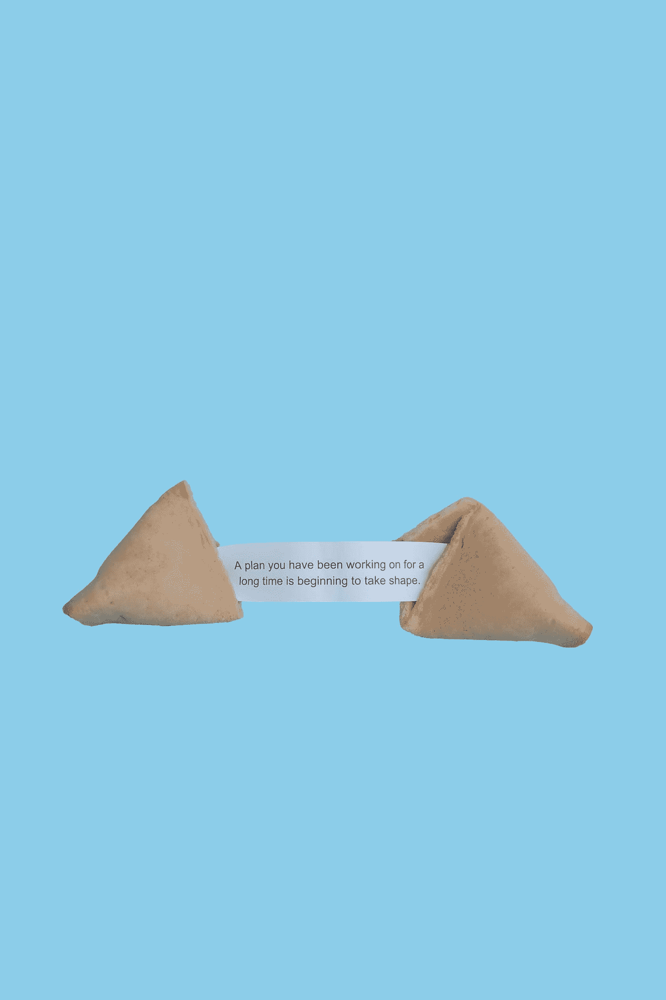

# 如何通过建立坚韧的精神来获得长期的成功

> 原文：<https://medium.com/swlh/how-to-achieve-long-term-success-by-building-mental-toughness-6f38f0b617e7>

## 最伟大、最鼓舞人心的企业家有什么共同之处？他们都拥有非凡的精神韧性。

Photo by [Winggo Tse](https://unsplash.com/@winggo?utm_source=medium&utm_medium=referral) on [Unsplash](https://unsplash.com?utm_source=medium&utm_medium=referral)

1998 年，未来的 Spanx 创始人萨拉·布雷克里是一名 27 岁的大学毕业生，他在佛罗里达州的克利尔沃特挨家挨户推销传真机。虽然她实际上很擅长，但她对销售传真机没有热情。事实上，她讨厌它。

[在 2016 年的一次采访中](https://itunes.apple.com/us/podcast/the-james-altucher-show/id794030859?mt=2)萨拉回忆道:

> *“有一天我醒来，心想。我演错电影了，打电话给导演！发生了什么事？这不是我的生活！”*
> 
> 于是我在一张纸上写下了我擅长的事情，其中之一就是销售。我刚刚开始思考这个问题，最后我在日记中写道，“我想发明一种产品，可以卖给数百万人，让他们感觉良好。””

所以她开始四处寻找一切，试图找到她的想法。有一天，在经历了一个又一个想法后，她著名地把一双紧身衣的脚切了下来，穿在一条米色裤子下面，那是她在一次聚会上首次亮相。

她低头看着弗兰肯斯坦紧身衣，问道:

> *“你是我的想法吗？”*

虽然匆忙修改的紧身衣的边缘整夜卷起她的腿，但她非常确定，她已经实现的平滑、永恒的外观是其他女人乐意支付的东西。当然，经过一些完善之后。

她知道的。她找到了自己的想法。这的确是她可以向数百万人推销的东西，而且会让他们感觉良好。

Photo by [Elena Koycheva](https://unsplash.com/@lenneek?utm_source=medium&utm_medium=referral) on [Unsplash](https://unsplash.com?utm_source=medium&utm_medium=referral)

即使在她的想法完成后，Sara 也花了两年时间让人们看到她的产品的价值。在很大程度上，她是一个人。

> *“我没有意识到挨家挨户推销传真机真的为我成为一名发明家打下了基础，创造出一种从未有人做过的产品，并将其推向市场，因为做这样的事情需要听到很多‘不’字，”*
> 
> *“推销传真机的电话推销是听到‘不’的绝佳训练场。我刚刚了解到有一个公式，你必须经历一定数量的‘不’才能得到‘是’，所以不要因此而气馁。”*
> 
> *—莎拉·布莱克利*

如果没有她通过多年的电话推销和挨家挨户推销传真机而建立起来的坚韧不拔的精神，她可能等不到听到“不”的那两年。

当被问及是否有人让她觉得有必要说“我告诉过你”时，布莱克利说:

> “有很多前男友甩了我，我想和他们共度美好时光，对他们说，‘大错特错！’但我认为我的成功做到了这一点。"

# 什么是心理韧性？

鼓舞人心的企业家、精英运动员、伟大的领导者和杰出的科学家有什么共同点？他们都拥有非凡的精神韧性，也被称为*。*

*在公司杂志的一篇文章中，杰夫·哈登将*毅力*定义为:*

> **“努力工作并对失败和逆境做出弹性反应的能力；使个人能够努力工作并坚持长期激情和目标的内在品质。”**

# ***那么，我们如何打造心理韧性呢？***

*通过培养习惯。*

*你看，心理韧性来自我们的习惯，而不是动机。*

*因此，我们需要养成习惯，不断挑战我们自己的现状，迫使我们作为个体成长。*

*这里有一些帮助你建立难以置信的精神韧性的建议:*

# ***1。总是表现得好像你完全在控制之中。***

> *“祈祷吧，仿佛上帝会照顾一切；表现得好像一切都由你决定。”—伊格内修斯*

*这个前提同样适用于运气。许多人认为最终的成功或失败只与运气有关。如果他们成功了，运气站在他们一边，如果他们失败了，他们只是不够幸运。*

*大多数成功人士确实相信运气在他们的成功中起了一些作用。但这几乎不是他们成功的原因，他们当然不会坐等好运或担心潜在的厄运。成功人士表现得好像一切都完全在他们的控制之下。如果他们成功了，那就是他们造成的。如果他们失败了，那是因为他们做得不够。*

*担心运气只会耗尽你的精神能量，而不是把这些能量投入到实现事情中去。*

*你不能控制运气，但你可以控制自己。*

# ***2。不要担心你不能控制的事情。***

*精神力量就像肌肉力量——没有人有无限的供给。所以为什么要把你的力量浪费在你无法控制的事情上呢？*

*每个人都有自己不同的推动点。也许是政治。可能是家人。或者可能是全球变暖。无论话题是什么，你都关心。你希望别人也关心你。*

*那很好。做你能做的。做你自己的改变，但不要试图让别人改变。老实说，他们不会。*

*不要浪费你的精力去改变你无法控制的人和事。*

# ***3。把过去的错误看作是对未来成功的训练，然后继续前进。***

*从你的失败和别人的错误中学习。仅从你如何利用它在未来创造更好的结果的角度来思考哪里出了问题。那就随它去吧。让过去成为过去。*

*当不好的事情发生在你身上，或者你在某件事情上失败了，把它当成一个学习的机会。当有人犯了影响你的错误时，从中吸取教训。但也要把它作为一个机会来练习善良、宽容和理解。*

*过去是未来挑战的训练场。拥抱它，但不要让它定义你。*

# ***4。去赢吧。***

> *“我不是去竞争的。我是为了胜利而来的。”—阿诺德·施瓦辛格*

*这是阿诺德·施瓦辛格对他的第一个头衔“少年欧洲先生”的评价。*

*意志坚强的成功人士不会将失败视为可行的结果，他们会展望成功。然后他们带着这个愿景出现，不是带着傲慢，而是带着自信。*

*大多数人都尽了最大努力。*

**胜利者出现赢得胜利。**

# ***5。当别人成功时庆祝。***

*有些人将成功视为零和游戏，这意味着他们将成功视为一种稀缺资源。但这与事实相去甚远；接近成功实际上会鼓励更多的成功。但是零和心态会引起怨恨。*

*怨恨会消耗大量的精神能量——这些能量用在其他地方会更好。当一个朋友成功了，做了一件了不起的事情，这并不妨碍你成功；它实际上增加了你的机会。事实上，说到成功，物以类聚，人以群分。所以，拉近你成功朋友的距离，鼓励他们，从他们的成功中学习。*

*从本质上说，不要怨恨了不起——创造并赞美它。*

*随着时间的推移，你会发现自己的成功，你会有很多朋友乐意和你一起庆祝。*

# ***6。专注于做真实的自己。***

*没有人喜欢你的衣服、汽车、小玩意、头衔或成就。那些都只是东西。当然，有些人可能喜欢你的东西，但那是表面的关系，不是友谊。*

*肤浅的关系是由它们不真实的本质定义的。*

*真正的友谊建立在真实的基础上。真诚待人。我们需要更多这样的东西——深厚的友谊联系。*

*所以，不要试图给人留下深刻印象，做你真实、可信、真实的自己。*

# ***7。永远不要让自己抱怨。***

*你的话有力量。他们对你特别有影响力。抱怨你的问题总是会让你感觉更糟，而不是更好。 ***100%的时间。****

*所以如果事情不对劲，不要浪费时间去抱怨它或者思考它的负面影响。从长远来看，继续担心和抱怨它比简单地修复它需要更多的精神能量。所以把精力放在寻找解决方案上。*

*不要抱怨出了什么问题——即使你只是在自言自语——而是谈论如何让事情变得更好。*

# ***8。积极思考，而不是消极思考。***

*我们大多数人不会花太多时间*思考* *我们的想法*，但是增加你对自己思维模式的意识对建立适应力是有效的。消极的想法会阻碍你发挥潜力，所以在它们失控并影响你的行为之前抓住它们。*

*找出这些消极的想法，用更有成效的想法取代它们。富有成效的想法不需要非常积极，但应该是现实的。不要说*“我什么都做不好”*而是*“我在这方面有一些弱点，但我正在努力进步。”**

*重要的是消除你头脑中的消极想法。*

# ***9。数一数你的祝福，练习感恩。***

*既然你的消极想法已经被富有成效的想法所取代，我们需要在其中加入一些感激和积极的想法。*

*我记得在我成长的每个感恩节，我奶奶都会拿出一本书，每个人都要签名。在我们的名字旁边，我们每个人都必须写下至少一件我们感激的事情。*

*[研究一致表明](https://www.sciencedirect.com/science/article/pii/S0191886915006054)感恩能增加幸福感，减少抑郁。花点时间停止担心你没有的东西，把注意力集中在你必须感谢的东西上。*

*从确定至少三件你感激的事情开始你的一天。养成每天早上做第一件事的习惯，因为这将为你一天的剩余时间定下基调。*

> **“凡是真实的，凡是高尚的，凡是正义的，凡是纯洁的，凡是可爱的，凡是有好名声的，如果有什么美德，如果有什么值得称赞的，就在这些事情上冥想吧。”——腓立比书 4:8**

# ***10。表现得像你想成为的人。***

*在你开始新的事物或接受新的挑战之前，坐着等你感觉更强壮是很有诱惑力的。但是等到你对自己感觉更好的时候再行动很容易适得其反。推迟申请升职，或者等到你觉得和朋友一起出去很开心的时候，可能会逆转你表现得好像一切都在掌控之中的效果，滋生受害者而不是赢家的心态。*

*相反，你应该把自己想象成你想成为的人。这将帮助你决定如何行动。而当你专注于改变自己的行为时，你的想法和情绪也会随之而来。*

*如果你在做决定或想出如何应对某个情况时有困难，试着问问自己，“我理想中的自己会怎么做？”*

*然后，行动起来 ***就好像*** *你已经是你想成为的那个人了。**

*结果你会变得更强。*

# ***11。每天反思和练习。***

*反思你实现目标的过程可以增强你获得成功的能力。通过回顾过去并从中学习，你可以更好地计划现在如何前进，并想象如果你继续朝着目标前进，你的未来会是什么样子。*

*每天结束时，问自己，“我今天学到了什么？”*

*从你的思想、情绪和行为的角度来思考这个问题。考虑你是如何随着时间的推移而提高的，以及你希望明天提高或完成什么。*

# ***心理韧性来自于你的习惯，而不是动力。***

> *“我们没有达到预期的水平。我们下降到我们训练的水平。”―阿奇洛克斯*

*动机善变，意志力有限。建立你的心理韧性会让你更好地准备迎接挑战，成为你想成为的人。*

*最后，*挑战自己*建立精神韧性。*

*因为坚韧的精神是长期成功的基础。*

# *感谢您的阅读！👏*

*如果你喜欢这篇文章，请评论并给它一些掌声。这也将帮助其他人找到这个故事。*

**

## *这篇文章发表在 [The Startup](https://medium.com/swlh) 上，这是 Medium 最大的创业刊物，拥有+367，690 读者。*

## *在这里订阅接收[我们的头条新闻](http://growthsupply.com/the-startup-newsletter/)。*

**