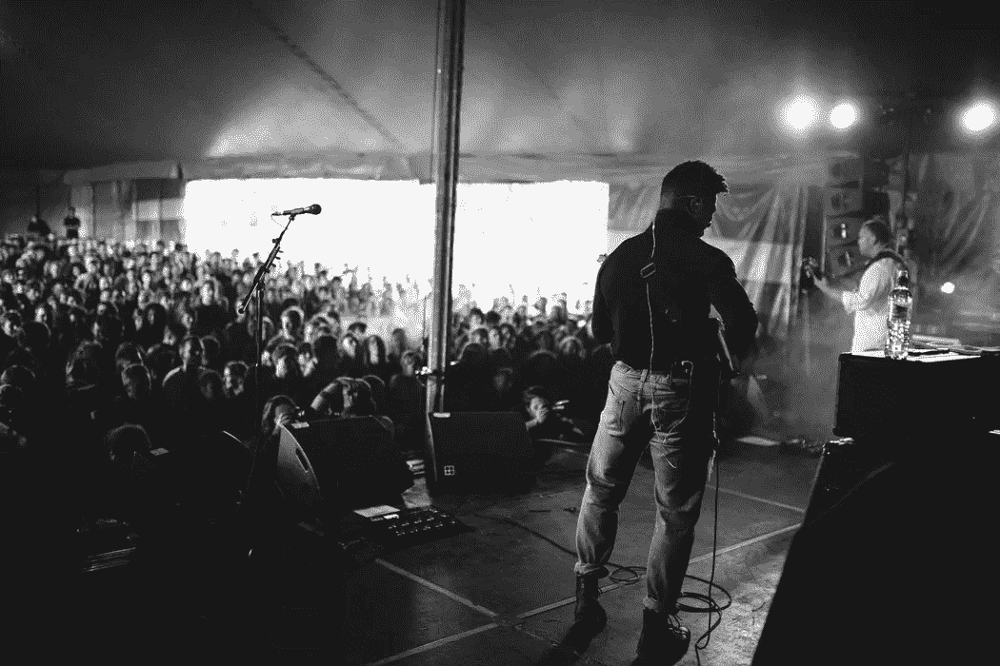

# 如何实现最佳性能

> 原文：<https://medium.com/swlh/how-to-achieve-peak-performance-e3a650bae244>

Photo by unsplash.me

# 介绍迈克尔·热尔韦的 TR Talk 第 17 集

## [【点击此处查看迈克尔的剧集】](https://soundcloud.com/ryan-warner-799706255/17-how-to-achieve-peak-performance-w-dr-michael-gervais)

> *“每天都是创造生活杰作的机会”——*[在 iTunes 这里给我们留下评论。](https://medium.com/u/daecf6416762#iTunes)

**关于作者**

*汤姆·阿莱莫(*[*@托马莱莫 _TTGT*](https://twitter.com/TomAlaimo_TTGT) *)是 TechTarget 的一名客户主管。汤姆还共同主持了 TR Talk 播客* *，他和瑞安·华纳采访了各自领域的领导者，以了解千禧一代如何在当今的劳动力市场产生影响。*

[*邮箱*](mailto:thomasalaimo7@gmail.com)*|*[*LinkedIn*](https://www.linkedin.com/in/tom-alaimo-573a1878/)*|*[*中型*](/@TomAlaimo_TTGT)*|*[*iTunes*](https://itunes.apple.com/us/podcast/tr-talk/id1294132895?mt=2%20#iTunes)

## 这个故事发表在 [The Startup](https://medium.com/swlh) 上，这是 Medium 最大的企业家出版物，拥有 294，522+人。

## 在这里订阅接收[我们的头条新闻](http://growthsupply.com/the-startup-newsletter/)。

