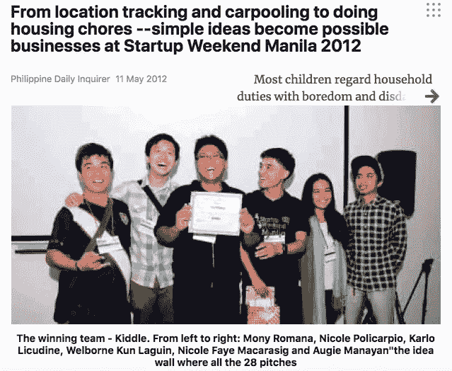

# 如何实现问题解决方案的契合

> 原文：<https://medium.com/swlh/how-to-achieve-problem-solution-fit-3edfb83d59e>

Photo by [rawpixel.com](https://unsplash.com/@rawpixel?utm_source=medium&utm_medium=referral) on [Unsplash](https://unsplash.com?utm_source=medium&utm_medium=referral)

## 假人的客户开发

2012 年，我加入了[创业周末(SUW)](https://startupweekend.org/) 马尼拉。这个活动的目标是迫使人们在一个周末内开发出一个产品。它专注于制造软件产品，而不是制成品。

那天的第一项活动是向每个加入的人推销我们的想法。我提出了一个旅游创业的想法。在推销之后，人们会根据推销的想法聚集在一起。

我的团队里没有人，所以我决定加入其他人的团队。我旁边的人是一名游戏开发者，人们被他的想法所吸引，所以我问他我是否可以加入。

我们小组有六个人:一个游戏开发者，两个设计师，三个非技术人员。我在非技术方面，我们为我们的应用程序创建了一个业务发展计划。这是我第一次涉足客户开发和寻找应用程序的盈利方式。

在接下来的几个小时里，四处游荡的导师给我们开了小型研讨会。我在参加之前读过《精益创业》,所以我对它有一点概念。但是我必须应用我所读到的——没有更多的理论。我们必须在现实世界中进行测试，验证我们的想法。

[Ash Maurya 的《精益运营》是一本关于精益创业方法的鲜为人知的书。但是与](https://www.amazon.com/Running-Lean-Iterate-Plan-Works/dp/1449305172)[埃里克·里斯的书](http://theleanstartup.com/)相比，这本书更像是一本操作指南。运行精益方法的第一部分是客户开发，试图证明有一个适合这个想法的问题解决方案。

在构建最小可行产品(MVP)时，您需要回答以下问题。这适用于任何商业或创造性的努力。

## 1.这是给谁的？

每个人都是一个错误的答案。如果你瞄准所有人，你什么都得不到。你的产品被稀释以取悦每个人，而不是让它变得非常特别以满足十几个早期用户。

那时我们正在开发一款育儿应用，所以我们的目标市场是那些有六到十岁孩子的妈妈们。他们住在地铁里，精通技术。他们要么在公司工作，要么是企业家。她们不是全职妈妈。

你可以开始剖析自己，记录下具体的特征。这是如果你的目标是喜欢你的人。你也可以想一个会用你提供的东西的朋友。

## 2.它们位于哪里？

分析完他们之后，猜猜这些人把时间和注意力花在了哪里。这可以以物理空间或数字注意力的形式出现。

如果你的目标是健身房老鼠，很明显他们大部分时间都在健身房。如果你的目标是企业家，他们在当地的企业家社区或商业会议上。如果你的目标是电影人，你可以在电影节上遇到他们。

博客的媒介，摄影师的 Instagram，视频博客的 YouTube。

## 3.采访

通过测试来验证一个想法。现在你知道了你的受众是谁，他们在哪里，是时候单独采访他们了。Ash 认为焦点小组讨论是浪费时间。人们听到别人要说的话，就会产生从众心理。

目标受众可以尝试 MVP，您可以就此提出一些问题。这是在解决他们的问题吗？它缓解了痛点吗？

如果你的货币化是直销，那么终极考验就是要钱。他们愿意为此买单吗？他们会把它推荐给他们的朋友吗？

在 Airbnb 的早期，有一个关于 Joe Gebbia 的故事。[Y Combinator](http://www.paulgraham.com/)的创始人保罗·格拉厄姆告诉乔去纽约采访他们的早期用户。乔不想这样做，因为与人一对一的交谈是不可扩展的。最好发出一个数字调查对不对？不对。

接下来是游戏规则的改变。

他发现早期采用者没有摄影的诀窍。Joe 热爱摄影，他帮助他们为自己的房源创作了更好的房地产照片。这使得预订量猛增。直到今天，Airbnb 还为经过验证的房源提供免费摄影服务。

在周末的最后一天，我们被要求在投资者面前推销。我参与讨论了客户开发流程以及我们如何验证这个想法。

我们每个人都有自己的角色，我在几个小时内学会了商业基础。

投球之后我太累了。我们熬过了三天累人的不间断工作。这是一场比赛，所以我们留下来为我们的参赛者加油。最终，我们赢得了比赛。这是一个惊喜。我们简直不敢相信，我们甚至不得不互相询问我们是否听到了正确的公告。

他们在地铁中心给了我们一个办公空间——支付了一年的租金。我们还获得了一年在该国顶尖大学的企业孵化机会。

但是这个想法没有任何进展。那时我们都有自己的事情要做，我们*慢慢地*疏远了。

你现在在建什么？是博客、播客、产品还是服务？是给谁的？它们位于哪里？

你和他们谈过了吗？

回头见，我的朋友。

## 加入我和我的部落，加入我们的 FaceBook 群组:[Origin Stories](http://bit.ly/originstorynicole)——在这里，我帮助创意人员利用他们的个人故事建立个人品牌。每个超级英雄都需要一个起源故事，我来帮你编一个。

## 这个故事发表在[的创业](https://medium.com/swlh)上，这是 Medium 最大的创业刊物，有 316，638+人关注。

## 订阅接收[我们的头条新闻](http://growthsupply.com/the-startup-newsletter/)。

