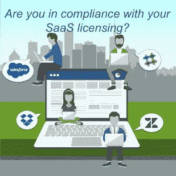

# 如何实现 SaaS 许可证合规性

> 原文：<https://medium.com/swlh/how-to-achieve-saas-license-compliance-6bb3bf0bcd92>

随着大多数公司转向更多地采用云服务，SaaS 许可证合规性似乎不再是一个令人担忧的问题。毕竟，当提供商控制您对产品的访问时，您怎么能不遵从呢？

问得好，但是……不要因为 SaaS 的产品是通过云访问的，就认为你是清白的。事实上，云可能已经消除了一些许可证合规性问题，但也产生了新的问题。与传统软件一样，围绕 SaaS 许可证合规性有许多法规，而且条款也有很大不同。最重要的是，SaaS 公司可以获得大量关于你的员工在使用什么的信息——可能比你自己还多！

有多种方法可以使您的云应用程序合同不符合 SaaS 许可证。这里有几个例子:

# SaaS 许可证合规性问题#1:免费增值产品开发

SaaS 应用优先考虑用户采用和易用性，经常使用免费版本来吸引我们。作为用户，我们变得依赖这些免费产品和它们提供的好处。它们通常不需要任何重要的 IT 知识或资源来部署。他们可能会避开安全、配置和 IT 审批。因为它们是免费的，所以很少有理由说“不”。但是，如果你有一个免费增值产品的付费许可证，你就很容易不合规。

这是怎么发生的？你为一个云应用购买一定数量付费席位的许可。你告诉你的员工使用付费许可证。但是，一些员工没有阅读或处理这些信息。几周后——更不用说几个月或几年后了！—他们都忘了这件事，甚至没有意识到你的公司有付费账户。或者他们可能知道，但没有预算，所以他们通过使用免费版本来绕过这个小限制。

你能如何修理它？您可以尝试为应用程序供应设置严格的策略，并反复设置提醒来手动审核设备…但为您完成所有工作的自动化工具是更好的解决方案。

# SaaS 许可证合规性问题#2:供应商允许过度供应

SaaS 供应商有时允许管理员甚至普通用户添加比合同中允许的更多的用户，这意味着你“过度供应”了他们的应用。他们为什么要这么做？这种销售策略不是严格控制用户数量，而是让应用程序的使用量不断攀升。您的员工可以轻松地将自己添加为用户，而没有意识到或不关心他们以后可能需要为此付费。这不仅会以意想不到的差异扼杀你的预算，还会使合同续约谈判变得更具挑战性。

# SaaS 许可证合规性问题#3:多个用户访问一个帐户

共享安装在客户端或服务器上的应用程序通常很困难，除非用户共享机器或共享许可证代码(这不受供应商的监控)。但在 SaaS 应用程序上通常很容易。如果有一个服务帐户，如 marketing@、finance@，或类似的帐户，一组用户可以用该单个帐户注册，该帐户可供许多人访问，允许他们所有人访问一个付费订阅。这种帐户滥用很容易被跟踪，并且通常被 SaaS 许可证合规条款所禁止。一旦你是一个足够大的目标，你可能会被要求采取这种行为。

# SaaS 许可证合规性:做什么(手动和自动)

# 确定谁在使用什么 SaaS 产品

在 Alpin，我们发现，平均而言，公司只知道他们的云应用的 10%。控制 SaaS 订阅的第一步是[发现影子 IT。](https://alpin.io/blog/top-3-saas-management-actions/)您可以通过扫描您的财务系统、访问 SSO、Office 365 和/或 G suite 凭证，或者通过调查团队成员来实现这一点。或者使用 Alpin 的自动化 SaaS 管理工具来[帮助你只需点击两下就能发现你所有的影子 IT。](https://alpin.io/#discovershadowit)

# 检查您的服务条款

SaaS 许可证合规性参数经常出现在服务条款中。对于 SaaS 产品来说，完全无视“点击进入”许可协议是很常见的，因为用户习惯于盲目地勾选“接受”框。也许是时候看看你的合同，以确定你必须作出的改变，以确保 SaaS 许可证的合规性。或者使用 Alpin，看着它自动揭示合规性问题，这样你就不必仔细阅读数百页的 TOS 法律术语。

# 认识现代赏金猎人

如果你是一个大目标，你的工人或承包商可以得到支付佣金，报告任何滥用 SaaS 软件。赏金猎人，极其先进的跟踪和监控能力，只是众多[控制你的 SaaS 订阅](https://alpin.io/blog/take-control-of-saas/)的理由中的一小部分。通过使用像 Alpin 这样的自动化工具来控制应用程序的使用，并保护您的合同，您可以避开昂贵的审计罚款！

# SaaS 许可证合规性解决方案:使用自动化工具

您可能需要花费几十甚至几百个小时来手工收集所有 SaaS 应用程序所需的信息。然后你可以花更多的时间阅读和分析这些信息。即使这样，你几乎肯定会错过一堆 SaaS 许可证合规性问题。

想要更好的解决方案？使用自动化工具持续发现您的云应用程序，收集有关许可证和使用情况的信息，并突出显示问题，以便您可以快速高效地解决问题。确保您完全符合 SaaS 许可证的要求，并成为一名英雄，永远不会受到审计和处罚。

了解 Alpin 如何帮助您只需两次点击即可发现 SaaS 的使用情况！

[**现在试试 ALPIN**](https://alpin.io)

## 这篇文章发表在《T4》杂志《创业》(The Startup)上，这是 Medium 最大的创业刊物，有 312，822+人关注。

## 在这里订阅接收[我们的头条新闻](http://growthsupply.com/the-startup-newsletter/)。

