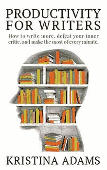

# 2018 年如何实现自己的目标

> 原文：<https://medium.com/swlh/how-to-achieve-your-goals-in-2018-80d8f8300506>

在内心深处，我们都知道我们不会坚持我们的新年决心。

我们中的大多数人也会犯一些非常愚蠢的错误，这意味着我们甚至在开始之前就已经为失败做好了准备。

如果你真的想在 2018 年改变你的习惯，这里有一些建议。

# 知道你的原因

创建成功目标的首要关键之一是知道你的原因。

无论你的目标是创业、写书还是锻炼身体，知道你的原因都会有很大的不同。

因为你觉得你应该做而做更多的锻炼和健康饮食并不是激励你的足够好的理由。

设定一个目标体重会有帮助，但是一旦你达到目标，然后呢？

你打算回到你以前的饮食习惯吗？

研究表明，如果你进行时尚饮食，然后达到你的目标体重，你会滑回你的旧习惯，最终比你开始节食时更重。

相反，努力变得更健康，因为 a)不健康会害死你，b)当你健康的时候你可以做更多的事情。

对我来说，我需要变得健康，因为 a)这能让我的哮喘好一些，b)我的关节不那么容易卡住，c)这能帮助我管理我的焦虑，d)我不太可能像我家里的其他人一样最终患上慢性背痛。

虽然我不喜欢锻炼，但也不可能讨厌 T2 的每一种锻炼方式。

尝试各种不同的东西，看看什么是坚持的，不要一提到你最喜欢的食物就突然停止。把它们从你的饮食中剔除，或者用它们作为小剂量的奖励。

如果你不确定你为什么选择了特定的目标，很有可能，你这样做是因为你觉得你应该这样做，而不是因为你想这样做。

# 不要把它们叫做新年决心

称它们为目标或目的。

除了新年决心，你可以称它们为任何东西。

目标听起来比新年决心要具体得多，我们都知道没有人会坚持到一月份以后。

如果你正在做一件特别大的事情，比如写作或创业，也不要称之为爱好。

称之为你的第二份工作，或者，我最喜欢的，你的副业。

我们的爱好是我们用来放松的事情。我们不把它们当回事，也没有像对待工作或职业那样投入太多精力。

我认识的大多数业余爱好作家几乎还没有完成他们的第一份手稿，尽管他们已经是当地写作社区的一员很多年了，或者几年前已经从大学毕业并获得了写作学位。

他们梦想在当地书店的书架上看到他们的书，但他们永远不会实现，因为他们没有足够重视它。

当你看到你的写作或你的生意或任何你想做的事情不仅仅是一种爱好时，你会投入更多的努力。

你也更认真地对待它，因此你周围的人也一样，这意味着他们不太可能在你工作的时候打扰你。

# 告诉其他人你在做什么

让人们对你负责是保持动力的好方法。

他们可以询问你的目标和进展，并在你困难的时候给你一个可以解决问题的人。

支持你的朋友和家人在生活中是必不可少的，但有时互联网也能有所帮助。

几乎所有的事情都有标签，只要一条简单的推特加上正确的标签就能帮助你很快找到一个支持团体。

# 追踪你的进度

每当你朝着目标努力时，在日历上标出你的进展。

如果可以的话，把它贴在墙上，让家里的其他人都能看到。

这不仅强化了问责，也给了你一个提醒。

你会开始喜欢每天在日历上看到那个标记，很快，你就会养成习惯。

# 小的改变可以带来大的不同

说到培养新习惯，我们经常一头扎进去，然后对失败感到惊讶。如果你十年没有游泳，你不可能在第一天游 1000 米。

从小的、可实现的目标开始，日积月累，不仅有助于在头脑中巩固你的新习惯，还能增强你的精神和体力。

如果你坚持足够长的时间(而且你有足够多的空闲时间)，一月初每天五分钟的写作习惯可以变成每天五小时的写作习惯。

# 奖励自己

当我们失败时，我们都对自己太苛刻了。

因为失败而惩罚自己只会让我们感觉更糟。

与其惩罚自己，不如善待自己。

洗个澡。

喝你最喜欢的咖啡。

做一些让你感觉良好的事情。

然后，当你准备好了，评估哪里出了问题，这样你就可以重新开始你的新发现。

# 勇往直前，走向成功！

继续，我知道你能做到；)

# 想让 2018 年成为你迄今为止最有成效的一年吗？

[作家的生产力](http://books2read.com/productivityforwriters)正是你所需要的！它充满了帮助你更好地管理你的时间和击败你内心批评家的提示和技巧。

现在可以从[所有好的电子书零售商](http://books2read.com/productivityforwriters)买到。

## 这篇文章发表在 [The Startup](https://medium.com/swlh) 上，这是 Medium 最大的创业刊物，拥有 277，994+读者。

## 订阅接收[我们的头条新闻](http://growthsupply.com/the-startup-newsletter/)。

