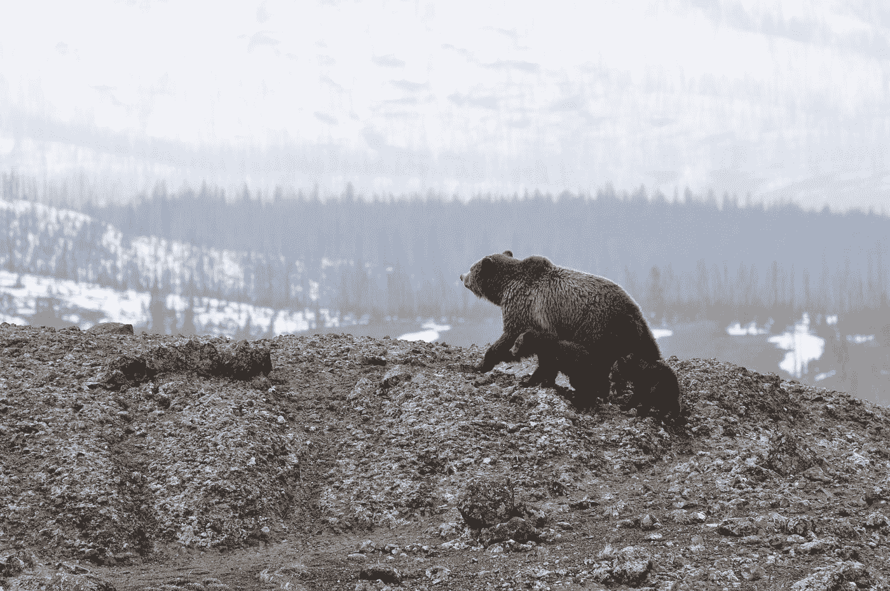

# 如何在创业中应用贝尔·格里尔斯的建议？

> 原文：<https://medium.com/swlh/how-to-apply-bear-grylls-advice-on-startup-6ac240a4ca54>

“grizzly bear walking on mountain” by [Adam Willoughby-Knox](https://unsplash.com/@adamwknox?utm_source=medium&utm_medium=referral) on [Unsplash](https://unsplash.com?utm_source=medium&utm_medium=referral)

> 生与死之间的界限取决于我们愿意做什么。

从吃生羊心到喝自己的尿，贝尔赢得了为了生存不择手段的名声。在商业上，这对你公司的生存来说是一样的。

就像 AirBnB 的联合创始人布莱恩·切斯基一样，当他的公司无法偿还信用卡债务时，他们出售限量版麦片。当他们人手不足时，布莱恩会去主持人家里帮助他们拍摄高质量的照片。

> 把注意力集中在你面前的台阶上。没别的了。

当[熊爬上珠穆朗玛峰](https://amzn.to/2SLIOyV)时，不专注于你的下一步可能是致命的。如果你已经在想峰顶会有多冷，这会分散你对攀岩本身的注意力。

我们常常在开始之前就开始思考最终目标。这种想法会发展成忧虑和失控。在它困住你之前抓住你自己。让目标引导你，不要让它影响你的下一步。

> 当你正在经历地狱——继续前进。

有几次，[熊在到达文明世界之前不得不游过冰冷海水。在冰冷的水中游泳并不愉快，但是如果他停下来，他可能会死于高温。](https://amzn.to/2ANpp9S)

当你最想要的东西在河对岸向你招手的时候，跳进去会很痛苦，很害怕。但这可能是实现你想要的东西的捷径。

> 生存不是无所畏惧。而是做一个决定。开始做吧。因为我想再见到我的孩子，或者其他什么原因。

尽管贝尔是一名生存专家，但他的想法可能并不总是行得通。他的木筏沉了。或者他的脸被蜜蜂咬了，因为他想要蜂蜜。但这些失败并不能阻止他即兴想出下一个点子。

> 随机应变。适应。克服。

总会有出路的。

> 下雨的时候微笑。

水对生命至关重要。在舒适的现代世界中，我们经常把下雨视为一种令人沮丧的状态。这只是视角的问题。

> 痛苦是暂时的，放弃是永远的。

为了保暖和驱除昆虫，贝尔经常把防火作为他的生存计划中的首要任务。

建立自己的公司就像生火一样，最初的想法就像火花一样。你可能需要几个火星才能让火绒着火。即使火绒着火了，它还是会因为你脸上滴下的汗水而死去。这种进展可能令人沮丧，在道德上也是失败的。

但是要有火，你必须继续，当它给你提供温暖时，你会感觉如此美妙。

> 永远不要依赖那些幸运时刻——它们是礼物，而是永远建立你自己的后备计划。

有些人说成功一部分是努力，一部分是运气。为了增加成功的机会，你必须预见到最坏的情况。当你做好充分准备并取得成功时，人们会认为你很幸运。

# 结论

我们不必在野外挨饿来理解贝尔·格里尔斯试图传授的课程。永不放弃。永远不要屈服。

# 行动呼吁

就像生存技巧一样，是可以学习的。使用这个[免费学习指南](https://pages.convertkit.com/7f1dc85d44/61f5f55e74)更聪明地学习。

## 这篇文章发表在[《创业](https://medium.com/swlh)》上，这是 Medium 最大的创业刊物，有+385，662 人关注。

## 在这里订阅接收[我们的头条新闻](http://growthsupply.com/the-startup-newsletter/)。

