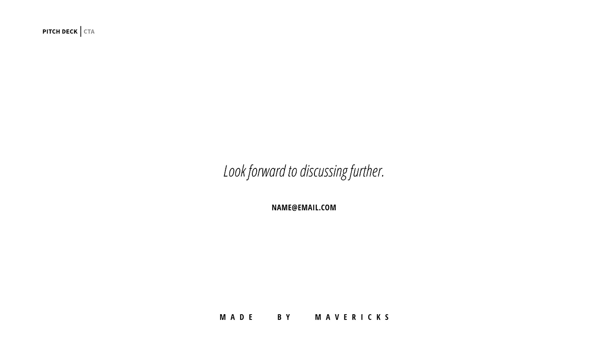

# 如何将战略营销原则应用到您的推介材料中

> 原文：<https://medium.com/swlh/how-to-apply-strategic-marketing-principals-to-your-pitch-deck-fd2885147aa9>

本指南适用于任何想要吸引投资者并更快获得资金的初创公司创始人或团队，他们正在为种子期或首轮融资搭建平台。

你即将开始你的筹款活动，并努力做好一切准备，向潜在投资者推销你的产品。你正在加紧你的演示，仔细检查你的数字，并不断验证你的产品。现在，您必须创建球场甲板。

[*Unsplash*](https://unsplash.com/photos/bzdhc5b3Bxs)

您认为将几张幻灯片放在一起是一个简单的过程，实际上比您预期的要复杂和耗时。你想要包含大量的信息，而你想要讲述的故事却无法实现。最重要的是，你的视觉风格看起来一点也不像你要对抗或想要成为的精致消费品牌。

你是做什么的？你可以做一副不传达信息、质量和努力的卡片，或者你可以重新考虑你的方法。

在全球品牌的广告公司和初创公司工作后，我看到了将机构层面的研究、战略和设计带给初创公司的好处。具体来说，更高的响应率和更快的融资途径。

吸取两者的经验，这里有一个框架，可以让你采取营销第一的方法来构思你的推销。

# 球场甲板的用途

组成你的资料的 10-15 页有可能为你的公司带来数百万美元的价值。

但是，在创建推介资料时，您的目标不应该是获得一份条款清单。没有投资者看到一副牌就开支票。

目标是再开一次会。

最好是面对面的，这样你可以和你的潜在投资者发展更深的关系，因为你的资料很可能是他们和你的公司的第一次互动。

> 你的推介平台是你的第一印象。

这意味着它必须正确地做许多事情。你必须讲述你的故事，描述一个市场问题，解释你提出的解决方案，为什么是你来做这件事，你需要什么来成功地做这件事，这对他们有什么好处，并说服他们带你去见一次面。

要做到这一点，你需要创造一种体验，用清晰、简洁、设计良好的演示来传达所有的信息。

最终，你的推介材料是一份营销文件。

# 了解你的受众

通常情况下，摊位甲板信息超载。

投资者都是大忙人。他们的时间非常宝贵，一项研究发现，[投资者平均只花 3 分 44 秒](https://beta.techcrunch.com/2015/06/08/lessons-from-a-study-of-perfect-pitch-decks-vcs-spend-an-average-of-3-minutes-44-seconds-on-them/)来回顾一个摊位。这意味着我们必须考虑他们的时间和我们实际上能包括多少。

让我们假设他们的日程安排，他们很可能在汽车后座或在去参加另一个会议的路上用手机看着你的牌。当你想到一个投资者看着你的平台时，你可能不会想到这种情况——周六早上在沙发上，他们翘着脚准备深入你的项目。

这意味着你必须有选择性。关注故事，只包括必要的关键事实和数据。记住，在他们邀请你进来后，你可以在会议中分享更多。

# 演示很重要

虽然在这一点上你可能只是提出一个想法，但是你的设计需要传达出你正在建造的东西的价值。

感知就是现实，你的甲板的视觉风格比你想象的更能说明你和你的公司。

当你交付一套设计良好的产品时，它表明你关心你在做什么，你尊重你的观众的时间，并且你正在创造一个有价值的产品。

你可以强化这种价值，让人们与你或你的公司的每一次互动都成为一致的设计语言和品牌的一部分。意思是无论何时有人看到你的推介材料、信头、电子邮件等。他们会知道是你公司的。这可能看起来无关紧要，但归根结底，这些事情向潜在投资者表明了你对它的重视。

这在今天尤其如此，因为品牌是建立在他们的视觉识别上的。如果你能向投资者展示你的品牌与其他品牌相比是什么样的，你就会领先于你的竞争对手。

如果你没有足够的时间或设计技巧来自己做这件事，请人来帮你做这件事是一个明智的决定。他们还能给你一个宝贵的第三方视角。

# 讲述你的故事

一旦被你的设计所吸引，你需要确保当有人开始与你的设计互动时，你的故事是显而易见的。

它需要具有吸引力，每一页都应该让他们说 ***是*** 才能翻到下一页。

在这里，你也需要考虑投资者会如何看待这副牌。首先，快速了解他们最初是否感兴趣并想了解更多，然后第二次进一步评估机会。

这意味着你需要设计你的甲板的流动，当他们被吸入时，你创造能量，然后当你想让他们慢下来消化页面上的信息时，你平静下来。在你的故事中制造这种紧张感会放大你的问题，并迎合需要有人来解决它的事实——在这种情况下，就是你。

这都是经历的一部分。

## 标题是你版面的支柱

我们需要做的第一件事是让潜在投资者通过第一关，并想挖得更深一点。这意味着你想让他们对你的牌有一个总体的了解，尽管只是标题。

通常幻灯片都有通用的名字，比如:*问题*或者*市场机会*。然而，那些名字实际上并没有增加任何价值。相反，你的标题应该是简短有力的陈述，从一页到另一页讲述一个连贯的故事。

意思是像*这样的标题，问题*可能变成**没有单一的信息来源**，而*市场机会*可能是**我们有三个独特的受众群体**。有人可以阅读这些文章，并从标题中了解你在说什么。

然后，当然，您可以在幻灯片正文中扩展这些陈述。

下面是如何写标题的策略。

# 投资者期望看到的幻灯片

在看了成百上千副牌之后，投资者在评估机会时会对他们将要看到的有所期待。

虽然这不是一个说明性的列表，但它确实遵循一种节奏，以一种教育、激励和设定预期的方式带着投资者走过甲板。

1.  **标题页**
2.  **问题/市场观察**
3.  **为什么重要/它可能意味着什么** *(许多套牌没有这一点，他们认为投资者会‘明白’。当你阐明为什么它很重要时，你使你正在解决的问题看起来更大，最终，你的解决方案是迫切需要的。)*
4.  **解决方案**
5.  **产品**
6.  **团队/独特能力/视角** *(投资人投资人这句老话没错。要清楚为什么你和你的团队非常适合接手这个项目。你知道什么，而其他人不知道。这一部分也可以放在最后，但最好是流畅的。)*
7.  **市场规模/受众**
8.  **竞争对手/行业分析**
9.  **商业模式**
10.  **走向市场计划**
11.  **提问/开发时间表**
12.  **CTA /谢谢** *(见下文我为什么认为这是必要的)*

如果你要进行首轮融资，你需要多放几张幻灯片。具体来说，你需要证明你已经验证了你的产品，以及额外的投资将如何推动你预期的增长。

对于 A 系列幻灯片，要包括的额外幻灯片有:

*   **牵引/验证**
*   **财务模型/预测**
*   **主要成就/里程碑**
*   **数据/指标**
*   **资金将如何使用**

把这些放在你叙述中最流畅的地方。

# 撰写您的标题

现在，一旦你把幻灯片整理好了，你就可以想出你的标题了。

要做到这一点，拿出你的幻灯片清单，为每张幻灯片写一个标题，这样读起来就像一个故事。标题不一定是句子，只要足以传达一个观点，并逐步从一个链接到另一个。

*(亲提示:先把这些手写出来)。*

完成后，您可以在幻灯片正文中添加支持信息和事实。

你剩下的牌会自己写出来。

# 您需要的关键事实和数据

你还需要包括不同轮融资的不同事实和数据。

在种子阶段，你很可能对自己的公司没有什么数据，但是你应该有关于市场机会的研究和事实。包括:

*   **潜在受众规模**
*   **观众人口统计**
*   **市场的金融规模**

这里要注意的一点是，虽然你可以确定你所追求的整个行业，但你的产品不会面向整个市场，所以要确定你最初的目标受众。

如果你在寻求首轮融资，投资者会希望看到证实市场需求的数字。这些数字为您的财务模型提供了信息，它们是:

*   **月度经常性收入** (MRR) **&年度经常性收入** (ARR)
*   **现金流量；总收入&净消耗，以及预期盈亏平衡**
*   **定制采购成本** (CAC)
*   **客户终身价值** (CLTV)
*   **流失**

如前所述，您通常希望包括您拥有的每个数据点，但实际上，您只需要包括支持您的故事的数字。如果投资者想要更多，他们会问你，你可以在后续或面对面的会议中分享更多。

# 得到你想要的

最后，不要在没有给投资者行动的机会时突然结束你的牌。

您应该利用最后一张幻灯片，巧妙地设定对后续步骤的期望。

记住，你不是在要求投资意向书。你想再开一次会。因此，一个简单的短语，如:*期待进一步讨论*和你下面的电子邮件，对你来说比简单地写谢谢要有用得多！或者结束你的筹款请求，没有理由做下一步。

重点是让他们很容易继续对你的提议说好。

# 回顾推介资料

这就是营销第一的方法，它利用受众的策略和心理来帮助你构思故事，为受众设计宣传材料，达到你想要的效果。

# 进一步阅读

要获得关于制作推介资料的其他重要资源，请查看以下文章:[筹款？为什么不直接复制红杉的推介模板](/crane-taking-flight/fundraising-why-you-shouldnt-just-copy-sequoia-s-pitch-deck-template-4b32ac60d93a)、[初创公司:如何分 10 步讲述你的推介模板](https://www.quora.com/profile/Brendan-Baker/Posts/Startups-How-to-Storyboard-your-Pitch-Deck-in-10-Steps)、[我们从设计 200 个推介模板中学到了什么](https://www.sketchdeck.com/blog/what-we-learned-from-designing-200-pitch-decks)、[想要更好的推介？掌握“招数”](/firm-narrative/want-a-better-pitch-master-the-move-5fbee071ca7f)，[窃取洛克菲勒的简单推销技巧](/@jamesnord/steal-rockefellers-simple-sales-pitch-3eebe6f97fc9)，[如何设计一个推销平台:来自经验丰富的创始人的教训](/swlh/how-to-design-a-pitch-deck-lessons-from-a-seasoned-founder-c816d1ae7272)。

你也可以在这里找到一个资助平台的列表:[所有的公共创业项目平台都在一个地方](/startup-grind/all-the-public-startup-pitch-decks-in-one-place-7d3ddff33bdc)。

[*韦斯*](http://www.wesjones.co) *与以使命为基础的公司的创始人和首席执行官合作，帮助他们启动项目，联系新的受众，并通过他的公司* [*放大他们的信息*](http://www.madebymavericks.co) *】。*

## 这个故事发表在 [The Startup](https://medium.com/swlh) 上，这是 Medium 最大的企业家出版物，拥有 306，792+人。

## 在这里订阅接收[我们的头条新闻](http://growthsupply.com/the-startup-newsletter/)。

