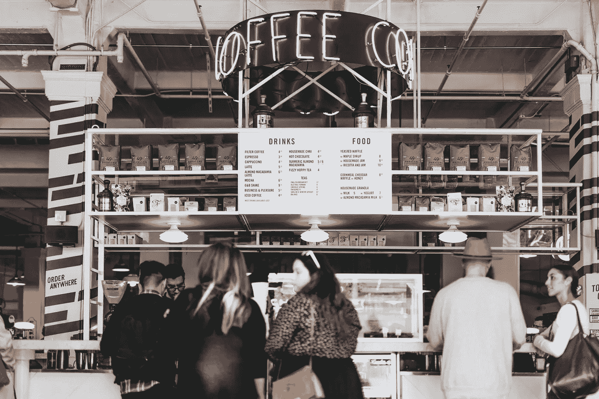

# 如何做出重大而可怕的决定

> 原文：<https://medium.com/swlh/how-to-approach-big-scary-decisions-9bb7272bd5f2>

## 更好地决定你的人生道路

如果我们去餐馆，我们会查看评论。我们想看看体验是什么样的——食物、服务、装饰、人。本质上，我们问自己:

其他人的体验如何？因此，对我来说，这种体验可能是什么样的？

我们做出一个合理的假设，在我们松散的社会经济领域中，其他人与我们有着相似的兴趣和期望。让他们快乐的东西被认为会让我们快乐。

**然而，当涉及到重大生活决定时，我们很少这样做。**

What we may assume a corporate job to be like

The reality: Crying yourself to sleep every night because you hate your life

在做出承诺之前，我们很少会花很长时间认真审视那些与我们做出类似决定的人，比如职业选择。

我们不问自己他们发生了什么，他们的经历如何，他们是否快乐。

是的，我们可以肤浅地看薪水，看西装和领带。但是我们并没有忽略 T4 的现实。日复一日的体验。

是因为我们不知道如何去做吗？我们在思考过程中没有意识到的？我们只是假设我们知道一次经历会是什么样的？

然而，使用代孕的心理模型，通过观察一个想法如何影响另一个人来检验这个想法，是我们已经无意识地在做的事情。

通过寓言，代孕在我们的心理发展中扮演了重要角色。通过故事。

我们从小就以他人为榜样。我们从他们的错误中，从他们的胜利中，从他们的考验和磨难中学习如何去做。

我们从《哈利·波特》中了解到为什么你需要为你的朋友挺身而出。

通过《指环王》中弗罗多的角色，去努力克服可怕的困难，去坚持，去承担责任——即使我们可能不想这样做。

通过《爱丽丝梦游仙境》中的爱丽丝这个角色来追寻我们的想象力。

Frodo’s example: How we learn the importance of perseverance & friendship when we are young

然而，当我们面临可能决定我们一生的重大决定时，比如大学毕业后的职业选择，我们就把它抛到了九霄云外。

如果不是如此悲惨的话，这将是可笑的，因为这样的决定在很大程度上确实决定了我们生活的进程。

因此，无论你是年轻的&考虑你的第一次职业变动，或者只是在寻找一条不同的职业道路，在做出承诺之前，测试一下你对可能需要什么的假设。

想当律师？看看一个真正的律师每天都在做些什么。做一些工作经验。采访几个律师。观察他们的工作。他们喜欢这份工作吗？它是有趣的工作吗？你想在你生命的大部分时间里每天都这样吗？

想开公司？与一些创始人交谈。了解它的真实情况。拿起那本关于坚硬事物的坚硬事物的书。你能应付这种压力吗？不确定性？你需要做出的艰难决定？

也许是智力上的懒惰。可能是自大吧。

不管是什么原因，我们在现代社会需要更多的情感谦卑。

我们需要认识到，我们不知道——也永远不会知道——一段经历会是怎样的，除非我们真的仔细观察了另一个人的经历。

我们傲慢地认为我们知道它会是什么样子，而实际上我们并不知道。

这是个悲剧。

因为重大决策——关于关系、关于职业、关于个人成就——没有得到应有的尊重。

他们会把你引入人生的歧途。

所以，下次当你面临一个重大而可怕的决定时，记得问问自己:

我真的想这么做吗？我如何验证我的假设？

*我想在 10 年后成为那个人吗？明年我还想成为他们吗？*

**因为你并不特别。你可能没什么不同。你可能会想，‘哦，那不会发生在我身上’。但是会的。**

你会追随他们的脚步。所以，认真思考这些是否是你想要追随的脚步。

## 这篇文章发表在 [The Startup](https://medium.com/swlh) 上，这是 Medium 最大的创业刊物，有 310，032+人关注。

## 在这里订阅接收[我们的头条新闻](http://growthsupply.com/the-startup-newsletter/)。

