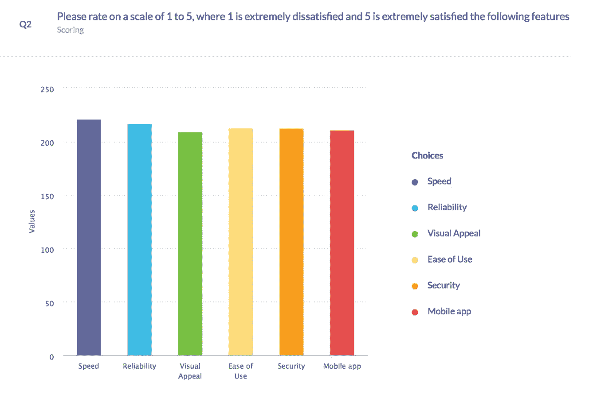
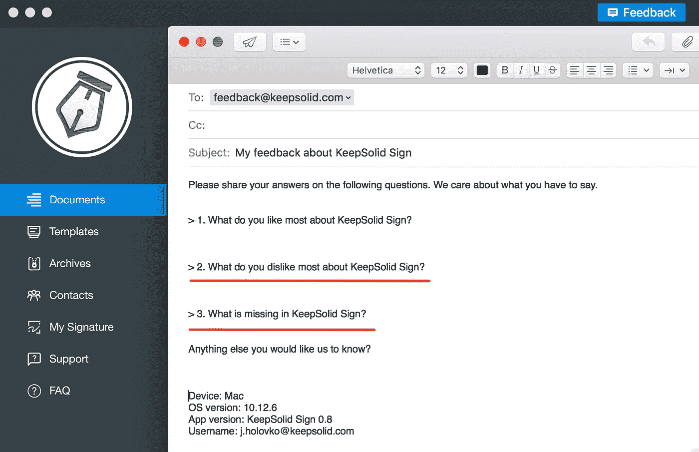

# 如何在客户调查中提出正确的问题

> 原文：<https://medium.com/swlh/how-to-ask-the-right-questions-during-customer-research-e40eb7d2fe3>

没有任何市场研究和分析师的预测能像一次经过深思熟虑的客户访谈那样给你提供如此多的洞察力和实用数据。越来越多的创业公司承认这一事实，并呼吁各种用户调查。然而，这就提出了一个重要的问题——如何恰当地进行面试？ ***问什么样的问题？哪些问题更适合面试，哪些问题应该留给调查？***

我们在 [KeepSolid](https://www.keepsolid.com) 团队已经在这方面积累了[一些经验](/swlh/how-to-conduct-a-closed-beta-testing-with-zero-budget-acd19c2de43)，从 ProductMan [club](https://www.facebook.com/iampmclub/?fref=mentions&pnref=story) 获得了一些灵感，现在准备与您分享一些技巧！👇

Photo by [Austin Chan](https://unsplash.com/photos/ukzHlkoz1IE?utm_source=unsplash&utm_medium=referral&utm_content=creditCopyText) on [Unsplash](https://unsplash.com/?utm_source=unsplash&utm_medium=referral&utm_content=creditCopyText)

**提出正确的问题以获得正确的答案**

人们可以称之为角本规则，这是正确的，它决不会使这一要求过时。

***如何提出正确的问题？***

好吧，为了做到这一点，在某种程度上，你必须已经知道答案。这听起来可能有点奇怪，但请坚持。此外，准备好迎接惊喜，对你将从用户那里听到的东西保持开放但批判的态度。

好吧，比方说，你是营销专员或者产品经理。您正在对您的产品进行测试，需要收集用户反馈。你可以依靠你的常识，准备许多不同形式的问题。其中一些听起来像是“你喜欢我们的应用吗？”或"*请用 1 到 5 分评价我们产品的以下特点？"。*

停在那里，因为它不会让你去任何地方。我们知道这一点，因为我们实际上为 [KeepSolid Sign](https://www.keepsolid.com/sign/) (我们的产品之一)问了后一个问题。这是我们得到的信息:

One of the questions in the survey for KeepSolid Sign

你认为这个问题揭示了什么？

实际上，没有。此外，它误导我们，显示一切都很好。

只有当您需要确定产品中的瓶颈并深入问题时，这些问题才是相关的。

当然，更好的方法是咨询您的开发人员，了解您的产品如何工作，咨询销售经理，了解其卖点。但是你仍然需要发展你自己的观点，这将帮助你达到你的目标，无论它是什么。

只有在这种情况下，你才能提出精确的问题，以了解非常具体、相关的信息。 ***有时候全在于选择哪个视角。***

因此，首先，我们认为应该区分三种观点:

1.  ***分析情绪问题。这些对一个重要的目标大有裨益——告诉你客户的痛苦以及他们是如何努力克服的。像这样的问题:***

*   “为什么需要解决这个问题？”真的这么可怕/气人吗？为什么？
*   “你之前是怎么尝试解决的？”

很适合这里。让用户说话。

这样，你会更好地了解你的客户，甚至可能会提出你以前从未想过的解决方案和想法。

**重要提示:**这类问题都是关于质量，而不是数量。在这个阶段没有必要尝试建立一个统计研究。

虽然每个用户的痛苦都是独特的，但很可能，您将能够找出一些清晰的模式。这就是为什么我们强烈建议为情感问题安排口头面试。然后，你就可以手动地将你的谈话引向你感兴趣的话题。

另外，帮你自己一个忙，不要在面试中提问时暗示答案。有时候，我们本能地提出问题，以便听到我们想要的答案。

我们过去也犯过类似的错误。😞

对于 KeepSolid Sign，我们希望了解 Mac 和 Windows 的原生应用程序是否确实是我们的竞争优势之一，因为它们允许在网络连接较弱或没有网络连接的情况下处理文档。此外，本机应用程序比浏览器版本运行得更快。

因此，我们问我们的用户*“为你的 Mac / Windows 电脑安装一个本地应用有多重要？”。*很明显，几乎所有与我们交谈过的人都表示，我们拥有适用于这些平台的应用非常重要，这很好，因为我们的用户确实拥有 Mac 或 PC。

但是，我们实际上希望了解*他们是否会在 Mac 或 PC 上使用 keep solid Sign*并让这些平台优先使用该应用程序的 web 版本，因为可以离线或在旅途中处理文档。

因此，后来，我们改变了问题的措辞，提出了“*离线处理文档对您来说有多重要？”。这给了我们更好的理解和更具体的答案。*

现在，我们坚持更精确和更容易理解的问题，如*“你需要离线处理你的文档吗？在飞机上呢？多久一次？”。*

**再次，自己反复检查，准备面试，主导对话，但要让用户先开口。**

**P.S.** 我们现在最喜欢的一个问题是*“这个产品对你的主要好处是什么？”。*我们以此开始我们的采访和调查，尽管这是一个宽泛的问题，但它将为你提供有意义的数据。几乎我们所有客户的评价都是基于这个问题的答案。

*2。* ***问题分析特征要求*** *。*这些更是你产品的核心。再说一次，为什么比什么更重要。如果你简单地问*“你希望在我们的应用中看到什么功能？”你很可能会得到一个通用的答案，这个答案你应该已经从你的市场调查中学到了。*

例如，我们在应用内和访谈中向用户提出了以下 3 个问题:

Our feedback form for KeepSolid Sign

在那一刻，我们认为这些问题是相当平衡和综合的，但一旦我们开始收到答案，人们对问题#2 和#3 的回答是相同的。例如，“没有与 OneDrive 集成”(问题 2)和“缺少 OneDrive 集成”(问题 3)😳。

回到特性的角度，如果你问类似*“你需要这个特性来完成什么样的任务？”*或“*如果没有这项功能，您现在如何管理您的需求？”你可能会无意中发现一个无价的洞见。*

此外，除了理解问题，你还需要了解这个问题现在是否真的是一个无法忍受的痛苦(记住，揭示情绪的问题？)而如果别人也深受其害。因此，考虑添加以下问题:

*   "用户是现在就需要这个特性，还是你可以以后再添加？"
*   "如何将这个特性嵌入到当前的工作流程中？"或者“使用场景是什么？”
*   "还有谁需要这个功能(如果你的产品是 B2B 的)？"这是一个有趣的问题，因为你的用户可以给你指出谁也需要你的未来解决方案(又名特性)。

所以，不要问功能，要问问题和烦恼，并创造解决它们的功能。口头面试在这里是一个不错的选择。

*3。* ***问题分析 UI/UX。*** 嗯，这里最好是实际看到用户如何与你的 app 互动，而不是提问。但是如果你没有时间或者没有安排好这个过程，那么你可以全力以赴进行统计研究，用定量和评级的问题。

这样的问题在各种 beta 测试中最常见，在 beta 测试中，你给用户一个具体的产品，并且需要收集一个同样具体的反馈。但是，即使在这里，你也必须深思熟虑，明白你想学什么，为什么要学。

例如，如果你问*“请从 1 到 5 评价我们的应用程序设计”*，你可能会得到许多令人愉快的答案，尽管如此，这些答案不会给你任何有价值的知识。

相反，试着问他们理解如何完成步骤 X(即发送第一份文件供签署)有多难，或者问*“你对该应用的第一印象是什么？”。*

**关于预算的旁注。**有时候，调查用户以了解如何将你的产品货币化是个不错的主意。通过这种方式，你可以了解他们准备花多少钱购买哪些功能。但是，我们再怎么强调这一点也不为过，要注意你的提问方式。像“*这样直接的问题，你准备为我们的产品付多少钱？”*会给你过分乐观的价值观。

最好是询问用户已经在类似产品上花了多少钱，或者这种解决方案的预算是多少，因为他们不太可能准备在你的产品上花更多钱(他们总是将你与某人或某事进行比较)。

所以，你的面试结构应该是这样的:

*   了解这个人——他/她在公司的职位，他/她的任务和挑战等
*   谈论他/她在工作中(如果产品是 B2B)或生活中(如果是 B2C)的问题——而不是关于你的产品。询问他们过去和现在经历的具体事情，例如他们以前是如何解决问题的，他们为该解决方案支付了多少钱，该解决方案的缺点是什么等等
*   如上所述，开始询问有关特性、功能和设计的具体问题，以更好地了解问题和难题。
*   面试结束后，发一封跟进邮件，附上你们讨论的要点，并说声谢谢。

你需要和你的用户进行至少 10-15 次访谈，才能开始发现他们回答中的模式。但是，当然，采访越多越好。

多听，少说话！

**底线**

显然，每个项目都是独一无二的，所以我们不想为每个人列出一个通用的问题清单。相反，我们想用人们在各种情况下可能会问和不应该问的问题来解释我们的观点。

我们希望这个小指南能帮助你建立下一个完美的面试或调查:)总而言之，永远记住两件事。**首先**，你想得到具体的答案，所以围绕这些来设计你的面试/调查。**其次**，永远不要忘记任何产品或功能的最终目标——帮助用户减轻痛苦。所以，无论你问什么问题，都必须帮助你把你的产品带到这个终极点。

你曾经对你的用户进行过采访或调查吗？怎么样了？请在下面的评论中分享你的故事。干杯！🎉

*在* [*【推特】*](https://twitter.com/keepsolidinc?lang=en)*[*【脸书】*](https://www.facebook.com/keepsolidinc/) *和我们的* [*博客*](https://blog.keepsolid.com/) *上关注我们，跟随我们的旅程，为企业创造最佳的生产力和安全解决方案。**

**

## *这个故事发表在 [The Startup](https://medium.com/swlh) 上，这里有 263，100 多人聚集在一起阅读 Medium 关于创业的主要故事。*

## *在这里订阅接收[我们的头条新闻](http://growthsupply.com/the-startup-newsletter/)。*

**