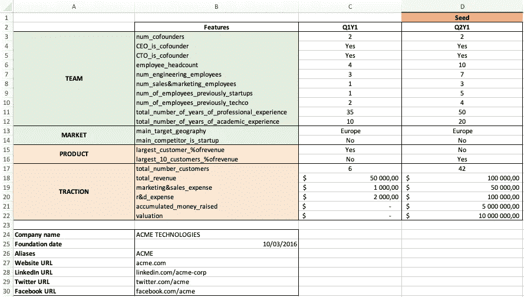
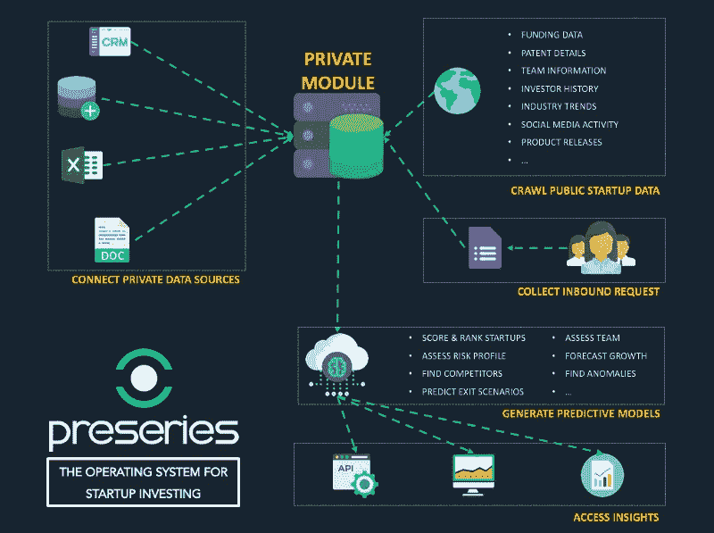

# 如何使用机器学习评估初创公司:第三部分——预测建模的喘息

> 原文：<https://medium.com/swlh/how-to-assess-startups-using-machine-learning-part-iii-the-gasp-for-predictive-modeling-f1f1a215a196>

## 风投界的数据极客们终于有了自己的简讯。 [*此处订阅*](https://preseries.us12.list-manage.com/subscribe?u=90e54ff28272f62fbfa31d206&id=b11d27c6a4) *！*

## 如何使用机器学习评估初创公司

> ***第一部分***——[简介](/preseries/how-to-assess-startups-using-machine-learning-part-i-introduction-ae7f38ae49e8)
> 
> ***第二部分***——[The GASP 开源框架](/preseries/how-to-assess-startups-using-machine-learning-part-ii-the-gasp-open-source-framework-36de812b4a7e)
> 
> ***第三部分*** —预测建模的喘息

# 标准化数据收集的 GASP 框架

在[第二部分](/preseries/how-to-assess-startups-using-machine-learning-part-ii-the-gasp-open-source-framework-36de812b4a7e)中，我们解释了需要标准化数据收集背后的动机，以及如何用我们的 GASP 开源框架做到这一点。这个框架的最终目标是让任何投资者建立自己的可量化的创业信息数据库。但是不管你的启动数据库有多丰富和更新，如果你只是用它来存储信息和不时地浏览它，那么你就错过了一半你可以从中产生的价值。永远记住黄金法则:数据只有在转化为洞察力时才有价值，不要成为数据囤积者。事实上，在用 GASP 收集了大量的创业数据后，你手动获取洞察力的能力自然会减弱。这就是机器学习进入竞技场的地方！

On the left: the GASP + Machine Learning — On the right: the GASP only

在这篇文章中，我们将看看机器学习如何帮助你理解所有的启动信息，这是一项比人工分析更适合机器的任务。查看我们系列的第一部分,权衡在这种特定环境下使用预测建模的利弊！今天，我们将使用 [PreSeries 的分析师平台](https://preseries.com/analyst)(由 BigML 提供支持)来说明幕后的预测建模过程。投资者和其他商业类型的用户更喜欢使用我们的[仪表板](https://preseries.com/home_dashboard)，或者让预测模型直接在他们的内部软件中工作，连接到他们的 CRM，或者其他。关于结果可访问性的更多信息在文章末尾。

PreSeries 平台抽象了预测建模固有的大部分复杂性，使我们能够专注于最重要的事情:轻松生成预测，而不是数据工程！

# 步骤 1 —从 GASP 电子表格到数据集

如果您已经在使用 GASP 开源框架，那么您应该已经在电子表格或数据库中存储了大量的启动指标。下面是一个定制的 GASP 在电子表格中的示例。为了简单起见，这里我们将特性的数量减少到 20 个，覆盖的时间段减少到 2 个(参见[第二部分](/preseries/how-to-assess-startups-using-machine-learning-part-ii-the-gasp-open-source-framework-36de812b4a7e)了解全貌)。

Example of a simplified GASP

上面的例子涵盖了一个筹集种子资金的创业公司。在现实生活中，你会在不同的时间点与许多初创公司打交道，这就是处理电子表格明显存在局限性的地方。电子表格(或者一般的表格)对于输入数据来说是很棒的，但是如果你有成百上千或者更多的喘息时间要处理，这将是不可能的。这就是为什么我们建议最终将收集的信息存储在您自己的私有数据库中，就像我们在 PreSeries 部署的数据库一样([询问我们](https://preseries.com/request-demo)，我们将为您自动完成)。通过将所有这些放在一个屋檐下，您现在可以将所有内容合并到一个数据集中，这是任何预测建模任务发生之前的必要步骤。

既然你已经做好了一切准备，我们需要一个目标。我们想预测什么？缺乏明确的问题来回答是机器学习实践者面临的第四大挑战。为了使任何建模方法有意义，它需要被清楚地定义，而答案将取决于你作为 VC 的投资标准。

> 例如，如果你是一个种子投资者，也许你想要回答的最重要的预测是:“这个申请人筹集种子资金的可能性有多大？”。

Without objectives, everything is a success!

为了本文的目的，让我们假设你是一个种子投资者(等一下！没有太多关于种子创业公司的可用数据……—请耐心等待！)你会收到大量创业者的请求，他们急切地想要采访你。“有什么问题？”你可能会问自己。“申请人越多，选择就越多。富足不是问题！”。嗯，如今联系很容易，但以不错过投资良机的速度处理交易流却不容易。

如果你错过了隐藏的宝石，不管你有多少机会。此外，你不能面试所有人，你需要一个可靠的预选过程，只为最有希望的申请人分配时间。换句话说，你想回答的问题是:**我应该面试这家初创公司吗？**要回答这个问题，先从数据说起。我们将用作示例的数据集部分基于从 [Kaggle](https://www.kaggle.com/aashay96/san-francisco-based-startups) 检索的天使名单数据(旧金山初创公司)。

Partial view of the dataset

# 步骤 2 —从数据集到预测模型

> 在 PreSeries，我们会为您自动执行以下所有操作，但这里先来看一下我们使用 Analyst 平台的机器学习方法。PreSeries 用户可以访问分析师平台(仪表板和 API ),包括所有在线数据和为您私人生成的预测模型。为了获得更好、更准确的预测模型，我们邀请您加入自己的数据，如果您想进行定制的私有部署，请在此处 **咨询我们的 PreSeries 操作系统解决方案[。](https://preseries.com/contact)**

首先，在 PreSeries Analyst 平台上手动导入数据集非常简单(可用于自动化的 API)。你只需进入“信号源”，点击“创建信号源”。为简单起见，我们假设您的历史交易流数据已经在 a *上导出。csv 文件(见上一步)。现在，您需要通过选择想要影响预测模型的特征，将您的源转换为机器学习就绪的数据集。我们使用的数据集已经包含了我们想要的所有变量，所以这个例子不需要任何准备工作。预系列 ca，处理不同类型的字段:文本，数字，分类，…看看数据集，看看！

Creating a source from a *csv file and a dataset takes a few seconds on PreSeries.

此时，您可能需要花些时间来研究您的数据集:评估缺失值、任何错误或分析每个字段的分布。如果您想从当前变量(如比率、标注或其他)中创建新变量，或者从其他数据集中导入要素，这也是合适的时机。一切都可以在平台上点击完成，不需要编码。

Take the time to explore the variables that are part of your inbound form

请始终记住，在生成预测模型之前，您需要将数据集拆分为定型数据集和测试数据集。该模型将在训练数据集上进行“训练”,并在“测试”数据集上进行测试，以评估准确性。PreSeries 提供了一键训练|测试拆分，所以你不用担心手动完成。

1 click Training | Testing split

现在我们准备训练一个模型。您可以在 PreSeries 平台上生成各种各样的预测模型。因为我们的问题是一个分类问题(面试？**是**还是**否**)我们需要选择一个分类模型，这里是决策树。不确定选择哪个型号？ [OptiML](https://bigml.com/features#automation) 功能将自动生成各种不同的预测模型(集成、逻辑回归、深度网络等)，并对它们进行基准测试，以找出哪一个表现最好，只需一次点击。

现在，让我们确保选择适当的目标字段，也就是您想要预测的内容。在这种情况下，字段“邀请面试”。然后，只需点击“1-click model”即可生成决策树，无需考虑配置参数。

Creating a predictive model to decide on dealflow interviews with just a few clicks

瞧啊。下面您可以看到我们刚刚用历史 dealflow 应用程序数据集创建的决策树模型。左侧是模型的表示，并带有沿节点向下移动的概率的图示。右边是一个模型总结，让你了解哪些变量更能预测我们的目标变量(也就是我们是否应该邀请他们参加面试)。

The decision tree we just created and an output summary. So far, 0 lines of code involved.

好了，现在我们有了一个模型来预测…它有什么好的吗？我们需要使用我们的测试数据集进行评估，看看预测实际上有多好。

正如你在上面的混淆矩阵中所看到的，有许多指标可以用来判断你的模型是否足够好，可以投入生产。评估模型的质量应该关注哪个指标？嗯，那要看什么对你来说代表更大的成本。在我们的例子中，成本的“概念”与进行访谈所需的资源相关:时间、金钱等。

我们可能会遇到两种类型的错误，第一种可能是错过一个我们永远都不应该失去的初创公司的面试([类型 I 错误](https://en.wikipedia.org/wiki/Type_I_and_type_II_errors)，拒绝真的零假设，也称为假阴性)，或者参加一个确实不值得我们花费时间的初创公司的面试([类型 II 错误](https://en.wikipedia.org/wiki/Type_I_and_type_II_errors)，接受假的零假设，也称为假阳性)。

如果我们想最小化假阴性的数量，我们应该关注[召回](https://support.bigml.com/hc/en-us/articles/207539549-How-can-I-interpret-the-evaluation-results-for-my-classification-model-)指标(越高越好)。否则，如果您主要关心的是减少误报的数量，我们应该关注[精度](https://support.bigml.com/hc/en-us/articles/207539549-How-can-I-interpret-the-evaluation-results-for-my-classification-model-)指标(越高越好)。

如果你想关注模型的整体性能，在两种类型的误差之间进行更好的权衡，你应该只关注 [F-measure](https://support.bigml.com/hc/en-us/articles/207539549-How-can-I-interpret-the-evaluation-results-for-my-classification-model-) 或 [Phi 系数](https://support.bigml.com/hc/en-us/articles/207539549-How-can-I-interpret-the-evaluation-results-for-my-classification-model-)指标。F-measure 表示召回率和精确度的平均值(平衡调和平均值)。Phi 系数也明确考虑到了真正的负面因素，非常重视不要安排我们不应该安排的对初创公司的面试。

从精确度来看，模型预测的每 20 次面试中有 17 次是我们应该追求的。如果我们看一下召回，我们可以看到每 10 次面试我们就失去 3 次面试机会。

基于这些数字，我们可以一次又一次地进入优化训练模型的螺旋:不同的特征组合，调整我们模型的不同参数，添加更多的特征，等等。但是这超出了本文的范围。

# 第 3 步—无缝预测您的入站交易流程

现在我们知道我们可以信任我们的模型，所以让我们把它付诸实践。PreSeries 在您的组织中有多种工作方式。(获取联系 [**这里**](https://preseries.com/contact) 了解更多！).

PreSeries 模型可以很容易地导出到 Google 电子表格、Microsoft Excel 或单机上。下面是它在谷歌电子表格中的工作原理。首先，访问 dealflow 数据所在的电子表格，并加载 PreSeries 插件。注意，当然应该有一个名为“受邀面试？”，类似于历史数据集中存在的内容。

Loading the PreSeries add-on on Google Spreadsheets

您使用您的 PreSeries API 凭证登录，现在您可以访问您的模型库。找到合适的模型并点击预测。

Your dealflow model making predictions and showing the confidence

该模型会自动将预测添加到留空的列中，建议您是否面试每家公司，以及预测的可信度。现在你可以筛选这些公司，并开始安排会议。准备好节省时间并将您的分析师从繁琐的工作中解放出来了吗？[在这里取得联系！](https://preseries.com/request-demo)

PreSeries automates the VC experience

你做到了，你读完了。恭喜你！你现在可能会想:它适合我吗？好吧，如果你是一个天使投资人，有大量的交易要处理，一个早期阶段的风险投资公司，或者一个成长型风险投资公司，我们有合适的解决方案给你。您可以利用更多的数据和预测模型来节省管理费用，同时确保不会错过任何好的投资机会。它不是很贵，正如你所看到的，它以非常具体的方式工作，远离了机器学习的宣传。

我们将开发更多像这样的案例研究，研究如何利用 PreSeries 数据来训练推荐模型，为您的投资组合公司找到投资者、竞争对手或收购者。机会是无穷的！

我们为对与我们建立数据合作关系感兴趣的风投提供折扣。联系我们 [**这里**](https://preseries.com/contact) **。**

## 这篇文章发表在 [The Startup](https://medium.com/swlh) 上，这是 Medium 最大的创业刊物，有+384，399 人关注。

## 在此订阅接收[我们的头条新闻](http://growthsupply.com/the-startup-newsletter/)。

