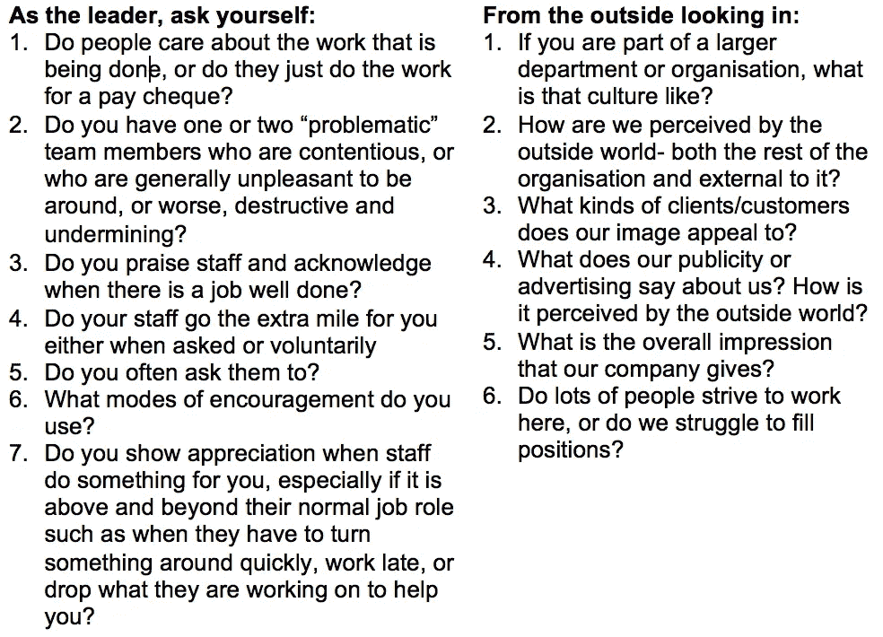
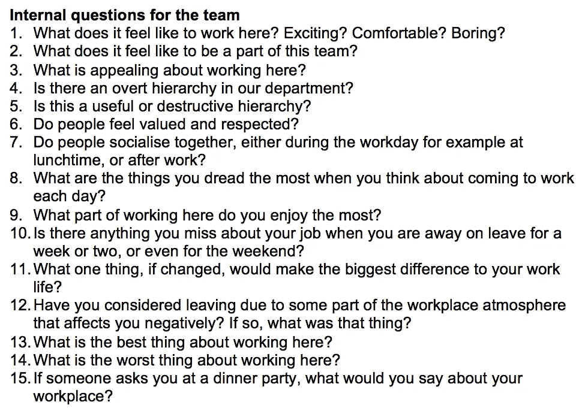

# 如何评估你的团队文化并使之成为你想要的

> 原文：<https://medium.com/swlh/how-to-assess-your-teams-culture-and-make-it-what-you-want-39914b26ff6>

stocksnap.io Rawpixel.com

> “事实证明，真正将蓬勃发展的组织与苦苦挣扎的组织区分开来的是工作人员难以衡量的态度、流程和看法。
> 
> 文化每次都会打败策略。"
> 
> 赛斯·戈丁

文化是指每天上班并为你的公司或团队付出至少八小时的感觉。良好的、一致的文化能提高生产力；它创造了你需要的创新和创造力的氛围。糟糕或不匹配的文化会完全破坏你想要实现的一切。

把你的文化搞对了，你的团队就会有很好的名声，让人们愿意和你一起工作。误解文化，或者完全忽略它，你可能会很难招聘到或留住你想要的、拥有你需要的技能的人。文化通过现有员工向未来的人才口头传播。

人们可能不会有意识地谈论文化，但当他们说“我们被允许犯错误并从中吸取教训”或“良好的非正式指导在这里发生”时，这就是他们的意思。它为你创造了作为雇主和领导者的声誉。

这就是为什么文化每次都会打败策略。世界上最好的商业策略也无法拯救一个陷入破坏性文化的团队。

文化可能看起来有点模糊，甚至不可能“看到”或确定。但是，我为领导和团队成员设计了一套问题，可以帮助你迅速揭示鲜明的文化。你会很容易开始看到你的团队中什么是好的，什么是需要注意的。

## **决定你的文化和任何潜在问题的问题**

团队或公司的文化是由个人的集体行为决定的。文化是一起工作的那群人的情商的总和，以及他们所坚持的标准和价值观。

文化是复杂的，但是一旦你确定了你的团队的核心价值观，为你的团队创造你想要的文化就变得容易多了。这很重要，因为这反过来有助于您的企业实现您需要的目标。

值得花时间仔细研究这些问题或类似的东西，这样你就可以确定你的团队正以最佳状态工作。 ***你很快就会在你的生产力、工作生活质量以及最终的底线上看到它。***

你可以找到所有这些问题，并在我的书《成为无畏的领导者:掌控和建立快乐、高效、高绩效团队的简单指南 *中找到更多帮助你创建最佳团队的问题。*你可以在[我的网站](https://www.elizabethshassere.com/)上找到免费的 pdf 工作簿，指导你完成它附带的所有内容。

我写了我如何成为一家科技创业公司的创始人，作为一名非技术人员，一名没有创业经验的 40 多岁的女性，以及我一路走来所学到的一切。更多 [*这里可以看到*](/@eshassere) *。* *如果你觉得这可能对其他人的创业之旅有帮助，请推荐分享。*

## 这个故事发表在 [The Startup](https://medium.com/swlh) 上，这是 Medium 最大的创业刊物，拥有 318，983+人关注。

## 在这里订阅接收[我们的头条新闻](http://growthsupply.com/the-startup-newsletter/)。

