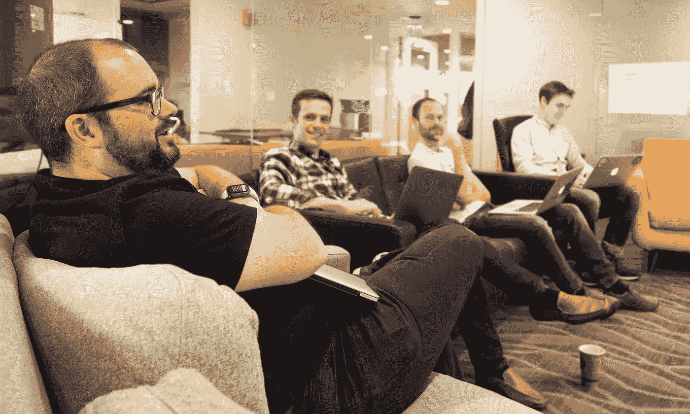

# 如何避免软件设计中的意外复杂性

> 原文：<https://medium.com/swlh/how-to-avoid-accidental-complexity-in-software-design-2792ad99fddc>

**由** [**安德鲁**](https://www.linkedin.com/in/sardone/)
工程副总，[一言以蔽之](https://www.nutshell.com)

> 计算机科学中有两个难题:缓存失效、事物命名和一个接一个的错误——[*莱昂·班布里克*](https://twitter.com/secretGeek)

1986 年，计算机架构师 [**Fred Brooks**](https://en.wikipedia.org/wiki/Fred_Brooks) 发表了一篇名为“ [**没有银弹**](http://www.itu.dk/people/hesj/BSUP/artikler/no-silver-bullit.pdf) ”的论文，他在其中观察到，与硬件工程 相比，软件工程并没有产生同样的生产力增益 [**。**](http://www.investopedia.com/terms/m/mooreslaw.asp)

布鲁克斯认为，当谈到制作软件时，有两个主要障碍需要克服:**偶然复杂性**和**本质复杂性**。

偶然的复杂性指的是开发人员在试图解决问题时无意中给自己带来的挑战。(幸运的是，这种复杂性也可以由开发者来修复或改进。)

本质复杂性只是你试图驯服的野兽的本性。布鲁克斯用的例子是，如果用户需要一个程序做 30 件事，那么这 30 件事是必不可少的；你不能简单地去掉其中的几个，让软件不那么复杂。每当你在解决一个问题时，**总有一些复杂的领域不能被削减。**

虽然 Brooks 指的是复杂性以及它与制作和修改代码的关系，但它也适用于最终产品。

销售预测、衡量销售渠道中销售线索关闭的可能性以及分析漏斗的行为对 CRM 来说都是必不可少的。另一方面，难以阅读的图表、心算或不会即时实时更新的报告都是意外复杂性的例子。

当我想到我们在 [**简而言之**](https://www.nutshell.com) 创建的软件时，我经常问自己:**它对我们试图解决的问题有多少是必不可少的，我们如何才能消除任何意外的复杂性？如何避免编写和使用软件的障碍？**

# **您的代码就是您的组织**

[**康威定律**](http://www.melconway.com/Home/Conways_Law.html) 指出“任何设计系统的组织都会产生一种设计，其结构是该组织沟通结构的复制。”换句话说，**你正在编写的软件代码将基本上反映你的公司是如何布局的**。

我反复强调这一点，我的团队可能已经听厌了，但是我相信，为了产生有效的代码，创建正确的组织环境是最重要的事情之一。

对我来说，这使得团队更加扁平和开放，因此与团队其他成员交流，或者更新和改进代码没有任何障碍。最终目标是**提高速度，减少知识孤岛，并改进最终产品**。

像谷歌或脸书这样的大公司面临的挑战是，他们拥有所有这些团队——有时甚至在同一产品上相互竞争——具有不同程度的官僚主义、流程和更复杂的沟通渠道。

现在它带来了权衡，因为这些产品提供的价值和规模是无与伦比的，但是复杂性开销有其成本，并且将您的架构与它隔离开来对于软件开发团队来说是一个重大的挑战。

# **英雄无处容身**

另一个减少意外复杂性的方法是尽可能限制“团队英雄”的数量。

有时候你的团队里会有一个摇滚明星，当有什么东西坏了，他们会说，“不管怎样，我去把它修好。”这在许多软件团队中是一种常见的动态，但是这种英雄崇拜对知识共享是非常有害的。

**也许你听说过“** [**公交车因素**](https://en.wikipedia.org/wiki/Bus_factor)**”**—*如果这个人被公交车撞了，会对我们公司造成多大的影响？*这可能适用于公司的任何部门，但在软件开发中尤其明显。由于软件开发中的移动部分的数量，高总线系数的英雄可能会不被发现，突然你有一个隐藏的单一依赖，如果丢失将会引发不幸的意外。这是一些意外的复杂性！

谢天谢地，我们没有那么危险，但这是我试图意识到的事情。我们执行代码审查，举行午餐和学习，并建立在可靠的技术之上，努力保持技术堆栈的可接近性。因为减少“总线因素”不仅仅是为了立即降低风险，也是为了提高我们团队的集体知识，从而产生更好的产品。

# **专注的力量**

从编写代码的方式到发布代码的方式，你可以做很多策略上的事情来简化和降低复杂性。例如，我们喜欢在**中发布小的、增量的、迭代的块**，这样就不会有大的切换，这可能会产生很多我们需要应对的问题。

但是，我们所做的影响最大的事情就是简单地缩小最重要的事情的范围。

正如 Fred Brooks 所指出的，当用户说软件需要做 30 件事情，并且没有其他办法的时候，本质复杂性就产生了。但是我会说，*好吧，我们如何将列表缩减到 30 个功能，这些功能是* ***实际上是必需的*** *？*

果壳的核心价值观之一是**专注**。在我的角色中，这意味着**找到软件必须做的基本事情的最大重叠，并对超出范围的事情说“不”**。

我们不能尝试执行每一个进来的特性请求，因为每一个边际输入都可能有一个指数级的复杂性。你必须有勇气说，“好吧，我们只是不会为产品这么做。”

想想你将如何营销一家公司:你的信息不应该与所有人产生共鸣——你必须选择最有可能使用你的产品并从中受益的目标市场和人物角色。

我以同样的方式看待产品开发。你必须为每个特性选择一些人物角色，这就意味着你要排除其他人。

缩小你要做的事情的范围会让你更好地处理重要的事情，并尽最大努力降低复杂性。在好的软件中，这不仅仅是一个“好东西”，而是必不可少的。

## 这个故事发表在 [The Startup](https://medium.com/swlh) 上，这是 Medium 最大的企业家出版物，拥有 271，813+人。

## 在这里订阅接收[我们的头条新闻](http://growthsupply.com/the-startup-newsletter/)。

