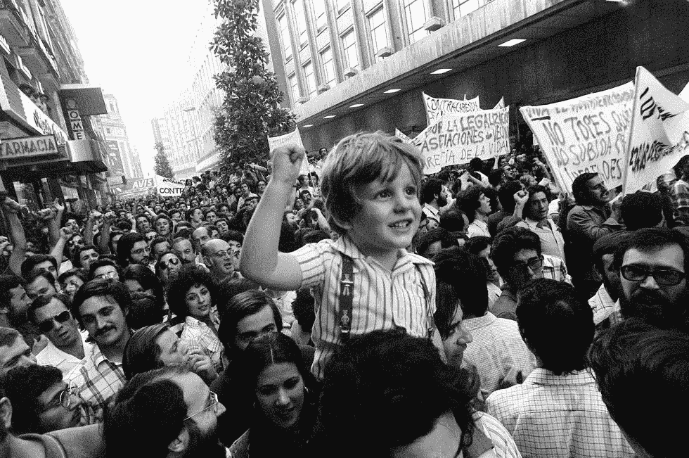

# 如何避免低效，并开始超高效

> 原文：<https://medium.com/swlh/how-to-avoid-being-unproductive-and-start-being-ultra-productive-827da48b3728>

Photo credit: La Movida Madrileña.

## 你可以考虑的 16 个基本原则

你可能认为你在参加一场赛马，结果你是在参加一场驴赛。你可能以为你在吃上等牛肉，结果你在吃猪排。或者你可能认为你的工作效率很高，但事实证明你的工作效率并不高。

# 你不是超高效的

*   没有达到更好的生活水平并不会让你变得超高效。即使你用更少的时间生产更多的东西，你也会富有成效，就是这样。然而，克服超高效的障碍甚至会适得其反。
*   每天创建 20 个仪表盘，你可以跟踪你的所有活动。
*   一天分析所有这些仪表板五次。
*   沉迷于数据，而不是随后的行动和与之前相比的最终结果。
*   听从你的思想，而不是你的身体，你的感觉和你的心。不要随波逐流。
*   先把钱放下再把灵魂放在第一位。
*   抱着你能赢得时间的想法生活。
*   结构严谨，刻板，不可动摇。
*   减少休息时间、社交生活和家庭时间，以提高工作效率。
*   我认为解决方案在工具中，在软件中。
*   为别人付出自己那么多而忽略了自己。
*   说(并相信)“我很忙。”

想想看，持续的超高效率会让你走得更远。

*   当计划改变，你的时间表改变，你的约会或承诺被取消时，不要微笑。
*   在划掉清单上的最后一项任务之前，不要躺下。
*   面对每天抽出 30 分钟做你想做的事情的可能性。
*   想同时实施十项改进。同时掌握五个超级习惯。或者开发 15 个日常系统，并希望它们都能正常工作。

这几点是试图成为 超高效的人 [**遇到的一些最常见的障碍。没什么可怕的。**](https://ultraproductividad.com/)

Afrika Burn

# 只是流动

关键因素是专注于改善你的生活方式，而不是你的工作。就是对自己做的事情感到舒服，不要太有压力，也不要被逼得太紧。集中你的能量进入一种流动的状态，这种状态会让你少工作一点，多生产足够的(或一小部分)，过上更好的生活。

【本帖最早出现在[**isragarcia.com**](https://isragarcia.com/being-ultra-productive)】

# 只有当你觉得值得的时候，才让这个故事震撼吧！如果你发现任何有价值的东西，请鼓掌。

> Isra Garcia = 53 个客户，48 家企业，400 次演讲，3.504 篇帖子，24 个项目，6 本书，380 场讲座，6 家公司，17 次冒险，25 次实验，∞失败。到目前为止…
> 
> [营销人员](https://isragarcia.com/wp/marketer)。顾问。扬声器。作家。教育家。经理。 [IG](http://thisisig.com) 的负责人。博主。企业家。颠覆性创新。数字化转型。高绩效者和生活方式实验者。

# 行动号召>>点击[这里](http://feeds.feedburner.com/isragarcia)订阅更多类似的文章！

## 这篇文章发表在 [The Startup](https://medium.com/swlh) 上，这是 Medium 最大的创业刊物，有 326，962+人关注。

## 订阅接收[我们的头条新闻](http://growthsupply.com/the-startup-newsletter/)。

