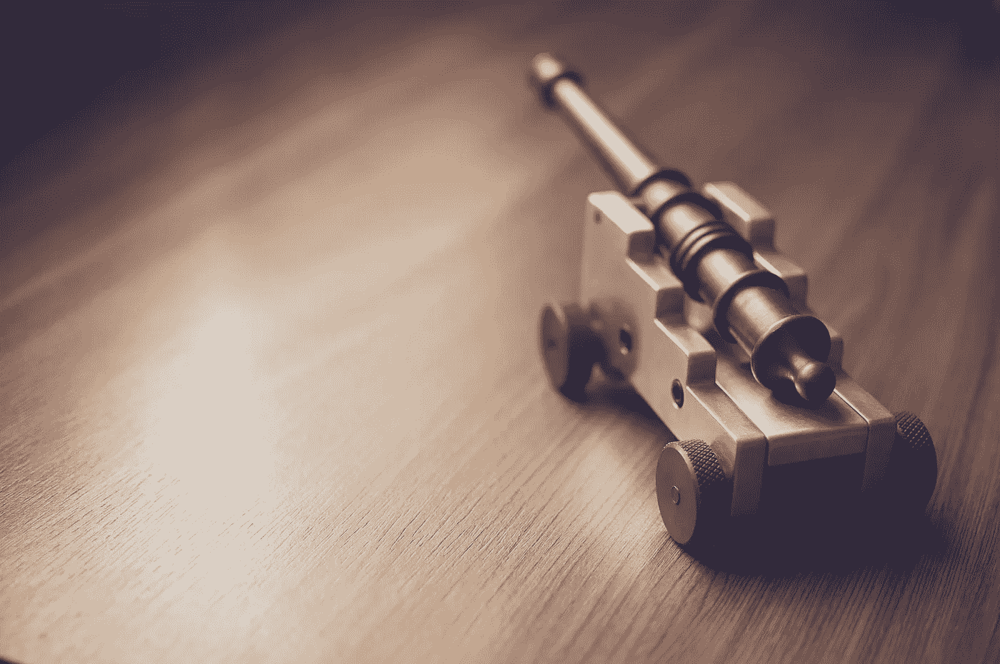
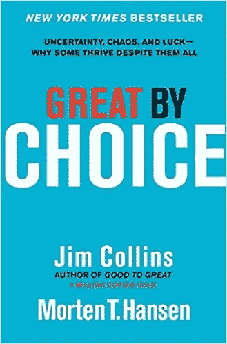

# 如何避免大多数新企业犯的头号错误

> 原文：<https://medium.com/swlh/how-to-avoid-the-number-one-mistake-most-new-businesses-make-e7800b62f406>

还记得早在 2001 年，当 Segway(那些有趣的小的，两轮的，自动平衡的电动汽车)在一阵媒体炒作中出现时，它被吹捧为个人交通工具的未来。

凭借一些令人惊讶的巨额资金和过于热切的宣传攻势，在一个短暂的时刻，我们似乎可能，仅仅是可能，将被集体带入一个勇敢的新世界，距离承诺的**回到未来**的悬浮板只有一步之遥。

但是十五年后的今天，我向你挑战，除了保安和游客，还有谁在使用赛格威。

发生了什么事？赛格威哪里出问题了？

> *这个问题问得好。由此得出的答案是每个企业在发布新产品和/或服务时都需要牢记在心的。*

所以，让我们从赛格威史诗般的失败中吸取教训吧。

# **未经证实的市场**

> "*你们的科学家如此全神贯注于他们是否能够* *，他们没有停下来思考他们是否* ***应该*** *。"* —侏罗纪公园

太多的公司失败是因为他们带着未经证实的产品投入未经证实的市场。

仅仅有一个绝妙的想法，并有能力执行它，是不足以成功的。一定，一定，一定会有一个愿意为你的产品或服务付费的市场。

如果没有，就会失败。

这就是赛格威误入歧途的地方。

扪心自问，*赛格威是为谁设计的？*

这是一个简洁的概念，但是从实际应用的角度来看，谁是目标受众呢？

> 是住在闹市区的商务男女吗？

如果是这样，我们需要解决物流问题。也就是说，这些混合动力汽车是利用人行道还是街道？我们在哪里起诉他们？你把它们停在哪里？

不幸的是，城市的基础设施不太适合这些奇怪的车辆。

> 那么，也许它们是为在校园里走动的大学生设计的？汽车的低成本替代品？

同样，问题是双重的。

首先，赛格威是非常昂贵的。你最好买一队自行车，或者一辆旧本田。

其次，赛格威是周围看起来最傻的车辆之一。这在很大程度上是因为 Segway 在发布之前一直将他们的发明严格保密。他们没有在设计阶段收集客户反馈，这在最终产品中表现出来。

无论你如何分割，赛格威从一开始就注定要失败，仅仅因为没有明确定义的目标受众愿意为此付费。

从赛格威的错误中吸取教训，并不断测试，以确保事实上，世界上有足够多的人愿意为你卖的东西掏钱。

用 FitBit 的方法做这件事…

# **原型成功**

当 FitBit 在 2007 年出现时，它离消费者准备就绪还差得远。

这只不过是一个想法，但最终，这就是证明一个概念所需要的全部。

除了一个简单的网页，上面充斥着一些关于 FitBit *可以*做什么的模糊信息，一个 3D 模型，以及一个面向有兴趣在未来某个不确定的时间获得产品*的人的预售，FitBit 就出发去比赛了。*

在一个已经知道 **Kickstarter** 和 **Indigogo** 很多年的世界里，这可能看起来不是一个奇怪的概念，但是许多潜在的企业家和初创企业仍然*未能*在真正走向市场之前*审查他们产品的适销性。*

这是一个根本性的错误。

如果你是一个小企业主，你可能没有太多的资金。你必须像龙一样保护它。你不能在未经证实的产品上浪费一分钱。

幸运的是，由于世界上目前的数字生态系统，你不必。

也就是说，如果你记得在炮弹之前发射子弹的话。

# **炮弹前的子弹**

想象你的企业是一艘船。

地平线上另一艘船快速靠近。在他们的船帆上，你可以看到海盗旗的缩臀标志。(打个比方，海盗船就是市场。这是一个机会，尽管只要给它一半的机会，它就会让你的船沉没。)

你准备战斗，装上你的大炮，但需要注意的是，你只有有限的火药(即:资本)。

当海盗船(市场)靠近时，你用你强大加农炮瞄准，并放出一排子弹。

不幸的是，你的导弹无害通过。

你校准错误。

你准备再装一次炮弹，却发现你愚蠢地浪费了你所有的火药。

鲁鲁…你已经死在水里了。

但是，如果在冲突开始的时候，你没有不管三七二十一就开始发射炮弹呢？

如果你先发射几发子弹来校准你的弹道呢？

你可能会错过前几个镜头，但到了第三个或第四个，你可能真的击中了。

然后，带着被证明有效的方法提供的信心，你用你的单炮瞄准，确保坏男孩找到它的标记。

这个比喻来自吉姆·科林斯的《卓越的 [**伟大的选择**](https://amzn.to/2H0n13B) ，它与今天任何想要打入市场的潜在企业家高度相关。

> 在没有先用几颗放好的子弹证明这个概念之前，不要发射炮弹。

# **测试市场**

这真的没那么复杂。从 FitBit 或 Kickstarter 的书里偷一页。

创建一个产品或服务的轮廓，然后把它推销给你的观众。让它可以预购，这样在产品上市之前，你不用从任何人的信用卡上扣钱。如果项目因为缺乏支持或物流问题而失败，那么每个人都能拿回他们的钱，你也学到了宝贵的一课。

> 通过这种方式，你可以审查你还没有创造的产品。

然而，这可能是一把双刃剑，因为如果产品真的起飞了，有一个巨大的市场，那么你必须做好准备，找到一种方法让小马快跑(这是一个全新的独特的完全不奇怪的类比，我现在刚刚想到的。如果没有任何意义请见谅。)

## **如果你的产品获得了一些初始购买量，但不是一吨，那该怎么办？**

现在你在前进和全面撤退之间处于一个奇怪的中间状态。这是一个艰难的地方。

那么，如果对你的产品有兴趣，但不够感兴趣，你该怎么办？

朋友，这是你从潜在客户那里收集反馈并开始迭代的地方。

乔希·考夫曼在《个人 MBA》[中称，人们不买东西有 5 个原因:](https://amzn.to/2JubZlf)

1.  “太贵了。”感知价值太低。
2.  *“行不通。”好得难以置信。*
3.  *“对* ***我*** *不起作用。”我的情况很独特。*
4.  “我可以等。”该产品解决的问题并不重要。
5.  *“太难了。”产品或服务太复杂。*

这 5 个原因中的任何一个(或其组合)都可能阻止潜在客户购买你的产品或服务。因此，解决方案要么是让人们更好地了解你的产品的价值，要么是在你的产品/服务的设计和/或实施中解决这些投诉。

这里重要的一点是避免做出巨大的、彻底的改变。

这是很多公司误入歧途的地方。

他们有满满一桶伟大的想法，但他们都把它们扔向了墙，在命运的讽刺转折中，他们最终改变了 a)从来不是问题的东西，或者 b)人们喜欢的关于原始问题的东西。

> 因此，始终以小块(最好是可逆的)进行迭代是至关重要的。

**调整和测试**是游戏的名字。

擅长这个游戏，你很快就会成为一个专业的射手，能够以令人难以置信的可靠性击中他们的目标。

或者，放弃类比，你将是一个成功的企业不断推出备受追捧的产品和服务。

**感谢阅读！如果你喜欢这篇文章，帮我一个忙，拍一下**👏**几十次。你的支持对我来说意味着一切！**

[**点击这里参加免费的五个势力范围电子邮件课程！**](http://www.thehyperfocusedmind.com/)

## 这篇文章发表在 [The Startup](https://medium.com/swlh) 上，这是 Medium 最大的创业刊物，有 314，551+人关注。

## 在这里订阅接收[我们的头条新闻](http://growthsupply.com/the-startup-newsletter/)。

