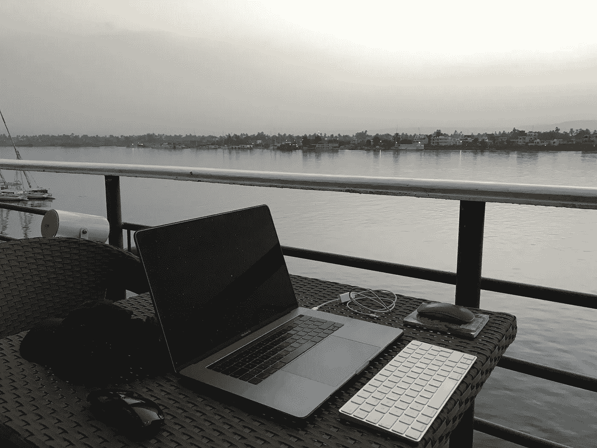
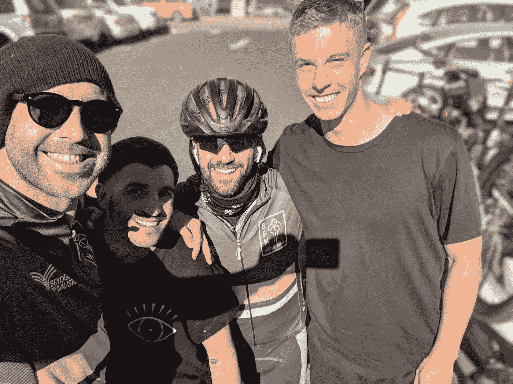

# 如何每天都更高效一点

> 原文：<https://medium.com/swlh/how-to-be-a-little-more-ultra-productive-every-day-942c1e8a4227>

## 每天实现超高生产率的 5 项新技术

这是五个新的改变(**)，我是 [**融入**](/swlh/how-to-be-ultra-productive-in-30-days-17-basic-practices-40303a525cbd) 我的超生产力系统。**

# **超高生产力系统:新黑客**

**我们开始吧:**

# **A.12 分钟会议系统**

**从今天起，我开始用 12 分钟会议来工作，为了敏捷、舒适、专注和扩展工作。因为减少长时间会议的主要想法是在 2018 年底之前减少并希望达到 5 分钟的会议。我梦见它和一个秘密，一个更大的梦，在我的生活中消除会议。**

**行动**:你能把每天的会议缩短 5 到 10 分钟吗？****

# ****B.电话关机****

****这个我测试了好几天了，还挺有用的。我在做我认为很重要的工作时拔掉了电话。当我必须完成我应该做得最好的工作时，这样可以避免不必要的分心。在产生更好回报的关键点上追求更高的卓越和效率。没有电话和其他干扰已经消除和留下，它是更舒适的，在复杂的。****

******行动**:很简单，当你知道自己将完成一天中最重要的工作时，就关掉手机。****

# ****C.邮件关闭****

****这可能是显而易见的，但我直到几天前才尝试过。在我确定我的效率窗口的时候关掉邮件，让它适合我的重要工作。一个月前，我关掉了所有能让我注意到收件箱的声音、指示或信息。主要是因为我已经非常依恋我的收件箱了，所以想象一下小提醒。我在没有电子邮件的情况下在电脑上工作，而且，如果我把电话断开，我也不用担心这个问题。****

******行动**:当你在做你杰出的工作时，断开你的电子邮件，不要陷入诱惑。如果你想更进一步，每天检查四次，早上，中午，下午和晚上。****

********

# ****D.断开 iMessage(或 WhatsApp)连接****

****直到几周前，这还是少数几种联系我的方式之一。如果你在我的朋友圈、专业人脉、家庭范围内。我从 2014 年 4 月开始就没用过 WhatsApp 了。我每周回答和查看一次社交网络。我的电脑、智能手机和平板电脑上都没有通知。于是，我断开了 iMessage(警告，声音差不多一年前就已经断开了)。最重要的是，我把它从电脑上拔了下来，这样我就只能在空闲时在我的智能手机上看到它。这样，我不仅在工作中，而且在当下都能更好地集中注意力。****

******行动**:断开你的即时通讯系统。至少是任何类型的所有通知。****

# ****E.间歇性禁食:每周 1 天****

****当然，这也是我超高效系统的一部分。它不仅与工作有关，而且与生活方式有关。少工作，多生产，生活得更好，这是最终目标。在我开始实验的几个月前，我禁食了 20 天，我的高水平老师 Ricardo Soares 建议我每周间歇性禁食一天，只喝碱性水。大约是在九月，然后我开始每周禁食一天，在实验结束时我继续。结果是辉煌的。尤其是酮症、活力、专注和意识，这些都让这种每周一次的超级习惯卷土重来。****

******动作**:如果你认为这适合你，也许你可以试试间歇性禁食，看看你是如何进化的。****

# ****升到新的 a 级****

****我几乎每天都在用实践、习惯、技巧、策略甚至实验来测试(我没有骗你)，这些都改变了我的 [**生活方式**](https://isragarcia.com/books/ultraproductivity-book) 。这影响了我的所作所为、所说所想、生活和生产。这是我超高效系统的核心。****

*****照片鸣谢:* [*桥梁供图音乐*](http://www.bridgesformusic.org/) *。*****

****【本帖最早出现在[**isragarcia.com**](https://isragarcia.com/ultra-productivity-system-techniques)】****

# ****只有当你觉得值得的时候，才让这个故事震撼吧！如果你发现任何有价值的东西，请鼓掌。****

> ****Isra Garcia = 53 个客户，48 家企业，400 次演讲，3.504 篇帖子，24 个项目，6 本书，380 场讲座，6 家公司，17 次冒险，25 次实验，∞失败。到目前为止…****
> 
> ****[有一手](https://isragarcia.com/wp/marketer)。顾问。扬声器。作家。教育家。经理。在 [IG](http://thisisig.com) 的负责人。博主。企业家。颠覆性创新。数字化转型。高绩效者和生活方式实验者。****

# ****行动号召>>订阅[此处](http://feeds.feedburner.com/isragarcia)更多类似的文章！****

********

## ****这个故事发表在[的创业](https://medium.com/swlh)上，这是 Medium 最大的创业刊物，有 334，853+人关注。****

## ****订阅接收[我们的头条新闻](http://growthsupply.com/the-startup-newsletter/)。****

********