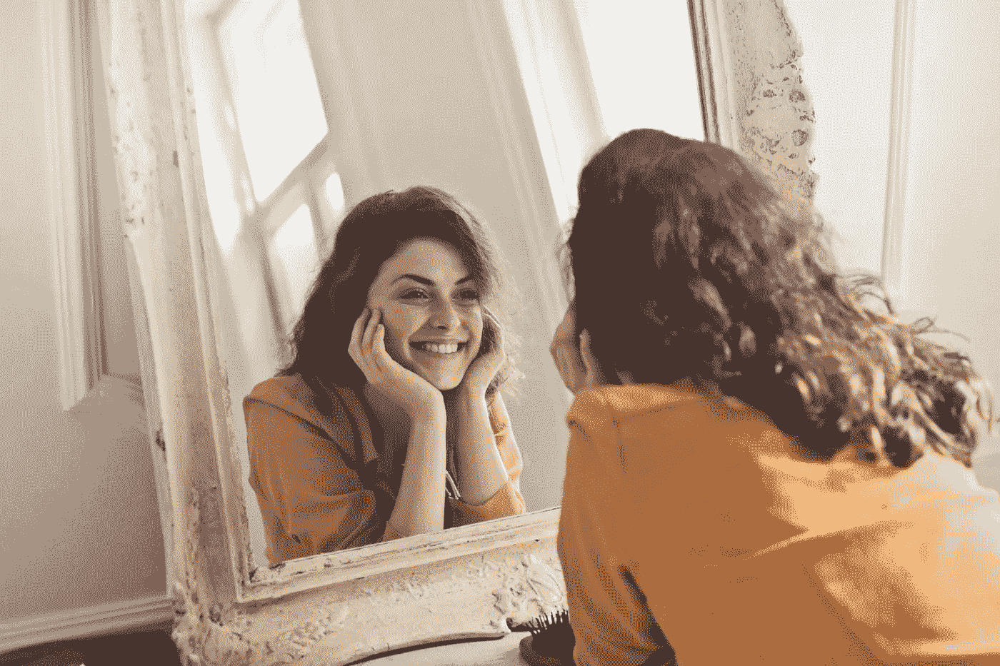

# 如何快乐并训练你的大脑不要停留在窃取它的事情上

> 原文：<https://medium.com/swlh/how-to-be-happy-and-train-your-brain-not-to-dwell-on-things-that-steal-it-62fdae4ba89c>

## “幸福不是你推迟到未来的东西；它是你为现在设计的东西。”—吉米·罗恩

当今社会令人担忧的是，我们越进步，就越空虚。我们的日程排得满满的，我们觉得…