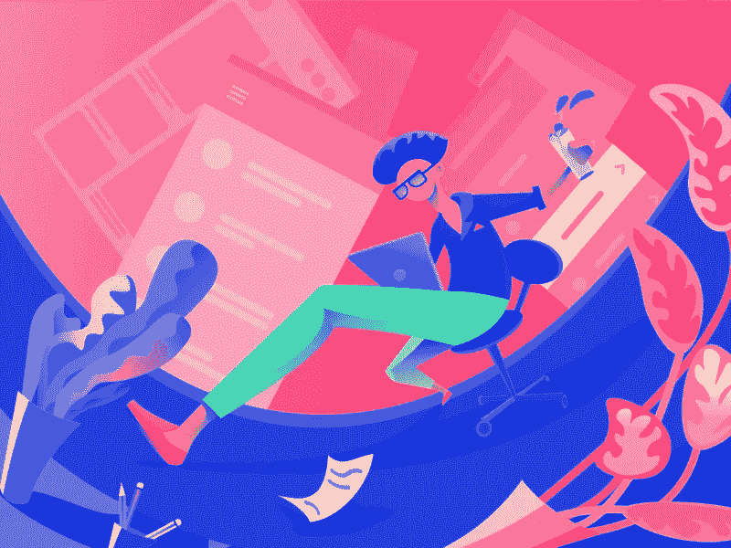

# 做自己的老板，避免倦怠，获得 Sh！t 完成

> 原文：<https://medium.com/swlh/how-to-be-your-own-boss-avoid-burnout-and-get-sh-t-done-c61c48de9fb3>

你是否有一份朝九晚五的工作，在这份工作之外，你正在做一个充满激情的项目，或者你一直在努力完成我的课程来提高技能？还是你想自己创业，做自己的老板？

credit: [Eran Mendel](https://dribbble.com/eranmendel)

当谈到这种志愿工作/项目时，在没有截止日期或外部权威/个人让你负责的情况下，很难集中精力并投入完成你为自己设定的里程碑所需的时间。以下是我从一名朝九晚五的专业设计师到一家需要每天都有责任心和生产力的数字机构的创始人的旅程中获得的一些见解。

# 单人军队

我辞去了一家数码公司的创意设计工作，以提高现有技能，学习新技能，建立自己的品牌。
我注意力集中，饥肠辘辘。我学习了先进的 Swift iOS 编码技术，以便能够“一人一军”地掌握我的 iOS 应用程序开发技能。这让我建立了自己的数字代理公司，并在两个月内以惊人的速度签署了我在 T2 的第一个项目。

credit: [tubik](https://dribbble.com/Tubik)

我学会了如何使用 React 编写自己的网站代码，建立了[代理网站](http://www.deske.io)。通过学习 SEO 和数字营销的课程，我学会了如何优化它。我甚至尝试了一些使用 python 的机器学习实验(因为 Swift 是基于 Python 的，所以我可以立即投入使用)。

我做了很多工作，建立了自己的剧目。

# 高原

当我进入自己当老板的第六个月时，我意识到我的注意力会从一件事转移到下一件事，就像一只兔子到处乱跳一样。我做了很多事情，但只完成了几件。我想创建一个教育 AR 应用程序，一个统一的 2D Metroidvania 游戏，一个约会应用程序，一个 youtube 教程系列等等。我有宏伟的计划，但我的重点是射击。

credit: [Meg](https://dribbble.com/megdraws)

此时，我退了一步，觉得有必要养精蓄锐。更新我转换视角来完成工作的能力。作为一名专业人士，无论你是为自己工作还是为别人工作，你都需要在自己的领域处于领先地位，以下是你可以用来保持敏锐的基本方法。
对你有效的免责声明对其他人可能不一定有效，即使是让你感到精力充沛、准备好出发的“一件事”也足够了。被困在众所周知的高原上，我做了以下事情来找回我的优势。

# 旅行

我一直想体验纽约，我把这作为一个机会，走出去，让自己置身于改变我对世界的看法的环境中。这座城市的景象、声音和气味，它的地铁、它的食物、它的人们像圣诞树一样点亮了我的嗅觉和其他感官。我开始沉浸在感官刺激中，而这些刺激是我坐在一个地方无法获得的。我每天都感受到灵感，并做了小笔记，以便以后可以回头再看。

credit: [ranganath krishnamani](https://dribbble.com/rkrishnamani)

我第一次在美国开车是在从新泽西到波士顿的高速公路上。这很不舒服，尤其是因为我一生都是右座驾驶，而突然我开的是左座驾驶，而且还是在高速公路上！虽然一开始很恐怖，但这是一次令人耳目一新的有趣的公路旅行，如果我没有走出我的舒适区，我是不会去的。

在很长一段时间里，我并不认为旅行对人类以不同的独特视角看待事物的能力有什么影响。再次旅行后，我意识到我通常会通过我能做什么和不能做什么的观念来限制自己。走出你的舒适区，进入让你害怕的环境是很重要的。你很可能会给自己惊喜。

# 为自我意识而写作

有时候，一个想法的种子会在你的脑海中生根发芽，你可以感受到它的潜力，这时，你往往会拿起咖啡、白板上的记号笔，开始描绘出这颗种子能够进化成什么样的复杂细节。
我们日复一日经常为工作相关的事情这样做。
把同样的方法运用到自己身上会有巨大的好处。让我们每个人都独一无二的是我们自己的想法集合，这些想法定义了我们是谁。我们喜欢什么，不喜欢什么，我们对自己和外界相对于我们的看法。

credit: [Neliko Kiria](https://dribbble.com/nelikokiria)

写作可以让活跃的思想，塑造你感知事物的方式，变得有形，让你有自我意识。同样，当我们相对于其他事物看待某事物时，我们对该事物的感知会发生变化，当我们有自我意识时，我们可以用新的眼光看待事物。

# 阅读寻找新的想法

最近的一项研究表明，首席执行官平均每年阅读 60 本书。世界上最优秀、最聪明的头脑是思想海绵，他们吸收世界上最好的非虚构作品，并将其中的智慧应用到自己的生活和事业中。虽然一开始我持怀疑态度，但现在我同意了。我倾向于每周读一本书(是的，我读得很慢)。在读完三本书后，我觉得尽管这些见解和想法可能与通过视频或音频格式呈现的相同，但当通过一本书传达时，它们往往会更加丰富和更高，因为这本书不需要简洁，也不会吸引普通数字消费者的注意力。

credit: [Farhan Fauzan](https://dribbble.com/Farhangeek)

一本书需要你的专注和关注，并奖励你一些想法，这些想法可以充实你可以从中汲取和思考的思想库。这是一种很好的方式，可以参考行业领导者和全方位专家的观察和经验，而不需要总是依赖第一手经验和启示。书籍让一个人能够利用我们当中最优秀的人所发现的东西。站在巨人的肩膀上，获得独一无二的优势。

# 睡眠是给强者的

credit: [Andrew Trofimenko](https://dribbble.com/andrewtrofimenko)

虽然你不需要有美国海军海豹突击队的养生法来赢得生活，但重要的是要区分意识和容器。你知道，当你躺在床上试图入睡时，你的大脑似乎变成了创造性想法的源泉，这是你的意识与你的身体不一致的时候。保持一致的睡眠时间可以让你保持灵感和健康。如果你很难入睡，试着在你打算快速入睡的前半小时不要使用手机或任何屏幕。阅读可以帮助你放松思想，让你更舒服地入睡。
你的身体需要那几个小时的睡眠，即使你满脑子都是“这就是斯巴达！”。

# 忍受下去

credit: [Cub Studio](https://dribbble.com/cubstudio)

身体需要正确的激素和这些激素的正确组合，以产生生产力并支持你的思想创造的想法。咖啡不会让你经历一切，你会崩溃，很严重。定期锻炼不仅会给你的身体注射内啡肽和血清素，还会帮助你保持创造性灵感。加入你已经关注了一段时间的健身房或者瑜伽班。相信我，一旦你起床，穿好衣服，出现，一切都是值得的。

# 吃小一点。经常吃。水合物吨。

你可能以前听说过这个，少吃多餐，所以在一天的第一餐和最后一餐之间，每 2-3 小时吃一次。这可以帮助你避免几个强大的专业人士陷入并倾向于依靠咖啡来克服的午餐后的懒散。经常少量进食会让你感觉轻松和警觉，并有助于保持一整天的注意力集中。我发现用简单的食物来填补早餐、午餐和晚餐之间的空隙是很棒的，比如燕麦肉桂亚麻籽餐或奶酪煎蛋卷或一片水果或一些不错的老式什锦。

credit: [Daryl Beaney](https://dribbble.com/dbeaney)

一定要坚持喝水，间隔一段时间，避免一口气喝很多，因为这会增加你眼睛里的液体压力，这里一杯，那里一杯，只要确保你每天至少可以补充八杯水。

我们更加数字化和即时满足的生活方式不利于加速疲劳的产生。令人惊讶的是，你可以做些什么来变得更健康、更有效率，这方面的基础并没有改变。我发现这些基本的东西仍然和以前一样好，可以补充新时代专业人士的思想、身体和灵魂。创作者的精神和身体状态需要随时准备好灵感的到来。

## 这篇文章发表在《初创企业》杂志上，这是 Medium 最大的创业刊物，拥有 358，974 名读者。

## 订阅接收[我们的头条新闻](http://growthsupply.com/the-startup-newsletter/)。

