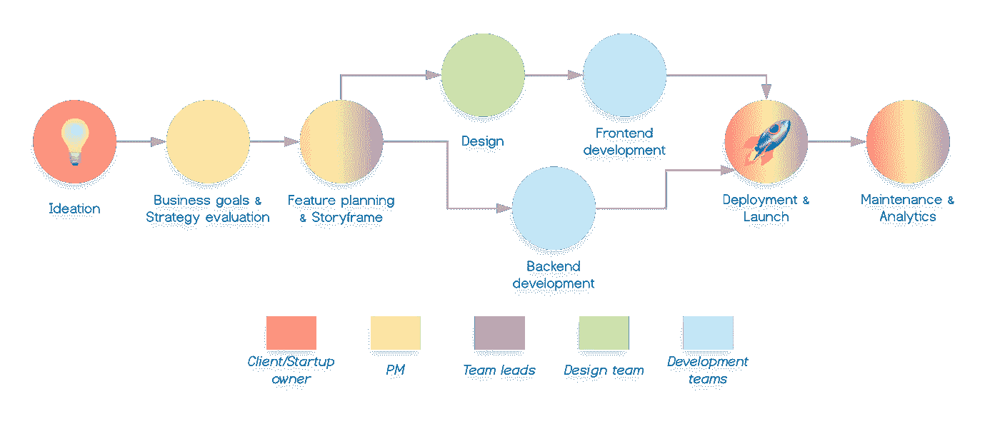
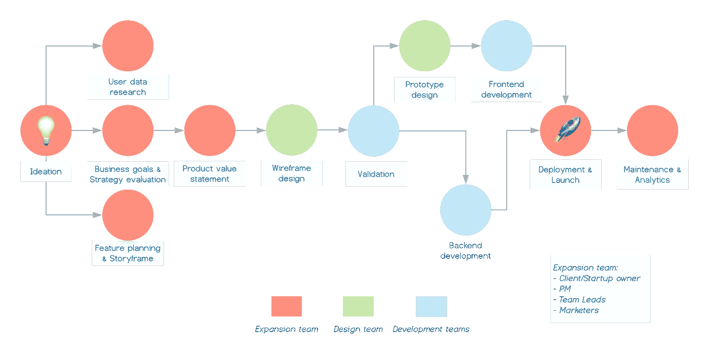

# 如何战胜对产品开发不感兴趣

> 原文：<https://medium.com/swlh/how-to-beat-product-development-disinterest-562137796aa1>

Photo by Julien-Pier Belanger on Unsplash

一般来说，我们将每一个新的数字项目都视为一个令人兴奋的提升机会，一次将我们带到新高度的旅程，或者是您的设计、开发或公司投资组合中的一枚漂亮的羽毛。

很酷，但也不总是这样。有些项目就是不合拍，没有激发我们去完善它们。这就是我们责怪客户、团队成员、疲劳、磁暴、太阳耀斑等等的原因。但是，如果我告诉你，项目失败的可能性很高，因为我们都做错了。我们有合适的人，合适的工具，合适的创业公司，但是我们从错误的角度进行产品开发吗？

> 问题的根源是团队对产品的成功不感兴趣，并且他们渴望摆脱任务，永远不再回来。

所以这里是[我们的](https://shakuro.com/)说说我们如何解决这个问题，以及到目前为止我们已经取得的成果。

# 为什么产品开发进展缓慢

十多年来，在网络和移动开发领域，我们已经失败了太多次，不能忽视这个问题。适可而止。承认问题是我们解决问题的第一步。很自然，当一个项目没有进展时，你首先想到的是*是错误的人*和*他们不属于团队*。这绝对有可能，但这不太可能成为你的团队失败的原因。

# 典型的死胡同工作流程

任何产品都可以而且应该被分割成更小的工作部分，并在最后阶段进行组装。一砖一瓦地盖房子是完全自然的，这同样适用于软件开发。然而，想象一下，如果没有一个共同的蓝图摆在桌面上，并且以后没有机会生活在其中，那该有多好。这就把这个过程变成了一系列机械的动作，与最终的结果无关。这使得设计人员和开发人员等待一个明确的任务出现，并分配给它命名，发送它，并接受下一个任务。

> 这就是为什么你每周的会议都是项目经理在说话来填补沉默，设计师感觉完全不合适，而开发者在与冷漠作斗争。

这不是因为他们不专业，而是他们所处的环境让他们别无选择。通常，以下合乎逻辑但效率低下的工作流是罪魁祸首:

如果你必须向你的祖母解释，如果一个团队需要一个借口退出他们并不真正感兴趣的舞台，这个流程是有意义的。这个过程确实允许甚至鼓励人们坚持他们的分支，建立一个栅栏，并在里面运行他们自己的过程。除了项目经理在周期开始和结束时的责任之外，没有继承的责任。

> 除此之外，就是“我不是我兄弟的守护者”的过程。不对。你是。

以下是这种流动可能给你带来的影响:

*   **浪费的时间**。如果公司和客户基于时间&物质基础工作，这是可能发生在他们身上的最糟糕的事情之一。一个自由漫游的设计师可能会创造出一个原型，但在预定的条款和技术环境下很难实现。这可能会导致高管们重新考虑最初的战略和预算，最终会影响整个流程。
*   **铅笔&编码员态度**。在尝试修复之前的问题时，PM 可能会尝试将团队置于某种范围内，这意味着设计师将对业务目标有一个肤浅的理解，并变成我们所说的“铅笔”，而开发人员将自动在代码中复制布局。这种分离可能导致无法组装一个具有复杂功能和用户体验的和谐产品。
*   **动机危机**。在尝试新事物、提高技能和展现职业潜力的同时，为项目的成功做出贡献是建立一个伟大的循证职业生涯的一种方式。没有跨越界限的机会，就没有对他们所在职位的个人依恋，这就把员工变成了他们梦想工作的永久申请人。
*   **产品的浪费潜力**。用户研究是构思和制定商业目标之前的一个重要部分，但是创业公司的老板有多少次会在项目中期回到 it 上来呢？在这种情况下，设计和开发团队成为数字产品的唯一用户。除了他们对产品的深刻了解之外，他们还有机会调整产品，但他们从来没有这样做过，因为他们没有被授予任何项目规划的权限。最终发生的是，在第一批发布后数据和分析开始出现后，我们最终会回到这种状态。

所有这些都使产品没有机会像他们本可以的那样获得成功。即使你的意图可能是正义的，你的团队可能是有才华的，如果你不抬头向上看，继续努力，星星永远不会为你而排列。

# 如何在不改变的情况下向上改变

重新发明流程，避免不感兴趣的陷阱和死胡同，只需要重新建立工作流程，从线性流程转移到集成流程。集成方法的主要思想是让每个人从项目开始一直参与到最后。

我们开始引入*‘扩展团队’*作为核心项目团队，在开发周期的整个过程中为其工作。典型的扩展团队由产品所有者、项目经理、设计和开发团队领导以及营销人员/分析师组成。我们不再在构思阶段就削减开发和设计。相反，我们鼓励他们为项目做出贡献，确定限制，并在产品仍处于评估阶段时提供见解。

尽管随着更多的人霸占毯子，这个过程看起来变得更加复杂，但在现实中，如果你深入了解它，就会发现它更有意义。

> *从表面上看，传送带式的工作流程更合理，但在无形输入方面效率太低。*

以下是扩展团队方法的工作原理:

*   **群体价值评估**。您从产品评估开始，目的是通过深入的用户研究找到功能和业务目标之间的平衡。此时的输出是*产品价值陈述*。
*   **线框设计**。不像线性过程，设计在某种程度上是独立的，我们鼓励我们的开发团队在早期阶段加入，并为线框做出贡献。为了尽早避免视觉设计争论，我们首先设计结构，并确保每个人都同意。
*   **验证**确保我们忠于最初的产品价值陈述。
*   **后端开发**从那里开始，因为它不需要太多的视觉设计技术参与，但同时，它作为一个潜在的锚将项目固定在适当的位置。
*   **原型设计**是线框所述要求的技术验证后的下一个阶段。原型设计产生大量的视觉资产，如图形、动画、交互、过渡状态等。**前端开发**遵循这一阶段，将产品“肉放在骨头上”。
*   **部署**在相当数量的测试和预发布验证之后开始。扩展团队再次带头确保最终产品满足开始时设定的期望、目标和策略。**发布**当然是一件大事，必须由整个团队和扩展团队监督执行。
*   **维护和分析**帮助我们找出哪些事情做得对或错，流程的哪些部分需要改变，哪些团队表现最好，以及公司在这个特定项目上的整体表现有多成功。

大多数设计和开发团队可以继承这种方法，并赋予所有团队成员在项目开发过程的每一步都为项目做出贡献的能力。这样，我们已经严重扰乱了线性生产不感兴趣的问题。通过鼓励团队成员更多地合作，同时让他们对自己的决定和建议的结果有一个公平的看法，我们已经设法为我们的客户提供更加一致和健康的体验。

也就是说，你不能指望你团队的每个成员都无私地为你的每个项目工作。他们只会耗尽精力。相反，你可以做的是创造一个愉快和值得信赖的环境，由负责任的人负责，并对你所做的任何事情的成功抱有共同的热情。

## 这篇文章发表在[《创业](https://medium.com/swlh)》上，这是 Medium 最大的创业刊物，有 310，032+人关注。

## 订阅接收[我们的头条新闻](http://growthsupply.com/the-startup-newsletter/)。

