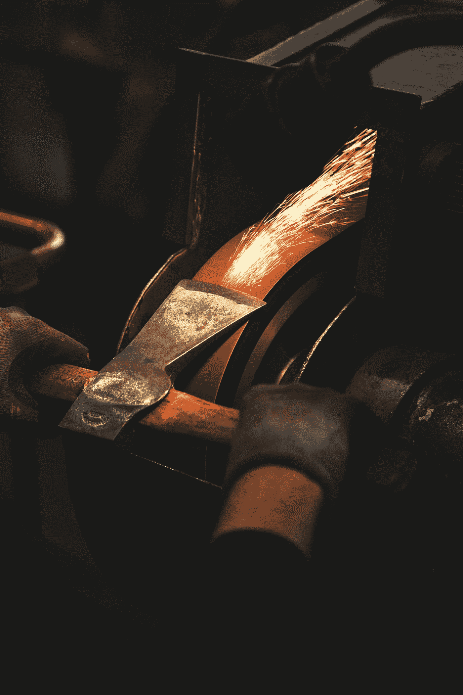

# 如何成为磨锯高手

> 原文：<https://medium.com/swlh/how-to-become-a-master-at-sharpening-the-saw-47a506068dd2>

## 三个简单的步骤

“person holding brown handheld tool” by [Malte Wingen](https://unsplash.com/@maltewingen?utm_source=medium&utm_medium=referral) on [Unsplash](https://unsplash.com?utm_source=medium&utm_medium=referral)

> "如果你只有五分钟砍倒一棵树，你会做什么？"
> 
> "我会在开始的两分钟半时间里磨我的锯子。"
> 
> —匿名

斯蒂芬·R·科维的习惯 7**高效人士的 7 个习惯*是“磨利锯子”*