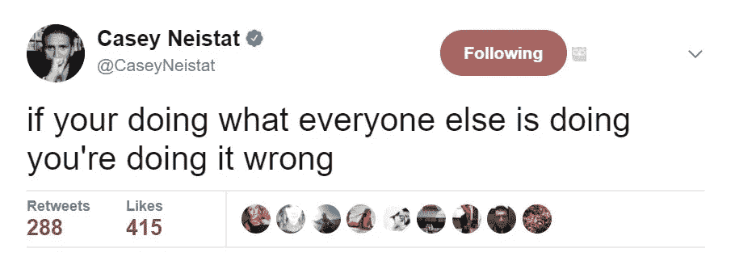
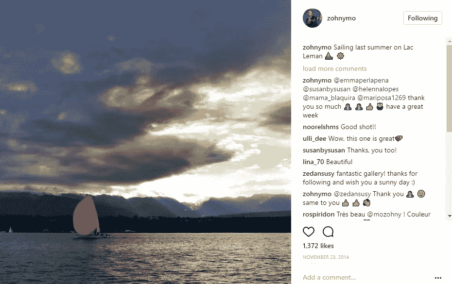
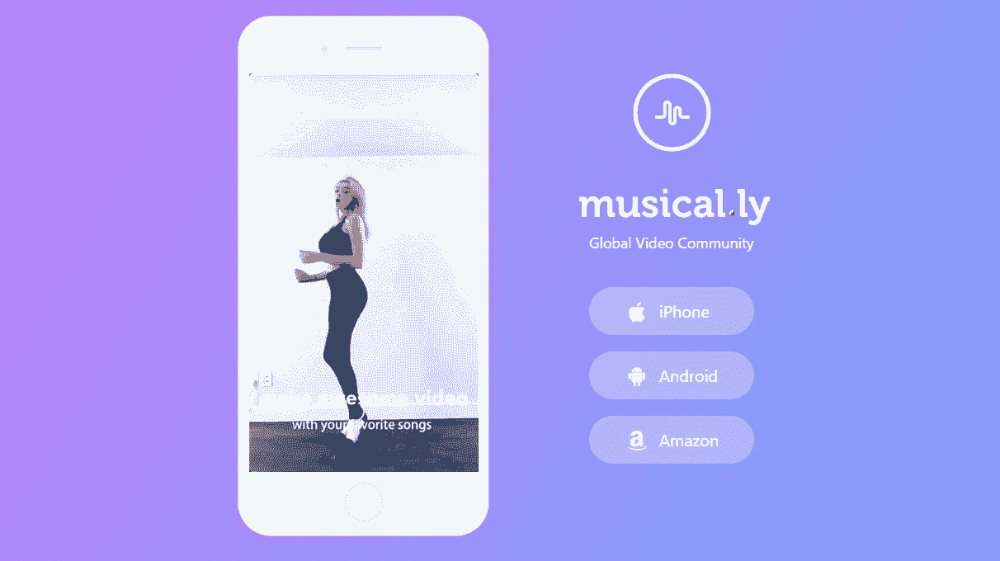
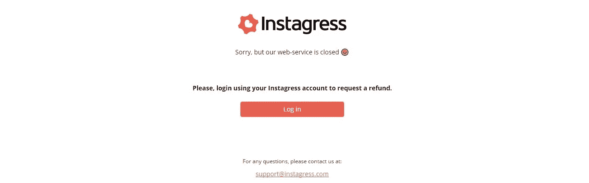
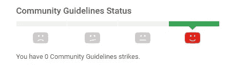

# 如何成为社交媒体影响者:终极指南

> 原文：<https://medium.com/swlh/how-to-become-a-social-media-influencer-the-ultimate-guide-4faddd294bee>

2015 年戛纳电影节期间，我第一次有机会看到杰罗姆·贾尔在工作。这是一个阳光明媚的日子，克鲁瓦塞特挤满了希望看到一线明星的粉丝。

杰罗姆的粉丝在戛纳马上就注意到了他。来自世界各地的数百名受到鼓舞的青少年聚集在他周围，有些人疯狂地流着泪。

杰罗姆·贾尔(Jerome Jarre)不一定是你希望在戛纳看到的那种名人，但他是一位白手起家的社交媒体影响者，其粉丝规模甚至连精英电影明星都会羡慕。

“他太有名了，以至于当他最近在巴西圣保罗组织一次集会时，防暴警察被召来平息成千上万的人群”——几年前纽约时间 [的一篇文章](https://www.nytimes.com/2015/01/29/style/jerome-jarre-the-making-of-a-vine-celebrity.html?_r=0)这样描述杰罗姆·贾尔。

杰罗姆最近展示了当社交媒体的力量被用于慈善事业时会发生什么。他和其他几位有影响力的人一起，在短短 19 个小时内为面临饥荒的索马里人筹集了超过 100 万美元[。](http://edition.cnn.com/2017/03/18/us/social-media-somalia/)

成为社交媒体的影响者是许多青少年梦寐以求的工作。报酬丰厚，满足了他们的旅游欲望，给了他们帮助他人的机会——甚至可能改变世界。

但成为社交媒体影响者的旅程并不容易，也不会一蹴而就。

大多数有影响力的人花了数年时间非常努力地工作，不断地学习，每天发布帖子，才达到今天的位置。

以下是我在与不同的社交媒体影响者合作时观察到的这一旅程的步骤总结。

**找到合适的位置**

现实检查:除非你是电影明星或公认的社交媒体影响者，否则没人会对你的自拍、昨晚吃了什么或周末跑了多少英里感兴趣。

但人们感兴趣的是他们自己，他们如何在生活中进步并实现他们的梦想。

如果你想成为一个有影响力的人，你需要为追随者提供他们真正关心的东西*——可以在某种程度上改善他们生活的东西*——并且所有这些都要以一种创造性和可及的方式来完成。**

**为什么？因为有数百万人以一种非常标准的方式发表关于他们并不真正了解的东西的普通帖子。**

****

**一个好的起点是研究其他有影响力的人已经在做什么，并列出他们分享的内容。**

**例如，在 Instagram 上，有一些影响者关注旅行、摄影、幽默、时尚、宠物和自助等。你能利用你目前的技能成为这些领域的影响者吗？是否有其他尚未开发领域可能令人感兴趣？**

**为了从现有内容中脱颖而出并脱颖而出，你需要并想学习哪些技能？影响者总是有他们自己独特的“东西”*——使他们与众不同的东西使他们的内容独特、真实和令人难忘。***

*****发布计划*****

***然而，光有好的内容和为自己开辟一个利基市场是不够的。事实上，有很多惊人的内容没有得到应有的关注。***

***无论你是否已经找到了自己的位置，或者还在寻找的过程中，你需要不断提高内容质量的一件事就是“继续发帖”***

***当凯西·奈斯塔特拥有 300 万粉丝时，他的主要建议是三个字:“继续上传。”***

***我不确定“只是”，但是“继续上传”是很好的建议。***

***定期在社交网络上发帖，经常与人交流，会让你充分利用你选择的社交平台。***

***它还会向您展示什么工作得好，什么工作得不好(或者根本不工作)。许多人羞于“发布和学习”，而是不停地编辑和重新编辑他们的内容，最终这些内容永远不会被上传。***

***你必须下水才能学会游泳。对你的发帖计划最好的建议是这样的:“不断发帖，不断学习，不断提高。”***

*****哪个社交网络？*****

***“试着去了解每一件事(每一个社交网络)和一件事(一个社交网络)的方方面面。”托马斯·赫胥黎***

***在 Instagram 这样的成熟社交网络上获得粉丝真的很难，insta gram 现在拥有超过 6 亿用户。如果你不是一个新的社交媒体网络的第一批用户之一，你出名的机会相当低。***

***一个新的成功的社交媒体网络就像一个浪潮，如果你及时抓住它，它可以带你成为网络明星。如果你错过了那一波，你很可能成为数百万用户网络海洋中的一滴水。***

****“商机(社交网络)就像公交车；总会有下一次的。”理查德·布兰森****

**在 Instagram 的早期，如果内容被 Instagram 的算法之神喜欢，它就会被发送到“天堂”或以前被称为 Instagram 的探索页面。**

**我早期的一篇帖子在 2014 年登上了 Instagram heaven，我大脑中的多巴胺水平给了我有史以来最好的社交媒体快感。**

****

**我的账户在几秒钟内就有了大量的关注者，在探索页面的帖子上有超过 1000 个赞。(我这篇帖子前后的平均点赞数是 300–400。)**

**如今，在 Instagram 上很难获得粉丝，探索页面也不再以旧的形式存在。**

**寻找那些有良好评价和稳定增长率的新网络。你在那里发展社区的机会要大得多。**

**在撰写本文时， [musical.ly](http://musical.ly/) 可能值得一看。它在一个非常年轻的极度活跃的群体中发展迅速。**

**Instagram 最初是一个专注于摄影的社交网络，后来发展成为世界上最大的社交网络之一。Musical.ly 最初专注于音乐视频，但可以迅速发展成为一个“全球视频社区”。**

****

# **如何获得追随者(黑还是不黑？)**

**获取追随者的方法有好的，坏的，丑的。我建议坚持好的方法，但这里列出了人们获得追随者的不同方式以及每种方式带来的风险/好处。**

## **丑陋的方法:快速但高风险**

****购买追随者**💰**

**购买追随者伴随着风险。当你购买追随者时，通常他们是机器人，而不是真人(尽管一些网站声称他们出售真正的追随者)。虽然获得假机器人追随者有其优势，但也有一些可能的陷阱。**

**好处很明显，叫“社会证明”。一种强大的心理现象，人们假设其他人的行为。拥有 20 万粉丝的人，即使他们大多是机器人，也比拥有 200 名粉丝的人有更高的机会获得更多粉丝。机器人在社交网站上创造了“社交证明”的效果。**

**但是社交网络也有他们自己的机器人，他们在那里追捕假账户。如果他们抓住了你的机器人(假追随者)，那么你就完蛋了，你会失去所有你购买的追随者，你的帐户可能会被暂停或列入黑名单。**

**此外，机器人对你的参与度有负面影响。他们成为幽灵的追随者。“幽灵关注者”是不关注你的内容的关注者。因此，它们会降低你的整体影响力和参与度，从而减缓你获得社交媒体影响力的速度。**

**然而，你可以在类似于 [one](https://www.blackhatworld.com/) 的论坛上阅读当前可用的黑客技术，并自担风险尝试较小的账户。**

## **坏方法:快速，但有道德问题和风险**

****自动化或把自己变成在线机器人**😜**

**有几个网站和应用程序可以让你的账户自动化，把你变成一个机器人，可以关注或不关注别人。**

**这种方法可以建立一个真正的追随者社区，但有一个道德问题，那就是欺骗其他人，让他们认为你的账户就是你，而实际上它只是一个机器人。**

**一个让你的 Instagram 账户自动化的流行网站(Instagress)最近被关闭了。**

****

**当然，除了 Instagress 还有其他选择，但用你的 Instagram 凭证登录第三方软件违反了 Instagram 的使用条款政策。**

****好方法:缓慢但回报丰厚****

**我推荐获得关注者的好方法。看到你周围的人靠自己的方式成名是缓慢的，有时会令人沮丧。但是，通过好的方式获得追随者是真实的、可持续的，并且最终会给你带来更高的投资回报。**

****社区管理专业****

**这似乎是显而易见的，但你当前的追随者群体是你成功的基础。你可以在网上找到许多关于社区管理[最佳实践的建议。](https://www.elegantthemes.com/blog/resources/community-management-tools-tips-best-practices)**

****

****赠品****

**赠品可以创造奇迹，促进社区的发展和参与。当凯西在他的 Instagram 上宣布他计划赠送一架 DJI 无人机时，他的帖子获得了 44 万条评论(他通常获得 1.5 万条评论)。**

****吊舱****

**Pods 是一群人，他们在社交网络上通过喜欢和评论彼此发布的帖子来相互支持。你一发帖就有很多赞和评论，这向网络算法发出了积极的信号，然后网络算法通过将你的帖子转发给更多人来奖励你。**

**这是一篇关于如何开始 Instagram pod 的很棒的[帖子](http://www.risingtidesociety.com/how-to-start-an-instagram-pod/)。**

****最终提示****

**如果你在这个过程中养成了坏习惯，成为社交媒体的影响者可能会令人沮丧。以下是一些让你一路保持动力的建议:**

*   **不要被社交网络上通知引发的紧迫感所欺骗。关掉它们。你不需要马上回复别人。**
*   **不要每隔几分钟就检查你的内容表现如何。每天花 15-30 分钟检查结果，分析数据，回应评论。**
*   **不要对结果感到沮丧，他们会告诉你如何改进。**
*   **不要放弃。如果你感觉没有动力，那就鞭策自己“继续发帖”。处理内容和发帖的活动会带回动力。**
*   **社交媒体上的评论可能是不公平的、严厉的、负面的、性别歧视的、种族主义的和侮辱性的。如果你发现公平的评论可以帮助你提高或开始积极的对话，那就太好了。否则，专注于你的计划，不要让不公平的评论阻碍你。**

**如果你跟随社交媒体影响力之旅，你至少会有一套非常需要的技能来帮助你推销自己或你对职业生涯的任何计划。这段旅程给了我在自己的职业生涯中成长的机会，也让我有更多机会接触不同社交网络上令人惊叹的在线社区。**

****

## **这篇文章发表在《创业公司》杂志上，这是 Medium 针对企业家和创业公司的领先出版物。**

# **你可以订阅[，在这里获取头条](http://growthsupply.com/the-startup-newsletter/)。**

****