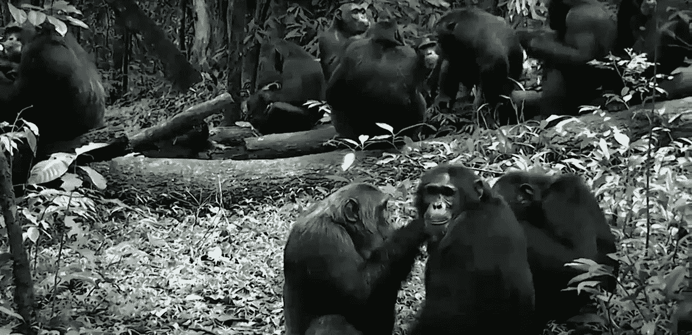

# 如何成为(黑猩猩部落中的)首领

> 原文：<https://medium.com/swlh/how-to-become-an-alpha-male-in-a-chimpanzee-tribe-c5aa36378d50>

我最近学会了如何成为黑猩猩部落的首领。我知道你在想什么，“这对我们的现代经济很有用。”

我同意，因为黑猩猩是我们现存的最近的亲戚，我们有 98.4%的 DNA 是相同的，所以通过研究它们的原始大脑，也许它可以让我们在剥去我们的工具和新大脑皮层后一瞥我们自己的潜在本质。