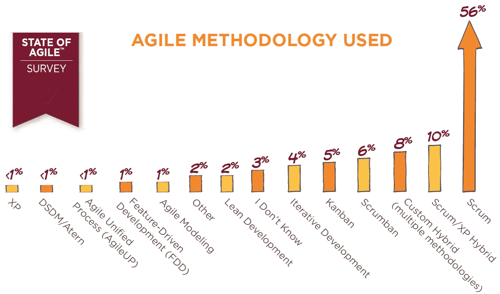
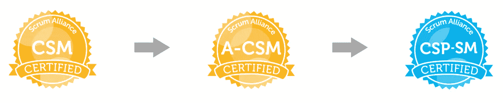
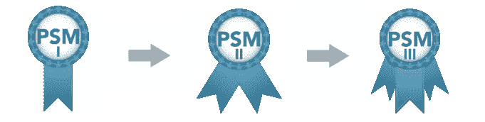
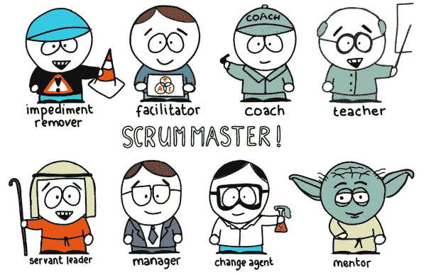
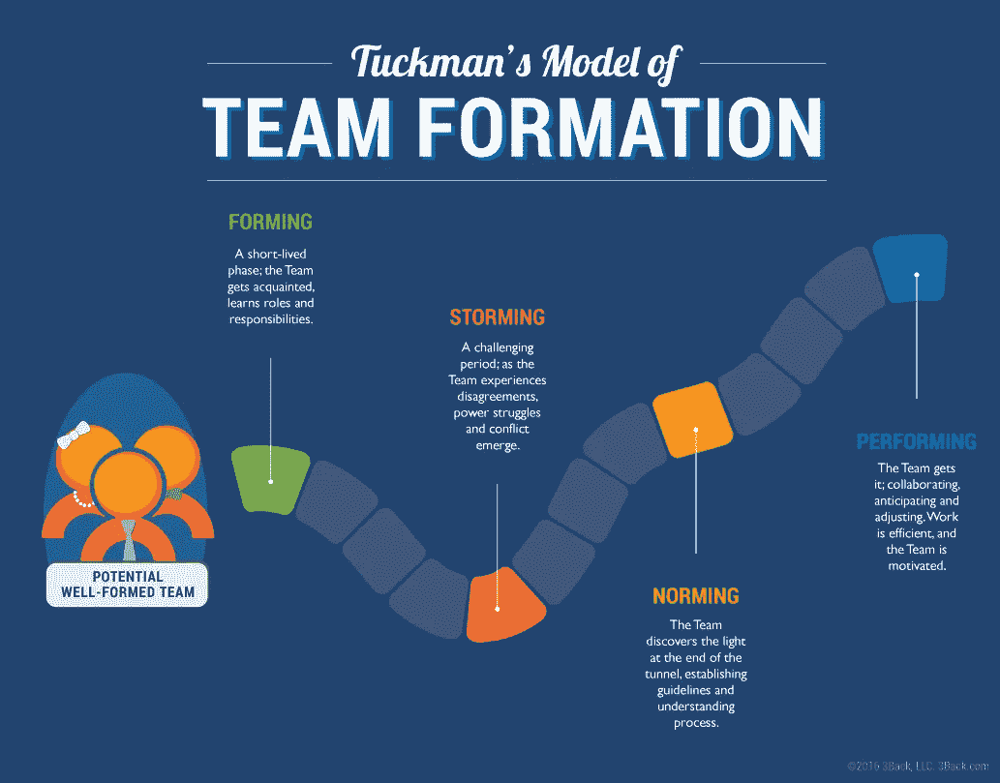
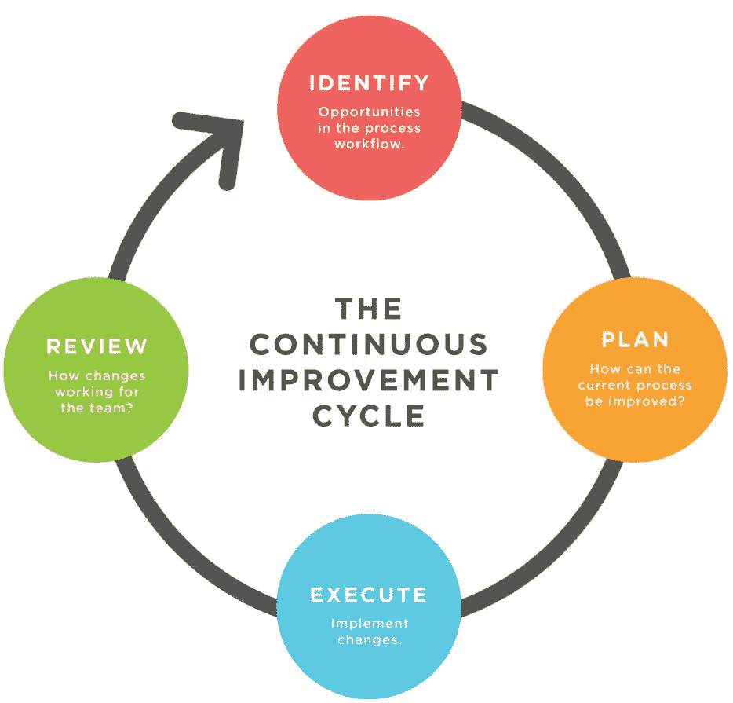

# 如何成为一名有效的 ScrumMaster(以及对你的第一个月有什么期望)

> 原文：<https://medium.com/swlh/how-to-become-an-effective-scrummaster-and-what-to-expect-your-first-month-d3c36a1c47b>

Photo from [Pexels](https://www.pexels.com/photo/adult-beard-board-boy-450278/)

有一个常见的类比，指的是一个人在没有任何经验的情况下，率先进入一个项目或角色。他们被认为是从悬崖上跳下来并在下落的过程中造了一架飞机的人。对我来说，我有机会在 Putnam Investments 的新职位上亲身体验这一点。尽管我以前从未做过 ScrumMaster，但对敏捷/Scrum 有足够的了解，并且在过去领导过几个团队，这为我平稳地过渡到我的角色提供了足够坚实的基础。

如果你正在读这篇文章，最近可能发生了两种情况中的一种。

**一:**你的公司已经加入了从瀑布方法转向敏捷方法的新公司浪潮。随着世界变化如此之快，越来越多的快速增长行业的公司已经转向敏捷，以保持竞争力并跟上不断加快的变化速度。切换到敏捷有助于团队以更低的成本更快地开发软件，同时允许团队保持灵活性，并对内部和外部的变化做出响应。

Among all of the different Agile methodologies, Scrum is by far the most popular. (source: State of Agile)

**第二:**你已经作为一名 ScrumMaster 进入了你的第一个角色。如果你在第二条船上，恭喜你！成为 ScrumMaster 是一种有益的体验，让你承担更多的责任和角色。它在几个不同的领域挑战你，帮助你成长为组织中的员工和领导者。如果你对这家公司完全陌生，除了通过办公室政治来了解不同工作组和个人之间的潜在动态之外，你还必须了解公司本身。最难的部分？将你学到的敏捷和 Scrum 付诸实践。

# 了解 Scrum

ScrumMasters 可以来自各种背景。关于 ScrumMasters 是否应该来自技术背景，他们是否应该有与他们将要加入的团队或正在开发的产品一起工作的经验，或者他们是否已经获得认证，有一个正在进行的讨论。不管他们的资历和背景如何，成为一名有效的 ScrumMaster 都要从了解敏捷和 Scrum 的来龙去脉开始。

尽管 ScrumMaster 的职责可能因公司而异，甚至在同一家公司的不同团队之间也是如此，但成为一名有效的 ScrumMaster 的步骤包括掌握关键人物、流程、工件，以及理解和采用[敏捷思维](https://www.agileconnection.com/article/what-does-it-mean-have-agile-mindset)。

对我来说，学习敏捷很容易，因为我有幸在大学里上过一门课。这是我的学校第一次开设敏捷开发课程，我选择了这门课，因为我知道我毕业后将要全职工作的公司遵循敏捷/Scrum 方法。

如果你没有足够的运气去上课，网上有很多资源可以帮助你学习和理解 Scrum。

官方 Scrum 指南，由 Scrum 的共同创始人 Jeff Sutherland 和 Ken Schwaber 撰写:

 [## 主页| Scrum 指南

### 官方的 Scrum 指南，由共同创始人杰夫·萨瑟兰和肯·施瓦伯编写和维护…

scrumguides.org](http://scrumguides.org/) 

这是另一个来自 Scrum 培训系列的免费资源，包括按顺序排列的信息视频，涵盖了从 Scrum 的高级概述到与 Scrum 相关的会议的所有内容。

 [## Scrum 培训系列:来自西雅图的免费 Scrum 大师培训

### 西雅图的在线教程教授 Scrum 框架。

scrumtrainingseries.com](http://scrumtrainingseries.com/) 

对于准备 ScrumMaster 认证的人来说，这是一个很好的网站。它提供了免费的培训计划和各种评估，您可以在参加实际的认证考试之前评估自己的进步。

 [## 免费 Scrum 大师培训

### 最好的免费 Scrum 资源集中在一个地方，帮助考生在考试当天取得成功…

freescrumtraining.org](http://freescrumtraining.org/) 

最后，如果你想获得更多真实世界的经验，世界上有很多 Meetup 小组，成员们希望就如何使用 Scrum 过程来管理和控制开发工作进行讨论和交流。

 [## scrum Meetup—Meetup

### 来见见其他 Scrum 用户吧。收集并讨论如何使用 Scrum 过程来管理和控制开发工作。

www.meetup.com](https://www.meetup.com/topics/scrum/) 

# 获得认证

当你申请 ScrumMaster 职位时，有两个主要的认证可以让你对 Scrum 流程有更深的理解，或者充实你的简历。获得认证有助于证明你的能力，并向雇主展示你对 Scrum 和敏捷有足够的了解。

第一个认证是由 Scrum 联盟提供的。您可以通过他们的组织获得三种主要级别的认证。为了获得认证 ScrumMaster (CSM)的认证，你必须参加为期两天的课程，费用在 800 美元到 1600 美元之间。之后，你要参加一场考试，在 35 道题中，你必须答对 24 道才能通过。要获得高级认证 ScrumMaster (A-CSM)认证，您必须首先获得 CSM 认证，通过全球数十位 CSP 教育者之一的验证，并且在过去五年中至少有一年的 ScrumMaster 工作经验。第三个阶段是认证 Scrum 职业(CSP-SM)，需要完成前两个阶段和一个强化混合课程，以及过去五年中两年的 ScrumMaster 工作经验。

Three levels of certifications through Scrum Alliance ([scrumalliance.org](http://scrumalliance.org))

第二个认证由 Scrum.org 提供。Scrum 不提供 CSM，而是提供专业 Scrum Master (PSM)认证。认证有三个级别，越来越难。然而，Scrum 认证并不要求考生参加课程，但通常比 Scrum Alliance 认证更严格，并且有更高的及格分数要求(85%比 68%)。截至 2018 年 5 月，从一级到二级到三级的每项考试费用分别为 150 美元、250 美元和 500 美元。

The three levels of certifications from Scrum.org ([scrum.org](http://scrum.org))

# 应用敏捷

无论你是兼职的还是全职的 ScrumMaster，你都会意识到你没有承担老板的角色。相反，你成为了一个仆人式的领导者，一个帮助产品所有者、团队成员和利益相关者完成他们的目标的人。你也将成为团队中其他人的教练和导师。此外，您还将帮助团队成员消除障碍，并帮助组织转变思维方式。

The many different hats a ScrumMaster wears, illustrated in the form of South Park (photo credits to [CRM Audio](https://crm.audio/scrum-dynamics-4-the-role-of-the-scrum-master-in-dynamics-365-projects/))

当你加入一个新团队时，你可能会遇到一个上升期，此时团队成员会更加宽容，并意识到你仍然需要学习团队的潜在动力以及任何现有的传统。不要指望事情会一帆风顺。不要指望人们会直接接受你，尤其是如果你对正在工作的团队或者正在使用的产品和技术一无所知。不要期望加入一个能立即产生不可思议的结果的团队。如果你对自己作为 ScrumMaster 的角色有不切实际的期望，你可能会被你的团队负面地看待，结果，你将不得不克服一些最初的怨恨和尴尬。

作为一个新的 ScrumMaster，我主持的前几次会议真的很尴尬。在课堂环境中学习敏捷和 Scrum 与在实际环境中应用敏捷和 Scrum 有很大的不同。一开始，我不知道该说什么，如何开始或结束会议，甚至不知道如何提示他人发表意见。一切都很混乱，因为除了学习公司文化和团队动态，我还必须领导和指导一个由我从未共事过的人组成的团队。随着时间的推移，我学会了适应和调整团队的结构。我很幸运，我的团队变得独立，经验丰富，我的职责最终集中在消除障碍、组织和领导会议上。

The end goal of a Scrum team is to reach Tuckman’s performing stage, where the team executes a defined process consistently and performs at a high level. (image credits to [3Back](https://blog.3back.com/well-formed-teams/what-football-teaches-us-about-scrum-teams/))

此外，ScrumMasters 不应该将敏捷视为一个团队必须严格遵守的一套定义好的标准和规则，而应该学会适应他们所面临的任何情况。敏捷宣言的主要价值观之一是鼓励团队响应变化，而不是遵循计划。这种灵活性应该扩展到 ScrumMasters 支持他们团队的方式。尽管 ScrumMaster 角色的责任和义务在产品负责人和高层管理人员对可交付成果的期望范围内可能看起来很严格，但 ScrumMaster 有能力决定如何解决团队内部的冲突，应该鼓励或阻止什么类型的行为，甚至在向团队成员提供反馈时，scrum master 应该关注多少参与或关注什么级别的粒度。

# 持续改进和后续措施

敏捷的基本思想是团队总是在成长，不断学习和提高。这种持续改进的概念在敏捷跟踪的一些核心指标中很明显，比如燃尽图和速度图。这也可以在 Scrum 的关键仪式之一 sprint 回顾中看到，团队成员坦率地谈论他们的组织问题和团队合作，以及他们如何才能改进前进。

Continuous improvements involves understanding and identifying flaws in the current process to implement changes that can improve existing workflows. (diagram credits to [LeanKit](https://leankit.com/learn/kanban/continuous-improvement/))

对于一个 ScrumMaster 来说，这种心态也应该适用。一旦团队开始对他们的模式和惯例感到安全和自信，ScrumMaster 的角色就是确保团队成员不会自满。总是有更多的东西需要学习，有更有效的方法来完成任务，还有更多需要改进的地方。

如果你的公司刚刚接触 Scrum，而你已经被聘为 ScrumMaster，这是一个很好的机会，你可以帮助领导向一种新的思维方式的转变。通过提前培训和学习 Scrum，你有能力塑造其他人如何看待转变，并影响他们对完全陌生的事物的看法。

谢谢你花时间来看我的文章！

如果你喜欢这篇文章，放下一些掌声，把这篇文章推荐给你的朋友。让我知道你对 Scrum 的想法，以及你在过渡到敏捷和 Scrum 的过程中是否有过类似的经历。欢迎在 Instagram 上关注我，或者在 T2 的 LinkedIn 上联系我。

***德瑞克*** [*http://www.derekmei.com*](http://www.derekmei.com)

## 这个故事发表在 [The Startup](https://medium.com/swlh) 上，这是 Medium 最大的企业家出版物，拥有 322，555+人。

## 在这里订阅接收[我们的头条新闻](http://growthsupply.com/the-startup-newsletter/)。

