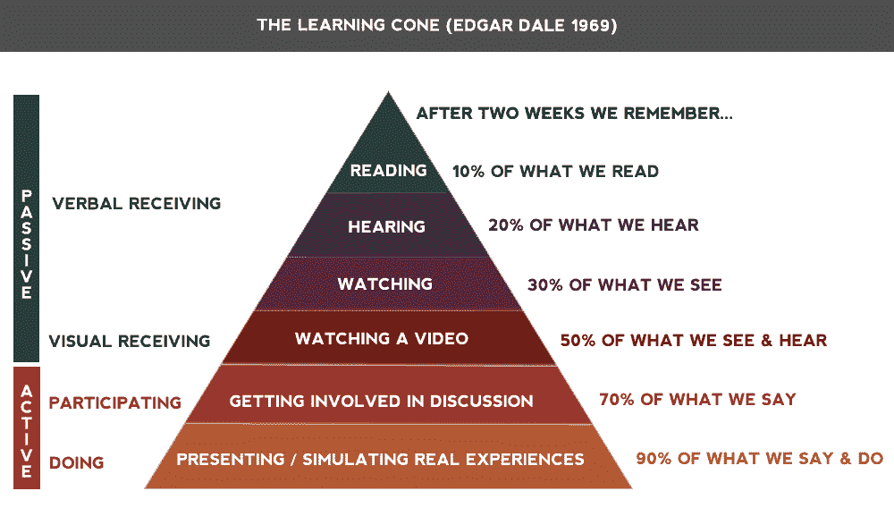

# 如何成为企业家:给新手的 9 堂课

> 原文：<https://medium.com/swlh/how-to-become-an-entrepreneur-9-lessons-for-noobs-31e8daa3a504>

Actual photo of me starting my first business. (via [Know Your Meme](http://knowyourmeme.com/memes/i-have-no-idea-what-im-doing))

2016 年 6 月 14 日，我和我的商业伙伴创立了[Immersion Arcade](http://immersionarcade.com/)——美国第一家 [HTC Vive](https://www.vive.com/us/) 虚拟现实街机。我们开业了 4 个月，在转型之前获得了 17，000 多美元的收入。由于这是我第一次涉足创业领域，我通过反复试验学到了很多东西。

**在这篇文章中，我想分享事后看来最有价值的教训。这篇文章是为那些想成为企业家，但几乎没有经验的人写的——换句话说，是为两年前的我写的。**

Sweet photo of our VR arcade in action.

# 第一课:普通人创业

当我第一次致力于街机的时候，我根本不认为自己是一个企业家*。我毫不怀疑我的商业伙伴布莱恩·杰西是一名企业家；他是一个天才的程序员，五年前他离开了 Wolfram 的舒适工作去追求创业。另一方面，我是一名美术教授，从来没有上过商业课！*

*每次我告诉布莱恩，我觉得自己像个骗子，不知道自己在做什么，他都会回应道，“普通人都会创业。”*

*他提醒我，每个企业都是由曾经不是企业主的人创办的。企业主并非生来就知道如何做生意，就像钢琴家并非生来就知道如何弹钢琴。他们是决定迈出这一步的普通人，从那以后他们就一直在思考这个问题。*

*有了这句话和艾米·卡迪的 TED 演讲，我决定假装自己是一名企业家。有一天，我成了一名企业主。*

# *第二课:任何人都可以成为专家*

*我早期依赖的另一个短语受到了凯文·凯利在“蒂姆·费里斯秀”上说的话的启发:*

> *“我想强调的一点是，目前，基本上没有 VR 专家。完全开放。真的，我们——总的来说，人类——不知道虚拟现实是如何工作的……所以这意味着一个在外面听这个的人可以很容易地成为虚拟现实专家……有太多的东西需要发明，而且……一个决定每天或周末每天都要工作的人可以取得巨大的进步。”
> *凯文·凯利，《连线》杂志创始人。(* [*)点击这里听完整剪辑。*T8*)*](https://podverse.fm/clips/HJJPbhR2z)*

*尽管 Kelly 的这个建议是针对虚拟现实和人工智能领域的，但我相信它适用于所有领域。任何人都可以成为专家，如果他们决定一个利基市场，定期探索它，并分享他们学到的东西。*

*凯利以[在太空频道和加拿大 MTV](https://medium.com/u/bbc924ecc521#t=1m52s)上做了专题报道。(那也是我们第一次来加拿大！)*

*   *在脸书对我们公司的评论中，一个朋友提到我们计划举办锦标赛。我的回应是挑战 [CTRL V](https://www.ctrlv.ca/) 和 [VR 迷](https://vrjunkies.com/)。这开启了我们公司之间的友谊。几个月后，我们举办并直播了有史以来第一次[国际 VR 街机锦标赛](https://www.twitch.tv/vrleague/videos/all)。*

*正如 Derek Sivers 在他的文章《[如何致富](https://sivers.org/d1r)中所说:*

> *“认识一下大家。追求每一个机会。没有什么是太小的。全部做。就像彩票一样，你永远不知道哪个会中奖。所以越多越好。后续和大家保持联系。”*

# *第五课:永远不要停止学习*

*创业是一项高风险的工作，但并非所有的风险都是不可避免的。可以避免一些风险。**要区分不可避免的风险和可避免的风险，你必须了解哪些对别人有用，哪些没用。**这意味着，如果你是创业世界的新手，你还有很多事情要做！*

*在我加入街机游戏后，我经常听创业播客、有声读物和 YouTube 视频。我建议新手经常用教育媒体包围自己，因为，如果你是五个与你联系最密切的人中的普通人，你也可以尽可能多地用数字方式让自己被成功的企业家包围。*

*我个人喜欢音频媒体，因为我可以在进行日常生活的世俗活动时被动地学习。关于这个的一个故事:当我第一次加入我的共同工作空间时，一个同事推荐我读彼得·泰尔的《[零比一](https://www.amazon.com/Zero-One-Notes-Startups-Future/dp/0804139296)我买了这本有声读物，在接下来的几个星期里听了两遍，每当我走路、开车、打扫卫生、做准备等的时候都会放上它。后来，我发现我的同事有这本书的纸质版，甚至还没有读完…所以最终我和他分享了他还没有读到的课程！*

*我从一些播客中学到了很多:*

*   *[蒂姆·费里斯秀](https://tim.blog/podcast/)*
*   *[本周创业](http://thisweekinstartups.com/) ( [经验锥](https://medium.com/u/ca9aa8cba00a#Cone_of_Experience)，我们记得我们听到的 20%和我们做的 90%。我的公司就像一个沙箱，在这里我可以“积极地做”我所学的东西。

    Edgar Dale’s Cone of Experience (from [KZOInnovations.com](https://kzoinnovations.com/whats-dales-cone-and-why-should-you-care/))

    第二，我变得对我的同事更有价值，因为我可以和他们分享我学到的东西。分享你学到的东西是一种互利的安排:另一个人得到免费的指导，你加强了对建议的理解，这有助于在你们之间建立友好的关系，扩大你们的关系网。

    # 第六课:要么精疲力尽，要么破产

    **在投资创业之前，** **了解一下** [**精益创业方法论**](https://en.wikipedia.org/wiki/Lean_startup) 。看 [YouTube 视频](https://www.youtube.com/watch?v=fEvKo90qBns)，读 [Eric Ries](https://medium.com/u/d2f31bf094c6?source=post_page-----31e8daa3a504--------------------------------) [书](https://www.amazon.com/Lean-Startup-Entrepreneurs-Continuous-Innovation/dp/0307887898)，读[文章](https://hbr.org/2013/05/why-the-lean-start-up-changes-everything)，听[播客](https://soundcloud.com/lean-startup)，以及[与他人谈论](https://www.reddit.com/r/Entrepreneur/)。这可能是一个复杂的主题，但你越是运用它，你的创业就越有可能成功。

    核心思想是这样的:不要花 10 万美元打造一个产品，然后发布它，希望人们会购买它。相反，花 1000 美元，或者 100 美元，或者 10 美元来构建一个“最低可行产品”(MVP)，这个产品的*刚好够*上市。然后发布你的 MVP，收集市场反馈，并利用这些反馈找出如何最好地投资你的产品向前发展。

    换句话说，不要先生产某样东西，然后再看人们是否会购买。看看人们会买什么，然后生产！

    也许人们会如你所愿使用你的 MVP，但也许不会。也许你认为会流行的一个特性从来没有被使用过。也许使用它的人群和你想象的完全不同。这就是为什么你建造 MVP 又快又便宜；你需要真实的市场反馈，这样你才知道你没有浪费时间和金钱去制造没人想要的东西。

    ## 实践中的精益创业——虚拟现实街机风格

    所以，让我们说，你开始一个虚拟现实游戏，并希望完全无视精益创业的方法。你可以签下一份 5 年的租约，在市中心租下一个巨大的空间，用 16 台 HTC Vives 运行在最好的电脑上，运行最好的商业授权游戏。见鬼，为什么不顺便扔几个[子面板](http://subpac.com/)和[虚拟全景](http://www.virtuix.com/)呢！

    如果你的街机成功了… *耶！！万岁！！我真为你高兴！！！*

    但是如果失败了，你现在就欠了 20 万美元。

    现在，假设您想要使用精益方法。你可以买一台配有像样电脑的 HTC Vive，免费注册 [Steam 网站许可计划](https://support.steampowered.com/kb_article.php?ref=3303-QWRC-3436)，并安装一个商业许可的[实验室](http://store.steampowered.com/app/450390/The_Lab/)，这也是免费的。你可以为朋友和家人练习运行虚拟现实演示，然后一旦你掌握了它，为当地企业和公共图书馆做免费的虚拟现实演示。带上名片和宣传材料分发出去，并有一个[电子邮件列表](https://mailchimp.com/)人们可以注册。最终，肯定会有人想邀请你参加他们自己的私人活动。让他们，并向他们收取高额费用。

    现在你有了市场需求的确凿证据，潜在未来客户的名单，与当地企业和图书馆的关系网，你的投资正在获得回报… **所有这些都只需要*也许*3000 美元。**

    下表说明了这种假设情景的更现实的成本，包括更合理的 3 年租赁和保险:

    

    Cost to start an HTC Vive arcade, lean vs. not lean.

    *注:我之所以只提到 HTC Vive 而没有提到*[*Oculus Rift*](https://www.oculus.com/)*是因为 Oculus 不允许将 Rift 用于商业用途，根据其服务条款* *的* [*第 3.1 和 4.1 节。*](https://www.oculus.com/legal/terms-of-service/)

    # 第七课:公平地切馅饼

    假设你和三个朋友正在创办一家公司。 ***牛逼！*** 现在，如何决定每个人获得多少股权？你如何“切馅饼”？

    起初你可能会想，“好吧，我们四个人平分公司吧。”这听起来很公平…直到你快进几个月或几年，一个创始人投入了 75%的日常工作，而其他人几乎什么都不做。当时看似公平的东西，现在已经不再适用了。

    当布莱恩和我开始做生意时，我们五五分成。这对我们来说效果很好…但是几个月后，我们的业务增长了很多，所以我们想让更多的人加入我们的团队。但是现在…我们该怎么处理股权？我们辛辛苦苦白手起家建立起这个企业…那么我们应该给新来者多少“馅饼”呢？

    当我向我们的顾问道恩·温克尔(Doan Winkel)提出这个问题时，他推荐我读一读 T4 的迈克·莫耶(Mike Moyer)的《切馅饼:在没有资金的情况下资助你的公司》这本书提供了一个通用的股权模型来解决这个问题。

    “切馅饼”模式足够复杂，足以保证购买这本书，但基本思想是**股权应该根据每个人投资的时间和金钱的数量来奖励。它对股票采用动态方法，这意味着它会根据每个人的投资实时变化。换句话说，相对于其他人的投资，你对公司投入越多，你从中获得的权益就越多。**

    要了解更多信息，[请查看 Mike Moyer 总结模型的视频](https://www.youtube.com/watch?v=sqUHmlFPpkY)。

    **如果我们从第一天开始就使用“分割派”股权模型，我们就会准确地知道*每个新人应该得到多少股权。***

    我建议所有的创业公司尽早将迈克·莫耶的模式融入公司。即使你是一个个体企业家，但有一天你可能会把其他人带到你的公司，这是一个遥远的 T21，从今天开始使用这种模式可能是一个好主意。

    # 第八课:与他人分享你的想法

    有时候，有抱负的企业家会对他们的创业想法保密。他们认为他们的想法会让他们成为百万富翁，所以他们不希望他们的想法和他们的百万富翁一起被偷走！

    在我的工作空间里流传的一个常见短语表达了相反的意思:
    **如果你的想法失败了，那是因为你没有与足够多的人分享它。**

    ## 不要害怕分享

    你不应该害怕分享你的想法，因为想法是最简单的部分。难的是将“一个好主意”变成“一家销售功能性产品的合法公司”需要大量的时间、承诺、技能和痛苦。

    正如德里克·西弗斯所说:

    > “想法不会让你变得富有。伟大的想法执行的确如此。”

    仅仅因为你和别人分享一个想法，并不意味着他们会执行它；因为一个想法的伟大执行需要你的生活和优先事项的彻底重组，所以另一个人为了执行你的想法而放弃他们生活中的其他事情是不太可能的。

    ## 分享帮助你衡量兴趣

    分享你的想法是获得早期市场反馈的好方法，因为你可以看到其他人的反应。

    我不记得出处了，但是 [Derek Sivers](https://sivers.org/) 曾经说过，你不想投资那些让人说“哦，听起来很酷”的想法你想要的反应是，“哦，我的上帝，我需要它！那会让我的生活轻松很多！”这种反应暗示你的产品可以为用户提供实际价值。

    一个很好的经验法则:**“酷”的想法会失败。“有价值”的想法会成功。**

    关于这一点的警告:这些反应可以在创业的早期概念阶段帮助你，但是当你真正开发产品的时候，**你必须** **相信人们的钱包，而不是他们的话**。仅仅因为人们表达出兴趣并说他们会购买你的产品，并不意味着他们真的会购买。回到第 6 课，这就是为什么你要建立一个 MVP——因为你需要尽快得到实际的市场反馈！

    # 第九课:找一个会计师和律师

    这最后一条建议不是来自我，而是来自我在开始[沉浸式街机](http://immersionarcade.com/)之前遇到的一位律师。他说:“如果你正在开始自己的生意，你真的想把它做好，你需要尽快聘请一名会计师和一名律师。我知道它们很贵，但从长远来看，你越早把它们带进来，对你越有利。”

    我给/r/Entrepreneur 发了一个帖子，征求对这个建议的反馈。我鼓励你自己阅读这些回复，但普遍的共识似乎是越早雇佣一名会计师越好，而律师可能直到后来才需要(取决于业务)。

    我也把这个贴在了我的脸书个人主页上。以下是一些回答:

    *   Doan Winkel :“在这之前，做大量的客户发现和原型制作。确保你知道你正在解决的问题，你在为谁解决问题，以及他们愿意为什么解决方案买单。然后想想会计师和律师。一开始自己做财务书籍来学习。让律师建立企业实体，到了那里再处理就业问题。”
    *   [获奖的](https://www.linkedin.com/in/vapinto/) [JV 工作室](http://www.thejvstudio.com/)的联合创始人文斯·平托:“如果你负担得起，并且你觉得你没有很好地跟上你的账目——是的，拥有一个 [CPA](https://en.wikipedia.org/wiki/Certified_Public_Accountant) 是非常有价值的。你可以使用像 Quickbooks 这样的网站来管理你的簿记工作，并先学习如何自己做。就律师而言，我认为手头有一个总是好的…但是日常使用没有必要。只要确保你有保险，不要偷工减料。”
    *   [特洛伊洪水与火灾](https://www.linkedin.com/in/patrick-moore-b07aa666/)[的帕特里克·摩尔](http://trojanplumbingcompany.com/trojan-food-fire/):“我同意这个…如果你想熬过第一年。”

    其他回复:

    *   “作为一名会计师，我可以说，根据业务情况，立即聘请律师和会计师可能是一个好主意。有些企业真的不需要，但让专业人士和你一起处理事情会很有帮助。”
    *   “劳动法非常重要，所以有一个法律顾问不会有坏处。我不是企业家，但我了解人力资源行业。”
    *   “‘需要’……也许不是。但绝对不疼。”
    *   “我从来不需要，并且拥有一些非常成功的企业…这完全取决于你企业的性质和规模…”* 

**如果你喜欢这篇文章，考虑给它一些掌声，关注我的媒体账户；而且既然我创作的内容超越了 Medium.com，就考虑* [*报名我的邮箱列表*](http://eepurl.com/drzAyH) *。谢谢大家！**

**

## *这个故事发表在 [The Startup](https://medium.com/swlh) 上，这是 Medium 最大的创业刊物，有 320，131+人关注。*

## *在这里订阅接收[我们的头条新闻](http://growthsupply.com/the-startup-newsletter/)。*

**