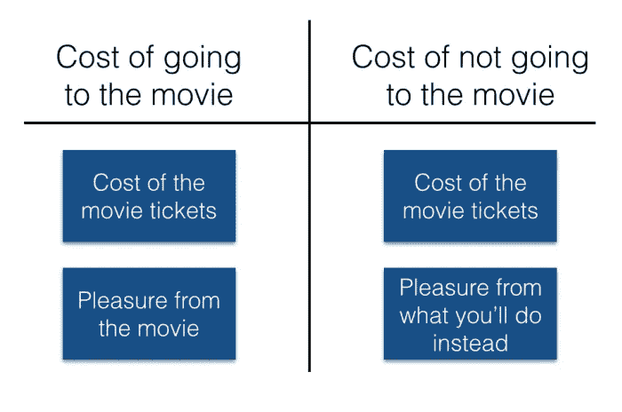

# 如何变得更聪明、更理性(是的，你也是)

> 原文：<https://medium.com/swlh/how-to-become-smarter-and-more-rational-yes-you-too-829885589091>

我们需要谈谈你和我每天做的一些傻事。

听着，我们是聪明人，所以有时候很难承认。

没有人愿意承认他们的缺陷，他们的弱点，他们的缺点。

但是…我们有很多。很多都是。我们有很多这样的例子，维基百科上有一个列表。

这些缺陷、弱点和缺点是你的认知偏差(好吧，也许你也有其他问题，但我们会留到以后再说)。精神捷径和盲点导致我们做出错误的决定，形成错误的信念，并且不以我们的最佳利益行事。

但是有个好消息！

你可以减轻对它们的易感性。你可以减少这些偏见对你决策的影响，并在这个过程中变得更聪明、更有逻辑。

而且不，没有人是“特别的”和不偏不倚的。我甚至可以说，你越认为自己没有偏见，实际上你就越有偏见。这一切都回到了[偏见盲点](https://en.wikipedia.org/wiki/Bias_blind_spot)，我们认为自己比其他人更少偏见。在接下来的例子中，我肯定你会找到至少一个你最近做过的例子。

事实是，我们**都**需要努力减少我们自己受这些偏见的影响(因为在谈话中向别人指出这些偏见是让他们讨厌你的好方法)，所以让我们开始吧。

# 减少你的认知偏见

意识是减少你的偏见对你的影响的最重要的因素。

[这份名单是你的新好友](https://en.wikipedia.org/wiki/List_of_cognitive_biases)。这是维基百科记录的认知偏见的索引，有简短的描述和完整描述的链接。

打开它，开始一个一个地检查偏见。看看你能否想出一个其他人在上个月证明了这种偏见的例子。我说其他人，是因为我之前提到的偏见盲点告诉我们，你不善于识别自己的偏见(至少现在是这样)。

开始这样做，每月一次，甚至开始时每周一次。我们的目标是，一旦你开始基于这些偏见之一思考或行动，你就可以抓住它并改变方向。同时，当其他人因为明显有偏见的心态而争论或行动时，你可以微笑、点头并静静地笑(请在你的脑海中)他们是多么的愚蠢。

但是试图同时做所有的事情并不是最好的做法。相反，让我们做一点分类。

# 首先关注哪种偏见

并非所有的偏见都是平等的。有些你会比其他人多遇到 10 倍，而这些是你最应该意识到的。

没有官方的频率列表，但这些是我见过最多的:

*   沉没成本偏差
*   确认偏差
*   可用性启发式
*   冲击偏差
*   马后炮偏差
*   塞梅尔维斯反射
*   生存偏差
*   行动者-观察者偏差(或基本归因错误)

让我们快速浏览一遍，并看看如何根除它们。

## 沉没成本偏差

**定义**

[沉没成本偏差](https://en.wikipedia.org/wiki/Sunk_costs)解释了我们倾向于在决策中权衡损失的资源(时间、金钱、精力)，即使这些资源已经不存在了，不管我们做了什么决定。

**例句**

例如，假设你买了今晚的电影票。无论你是否去看电影，你都不会把钱拿回来，所以你花钱的事实不应该影响你的决定。影响你决定的唯一因素应该是你是否还想看这部电影。

或者，说你正在考虑结束一段关系。你已经在里面呆了一年，两年，等等。不应该影响你的决定，因为无论哪种方式，你都不能把时间拿回来。它不见了。问题只是如果你想多花一两年**年**年。

**避开它**

你对这种偏见的易感性要部分归咎于你的父母。

想象一下，当你还是个孩子的时候，说服你的父母带你去一个主题公园，然后决定(在他们买了票之后)你不想再去了。他们会生气的，对吧？你要么被迫离开，要么受到惩罚(除非你的父母有着非同寻常的偏见)。

因此，从年轻时起，我们就有这样的想法，我们“需要”坚持过去灌输给我们的承诺(尤其是财务方面的)。但是我们不需要遵守过去的承诺，这种心态很可能是肥胖问题的一部分(让清洁盘子俱乐部见鬼去吧)。

从现在开始，你买的任何东西都是一种选择，而不是义务。

主题公园的门票？这是一个去的选择，而不是一个强迫因素。

那一年长的关系？你有继续下去的选择，而不是义务。

你的那些孩子？你可以选择继续吸血…算了，忘了这个吧。

## 确认偏差

**定义**

[确认偏差](https://en.wikipedia.org/wiki/Confirmation_bias)是指我们倾向于寻找、记住和相信支持我们现有信念的信息，同时忽略、忘记和不相信与之相悖的信息。

**例题**

看看社交媒体就知道了:

*   新时代嬉皮士健康饮食者张贴伪科学支持纯素食/古/全食品饮食
*   胖人发帖抱怨媒体制造了身体形象问题，以及不管身材如何，每个人都是健康的
*   共和党人发表文章支持减少枪支管制
*   民主党人发表文章支持更大的收入再分配
*   无神论者发帖讲述他们认为宗教中的荒谬之处
*   宗教人士发布关于奇迹的故事/人们与上帝交谈
*   白人发帖称自己不是种族主义者
*   1%的人发帖谈论涓滴经济学
*   中产阶级发帖抱怨华尔街腐败
*   我得罪大家了吗？够近了，我们继续。

或者，在自己身上找例子，看看自己的信息来源。如果你是民主党人，你会读卡托的文章吗？如果你对转基因生物不可知论者，你读生食和素食博客吗？可能不会，因为我们倾向于阅读支持我们已经相信的东西的信息。为什么？因为它让我们感到温暖和模糊，就像我们知道我们在说什么。

见鬼，我怀疑在这个时候阅读这篇文章的人会对此感到惊讶。所有“不偏不倚”(笑)的人早就不看了，回 Buzzfeed 了。

**避开它**

首先，发展对[虚幻相关性](https://en.wikipedia.org/wiki/Illusory_correlation)和[科学方法](https://en.wikipedia.org/wiki/Scientific_method)的良好理解。

然后，避免从游戏中有片面皮肤的来源阅读任何东西(无论是支持还是反对这个想法)。

例如，像“ [Mark's Daily Apple](http://www.marksdailyapple.com/) ”这样的博客，虽然是过旧石器时代生活的极好来源，但对于评估*旧石器时代是否是一个好主意*来说，却是一个糟糕的来源。为什么？因为如果他说“旧石器时代可能是个坏主意”，他的整个生意就完蛋了！

类似地，不要从共和党人那里得到对共和党人的批评(或者民主党人，这是双向的)，从牧师那里得到对基督徒的批评，从酒保那里得到对禁酒令的批评，等等。在你听取任何人的意见之前，问问他们是否只是为了支持自己的决定或生活方式而争论一些事情。

当你遇到任何支持你已经相信的东西时，就像批评你不同意的东西一样严厉地批评它。

并且，如果可能的话，试着寻找与你所相信的相矛盾的来源。公平地看待他们的论点，看看他们如何影响你的信念。

## 可用性启发式

**定义**

[可用性启发法](https://en.wikipedia.org/wiki/Availability_heuristic)告诉我们，我们更倾向于相信基于我们拥有的记忆或例子的数量，以及这些记忆的情绪化程度。

**示例**

几个星期以来，我一直强烈地认为，伯尼·桑德斯正在认真地与希拉里争夺民主党提名。这种信念大多来自两三个朋友，他们在我的脸书新闻订阅上发表了很多关于他的文章。

就在几天前，我查了一下，发现他只有大约 11%的选票，而她只有大约 60%(如果你正在读这篇文章，而桑德斯是总统，那么，我就是在开玩笑)。

仅仅是看到一堆关于他的文章，以及他过得如何“好”，就让我相信了一些我没有证据证明的事情。

**避开它**

最简单的第一步是[避开新闻](http://www.nateliason.com/news-waste-time/)和任何需要填补时间和空间的信息来源，以保持业务。最终，故事会不断重复，你听得越多，你就越相信它们。

当你做一个重大决定时，为双方获取等量的信息。多研究一面会让你更相信它，因为你的头脑中会有更多的例子和论据。

一般来说，忽略数据的单个实例，而是寻找趋势。

## 冲击偏差

**定义**

[影响偏差](https://en.wikipedia.org/wiki/Impact_bias)告诉我们，我们倾向于高估我们对生活变化的情绪反应的长度和强度，无论是好是坏。

**例题**

例如，当你买了一辆新车时，它在一小段时间内很棒，但后来它只是你开车去上班的车。

Or the car you leave in glass-walled garage out of fear of damaging it.

或者你因为害怕损坏汽车而把它留在玻璃墙的车库里

或者，也许你有过去度假的经历，在最初的几天或几周内感觉很棒，但到了最后一切都很正常，你不再对它有什么印象了。

或者，也许你认为结束那段关系或者得不到那份工作/大学会在感情上彻底崩溃，但是几个星期后你就克服了。

当糟糕的事情发生时，我们的大脑非常善于应对短期的情感创伤。我们比预期的更快地克服了它们。

当好事发生时，我们的大脑会再次适应新的环境，而且我们很擅长。情绪上偏离常规比我们想象的更短暂。

**避开它**

当不好的事情发生时，或者当你担心不好的事情发生时，不要想象你认为它会影响你多久，**想想过去类似的事情影响你多久**。当你回头看的时候，你会意识到你并没有想象中那么情绪化。

为了好的改变，记住你会很快适应一切。这意味着，你可以通过做许多小的改进来创造更大的长期幸福，而不是进行大的购买或转移(昂贵的汽车、房子)。这样，你总是获得短暂的快乐，而不是花太多时间去习惯你已经拥有的东西。

记住，你会很快适应生活中的任何变化。所以，如果你在你现在的地方很快乐，辞职和移居国外不会让你快乐很久。也不会有更大的房子。或者更好的车。

但是抛弃那些永远制造不快的情况(糟糕的关系、你讨厌的工作、老是抛锚的汽车、学校等等)。)会给你带来持续的更高的幸福感。不要专注于改善你的优势，而是将你的劣势最小化。

## 马后炮偏差

**定义**

认为[后见之明偏差](http://www.nateliason.com/become-smarter-more-rational/en.wikipedia.org/wiki/Hindsight_bias)的最简单方法是“自始至终都知道”效应。任何时候有人(或你)声称自己一直都知道某事…他们(或你)很可能并不知道。

**例题**

每当有人(或你)说一些大意为“我真的应该投资那只股票/不应该和那个女孩出去/早点发现秘密”的话，他们就犯了后见之明偏差(或第三种情况下的疯狂)。

我们这么做主要是为了让自己觉得自己不傻。没有人愿意承认他们不知道某件事会是一个好/坏主意，所以我们讲这些故事来让自己感觉更好。

在这份名单上的所有人当中，我要特别推荐你**不要向其他人指出这一点**。没有人想听到“来吧，你不知道那个家伙会想让你打扮成一匹马，并为他嘶鸣，克服它，你搞砸了”只是让他们生活在他们的幻想世界中，他们能够预测未来，并选择不这样做。

**避开它**

避免它很简单。接受我们不擅长预测未来，我们不需要向别人证明我们有多聪明。

认识到当你采取“我一直都知道”的立场时，你否认了自己从错误中学习的能力。如果你没有从错误中吸取教训，你一定会重复错误。接受你不知道未来会怎样的事实！现在你知道不要和穿着马刺，皮夹克，背着马鞍的男人回家。

## 塞梅尔维斯反射

**定义**

Semmelweis 反射是指任何时候有人对新信息做出反应，因为它与现有的范式相矛盾而立即拒绝它。如果相信它需要信徒接受他们在很长一段时间内一直在犯某种错误，这种情况尤其常见。

这被称为塞麦尔维斯反射，因为[伊格纳茨·塞麦尔维斯](https://en.wikipedia.org/wiki/Ignaz_Semmelweis)发现医生在处理尸体后不洗手是在杀害新妈妈。他去医院告诉他们，谢天谢地，他们意识到自己的错误，改变了政策。

开玩笑的。**他们笑着把他赶出了大楼，宣布他精神失常，最终他在精神病院被殴打致死。**

为什么医生不相信他？因为如果他们这样做了，他们就等于承认他们的错误已经杀死了无数的母亲。对于医生来说，这是太多的认知失调，所以他们杀了信使(和更多的母亲)。

反正出生都是乱七八糟的，为什么要先洗手？

**例题**

根据我的经验，最常见的例子是在健康方面。

如果你告诉某人几天不吃东西是健康的，他们会认为你是厌食症患者或疯子。

人们开始意识到吃脂肪不一定会让你变胖，实际上是燃烧脂肪的最佳宏营养素，但我仍然对此感到奇怪。

或者试着告诉一个民主党/共和党人，赞同相反方法的人和他们一样理性。你可能会被嘲笑(如果他们有逻辑，肯定会同意你的哲学……)

任何时候，当你试图告诉某人一些事情，意味着他们在任何重要的时期都生活在矛盾之中，你就会看到这一点。我们对认知失调有强烈的厌恶，所以忽略这个信息比接受我们可能已经搞砸了更容易。

**避开它**

如果你正在读这篇文章，那么你应该不会有太多的问题来避免它。你在一定程度上认识到自己受到这些偏见的困扰，并且会更加意识到它们的影响。

但是一个有帮助的心态是假设你不完全知道任何事情(苏格拉底)。涉及到健康、政治、经济、商业等。假设你对它有一个不完整的理解，你应该张开双臂接受新的信息。

生活不像政治，摇摆不定是完全可以的，这正是你面对新信息应该做的。不要因为骄傲而固执己见，承认自己错了，继续前进，为自己悟性的提高而高兴。

## 生存偏差

**定义**

[生存偏见](https://en.wikipedia.org/wiki/Survivorship_bias)是指我们假设某个人之所以取得成就，是因为他们特别、有才华、努力工作等等。而不是考虑他们可能只是运气好，或者至少很大程度上是运气好。

**例句**

你会在初创公司中看到这种情况，当某人因为参与了一家成功的公司而获得了巨大的尊重，不管他们在公司的成功中发挥了多大的作用

或者说某人[吃了一串胡萝卜，他们的癌症就消失了](http://www.amazon.com/Curing-Cancer-Carrots-Ann-Cameron-ebook/dp/B00JY2QG8K/ref=as_li_bk_tl/?tag=natsite-20&linkId=ece1ae1ac619f59a8b2baa41283f80d1&linkCode=ktl)。这是否意味着胡萝卜可以治愈癌症？不，因为所有喝了胡萝卜汁死了的人都不在这里告诉我们这件事。这与因果关系/相关性混淆密切相关。

或者，嘿，亚洲人擅长数学对吗？不，只是那些足够努力进入美国顶尖学校的人。你忽略了数以亿计的完全没有数学技能的人。(这也和[基率忽略](https://en.wikipedia.org/wiki/Base_rate_fallacy)有关)。

**避开它**

如果你想避免受生存偏差的影响，总是要问“那相反的呢？”

看看正在提出的任何主张，并思考相反的观点是如何成立的。

*   在一家成功的公司里，会有无用的人吗？当然可以。
*   会不会有人喝了一堆胡萝卜汁还是死于癌症？当然可以。
*   会有数学不好的亚洲人吗？当然可以。

你会经常发现，不仅相反的情况可能是真的，而且更有可能是真的，而最初的说法只是一个有偏见的误解。

## 行动者-观察者偏差

**定义**

[行动者-观察者偏差](https://en.wikipedia.org/wiki/Fundamental_attribution_error)，或基本归因错误，是指我们将自己的缺点归因于我们的处境，而将他人的缺点归因于他们个性的某个方面。

**例题**

假设你正在开车。前面的人突然减速右转，没有打信号。“真是个混蛋！显然他们不会开车。他们应该离开公路。天啊，我讨厌这样的人。他们是怎么拿到执照的？!"

然后，突然，你意识到你要错过机会了。你猛踩刹车，不打信号就转弯。你后面的人冲你按喇叭，你说“是啊，是啊，但我分心了，这是常有的事，我通常不会这么做。”

看到矛盾了吗？当其他人搞砸了或者做了一些愚蠢的事情，我们认为那是他们的一部分，而不是他们所处环境的结果。但是当我们搞砸了，那只是情境性的，并不反映我们是谁。

然而，通常后者是正确的:人们会犯错，这很可能是他们所处环境的一部分，而不是他们的个性。大量的错误可能是个人弱点的标志，但一个数据点不足以做出这些声明。

Anyone who says homeless people are just lazy would certainly blame the government if they themselves ended up on the streets.

**避开它**

当有人搞砸或行为不端时，假设这与他们的处境有关，而与他们是谁无关。

有人完全失去理智，对你大喊大叫，可能是被解雇了/和配偶吵架了/考试不及格。这是对他们处境的反应，所以不要往心里去。

这很难做到。你必须克制对人发火的冲动。但是如果你这样做了，当人们不可避免地搞砸时，你会感觉更好，反过来你也不会对他们感到沮丧。

这并不意味着原谅一切。显然，惯犯都是混蛋，而且不仅仅是在糟糕的情况下。但是如果你只有一两次互动，你就没有足够的数据。

# 入门指南

不要试图一次解决所有这些偏见。就像我说的，每个月检查一下[偏见清单](https://en.wikipedia.org/wiki/List_of_cognitive_biases)，看看哪些你还需要改进。

当你发现自己屈服于一个时，不要自责。这种事经常发生。好的一面是，你认识到了这一点，这样你就能在未来更多地意识到类似的情况。

现在就养成识别它们的习惯。在过去的一周里，有哪一种情况让你成为这些偏见的受害者？请在评论中告诉我。

[***获取更多免费指南，优化您的生活。***](http://www.nateliason.com/join)

[*如何变得更聪明更理性(是的，你也是)*](http://www.nateliason.com/become-smarter-more-rational/) *原载于 2015 年 6 月 23 日*[*【www.nateliason.com*](http://www.nateliason.com)*。*

*发表于* **创业、旅游癖和生活黑客**

-