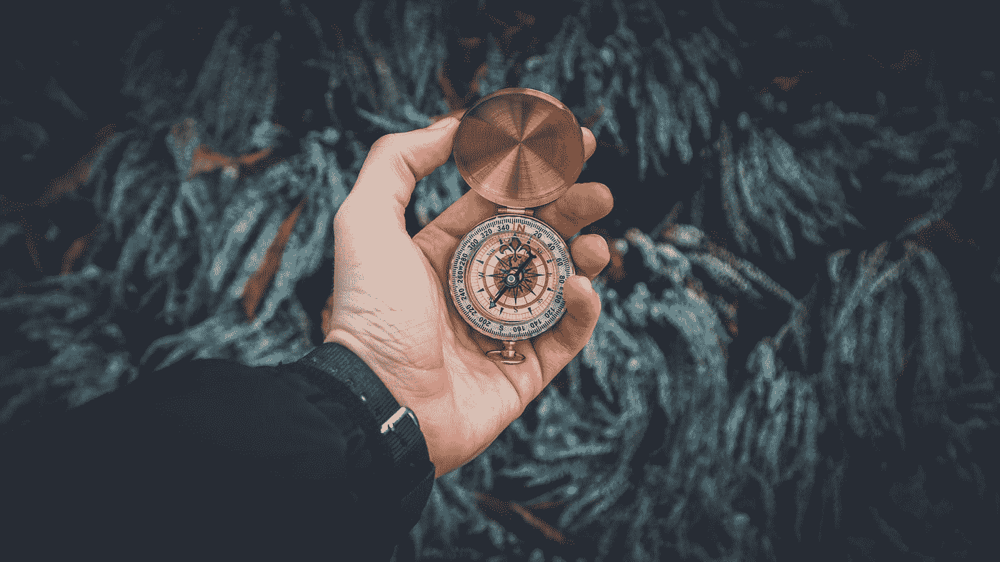

# 当你不知道如何找到自己的位置时，如何大胆地找到自己在这个世界上的位置

> 原文：<https://medium.com/swlh/how-to-boldly-find-your-place-in-the-world-when-you-dont-know-how-c0bd06bc8ec2>

## 揭秘发现你人生中个人使命的过程

Photo by [Kristopher Roller](https://unsplash.com/photos/3SFgixAUnAU?utm_source=unsplash&utm_medium=referral&utm_content=creditCopyText) on [Unsplash](https://unsplash.com/search/photos/destiny?utm_source=unsplash&utm_medium=referral&utm_content=creditCopyText)

## 我想知道过去的每一天，你是否都觉得自己在漂泊。

离你想要的生活越来越远。

你知道有更大的东西在等着你，但你很难说出那是什么。为了找到答案而踏入未知领域是很可怕的。

但是，如果有一种方法能让你非常清楚地知道你这一生打算做什么呢？

如果有一种方法能真正与你独特的使命联系起来，会怎么样？

我相信每个人都有惊人的激情和天赋。

对许多人来说，这些激情和才能正等着被释放。

不幸的是，生活是艰难的，在现实生活中过这样的生活说起来容易做起来难。当你试图平衡日常成人生活中的所有责任时，你陷入了困境。

也许你是一个对工作漠不关心的人，对你的未来感到焦虑，对过上你梦想的生活失去希望。

**如果这是你，那么你可能正过着别人希望你过的生活。**

不足为奇的是，人们临终前表达的五大遗憾之一是

> *“我希望我有勇气过真实的生活，而不是别人期望我过的生活。”*

无论是我们的父母为我们安排了一条特定的道路，提供“成功”公式的美国梦，还是迫使我们成为特定方式的文化，我们每天都面临着关于我们应该如何生活的意见。

当我们开始做我们命中注定要做的事情时，事情就会慢慢变得井井有条。

但重要的是。

# 生活中没有一步一步的公式来实现你真正的使命。

Photo by [Valentin Antonucci](https://unsplash.com/@valentinanto?utm_source=medium&utm_medium=referral) on [Unsplash](https://unsplash.com?utm_source=medium&utm_medium=referral)

这就是为什么当人们试图发现他们的使命时，他们最终会放弃，因为他们一开始就在寻找错误的东西。

人们想要一个万无一失的计划，所有的答案都摆在他们面前，但你的召唤并不像那样工作。

这就是为什么遵循像美国梦这样的公式更容易取得好成绩，进入好学校，找到好工作。

当你的生活被规划好的时候，你会有一种舒适感，但是当你最终得到那份工作，并且意识到你不想在你的余生都做这份工作的时候，你会猛然醒悟。

残酷的事实是。

你可能没有尽你所能去实践你真正的使命，因为过别人希望你过的生活要容易得多。

对我来说，最大的范式转变是肯定的，当我按照别人的指示生活时，我从未发现自己的使命并实现它的真正原因是我太害怕这样做。

> 梦想美好的生活比努力工作去实现它更容易。

最可怕的是，一旦你拥有了自己唯一的生活，如果出了问题，你没有人可以责怪。至少听从别人的指示让你有了指责别人的权利。

因此，为了帮助你找到你在这个世界上独一无二的位置，这里有三件重要的事情要记住，你真正的职业是什么，不是什么。

# 1.你的召唤不是一个公式

在这个世界上，如何指南和快速致富计划充斥着我们的社交媒体，我们希望能够立即找到如何在生活中取得成功。这就是为什么大多数人不管尝试了多少次，仍然感到停滞不前。

直到你认识到你真正是谁，什么对你来说是重要的，你才会开始感觉到你被召唤去做什么。你的召唤不是一步一步的公式。它更像是一个指南针。

**你的使命更像是一个绝对的方向，你应该把你的生活引向这个方向。**

它包括勇敢地步入未知，相信生活远比你自己伟大。

一旦你意识到这个事实，你将朝着正确的方向前进，给你的生活带来深刻的意义，这是我们在一天结束时都想要的。

> *“生活从来不会因为环境而变得无法忍受，只会因为缺乏意义和目标。”* —维克多·弗兰克尔

# 2)你的职业并不意味着给你安全感

你可能在生活中的某个时候会有这种感觉。

有东西在召唤你走向不同的生活，你的一部分知道你最好的生活在另一边，但是你的恐惧在拖你的后腿。

活出你的使命需要大胆踏入未知领域去发现你的能力。我认为富兰克林·罗斯福说得很对:

> 勇气不是没有恐惧，而是评估出有比恐惧更重要的东西。

> 你的召唤从不要求你安定下来，而是要求你继续前进。

当实现你的使命对你来说变得比阻碍你的恐惧更重要时，那就是你找到勇气采取必要的大胆行动的时候。

# 3.你的使命并不总是与你在做什么有关，而是与你将成为什么样的人有关。

现实是，生活是艰难的，我们中的一些人在生存模式中度过了大部分时间，只是为了支付账单和把食物放在桌子上，但过你所拥有的生活的最好方式是利用你所拥有的激情和天赋。

> 如果我们因为太忙而埋葬了我们的梦想，我们将永远不会成为我们应该成为的人。

所有人都有一种强烈的欲望和一套独特的技能，可以帮助我们对世界产生有意义的影响，但除非我们花时间与他们亲密接触并培养他们，否则我们永远不会找到自己真正的使命。

# 如何活出你独特的使命

现在比以往任何时候都更需要你的技能、才能和潜力。

如果你越来越意识到自己陷入了困境，那么你可能会想知道如何开始挖掘自己与众不同的一面。

你内心深处知道的那部分你可以对这个世界产生巨大的影响。

如果是你，那么在我的免费深入培训中学习神经科学如何显著提高你的决策、批判性思维和创造技能，[如何激活你大脑的超能力:*一种科学支持的方法来发现你的激情，找到你的目标并改变你的生活*](https://mailchi.mp/92ca462e034d/neurohacking-masterclass-training-session)

为保持生活的美好干杯。

## 这篇文章发表在 [The Startup](https://medium.com/swlh) 上，这是 Medium 最大的创业刊物，有 325，962+人关注。

## 订阅接收[我们的头条新闻](http://growthsupply.com/the-startup-newsletter/)。

