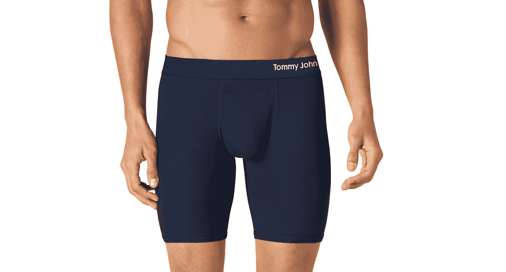
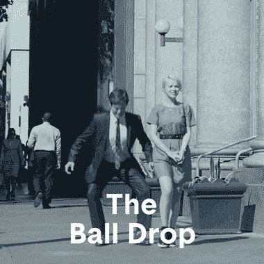
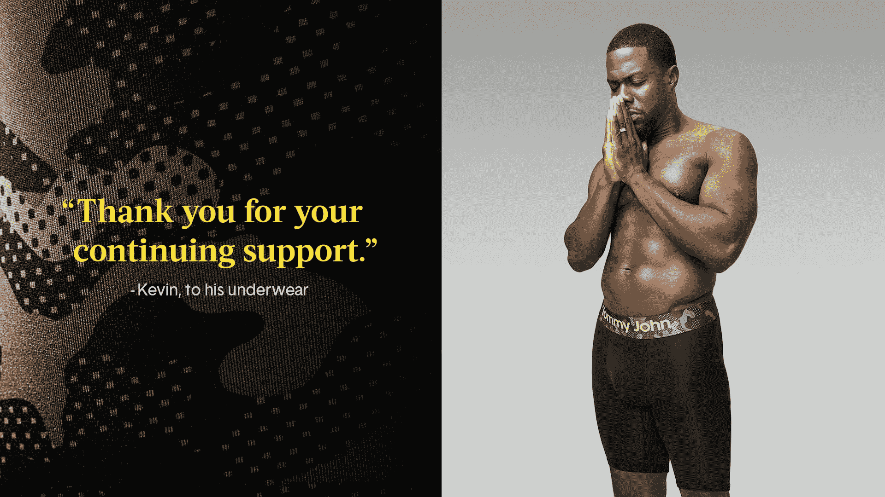
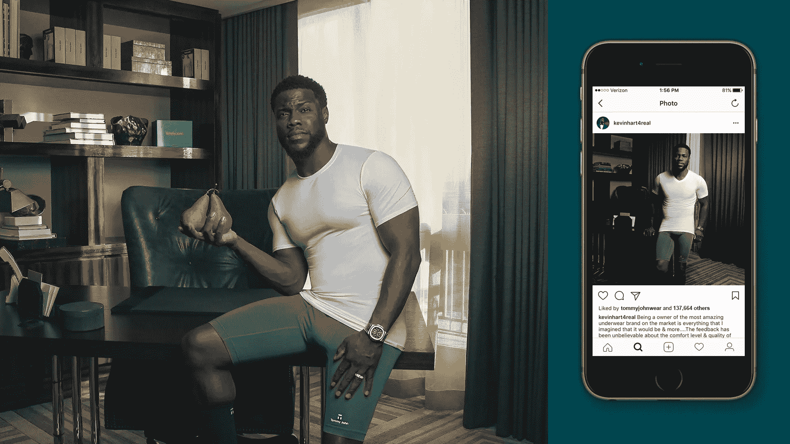
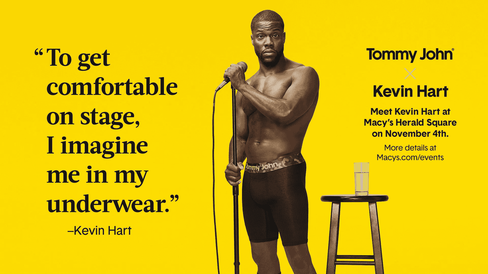

# 如何给低垂的水果打上品牌:汤米·约翰的故事

> 原文：<https://medium.com/swlh/how-to-brand-low-hanging-fruit-the-tommy-john-story-8b7075a6d4a1>

汤米·约翰于 2008 年推出了世界上第一件有保留褶裥保证的专利汗衫，此后扩展到内衣、袜子、休闲服和表演装备。

2016 年，演员/喜剧演员凯文·哈特投资了汤米·约翰，这是一个颠覆性的、不敬的、有点不安分的内衣品牌。*(毕竟，当你进入一个充满噪音的空间时，你需要知道如何以这样一种方式进入那个空间* [*，以真正扰乱*](http://www.risingabovethenoise.com/the-4-traits-of-an-exceptional-brand/) *每个人都已经在那个类别中进行的对话。而且你需要找到* [*那种能让你的品牌被听到的*](http://www.risingabovethenoise.com/secret-sauce-brand-slogans-and-customers/) *。)*

“我想做的不仅仅是另一个名人代言人，”哈特说。

“投资你喜欢的品牌——你穿的品牌，比花钱买的品牌，要真实得多。我喜欢这条内裤。它很舒服，看起来很好，他们说它是这样的。汤米·约翰正在以一种前所未有的更真实、更相关的方式颠覆、创新和营销内衣。我很高兴有机会参与其中。”

首席执行官汤姆·帕特森(Tom Patterson)在长期对男性内衣缺乏创新感到沮丧后，推出了汤米·约翰(Tommy John)。

自 2014 年以来，该公司的年增长率为 2.5 倍，预计今年的销售额将超过 1 亿美元。

从品牌的角度来看，汤米约翰采取了一个产品类别，主要是一种商品，并在正确的地方迅速踢打乱。纵观该公司作为品牌管家的工作以及汤米·约翰雇佣的代理公司[布道者](http://preacher.co/)出色的品牌宣传，品牌声音是如此正确，这一切似乎是不可避免的。只要看看:

*   幽默，
*   智慧，
*   真实性，
*   摄影，还有
*   知道何时停止(任何伟大艺术家或品牌的标志)

于是，我坐下来(不是身体上的，而是精神上的*——数字阅读*)，从汤姆·帕特森本人那里获得了一些很棒的见解。**

*你认为拥有独特的品牌声音有什么价值？*

*“拥有独特的品牌声音非常重要。男士内衣是一个非常拥挤的空间，既有传承品牌，也有后起品牌。也就是说，我们认为该类别中的其他品牌有一种不可接近和不相关的倾向。*

*“我们实话实说，谈论现实生活中男人们在内衣上的挣扎，比如蝙蝠翅膀、楔形鞋和调整。”*

*在为汤米·约翰品牌命名的过程中，你学到了什么？*

*“我认识到了保持真实和创造产品解决未满足需求的重要性。这就是我们在一天结束时所做的事情。我们所有的产品都源于解决我个人在服装方面遇到的问题。”*

***一个企业家将如何着手寻找一个需要颠覆的行业，开始时哪些行动是至关重要的？***

*“找到你能做得更好的事情，你热爱的事情，然后去做。*

*“不符合行业标准。我没有服装设计或制造方面的背景或关系，直到今天，我相信这是我最大的财富。我能够找到新的、更有效的方法来完成工作。我提出了问题，挑战了业内大多数人自动遵循的流程。”*

***品牌如何让消费者关心一个产品，甚至感知对该产品的需求？***

*解决市场上的一个问题(或未满足的需求)并让人们去尝试。*

*“2009 年，在我第一次与零售买家见面之前，我给她准备了礼物——她的丈夫和所有男性同事汤米·约翰。当我到达时，她已经收到了非常积极的反馈，并准备让我们进入比最初讨论的多 3 倍的门。*

*“我们的第一个广告《大调整》(The Big Adjustment)在发布后的头 5 天内就获得了超过 100 万的浏览量。这则广告讲述了男性适应过程中令人不安的真相——这是所有男性都能体会到的，所有女性都目睹过的。*

***研究表明，50%的新企业无法持续超过 5 年。你是如何避开这个统计数字的？***

*“我们决定不依赖风险投资，因为我们希望按照自己的速度增长，并保持对业务的控制。太多时候，人们陷入了对企业价值的评估，让事情分散了他们的注意力。大规模融资并不能保证企业的长久存在。相反，重要的是先完善你的产品，了解你的客户。”*

*在汤米·约翰成为一个成功的品牌后，凯文·哈特伸出了手。为什么，在所有这些成功之后，它是一个很好的选择？*

*“老实说，当凯文·哈特第一次与我接触时，我非常犹豫是否要让他成为公司的投资者。*

*“我担心他的名气会主导我们多年来培育的品牌。直到凯文让我坐下来，对我说‘我不想让这成为凯文·哈特的品牌。你已经建立了一个大的、受人尊敬的、可信的品牌…我只是想成为其中的一部分。我想帮助你成长。*

*“他解释说他有多爱这个产品，尊重这个品牌。他的努力、决心、理解以及对产品和品牌的真诚热爱让我重新考虑。”*

*汤米·约翰是发现你的品牌声音的一个很好的例子，忠实于那个声音，从不妥协，并且有勇气继续做下去，直到世界其他地方跟上。正是我在 [***中掩盖的特质，品牌介入***](http://a.co/aSh5zRM) 。*

*下面是几个例子，清楚地表明品牌是如何舒适地“在自己的皮肤里”,随后是几个促销活动，展示了凯文·哈特如何有机地融入品牌叙事。*

**************

1.  *找到你的声音。*(你的，而不是别人的某个版本。)**
2.  *不可能被忽视。*
3.  *愿意去破坏。*
4.  *准备好改变现状。*
5.  *当羽毛竖起时，坚持到底。*
6.  *玩得开心。*

> *参加马拉松比赛。*
> 
> *太多的人只是为了冲刺而出现，却没有意识到:*
> 
> *那只是热身。*

**原载于*[*www.risingabovethenoise.com*](/@brierman/how-to-brand-low-hanging-fruit-the-tommy-john-story-250ca0b51359)*。**

**

## *这个故事发表在 [The Startup](https://medium.com/swlh) 上，这是 Medium 最大的企业家出版物，拥有 301，336+人。*

## *在这里订阅接收[我们的头条新闻](http://growthsupply.com/the-startup-newsletter/)。*

**