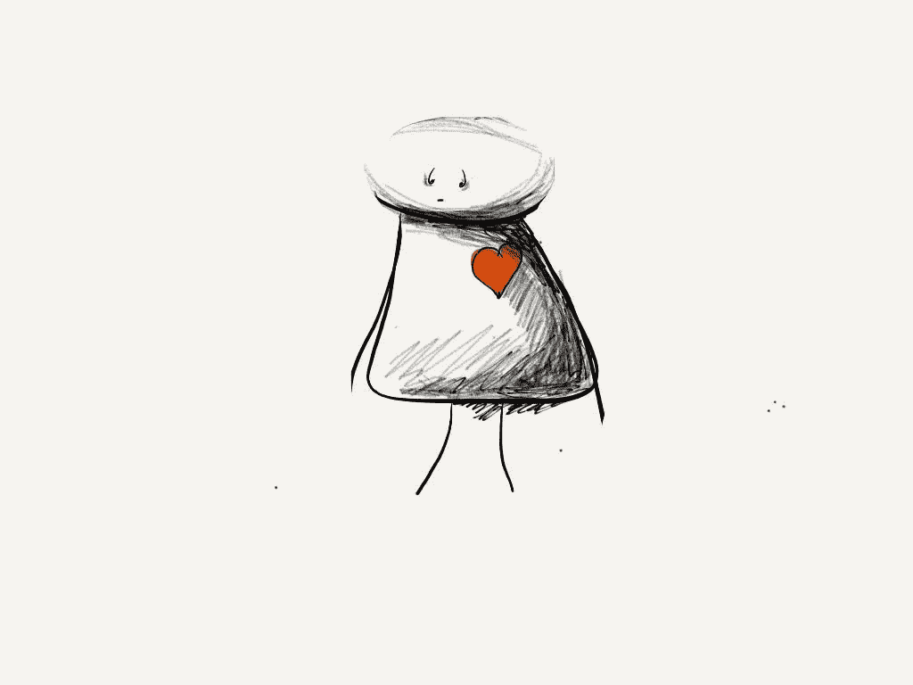

# 如何打破“责备循环”

> 原文：<https://medium.com/swlh/how-to-break-the-blame-cycle-985e440865a9>

> “犯错是人之常情。指责别人是政治。”休伯特·汉弗莱

Original artwork — Barbara Grace

当你觉得工作或人际关系中的所有问题都被指责时，以下是打破责备循环的方法。

当事情出错时被指责是具有挑战性的。你可能最终会觉得整个世界都在和你作对——不管你转向哪个方向，你都会被欺负、被欺负或者成为受害者…