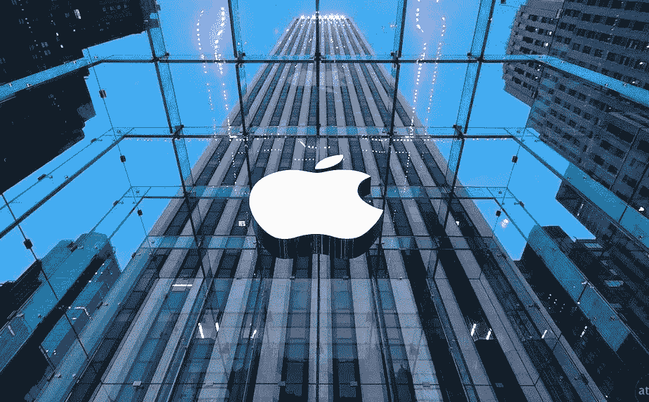
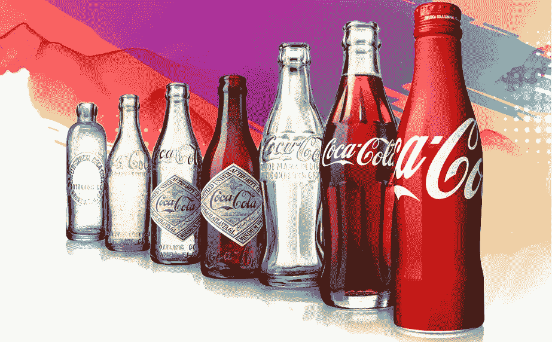
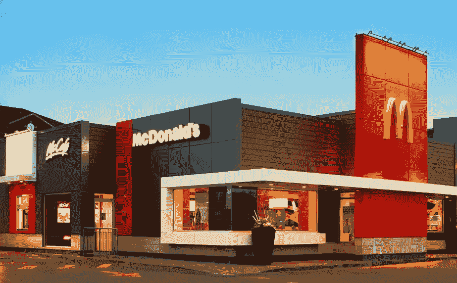

# 如何建立一个像苹果、麦当劳和其他几个巨头一样的品牌？

> 原文：<https://medium.com/swlh/how-to-build-a-brand-like-apple-mcdonalds-a-few-other-giants-23cc88ff8d85>

## 无论你是一家希望从竞争对手中脱颖而出的公司，还是一家希望建立自己身份的初创公司，有效的品牌推广都是关键。品牌，如果做得好，将对你的业务产生持久的影响。

一次又一次，像苹果、谷歌、可口可乐和麦当劳这样的商业巨头把它赶出了公园。他们是如何天衣无缝地完成的？具有一致性和一点创造性。

## 苹果——利用情感建立品牌形象

苹果已经掌握了推出新产品的艺术。关于新品发布的消息一传出，就引发了兴奋的浪潮，并在其忠实的粉丝群、潜在客户和世界各地的技术专家中引发了关于新品的辩论。

数字设备和服务已经融入我们的生活，到了不可分割的地步。苹果公司利用这一点，创造情感触发器，让顾客动起来，让人无法忽视这个品牌。例如，他们的主流媒体广告是独一无二的，人们试图用电子设备彻底改变世界，总能引起观众的共鸣，并铭刻在他们的记忆中。

苹果也喜欢他们的顾客通过购买他们的产品来确认他们的感知状态的倾向。一旦苹果用户成为苹果的终身用户，他们就开始认同这个品牌。

> 史蒂夫·乔布斯曾经说过“制造记忆的机会是品牌营销的精髓。”

苹果通过
密切关注卓越的设计和包装
提供一流的客户服务
通过遵循一流的定价策略
令人振奋的广告展示了试图用电子设备彻底改变世界的人们。
苹果在围绕品牌的各个方面都很用心——无论是通过建立独特的展厅体验，还是通过为顾客举办壮观的产品发布会，苹果都是无与伦比的。

## 可口可乐——一致性和外观

谈到品牌，可口可乐总是击中靶心。尽管自 1982 年入行以来，可口可乐的标识一直保持不变，但他们的理念从未消沉。从不时为他们的瓶子想出令人耳目一新的外观，到为主流媒体制作广告，他们一直在不断创新。

可口可乐独特的味道、标志以及它与红色的紧密联系不仅有助于建立一个强大的品牌形象，也有助于与他们的顾客建立一种永恒的联系。他们的成功可以归功于他们非凡的品牌存在、可及性和分销技术。

## 谷歌——使命清晰，视野开阔

谷歌坚持他们的官方使命，即“组织全世界的信息，并使其普遍可用和有用”，这使他们处于领先地位。通过执行他们的使命宣言，谷歌为他们的员工提供了一个明确而令人信服的长期承诺。谷歌排斥优秀，这经常反映在他们严格的招聘流程中，只有精英才能被录用。

谷歌认识到竞争对手的处境后，就开始了多元化。其中一些已经退出市场，其余的则遥遥无期。根据他们最近成立的母公司 Alphabet，每个业务集团都有自己的使命宣言，以坚持和不妨碍其他的增长。

谷歌创始人拉里·佩奇说(关于 Alphabet 的推出)

> “我们一直认为，随着时间的推移，公司往往会习惯于做同样的事情，只是进行渐进式的改变。但在科技行业，革命性的想法推动着下一个巨大的增长领域，你需要有点不自在才能保持相关性。”

对其他公司来说，关键的一点是接受谷歌跟上用户预期的能力，以及他们创造性的参与技术，例如根据场合在他们的标志中显示涂鸦和互动游戏。这是创建沉浸式用户体验的一个很好的例子。

谷歌凭借其深远的愿景脱颖而出，不断期待推动边界的增长。他们从一个搜索引擎到今天的一切，特别是自动驾驶汽车和旨在延长人类寿命的 Calico 项目，是一个非凡的旅程。

简单来说就是不等世界改变的品牌，就是改变世界的品牌。你的品牌应该有明确的目标、敬业的员工和强烈的成长意愿。

## 麦当劳—目标市场探索和适应

麦当劳被福布斯评为世界上最有影响力的品牌之一。麦当劳详细的市场调查和细分是他们在餐饮业成功的主要原因。这反映在他们的产品中，因为他们提供的饮料、薯条和汉堡会根据人口统计数据而变化，以适应人们的饮食习惯。

因为他们迎合不同文化的人，为了表示他们对差异的尊重，他们在世界各地的特许经营店被授权制定符合当地饮食习惯和兴趣的菜单。比如赤金龙田(日本)，王公麦克(印度)，纽约经典(美国)。

尽管有不同的菜单，麦当劳的氛围、体验和调色板在世界各地都是一样的。谈到调色板，他们选择了一种能为他们的业务带来更好结果的颜色，即红色和黄色，这两种颜色已知会刺激人类的饥饿感。这就是一个聪明的品牌的用武之地，例如，看看[prop wiser](https://goo.gl/HH47pb)——一个品牌项目，我们将色彩心理学原理引入其中，以唤起信任和舒适的感觉。关于色彩心理学的更多细节，[看看这个](/the-mission/how-are-the-worlds-most-successful-brands-using-the-psychology-of-color-in-their-branding-ed9446c0bdf0)。

> “罗马不是一天建成的”；伟大的品牌也不是。

品牌建设需要时间和耐心。它围绕着你的业务的多个学科。它需要全神贯注和坚定不移的承诺。品牌建设不是百米冲刺，是马拉松。事情没那么简单，但不管怎样，你可以从今天开始行动。从一次迈出一步开始，跑，跑得更快更聪明，你可能会摔倒，但记住要向前摔倒。

**现在，去打造你的品牌吧！**

**我们是**[**Webchirpy**](http://webchirpy.com/)**，一家位于印度哥印拜陀的创意设计机构。**

*在 [**推特上打招呼**](https://twitter.com/webchirpy) **|** [**脸书**](https://www.facebook.com/webchirpy/)**|**[**Insta**](https://www.instagram.com/webchirpy/)**——**获取设计灵感&品牌推广技巧。*

*如果你喜欢这篇文章，请按下“鼓掌”按钮👏👏👏帮助其他人找到它。*