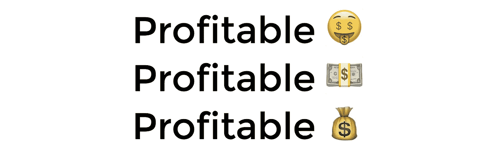
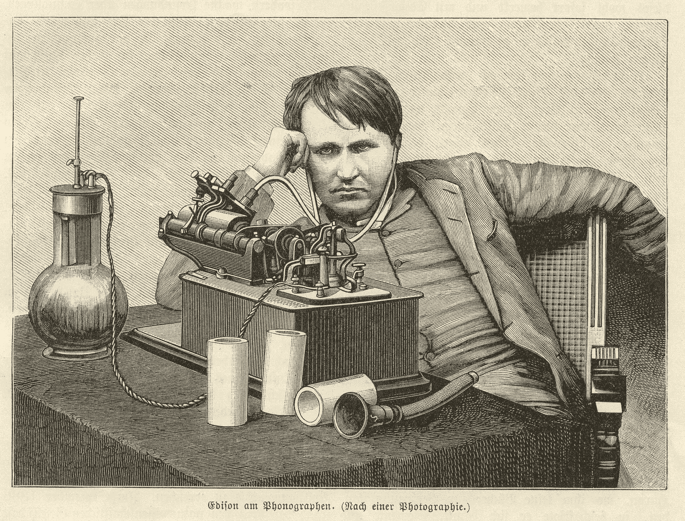
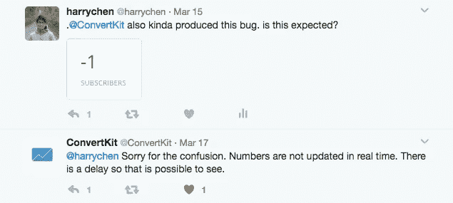

# 如何建立一个蟑螂创业公司(而不是独角兽)

> 原文：<https://medium.com/swlh/how-to-build-a-cockroach-startup-instead-of-a-unicorn-4f776f068583>

## 我对创业有争议的观点

A cockroach startup is all about being profitable.

创业是一个时髦的词。创业公司是刚刚起步，还没有实现可持续盈利的企业。默认情况下，一家初创公司是一家失败的企业，直到你让它盈利。

独角兽创业公司是指被投资者估值超过 10 亿美元的公司。**独角兽创业不一定要赚钱**。独角兽创业公司不一定要展现健康的商业基本面。一个独角兽创业公司只需要成长和被投资者定价。

我提出，或许，还有**另一种创业**——**蟑螂创业**。**蟑螂创业公司是那些以盈利为目的，专注于赚钱的公司**。要成功创建一家盈利的初创公司，你必须专注于实际业务。我提议我们可以遵循一些规则，其中一些非常有争议。

## **#1。从第一天开始收费💰**

不管你要做什么，你都应该从第一天开始收费。不知何故，有一种观念认为，只要你让你的产品免费，并且有很多人使用它，你就可以担心以后的货币化。对于许多企业来说，这是有缺陷的。

**当你的产品免费的时候，你没有办法测试你产品的真实价值。**作为用户，看到免费的东西，也没什么损失，所以大部分时候会说好。当你看到价值 1.99 美元的东西时，现在你有东西要失去了。如果你不真正重视产品，你就不会付钱。对于企业主来说，这是一场灾难，因为你无法直接衡量别人如何评价你的产品。

麦当劳收钱。苹果收费。Airbnb 收费。不知何故，很多人认为他们的创业公司不需要向客户收费。

作为一家蟑螂创业公司，你通过收钱来发现你的业务。你通过收费发现你的定价、定位和成本结构。

## #2.你的想法可能是愚蠢的，我的也是🙄

作为一个创业公司的创始人，你的工作就是实验。爱因斯坦不是在第一天就提出狭义相对论的，所以你不应该指望自己在第一天就有完美的商业想法。

想法也是毫无价值的，直到你去执行它们。当你开展业务时，每个细节都很重要。对于一个小细节，你会有 10 个想法，这些想法总结起来就是整个企业的 1000 个小想法。你越快尝试这些想法，你就能越快学会并实现盈利。要明确的是，我不是让你尝试 1000 种不同的业务。**我要求你为同一项业务尝试 1000 个不同的小创意**。

Thomas Edison experimented on different filaments to invent light bulbs.

没有人能评判你的想法。其实谁也不知道什么。如果你的想法能帮你赚更多的钱，它们将被证明是成功的。

作为一家蟑螂创业公司，你需要不断尝试微小的想法来改善你的业务。一只蟑螂可以在核爆炸中存活，你的企业也应该如此。

## #3.关心每一个用户💁

令我惊讶的是，人们并不像我想象的那样关心他们的用户。我一直[在推特上发布不同的 bug](https://twitter.com/harrychen)给我用过的产品，只有不到 50%的人回复我。无论大小，这些产品都被许多其他用户使用，他们会看到和我一样的问题。

**如果你真的关心你的用户，这是一个竞争优势。**当用户报告 bug 时，你可以立即修复并感谢他们。如果他们给你发邮件，在一个小时内回复他们。如果用户给你建议，试着把它们融入到你的产品中。用户并不总是对的，但是你不应该忽视他们。马克·扎克伯格曾经说过，脸书的成功部分是因为“我们只是更关心”。

保罗·格拉厄姆一再表示，创始人应该从一开始就做不可扩展的事情。我挣扎了很久才明白背后的含义。他的意思是自动挡没用吗？他的意思是所有可扩展的想法都是不好的吗？不。我相信他的意思是你应该关心你的顾客。要真正关心你的客户，你需要照顾每一位客户。要做到这一点，你必须个性化你的服务，让每个客户都满意，这在一开始是不可扩展的。

作为一家蟑螂创业公司，你需要关心每一个用户。如果你不能给 1 个用户提供好的价值观和服务，你怎么能做好 100 万用户？

## #4.如果你是技术型创始人，不要再回避销售了😭

所有技术创始人都有一个共同的梦想，那就是他们可以创造出伟大的东西，数百万人会立即使用它。这也是我的梦想，但它只是一个梦想。

在现实中，你必须说服人们为你的产品付费。

作为用户，如果一个随机的人走到你面前，给你提供某种产品，你会买吗？嗯，这取决于这个人是否成功地让你相信这个产品对你有价值。大多数情况下，你不会买。作为一个创始人，你不能指望人们第一眼就信任你。

技术型创始人应该接受说服他人的过程，因为这是从客户那里获得诚实反馈的唯一途径。这也可以追溯到从第一天开始收费，因为如果你不这样做，你得到的反馈将不会是你产品的真实反映。

作为一家蟑螂创业公司，你通过说服他人购买来定义你的产品。

## #5.如果你不是技术型创始人，那就成为技术型⛏吧

如果你真的关心你的产品，你应该参与到产品的建设中来。作为一家科技初创公司，你的业务建立在科技之上。你的竞争优势在于你如何改进和优化你的产品。如果没有一定水平的技术理解，您将会错过数百个潜在的改进。

如果你的生意是关于食物的，你最好了解食物。如果你的业务是关于技术的，你最好了解一些技术。一些创始人告诉我他们没有时间学习，但我看到他们在一些需要技术知识的事情上浪费了很多时间。

作为一家蟑螂创业公司，你应该是那个制造产品的人。

## #6.你不需要风投的钱👼

很多创始人认为，创业的首要目标是从风险资本家等外部投资者那里获得资金。媒体也把资助的创业公司包装成成功的创业公司。它给人一种错觉，如果一个创业公司资金充足，它一定是一个成功的创业公司。这是完全错误的。

当一家初创公司的估值为 1 亿美元时，并不意味着它每年都有 1 亿美元的利润。这并不意味着这家初创公司有 1 亿美元的销售额。这家初创公司甚至可能还没有推出产品。Twitter 目前的市值为 100 亿美元(相当于 100 亿美元)，但它从未从投资者的运营中赚到一分钱。

Twitter’s annual net income (Google Finance)

创业估值是一个由不比你聪明的人说出的价格标签。媒体选择这些新闻是因为它们是很好的点击诱饵。

**当你的现金流成为你发展的瓶颈时，你应该筹集资金。**如果你的初创公司因为银行存款不足而增长不够快，你应该筹集资金来推动增长。

当你筹集资金时，你有义务为你所有的老板(你自己、你的联合创始人和你的投资人)挣钱。你可能只想要一个 1000 万美元的企业来让自己过上好日子，但你的投资者正在寻找一个 1 亿美元的企业来让他们的投资物有所值。**确保你想要你所要求的。**

作为一家蟑螂创业公司，风险投资可能是一种负担。

## #7.确保你的商业模式真的会赚钱

开一家蟑螂创业公司的最终目标和开一家咖啡店是一样的。你试图建立一个商业实体，通过盈利为你印钱。

你的目标是确保你的生意赚钱。对于你的每一笔销售，你都在努力赚取利润。如果你每笔买卖都赔钱，那么你卖得越多，损失就越大——这是一笔非常糟糕的生意。

> 如果你每次销售都赔钱，你卖得越多，你损失的就越多。

一些公司通过低于成本销售来烧钱以刺激增长。他们的目标是不惜一切代价占领市场，包括不断增加的亏损。这是独角兽的经典增长策略。低于成本销售还不如免费。我曾经是提供低价产品和服务的商家的常客。不接受这些便宜货是愚蠢的。但是，一旦他们停止促销，我就不再是他们的顾客了。蟑螂创业公司根本无力部署这种高风险的策略。你需要赚钱来验证你的商业想法。

作为一家蟑螂创业公司，不应该有赔钱的商业模式。

## #8.一个超级小团队💪

一个蟑螂创业公司大概有一个超级小的团队(不到 5 人)。一家蟑螂创业公司没有钱或资金雇佣其他人，所以创始人自己做所有的事情。

对我来说，理想的团队规模是 2 或 4 人(4 人分成两个 2 人团队)。如果你有正式的会议，团队可能没有做足够的工作。如果你需要经常同步，你的沟通是无效的。**每个人都应该异步地知道他们在任何给定的时间需要做什么。优先顺序通常是不必要的。**如果你知道某样东西会帮助你的销售增长，那么这个任务将会是第一要务。其他任何对销售没有明显帮助的事情都在同样的低优先级组，所以你只需要根据你的直觉选择一个去做。

一个精益团队迫使创始人通过软件或第三方服务来自动化一切。他们自动化程度越高，就越有竞争优势，因为他们现在可以用很低的成本做事。

蟑螂创始人通常也有很高的技术含量，因为他们必须自己打造产品。正如我在第 4 条中提到的，技术型创始人需要付出更多努力来学习如何销售产品。

作为一家蟑螂创业公司，团队小是优势。

## #9.时间⏰比金钱更有价值💰

一家蟑螂创业公司是防御性的。目标是留下来，挣钱，不死。一家蟑螂创业公司并不打算在未来 3 年内一夜暴富。相反，其创始人希望学习如何建立能持续 10 年、50 年或 100 年的企业。

创业是一个学习的过程。从学习如何做出微小的改进到了解客户想要什么，你每天都在学习新的技能。创业不是靠运气而是像科学家一样试错。

**科学家最想要什么？钱？不。科学家需要更多的时间。金钱当然可以通过加速实验来赢得时间，但科学家最终追求的是时间。**

作为蟑螂创始人，你是科学家。如果你还没有赚钱，你应该用你尝试过的实验次数来衡量自己。如果你已经在赚钱了，你应该以实验为基础的利润增长来衡量自己。

创始人应该为学习而优化。由于时间有限，你只需增加实验次数来获得更多的知识。

一个蟑螂创业公司和一个科学实验室没什么区别。

## #10.没有退出策略😵

创始人经常被问到他们的退出策略是什么。退出策略是给风投的，不是给创始人的。如果你的生意赚钱了，你为什么要退出呢？风险投资通过在 5 到 7 年的时间内退出业务来赚取资金。企业主和创投资本家的最终目标往往不一致。

你的目标不应该是把你的股份卖给一个更大的傻瓜。如果你的生意好，赚钱，你显然可以随意选择卖给别人。

一些创始人在寻找 5 到 7 年的累积奖金，以便尽快退休。其他人则希望建立一家可以运营 30 年的公司。弄清楚你是哪种类型的创始人。

作为蟑螂创始人，你不是在找出口。你唯一的策略是建立一个永久印钞的企业。

我是[艺术学院](https://www.altcademy.com)的联合创始人——我们正在创造**最好的在线学习场所**，提供有效的在线课程。到 altcademy.com/@harry[找我](https://www.altcademy.com/@harry)

## 这个故事发表在 [The Startup](https://medium.com/swlh) 上，这是 Medium 最大的企业家出版物，拥有 271，106+人。

## 在这里订阅接收[我们的头条新闻](http://growthsupply.com/the-startup-newsletter/)。

