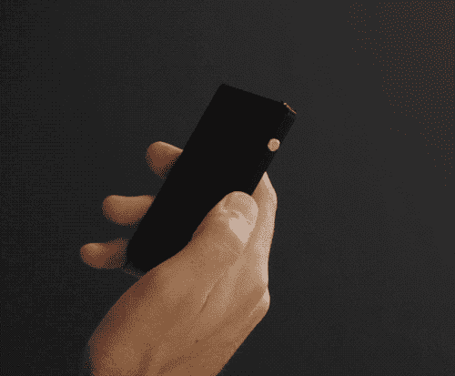
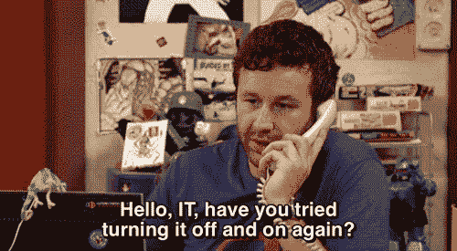

# 如何建立一个爱你的社区

> 原文：<https://medium.com/swlh/how-to-build-a-community-that-loves-you-b6c055361f65>

C[**raft Wallet**](http://www.craft-wallet.com/)**今年已经两岁了，毫无疑问，让我们继续前进的是我们的社区。**

> **Craft Wallet 的社区**
> 一群拥有 Craft Wallet 或对该品牌感兴趣的人。

他们是那些在没有人相信我们的时候相信我们的人，是那些不断给予反馈的人，是那些在两次成功的众筹活动中支持我们的人，是那些一有机会就向朋友展示他们的[工艺钱包](https://craft-wallet.com/)的人。他们让这家公司活了下来。

Craft Wallet Black Essential

对于不了解我们的人来说， [**工艺钱包是一个直接面向消费者的高级钱包品牌**](http://www.craft-wallet.com) 。我们的钱包设计精美，体积小巧，功能多样，但价格低廉。我们在葡萄牙的工厂生产钱包，并对我们的产品提供终身保修

当我们创办[工艺钱包](http://craft-wallet.com)的时候，我们还是学生，并不真正知道我们在做什么。很快，我们意识到，如果我们想制造一个伟大的产品，我们不能独自完成。令人惊叹的产品往往是那些以简单和令人上瘾的方式解决常见问题的产品。很少有第一次尝试就完成的。为了适应市场，产品需要经过一次又一次的测试，直到它们能做它们应该做的。这就是为什么如果你是一家早期创业公司，建立一个社区是如此重要。你需要一小群早期采用者，他们爱你的公司，信任你，愿意经历糟糕的 UX，只是给你他们的意见，告诉你如何改进你的产品。如果你做得很好，他们会付钱让你重复体验，希望你一直在倾听他们的反馈。

## 但是怎么做呢？

在 [Craft Wallet](http://www.craft-wallet.com) 中，我们用 6 个步骤建立了我们的社区。

# 1.找到你的早期用户

早期采用者是一个非常特殊的人。顾名思义，他们是第一个采用产品的人。他们喜欢抢在其他人之前拥有它，如果可能的话，还有一个只有他们才能得到的特别版本，希望这是他们将来可以夸耀的东西。

你的早期采用者会给你不断的反馈，向他们的朋友谈论你，同时期望使用你的产品会有一个不那么惊人的体验。他们知道你想明白这一切还为时过早。

你未来的早期用户倾向于分享一些兴趣和特点。识别它们，你就更容易知道在哪里可以找到它们。像 [Reddit](https://www.reddit.com/) 、 [Product Hunt](https://www.producthunt.com/) 或众筹平台( [Indiegogo](https://www.indiegogo.com/) 、 [Kickstarter](https://www.kickstarter.com/) )这样的社区是寻找第一批尝鲜者的好地方。

# 2.不要忘记给予

企业与客户建立关系。一段关系要想成功，双方都必须给予对方同等的价值。这就是正常关系的运作方式。你可以在友谊、爱情、工作、自然和你想到的任何事情上应用这条规则。保持关系健康的是价值传递的平衡。考虑到这点，我需要你回答我一个问题:

> **你如何保持你和早期用户之间的健康关系？**

他们冒着金钱和时间的风险投资你的产品。与此同时，他们可能不会对你的产品有什么惊奇的体验，因为它还处于开发的早期阶段。这给我们留下了一个价值传递的问题:

> **我们如何提供足够的价值，至少在用户给我们的和我们给他的之间建立一个平衡？**

答案是补偿用户，让他记住与产品无关的所有东西。**如果你不能在一开始就提供令人惊叹的产品，那就提供令人惊叹的客户服务**。像对待国王一样对待你的顾客。让他们知道你关心他们的痛苦。不要害怕对公司发生的事情直言不讳(**保持透明，你会赢得他们的信任**)。认识到这样一个事实，那就是你能有今天是因为他们的帮助。让他们感受到所有权，即使他们不拥有任何股权。让他们觉得他们没有在你和你的产品上浪费时间和金钱。让他们意识到，通过和你一起参与这次冒险，他们获得了情感价值。如果你能让顾客产生情感上的归属感，你就已经赢得了一个终身粉丝。

# 3.惊人的客户服务是你最好的营销工具

如果你看看今天大多数公司的内部，你会注意到通常有一个市场部和一个客户服务部。它们是分开管理的，也许要对不同的人负责。但是为什么呢？

在一个“客户体验”被认为是许多公司“主要”关注点的世界里，为什么客户关怀不是营销工作的一部分？**一个快乐的顾客带来 3 个新顾客。一个生气的拿走 30。**这是显而易见的。如果人们喜欢他们受到的待遇，他们会带着朋友回来。最终，令人惊叹的客户服务会给你带来更多的新客户，这比任何一家没人知道的公司支付的广告活动都要多。

将客户服务和市场营销分开可能会让他们的目标不一致，而且随着你的公司开始成长，会出现沟通问题。**这可以通过让客户关怀成为你营销策略的一部分来避免，和谐共存。**

永远不要忘记，今天超级强大的客户知道与亚马逊、网飞和苹果这样的公司打交道是怎样一种令人惊叹的客户体验。他们会比较你和他们的客户服务，因为这是他们习惯的。你需要搞定客户服务，即使你什么都没做对。我们在[工艺钱包](https://craft-wallet.com/)中体验了这一手。我们的第一款钱包有几个可用性问题，但顾客们会不断回来，因为他们喜欢他们被对待的方式。这一点现在比以往任何时候都重要。

# 4.让分享变得简单而有益

[Uniplaces](https://medium.com/u/a2265a547b17?source=post_page-----b6c055361f65--------------------------------)的产品负责人 Andre Albuquerque 曾经说过之后的[:](https://albuquerque.io/finding-harmony-among-product-chaos-338cec124eb5)

> 从产品的角度来看，对产品的喜爱推动了采用，从而推动了保留，进而推动人们更加喜爱该产品，并因此吸引更多的人使用该产品。它复合，因此呈指数增长。当你的用户“传播”这份爱时，你不需要一遍又一遍地构建它，你的用户会为你做的。

人类喜欢分享他们最近的想法。如果你能以正确的方式让你的早期用户惊叹，他们会毫不犹豫地与他们的朋友分享你的产品有多棒，它如何改变了他们的生活。让分享变得容易，人们会更经常分享。让它变得容易和有回报，人们就会上瘾。

在 [Craft Wallet](https://craft-wallet.com/) 时，我们通过实施一个[双边推荐计划](https://craft-wallet.com/pages/ambassadors)让它成为现实，每个人都可以加入。大使与他们的朋友分享一个特殊的链接，他们可以在所有[工艺钱包](https://craft-wallet.com/)产品中获得 10%的折扣，大使可以获得他们朋友现金订单总额的 10%。

*   **简单:**只需分享一个链接
*   奖励:你的朋友通过你的链接所做的每一笔订单都会赢得金钱

如果你的顾客喜欢你的产品，他们可能会想成为大使。不断提醒他们成为其中一员是多么容易。在 [Craft Wallet](https://craft-wallet.com/) ，我们一直在我们的网站、社交媒体、电子邮件和包装上宣传这一点。你也应该这样做。别变得讨厌就好。

**注意:**双边推荐计划有最好的转化率，因为每个人都是赢家。大使们的努力会得到回报，朋友们不会感到被利用。如果这对你的生意有意义，那就建立一个。今天，多亏了像推荐糖果这样的应用程序，每个人都可以做到。

# 5.了解你的受众

许多人在开始时犯的一个错误是试图与各行各业的人建立一个巨大的社区。不要试图同时向学生、爸爸、全职妈妈、老年人和财富 500 强的活动经理推销你的产品。多元化很重要，但专注更重要。

当你开始的时候，有太多的人看起来可能适合市场。由于很难选择，许多企业家试图取悦所有人。这是取悦任何人的最好方法。如果你想对某人产生强烈的影响，打造一款能解决他们确切问题的产品，而不是*【每个人的问题】*。

没有什么比不知道瞄准谁更能阻碍增长了。这个问题的解决方案是:

从小事做起，但要有远大的抱负。随着时间的推移，你将能够扩大你的目标受众。要打造一个强大的产品，你需要一个坚实的社区在整个过程中支持你。要感觉他们是社区的一部分，人们需要感觉到一些特殊的东西将他们与其他社区成员联系在一起。那个特别的东西是你的产品解决了一个特定的问题。如果没有人觉得他们的特殊问题得到了解决，你就无法建立自己的社区。结论:

## 将你最初的努力集中在一个目标受众身上。时间会让它变大。

# 6.爱是答案

爱情以战争告终。它还能让你的业务不断增长。只要坚持给予，你的社区就会保持活力和健康。停止给它，他们会把你换成你的竞争对手。

# 如果你喜欢这篇文章，请点击👏(最多可以做 50 次)！

不要犹豫与我联系！发邮件给 pedro@craft-wallet.com**和 AMA**。也可以在 [**Messenger**](https://www.messenger.com/t/pedro.xyz) 、 [**Linkedin**](https://linkedin.com/in/pedrosand) 和 [**Instagram**](https://www.instagram.com/pedroem_me/) 上与我联系。

# 关于作者:

佩德罗·安德拉德是一名 22 岁的葡萄牙企业家。他曾在三大洲生活和工作，是 [Craft Wallet](http://www.craft-wallet.com/) 的联合创始人之一。他目前在葡萄牙里斯本工作。

## 这篇文章发表在 [The Startup](https://medium.com/swlh) 上，这是 Medium 最大的创业刊物，有 328，729+人关注。

## 在这里订阅接收[我们的头条新闻](http://growthsupply.com/the-startup-newsletter/)。

