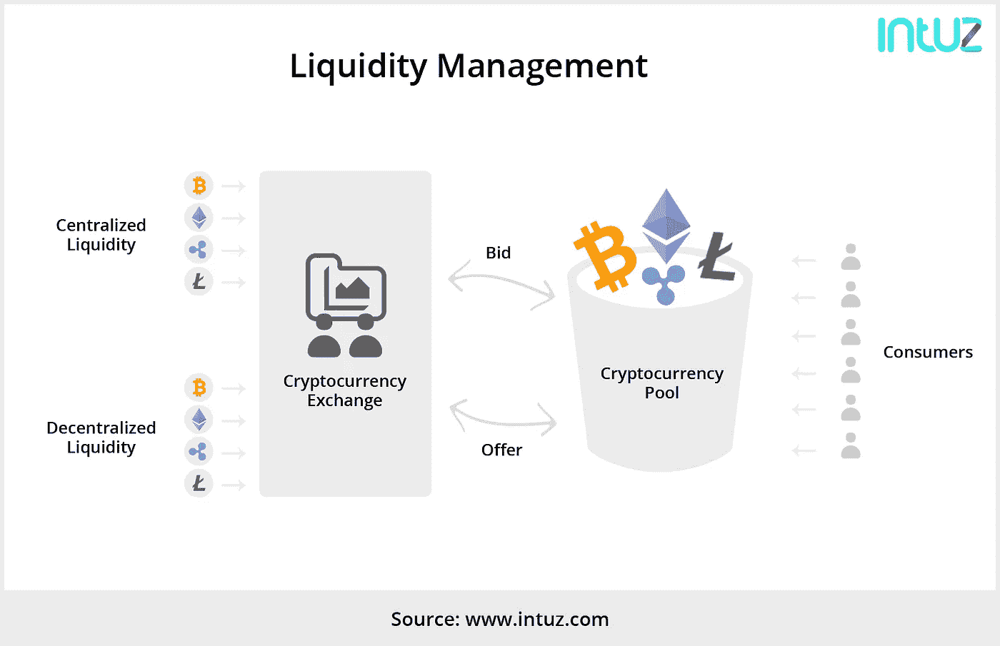
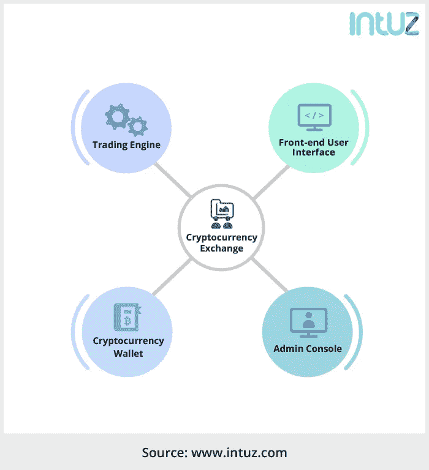

# 如何搭建加密货币兑换 App

> 原文：<https://medium.com/swlh/how-to-build-a-cryptocurrency-exchange-app-d463d3e0ccb3>

加密货币作为全球交易媒介的受欢迎程度已经飙升至极高水平。事实上，比特币的受欢迎程度每个月都在持续增长。在这样一个充满希望的市场中，企业家和机会寻求者希望利用这个机会带着加密产品进入市场。而在大规模炒作的状态下，还有什么能比加密货币兑换 app 更好呢？

随着全球交易量的不断增长，对加密货币交易应用的需求将继续上升。在这种情况下，推出一款高端加密交换应用远比想办法挖掘比特币代币要好得多。通过成为中介和有效地处理交易，企业家可以赚取巨大的利润。

> 全球区块链市场规模预计到 2025 年将达到 5700 万美元。

# 加密货币交易所的兴起

随着比特币越来越受欢迎，世界各地的企业都在寻找比特币交易方式。这为加密货币交易领域带来了巨大的发展机遇。加密交易所使用法定货币(如美元、卢比、日元等)促进加密货币的交易。使用交易所，用户可以轻松地买卖加密货币，并在短期和长期获利。

# 发展加密货币交易所:值得思考的问题

## 操作范围

在做任何事情之前，设定你的加密货币交易所的操作范围是很重要的。这一点至关重要，因为您需要根据运营范围获得必要的批准。你必须考虑根据当地或全球法律许可和注册交易所。

## 法规和合规性

加密货币是一个热门领域，几乎全球所有政府都对加密货币和交易所的使用持严厉态度。作为一个希望开办加密货币交易所的人，你的企业需要遵守 KYC 规范。这意味着你将被要求获得文件，以核实客户的身份，并保持相同的记录。这对于消除通过加密货币交易洗钱的机会至关重要。

为了遵守法规，在交易所中集成客户验证 API 并开发后端数据库以保存适当的记录是很重要的。

## 支付处理

为了能够将法定货币支付转换为加密货币，您需要一个支付处理合作伙伴，如银行。如果你在不发达国家工作，请记住这些国家银行的贸易结算周期。

在高效的支付处理合作伙伴和支付网关 API 的帮助下，您将能够让用户随心所欲地增加和提取资金。

## 流动性管理

**(Image Source:** [**Intuz.com**](https://www.intuz.com/?utm_source=Medium-post&utm_medium=Liquidity-mngt-image&utm_campaign=cryptocurrency-blog)**)**

流动性是加密货币交易市场成功的一个重要方面。交易所的交易决定了其流动性状况，如果没有繁忙的交易活动，任何加密货币交易所都无法生存。为了管理您的交易所的流动性，您需要将您的加密货币交易所的流动性头寸整合到其他现有交易所。

这可以在现代 API 接口的帮助下完成，该接口在两个交易所之间共享流动性和交易量数据。成为加密交换网络的一部分也有利于提高流动性。

## **为客户数据建立高级别的安全标准**

投资总是有风险的，但有了加密货币，一切变得如此简单和安全。加密货币交易所是这样一种平台，它提供了一种买卖数字货币的媒介，根据 bitcoin.com 的[，大约有 500 家交易所可供选择。因此，在做出任何决定之前，选择好的研究，阅读相关的评论，并与有经验的投资者进行富有成效的交谈。](http://bitcoin.com)

## **创建客户支持渠道**

客户支持渠道已经成为每个软件或产品都必须加入的东西。对于为您的客户的所有查询提供即时答案，交互式客户支持渠道将发挥重要作用。当涉及加密货币交易时，你必须采用客户支持渠道，为你的客户群提供最好的帮助。

## 加密货币支持

**(*Image source:*** [***TechCrunch***](https://techcrunch.com/2017/06/08/how-ethereum-became-the-platform-of-choice-for-icod-digital-assets/)**)**

据 [**Coinmarketcap**](https://coinmarketcap.com/all/views/all/) 统计，目前市场上活跃的加密货币超过 1500 种。事实上，随着以太坊平台的引入，新加密货币的引入率大幅上升，以太坊平台能够轻松推出新的加密货币。在竞争激烈的时代，决定交易所将支持的加密货币数量非常重要。

平台支持的加密货币越多，开发专用 API 以获取历史价值、实时图表和下达买卖订单的投资就越大。

# 加密货币兑换应用的基本组件

**(Image source:** [**Intuz.com**](https://www.intuz.com/?utm_source=Medium-post&utm_medium=crypto-compo-image&utm_campaign=cryptocurrency-blog)**)**

一旦你完成了关于加密货币兑换业务的重大决策，你需要弄清楚加密货币兑换应用的基本架构。任何加密货币交易应用程序都必须快速、直观且功能强大，才能取得成功。为实现这些目标，应用程序应具备以下组件:

> 1.交易引擎
> 
> 2.前端用户界面
> 
> 3.加密货币钱包
> 
> 4.管理控制台

除了这些基本功能，每个加密货币兑换应用都应该有额外的功能，这些功能可以在收集用户反馈或分析全球顶级兑换应用后开发出来。让我们详细了解一下该应用的关键组件:

## 交易引擎

交易引擎是任何交易所的核心，负责交易的运行。执行交易、计算余额、访问订单簿以及匹配交易所中的所有买入/卖出交易至关重要。

在构建加密货币应用程序时，设置交易引擎应该是首要任务。如果没有功能引擎，加密货币 app 就只是一个没有任何价值的空壳。

## 前端用户界面

这一部分尤其是你的交易所的门面，即用户如何看待交易所。确保用简约的方法建立一个用户友好和直观的界面，以提供令人惊叹的交易体验。远离杂乱将提高简单性，使用户更容易执行交易订单。构建此组件时，请确保它具有以下功能:

*   用户注册和登录
*   资金存取
*   查看订单簿、交易、余额、统计数据、图表等。
*   购买/销售订单
*   支持功能

## 加密货币钱包

嵌入对加密货币钱包的支持对于加密交换是必不可少的。所有加密代币/硬币都将存储在用户的钱包中。开发具有增强安全性的钱包解决方案将有助于发展用户和您的加密货币交易所之间的信任。

钱包是交换服务器上的一个守护程序，可以在适合该目的的脚本或 API 的帮助下集成到加密货币交换应用程序中。

## 管理控制台

管理控制台将帮助交易所运营商/所有者管理加密货币交易所的不同操作方面。控制台的功能可以根据特定的业务需求进行定制，但通常情况下，每个管理控制台都必须可以选择编辑交易费用、管理加密货币列表、添加新货币、向钱包中贷记/借记资金以及解决支持问题。

## 我如何获得 exchange 软件？

> 内部开发
> 
> 使用开源脚本
> 
> 白标交换软件

**构建一个加密货币 app 需要多少时间和成本？**

毫无疑问，加密货币的流行是进化而来的。现在，每个企业都在考虑开发自己的加密货币应用。但有一个问题始终萦绕在他们的脑海中，即创建一个加密货币应用程序需要多少时间和成本？

要知道这个答案，首先了解加密货币应用程序开发中涉及的整个流程方法是很重要的。

将上述组件整合到一个应用程序中，必将产生一个功能强大的加密货币兑换应用程序。如果您寻求有关加密货币交换的专家帮助或完整的开发支持，Intuz 可以提供帮助。[**Intuz**’](https://www.intuz.com/?utm_source=Medium&utm_medium=Medium-post&utm_campaign=cryptocurrency-blog)专家团队拥有丰富的相关 API、开发堆栈和解决方案知识，能够加快加密货币交易所的开发步伐。有了这个，任何企业家都可以推出一个高效的加密货币兑换应用程序，而不必陷入理解技术方面的麻烦。寻找专家提示或指南？ [**今日联系 Intuz】！**](https://www.intuz.com/contactus?utm_source=Medium&utm_medium=Medium-post&utm_campaign=cryptocurrency-blog)

> **也可以看看我的新文章:** [如何推出和营销你自己的加密货币/ICO](/swlh/how-to-launch-and-market-your-own-cryptocurrency-ico-33dbebecf382)

我希望这可以帮助你了解加密货币应用程序交换的基础知识。文章最初发布在 Intuz.com

**请继续关注我们的 [Twitter](https://twitter.com/IntuzHQ) 、[脸书](https://www.facebook.com/Intuz/)和 [LinkedIn](https://www.linkedin.com/company/intuz) 网站，了解我们的其他有趣新闻！**

****

## **这个故事发表在 [The Startup](https://medium.com/swlh) 上，这是 Medium 最大的创业刊物，拥有 333，853+人关注。**

## **在这里订阅接收[我们的头条新闻](http://growthsupply.com/the-startup-newsletter/)。**

****