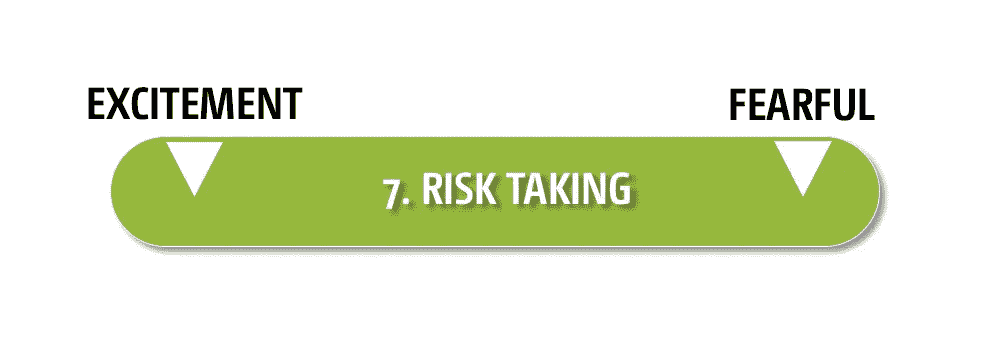
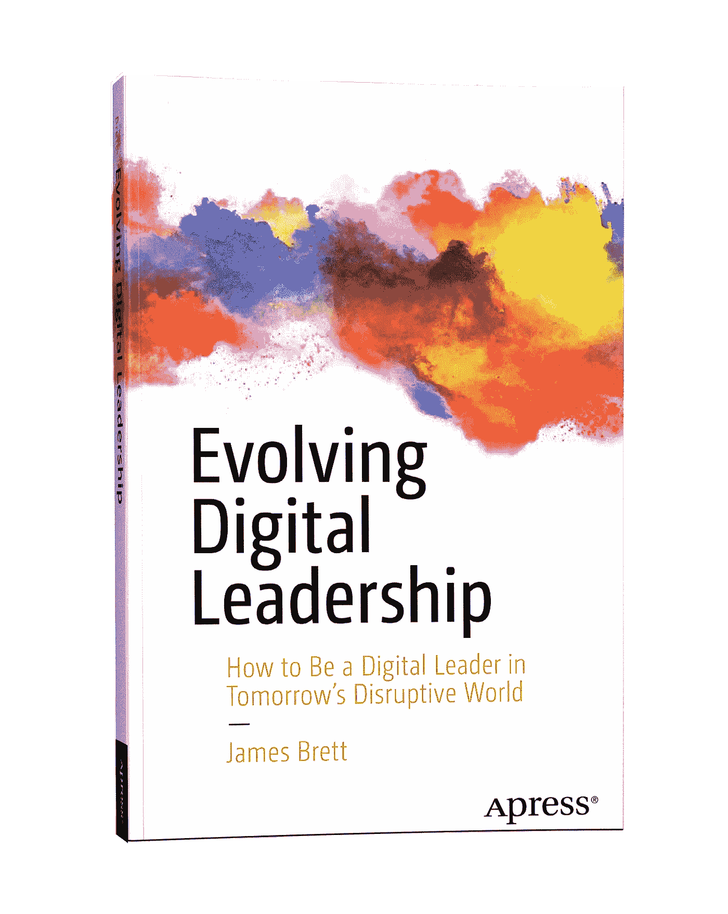

# 如何建立一个颠覆性的组织:第 1 部分(共 3 部分):颠覆性思维揭秘

> 原文：<https://medium.com/swlh/how-to-build-a-disruptive-organization-part-1-of-3-the-disruptive-mindset-demystified-272149692ae5>

到目前为止，我已经多次介绍和谈论过颠覆。每次我都会问观众以下两个问题:

1.  谁认为颠覆性很重要？
2.  谁认为他们的组织具有足够的破坏性？

答案几乎总是一样的:几乎每个人都认为颠覆性很重要，几乎每个人都认为他们的组织还不够颠覆性！

主要问题是很难定义中断和破坏性的元素。是某种可以完成的活动吗？这是组织的个性或文化特征吗？或者是做事的方式释放了一个组织的全部颠覆性潜力？

我的答案是，当我们理解并培养以下三个要素时，破坏性会大大增加:

1.  破坏性思维
2.  破坏性策略
3.  破坏性领导

在这 3 篇文章的第 1 部分中，我将讨论破坏性思维的 7 个要素，以及一些人和团队是如何适应高度破坏性的。

# 1.破坏性思维

人们通常认为心态是成功的关键挑战或组成部分。很多时候，没有详细说明所谓的“心态”是如何运作的，以及为了成功需要发展、消除或扩大什么。我将打破这一传统，直接谈论颠覆性思维的 7 个关键要素，以及如何利用它们来增加颠覆性潜力。

我们的思维模式是由我们头脑中运行的元程序形成的。顾名思义，元程序就像微服务——在大脑的元层面上运行的小软件，创建了一个思维框架。

当我们在头脑中重建外部世界时，每一个元程序都改变了我们感知外部世界的方式，并且每一个元程序都是特定的。迈可·何的神经符号学著作，尤其是他的著作《理解人》，确定并描述了我们所有人运行的不同元程序。

如果你曾经做过迈尔斯-布里格斯性格评估，你会得到一个四个字母的结果，如 ENTF 或 INTJ。这四个字母代表迈尔斯-布里格斯的想法(不是

我的)描述人类的关键元程序。(我不会在这里深入解释为什么我不喜欢迈尔斯-布里格斯的简介。如果你想知道我的想法，给我发电子邮件或查看这本书的第九章。)

迈尔斯-布里格斯评估令人困惑地为每个元程序返回一个字母，表示他们已经确定你的个性处于元程序连续体的哪一端。四个字母中的第一个不是“I”就是“E ”,表示我们是属于内向型还是外向型。内向者和外向者实际上是返老还童元程序的相反两端，如图 1 所示。

Figure 1: The Rejuvenation meta-program

元程序是一个连续的光谱，而不是二元选择。在返老还童元计划的例子中，一个有野心的人(既内向又外向的人)每次参加评估时可能会得到一个不同的字母。

元程序是由我们重复的思想和情感以及我们随着时间的推移而习惯的精神状态构成的。很多这样的元程序在我们生命的早期就建立了，并成为我们人格的关键属性。好消息是元程序是可重新编程的！就像习惯一样，它们需要时间和努力，但是我们可以改变它们。有时它们会自己改变，无需我们有意识的努力。有时他们需要真正的专注、决心和时间来改变。

# 破坏性思维的 7 个元程序

我们的大脑运行着 60 种不同的元程序，它们都影响着我们思考和感知现实的方式。虽然所有 60 个元计划都有可能影响我们的破坏性，但有 7 个关键元计划最具影响力:

# 1.时区

时区元程序(图 2)决定了我们关注时间的地方。对于我们这些更关注过去的人来说，我们回忆记忆(积极的和消极的)并反思过去发生的事情，以了解这个世界。其他人关注未来，关注可能会发生的事情。有时，这会带来焦虑(对未来可能出错的恐惧)或兴奋(未来可能正确的可能性)。最后一组人更关注当下，当前的时间和地点，正在发生的事情，他们在哪里，他们和谁在一起。

Figure 2: Time Zone Meta-program

正如你可能想象的那样，如果你总是专注于过去或现在，就很难有破坏性。破坏性思维能够从过去学习，但会花更多的时间关注未来。它着眼于组织、行业、技术和社会的趋势，以创造和应对破坏。

# 2.更换适配器

变更适配器元程序(图 3)可能是最接近我们所说的“创新者元程序”的。它决定了当变化发生时，我们是倾向于早期采用、中期采用还是晚期采用。早期的适应者拥抱变化，并被它激励，后期的采纳者对抗和抵制变化。这种元程序通常是由我们对变化的信念构成的，这种信念是通过我们对所经历的变化的具体体验而形成的。因此，如果我们认为改变是痛苦的，我们所做的任何改变都会随着时间的推移而恢复，那么我们很可能是一个改变的迟到的适应者，如果不是抵制我们所经历的任何改变的话，我们也会抵制。

Figure 3: Change Adapter Meta-program

那些早期适应变化的 T2 人持有破坏性思维。他们对变化持积极态度，并享受变化的过程。他们在变化中茁壮成长，却常常对缺乏变化和常态感到厌倦。

# 3.权威来源

权威来源元程序(图 4)处理我们在哪里寻找做事情的权威或许可。当我们有一个内部权威来源时，我们审视自己，确定我们是否被“允许”做某事，或者做某事是否是“正确”的。如果我们有一个强大的外部权威结构，我们会向其他人寻求帮助，比如思想领袖、更高层的领导人和那些展示自信和权力或权威感的人物。

Figure 4: Authority Source Meta-program

这种破坏性思维是由**内部**权威来源助长的。颠覆通常意味着在不可能为他人寻求指导和权威的地方做一些新的和创新的事情。强烈的内部权威感在别人看来就像是对我们的行为和决定的信心。它经常会让我们努力去做一些其他人会等待指导或允许去做的事情。

# 4.关系比较

关系比较元程序(图 5)决定了我们与接收到的新信息的关系。我们是将它与我们已经知道的东西相匹配，并寻找它的相同之处，还是寻找它与我们已经知道的东西的不同之处？为匹配而连线的人将首先识别产品、商业模式、技术等的相似性。不匹配者将立即识别两个选项之间的差异。

Figure 5: Relationship Comparison Meta-program

虽然看到相似之处对建立团队和文化很有好处，但它常常会妨碍我们的破坏性能力。根据定义，颠覆和创新是指以不同的方式做事，创造新的不同的组织和产品，即**与现状**不匹配。

> *“我们所做的一切，* ***我们信奉挑战现状*** *。* ***我们相信思维方式的不同。我们挑战现状的方式是让我们的产品设计精美、使用简单、用户友好。我们只是碰巧制造了很棒的电脑。想买一个吗？”***

*西蒙·西内克关于苹果如何沟通的话摘自他 2009 年的 TED 演讲:伟大的领导者如何激励行动*

# 5.场景类型

场景类型元计划(图 6)影响我们认为场景将如何发展——我们是否对未来持乐观态度，认为一切都会好起来？还是我们悲观，处理可能或将要出错的事情？在社会上，乐观主义者被更积极地看待；他们乐观向上，吸引周围的人。大多数人不明白的是，乐观主义者可以成为非常低效的领导者。过于乐观的人会冒更大的风险，往往不会做太多计划，也不会在需要的时候采取行动，因为他们认为一切都会好的。

Figure 6: Scenario Type Meta-program

然而，破坏性思维有一种强烈的乐观感，认为这个人可以以积极的方式改变和破坏未来。没有这种乐观，人们不会尝试新事物，或者不会全力以赴去获得成功，相反，只会经历一个以失败告终的过程，因为这是他们所期望的。

# 6.传统的

传统的元计划(图 7)涉及我们如何思考如何“融入”他人、我们的团队、组织、行业和社会。循规蹈矩的人希望融入、被人喜欢、成为群体的一部分，并寻求群体的认可。不合规者不关心规范和流程，有时会被认为不是“团队成员”。不墨守成规的人通常富有创造力和创新精神，他们经常会发现许多新的有趣的选择和常态的替代品。

Figure 7: Conventional Meta-program

这个元计划的**非墨守成规**端支撑着这种破坏性思维。如果你的元程序当前配置有一个强烈的从众偏好，那么它几乎不可能是破坏性的。

# 7.风险

冒险元计划(图 8)影响我们如何应对可能对我们的声誉、成功或职业造成潜在危险的新事物、新经历和新情况。具体来说，冒险元程序会影响我们感知风险时的感受。我们是普遍害怕结果，还是普遍对结果的潜在好处感到兴奋？大多数个人和领导者喜欢认为他们是破坏性的，并在他们的角色中拥抱风险，然而，大多数人并不像他们认为的那样拥抱风险。

Figure 8: Risk Taking meta-program

感到一些恐惧并不一定会阻止我们的破坏性。然而，破坏性的个人和团队对潜在的结果感到更多的**兴奋**，而不是害怕风险。颠覆是一件充满风险的事情。对风险的恐惧阻止了我们真正的颠覆性，并且(像悲观主义者的情景类型)让我们看到我们在从事那些我们贴上颠覆性标签的项目，但实际上这些项目是相当安全和没有颠覆性的。

# **颠覆性思维**

如图 9 所示，破坏性思维包括对这 7 个元程序中的一个的偏好。重要的是要记住，元程序既是上下文特定的，也是可以重新编程的。也就是说，可能会有这样的情景:一个人表现出高度破坏性的思维模式(比如在工作中使用技术),而其他人(比如在家里使用财务工具)则没有。

Figure 9: The Disruptive Mindset

# **自己进行自我评估**

你认为你目前的心态有多混乱？你需要在你的角色或你未来的理想角色中有多大的破坏性？花些时间思考你是如何运作的，你的 7 个元程序是如何配置的，以应对或避免中断。你可以在这里下载破坏性思维自我评估[来帮助你反思。](https://evolvingdigitalleadership.com/wp-content/uploads/2018/09/Disruptive-Mindset-Self-Assessment.pdf)

# **颠覆性团队**

团队的颠覆性潜力来自于团队中拥有颠覆性思维的个体数量。最好的团队是多样化的团队。一个非破坏性思维的团队将努力创新和颠覆，而不是寻求稳定、一致和更安全的运营模式。同样，一个具有高度破坏性思维模式的团队会在一个组织内造成巨大的干扰——他们的思维模式就是不一致，不匹配人员、团队和标准，并在可能的情况下打破常规。组织通常需要破坏性和非破坏性团队的混合，以适当的方式创造破坏性和稳定性。

如果你想创建一个颠覆性的团队，那么你需要让团队中持有颠覆性思维的人占更高的比例。你可以使用 7 个元计划和破坏性思维自我评估来更好地了解个人思维的破坏性，并创建一个你认为适合你的团队。

然而，如果你有一个现有的团队(你不能修改),并希望提高他们的中断水平，我强烈建议主持一个中断研讨会，让团队谈论中断思维的概念及其 7 个元计划，将他们自己的思维作为一个小组进行评级，并就中断以及它对他们在组织内提供的产品或服务的成功意味着什么进行分享。

# **第二部分:颠覆性战略**

在第二部分，我探讨了颠覆性组织的第二个组成部分——颠覆性战略及其在推动创新和文化方面的重要作用。

> **注**:本文提出的概念是基于我在 2018 年出版的《进化数字领导力》一书中的人类全栈模型。更多信息可以在这里找到:[https://evolvingdigitalleadership.com/](https://evolvingdigitalleadership.com/)

*更多车型和书籍信息请查看:*[*https://evolvingdigitalleadership.com/*](https://evolvingdigitalleadership.com/)

在推特上找到我[https://twitter.com/JamesCuriously](https://twitter.com/JamesCuriously)

已连接:【https://www.linkedin.com/in/james-brett/ 

## 这篇文章发表在[《创业](https://medium.com/swlh)》上，这是 Medium 最大的创业刊物，有+ 370，771 人关注。

## 在这里订阅接收[我们的头条新闻](http://growthsupply.com/the-startup-newsletter/)。

