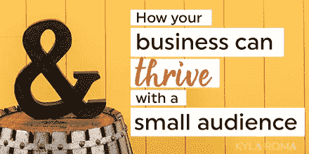

# 如何围绕你的品牌建立一个高度参与的社区

> 原文：<https://medium.com/swlh/how-to-build-a-highly-engaged-community-around-your-brand-16e2e548e6a4>

当你看网上商业世界时，不难得到这样的印象:成功之路只有一条。吸引成千上万的用户，以 97 美元的价格卖给他们一个产品，然后冲洗并重复，直到你有一个六位数的业务。听起来熟悉吗？现在，一大群观众会受伤吗？当然不是。但是成功需要大量的观众是完全不正确的。

今天的帖子将向你展示成功的其他有意的小版本。

我就从我最了解的业务开始——我自己的！我的业务由一项服务组成，即一对一的商业战略咨询。去年，它创造了不到六位数的收入。它让我的丈夫辞掉日常工作，让我们建立了一个家庭，在那段时间里，我的电子邮件列表有了大约 2000 名订户。

你可能想不到:**我的收入没有一分来自向我的列表销售**

我的客户都是其他专业人士和老客户推荐的，或者他们是通过我的销售页面询问的博客读者。我不需要推销。

> 这就是做利基业务的魔力。

利基业务专注于与较小的受众建立深度联系。这个想法是为一个由志同道合的人组成的小型互动社区提供最大的价值。作为交换，你可以收取更高的价格，因为你可以解决专门的问题。

这种方式与通常推动创建一个巨大的社区或花费数千美元做广告的方式有很大不同。(我看到你了，教练沉迷于脸书广告！)相反，利基商业方法专注于围绕你的品牌建立一个小型的、高度参与的社区。

今天，我想分享两个成功的利基企业主的故事，他们是我过去的客户。他们都通过为特定的社区提供巨大的价值而建立了成功的小企业。

每家公司都向特定的客户群出售较高的投资服务，而不是向大众出售低价产品。我想他们会像激励我一样激励你。

# 围绕情感联系建立社区

[Ale Vidal](http://www.ale-vidal.com/) 是一名电影制作人，擅长导演和制作视频内容。她的作品以一种情感的、发自内心的方式将品牌与观众联系起来。作为一名讲故事的专家，Ale 的作品带她走遍了世界各地，并点燃了观众的情感联系。她的潜在客户群体很小，她的工作很受欢迎。以下是她的故事，用她自己的话说:

**是什么让你的企业周围的社区与众不同？我的社区由有远见的人和艺术家组成，他们用自己独特的眼光和故事创造出独特的审美。他们崇尚原创，如果这意味着创造一个更好的故事，他们不怕冒险。**

我们成长的方式，我们体验生活的方式，让我们好奇，影响了我们对艺术和品牌的个人态度。我帮助我的社区揭示这一点，并通过视频将它带入生活，以便他们的客户了解他们工作的广度。

你是否有意限制你的观众数量？
我想说我的工作性质限制了我的观众数量。我的方法是深入和亲密的，包括很多一对一的时间来揭示他们品牌的独特特征。这种水平的创造性能量和时间对于为我的客户和他们的观众创造独特和吸引人的东西是必要的。

**你如何吸引你的观众？**
我相信我的观众和我有着相同的价值观——联系、情感和美。因此，当我分享内容时，无论是幕后的图像还是我客户电影的一部分，我都确保它符合这些价值观。我的客户喜欢以不同的方式思考，所以我非常愿意分享与他们挑战极限的热情产生共鸣的内容。

**随着您的社区不断发展壮大，您如何保持关注度？在过去的一年里，我学到的最大的教训是关于消耗能量和记住事情需要时间。老实说，我不得不学会不焦虑地坐在停顿中，并总是检查我的价值观。当我与我的价值观一致时，不管我的社区如何变化和发展，我都能更好地保持专注。**

在你看来，观众少有什么好处？通过全心全意地关注一小群人，我与他们建立了忠诚。我赢得了他们的注意。人们会听取他们信任的人的意见并从他们那里购买，同时保持参与，因为他们觉得他们不仅仅是一笔交易。

通过与一小部分观众建立关系和亲密关系，我已经成为他们的支持者和引导者。没有什么比与我的客户坐下来，倾听，理解他们的愿景，并通过视频给他们一个声音来实现这一愿景更让我兴奋的了。

[*在 Instagram 上查看更多 Ale Vidal 的作品*](https://www.instagram.com/alevidal/)

# 围绕有意的简单性构建社区

Brooks Editorial 的 Ashley Brooks 让博客和内容策略对企业家来说更快、更容易、更有效。她的客户希望专注于他们的业务，而不是陷入永无止境的忙碌生活中。她是一名内容策略师、作家、播客主持人，也是一名在家工作的妈妈，有一个小型的互动社区关注她的工作。以下是我对她的采访:

是什么让你的社区与众不同？
我吸引了很多妈妈企业家和兼职皮条客，因为他们一生都没有时间做生意。在我的社区里，许多人都在犹豫是否能让他们的生意和其他承诺一起运作。我工作的很大一部分是鼓励他们，让他们可以拥有一个适合他们现有生活的成功企业。

**你是否有意限制你的观众数量？**
我没有限制我的追随者的最大数量，但我确实限制了我的听众，只对某些人说话。几乎每个在线企业家都有一个博客，但我不是帮助他们所有人的合适人选。我只适合和那些有意写博客的人一起工作，这样他们就可以把更多的时间放在生活上。如果有人喜欢过忙碌的生活，我不适合他们——没关系！

你如何吸引你的观众？我确保我发送的每一封电子邮件简讯(即使是自动发送的)都包含个人邀请，让人们联系我，即使只是打个招呼！我每周都会收到想要联系我的新粉丝或老读者的电子邮件，告诉我他们的旅程。因为我的听众比一般人少，所以我很容易做出回应，并真诚地了解我的员工。

随着社区的发展壮大，你如何保持关注度？我保持我的信息的意图性和简单性，而不是在博客和商业中赶时髦。老实说，有时改变我的核心信息很诱人，但我知道这不值得。我经常不得不戴上眼罩，这样我才能调到最适合我的观众的节目。

在你看来，观众少有什么好处？
就个人而言，我实际上了解我的大部分观众！这让我通过我的内容和付费服务给他们带来了更多的价值。我是一个内向的人，所以这让我更愿意把自己放在外面，对我的人完全透明。我每月与我的电子邮件订阅者分享我的业务的幕后工作，如果我觉得我在给一群陌生人发电子邮件，我就做不到这一点。

[*在这里了解更多关于布鲁克斯的社论*](https://www.brookseditorial.com/work-with-me)

—

在这两个故事中让我印象深刻的是 Ale 和 Ashley 与他们的社区建立的深厚联系。在我看来，这是成功吸引任何观众的关键——尤其是小观众。

当你不再试图成为每个人的一切时，作为企业主和“部落首领”，你有可能与每个人单独联系。你可以对他们的处境感兴趣，倾听他们的故事，并以更深入、更有意义的方式为他们服务。

> 专注于深度联系的企业更容易以少胜多。

突然之间，更少的流量或更少的观众并不意味着更少的收入和自由。相反，你与更少的个人客户合作，产生更大的影响并获得更高的价格。

这是适合你的社区和推广模式吗？也许吧——尤其是如果你喜欢深入主题，与你的人建立个人联系，并对你所服务的个人产生影响。

感到不知所措，不知道如何推销自己的产品和服务？准备好让营销变得不那么复杂了吗？让我来帮忙！ [*注册参加我的免费营销研讨会*](https://www.kylaroma.com/a-workshop/register/) *学习在线企业主使用的简单系统，通过不完美的社交媒体存在、比你认为需要的更少的受众，以及通过成为他们有用的自己来进行销售。*

*The post* [*如何围绕你的品牌建立一个参与度高的小型社区*](http://www.kylaroma.com/build-a-highly-engaged-community/) *最早出现在*[*Kyla Roma*](http://www.kylaroma.com/)

## 这篇文章发表在 [The Startup](https://medium.com/swlh) 上，这是 Medium 最大的创业刊物，拥有 275，554+人关注。

## 在这里订阅接收[我们的头条新闻](http://growthsupply.com/the-startup-newsletter/)。

