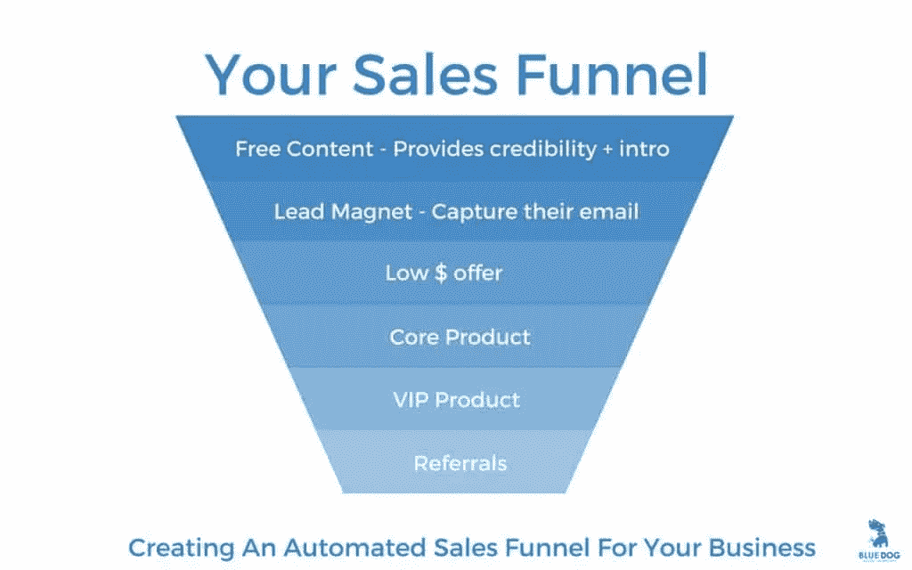

# 如何建立基于媒介的销售漏斗

> 原文：<https://medium.com/swlh/how-to-build-a-medium-based-sales-funnel-8f8d259206a2>

Photo by [Álvaro Serrano](https://unsplash.com/photos/-kr8XPYuSI8?utm_source=unsplash&utm_medium=referral&utm_content=creditCopyText) on [Unsplash](https://unsplash.com/search/photos/selling?utm_source=unsplash&utm_medium=referral&utm_content=creditCopyText)

## 作为销售线索生成工具的媒介。

媒体最有效的商业用途是作为一个潜在客户生成工具。你提供有价值的内容，建立读者的信任，让他们订阅你的电子邮件列表，然后专注于销售转化。

除此之外，Medium 实际上没有任何其他潜在的商业功能。当然，这同样适用于个人博客。

**在向 Medium 投入大量资源之前，有一些事情需要考虑:**

*   媒体受众并不热衷于离开这个平台，这使得人们很难转化为电子邮件订户。
*   永远不要试图通过媒体直接销售任何东西，也不要把人直接送到销售页面。这只会产生不信任。
*   人们来这里是为了获取信息和阅读。很大一部分人甚至不愿意为媒体订阅支付 5 美元，更不用说为其他产品付费了。
*   你对你的媒体博客没有任何控制权。该算法可能会在任何时间点改变，你正在失去你的大部分流量。

另一方面，媒体有固定的受众。

这意味着，对于刚刚开始内容营销策略的人来说，与普通的“自有”博客相比，接触大量的人要容易得多。

**建议 1:**

永远不要使用媒体作为你的主要内容枢纽。它可以是一个很好的联合工具，也可以是一个接触特定受众的工具(例如，利用初创公司接触科技企业家)，但不应该被用作独立的博客。

# 第一步:

## 明确你的目标。

Photo by [Artem Kovalev](https://unsplash.com/photos/fk3XUcfTAvk?utm_source=unsplash&utm_medium=referral&utm_content=creditCopyText) on [Unsplash](https://unsplash.com/search/photos/goals?utm_source=unsplash&utm_medium=referral&utm_content=creditCopyText)

你能做的最糟糕的事情就是开始投入大量精力在媒体上，仅仅因为你认为这是获得大量流量的好方法。没有一个具体的计划，你想怎么处理这些流量，所有这些都是没有意义的。

我举个个人的例子吧。

在我进入媒体的前 8 个月，我相当成功地吸引了一批观众。但是我和那些观众没有任何关系。我只是在我的个人资料中有一个指向我的电子邮件注册表单的链接，并在我所有文章的末尾有一个指向我的注册表单的链接。

我基本上只是在文章末尾复制粘贴了同样的文字。我在 Medium 上看到一个最大的作家使用这种风格，然后简单地将它复制到每一篇文章中:

> 如果你觉得这篇文章有用，请👏并与你的朋友分享。记住，你最多可以鼓掌 50 次——这对我真的很重要。
> 
> 你也可以通过[点击这里](https://mailchi.mp/b0d1e1fba452/struggle-first-thrive-later)订阅我的免费时事通讯。

不出所料，它几乎没有得到任何结果。

虽然我的文章每月可能有 15000-17000 次浏览，但我每月只有 10 个电子邮件订阅者。主要原因是我没有真正的计划。我真的不知道:

*   我想对这种交通做些什么
*   我希望我的读者在阅读一篇文章后
*   我想联系谁
*   一旦人们订阅了，我会做什么

我只是为了吸引观众而吸引观众。我以为一旦我有了这些观众，我就会知道该怎么做了。事实上，我只是浪费了一个将流量转化为有意义的东西的机会。

**建议 2:**

在开始使用 Medium 之前，请明确:

*   你的目标读者是谁，哪些出版物有助于接触到这些读者
*   一旦人们阅读了你的文章并喜欢上它们，你希望他们做什么(不同的行动号召)
*   一旦人们订阅了你的电子邮件列表，你的销售漏斗的下一步会是什么样子
*   你获得这些读者/订户的目的是什么？它们如何融入你的业务大局？

# **第二步:**

## 定义内容策略。

Photo by [Glenn Carstens-Peters](https://unsplash.com/photos/RLw-UC03Gwc?utm_source=unsplash&utm_medium=referral&utm_content=creditCopyText) on [Unsplash](https://unsplash.com/search/photos/strategy?utm_source=unsplash&utm_medium=referral&utm_content=creditCopyText)

仅仅开始在媒体上发布随机内容并期望为你的业务带来真正的结果是没有意义的。你需要的是一个符合你商业目标的内容策略。

**这是什么意思:**

*   你的内容需要与你的目标市场相关
*   你的内容需要解决你的目标市场所面临的问题(最好是解决你的产品所解决的问题)
*   你的内容需要提供价值并建立信任(而不是给人一种俗气的推销印象)
*   您的内容需要成为合理的第一步，让您的客户在购买您的产品的过程中更进一步

始终意识到媒体应该是你与目标受众接触的第一点。人们会说“哦，太棒了！我绝对需要订阅这个！”都很低。

如果人们真的喜欢你的一篇文章，他们可能会先在 Medium 上订阅你的文章。然后，如果他们发现你的许多文章是有帮助的，他们可能会考虑注册你的电子邮件列表。

相应地建立你的策略。

不断解决你的目标客户面临的问题。不断提供价值。最终，人们会注意到。

**建议 3:**

不要在 Medium 上使用公司品牌。我从未见过一个公司账户在这里获得成功(除了经营出版物的媒体机构)。

如果你代表一家更大的公司，那么使用你自己的名字(或首席执行官的名字，并保持内容的个人化。使用相关的个人故事，但也要着眼于解决客户的问题。

# 第三步:

## 将读者转化为订阅者。

Photo by [James Tarbotton](https://unsplash.com/photos/gm18kqu9TxQ?utm_source=unsplash&utm_medium=referral&utm_content=creditCopyText) on [Unsplas](https://unsplash.com/search/photos/readers?utm_source=unsplash&utm_medium=referral&utm_content=creditCopyText)h

> 所以，你通过分享个人故事和解决一些读者的问题，不断地为你的读者提供价值。人们开始相信你是可靠的消息来源。现在，是时候考虑如何将他们转化为电子邮件订户了。

**问题:**

中等真的不太适合。你能真正尝试改变人们的唯一地方是在你故事的结尾，或者在你的简历中。然而，生物学方法几乎从未奏效。

另外，如果你只是简单地说一些类似于“要获得更多这类内容，请点击这里订阅”的话，这在 Medium 上几乎是行不通的。

再说一遍，这里的观众更喜欢待在这个平台上。

他们来这里主要是因为他们喜欢这个平台，并希望在他们已经在的地方继续阅读。

> 所以，你最好的办法是开出一个他们无法抗拒的绝妙报价。在大多数情况下，这可以转化为一份“免费报告”(即一本关于你的读者真正感兴趣的主题的免费电子书)。您提供一个登录页面的链接，人们可以通过提供电子邮件地址获得免费报告。

显然，这不一定是免费的报告。也可以是免费参加网上研讨会或任何你想到的事情。

**重点是，它需要:**

*   对人们有价值(即解决他们面临的问题)
*   你的文章的逻辑发展(即报告应该是和你的文章相似的主题，并且更加深入)
*   易于访问(即，您的读者只需点击一下鼠标和一个简单的登录页面即可访问)

我强烈建议从一开始就准备至少 2 到 3 个不同的免费报告(当你刚刚开始使用 Medium 的时候)。没有他们，你就不太可能将很大一部分流量转化为订阅。

为什么不只是一个？

因为那份**的**报告不太可能和**你的所有**文章很契合。例如，我写的主题多种多样，包括商业、创意、内容营销、博客和生产力。

对其中一个主题感兴趣的读者不一定对其他主题感兴趣。因此，提供一个这样的主题的报告对于那些从另一个主题的文章中来的人来说是完全没有兴趣的。

**建议 4:**

不要犯失去潜在客户的错误。从第一天起，你就需要一个强有力的免费报价。

我在 Medium 上有成百上千的追随者，他们不再活跃在这个平台上。如果我在他们活跃的时候有一个免费的报告，我可能会把他们转化成电子邮件用户。

就这样，他们就永远'*输给了我*。

# 第四步:

## 要清楚“超越”媒介的是什么。

Photo Credit: [Blue Dog Websites](https://www.bluedogwebsites.com)

看上面的漏斗。你在 Medium 上所做的主要与前两个层次相关(首先获得可信度，将这些读者转化为电子邮件订阅者)。

无论接下来发生什么，都是一个完全不同的故事。

介质在这里可能仍然有一个小的作用。例如，您可以向读者发送有关您已发布的新媒体文章的更新。但最终，你现在的目标应该只是两件事之一:

1.  提供更多的免费价值来提供信任(可以是媒体文章的形式，也可以是完全不同的东西)
2.  将您的订户转化为付费客户

关键是，在漏斗的每个阶段，你的行动都需要与你的整体战略保持一致。不要突然谈论一些完全不同的东西，让你的读者感到困惑。

**始终从你要销售的解决方案开始建立你的内容战略:**

比方说，你的高端产品是一种咨询服务，帮助小企业的不同方面的营销(例如，搜索引擎优化，脸书广告，内容营销)。

你可以让人们通过的一个漏斗看起来像这样:

1.  人们在媒体上发现了你的一篇关于脸书广告的免费文章
2.  你向他们提供一份关于脸书广告的免费报告，以换取他们的电子邮件地址
3.  在接下来的几周里，你会给他们发几篇相同主题的文章
4.  他们会买你的书《在脸书做广告:如何利用脸书让你的销售机器运转起来》
5.  他们发现你的书很有帮助，但是他们在执行过程中遇到了困难。所以他们联系你，并最终决定购买你的高价咨询服务

现在，想想这个:你实际上提供了三种服务。在整个漏斗中，你在向你的客户发送关于搜索引擎优化和内容营销的“其他”不相关的信息，这是你的客户不关心的东西。

他们只想解决脸书的广告问题。

在这种情况下，你可能会很快失去潜在客户的兴趣，让他们在测试你的低价报价(这本书)之前就退订。

你需要准备好技术解决方案来追踪你的客户来自哪条路线(例如脸书广告路线)。然后你需要不断给他们他们想要的东西。

如果你不这样做，那么在你将他们转化为付费客户之前，你很可能会失去他们。

**建议 5:**

理想情况下，你应该从第一天起就准备好销售漏斗的所有后续步骤。您应该至少有一个产品和一个免费优惠(例如免费报告/网上研讨会)以及一个电子邮件订阅的登录页面。

此外，您需要具备技术能力，带领您的目标客户走过销售旅程的每一步。

# 结论:

> 如果你意识到它的优势和局限性，媒体可以成为一个有用的营销工具。这是吸引受众的一个很好的工具，但是如果你想让它对你的业务真正有价值，你需要尽快将人们转化为电子邮件用户。

**这里有个小总结:**

*   要清楚媒体如何帮助你实现你的整体商业目标
*   制定一个符合你的商业目标的内容策略
*   在销售漏斗中的每一步，你要传达一致的信息。一次一个合理的步骤带领人们通过漏斗。
*   提供非常有价值的免费服务，让人们成为电子邮件订户
*   确保你制作的所有内容都是个性化的，同时也为你的目标客户提供解决方案，这些方案与你以后要提供的产品相一致

永远不要尝试使用媒体做任何事情，除非它是一个潜在客户创造工具。帮助你与新读者建立信任的工具。一个帮助你增加登陆页面流量的工具。

**你的漏斗不应该是这样的:**

中型商品->销售页面

**它看起来应该更像这样:**

媒体文章->免费报告->电子邮件订阅->通过文章等提供更多免费价值。->缓慢而温和地将人们带到销售页面

[Yann Girard](https://medium.com/u/a65448032c86?source=post_page-----8f8d259206a2--------------------------------) 谈到人们在决定从你这里购买之前，平均需要至少与你接触 7 次。永远不要忘记这一点。

媒介不是销售工具。

这是一个创造销售线索的工具。

你需要的是一个完整的策略，让人们从第一次接触你开始，一直到从你这里购买，每一步都是如此。

# 行动号召:

我整理了一份免费的逐步指南，教你如何围绕你的博客建立一个有利可图的生意。你可以通过[点击这里](https://mailchi.mp/b25ad9dbbbeb/blog-to-business)获得指南。

## 这篇文章发表在 [The Startup](https://medium.com/swlh) 上，这是 Medium 最大的创业刊物，有 353，974+人关注。

## 在这里订阅接收[我们的头条新闻](http://growthsupply.com/the-startup-newsletter/)。

