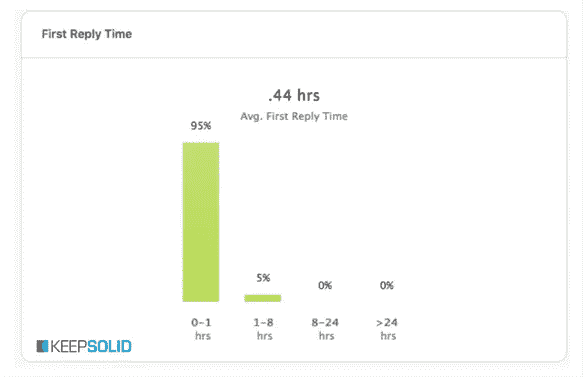

# 如何建立一个数百万人的客户支持部门——我们的成功故事

> 原文：<https://medium.com/swlh/how-to-build-a-multi-million-customer-support-department-our-success-story-fe7246852898>

好的，那么，首先——什么是 [KeepSolid](https://www.keepsolid.com/) ？它是一家拥有超过 700 万客户和众多成功产品的 It 公司，包括 [KeepSolid Sign](https://www.keepsolid.com/sign/) 、 [VPN Unlimited](https://www.vpnunlimitedapp.com/en) 、[路线图规划器](https://www.roadmap-planner.io/)等。

这些成就的取得在很大程度上归功于我们高端、专注、专业的客户支持部门。今天，我们想给他们一份适当的荣誉，并告诉你这个部门的创建故事。你还可以找到一些建议，帮助那些计划建立自己的客户服务，但不知道从哪里开始的人。

我们走吧。

**走过的漫长道路**

我们的客户中心最初只有 2 名代理和一项电子邮件服务。当时我们是一家小型创业公司，每天只需处理 60-70 个请求。但是半年很快就过去了，在我们意识到之前，请求的数量已经飙升到每天 200-400 个。此时，我们推出了脸书和 Twitter 账户，因此，加上电子邮件和商店评论，联系渠道的数量已经增长到 4 个。

此时，我们意识到需要**集中工作流程**和统计数据收集，这导致了 Zendesk 服务的实现。这使我们能够将与客户的所有通信合并到一个工作场所，并开始以一种有组织的方式收集用户反馈。另一个好处是，由于清晰的统计数据，我们能够定义高峰时间，并在这些班次集中更多的支持代理。

像任何工作一样，在客户支持部门工作也有不好的一面——日常任务和偶尔的压力也是其中之一。这一点，再加上代理人在达到一定专业水平后希望调到其他部门，可能会导致人员流动率很高。为了解决这个问题，我们加入了一些激励措施。

首先，我们从 IT 领域借用了员工评级的概念，分为初级、中级和高级。这可以让我们的员工清楚地了解他们的职业前景，以及他们需要什么样的技能和知识来获得晋升。我们还将实时聊天等压力更大、要求更高的工作分配给更高级别的代理，以确保他们能够应对挑战。

客户支持是一个公司的前台，无论是对现有的还是潜在的客户 —我们现任销售经理和前任客户支持主管如是说

我们还制定了严格的员工**招聘和培训制度**。首先，候选人要经历一个小时的面试，我们会检查他们的语言、技术和沟通技巧。之后，他们将接受 2-3 周的培训和教学，然后才能开始实际工作。

**到目前为止**，我们的客户服务已经比我们开始的时候发展得更快了。我们的团队由专业人士组成，他们随时准备帮助我们的 700 万观众。我们在联系渠道中增加了实时聊天和通话功能(最初，仅针对销售问题，且仅在回拨模式下)。我们全天候工作，每天处理大约 **500 个请求**，平均第一次回复时间为**30-40 分钟。**

Photo by [Igor Ovsyannykov](https://unsplash.com/photos/6uWHZ74S5Rk?utm_source=unsplash&utm_medium=referral&utm_content=creditCopyText) on [Unsplash](https://unsplash.com/?utm_source=unsplash&utm_medium=referral&utm_content=creditCopyText)

**障碍和问题**

显然，如此重要和引人注目的部门的发展永远不可能完美无缺。我们也面临着许多问题，并准备与你们分享我们的经验。

1.  **跨部门互动** *。*有时，夜班代理面临一个只有 IT 专家才能回答的技术问题，而他们在凌晨 4 点显然不在。或者，客户报告了一个潜在的重要问题，但是支持部门和 IT 部门目前都忙于日常工作，没有时间一起讨论这个问题。不管是什么原因，缺乏与其他部门的互动总是一个问题，必须尽快解决。

***解决方案:*** 由于这个问题可以以多种方式表现出来，所以需要一个复杂的方法。首先，你需要建立跨部门的沟通(比如使用 Slack)，安排经常性的会议讨论现状。确保你鼓励其他部门向你咨询关于顾客需求和要求的问题。

现在，关于这个问题的另一部分——当出现技术问题时，某些专家不在。为了解决这个问题，我们已经为我们的团队指派了一名特殊的技术支持代理。它是一个深谙此道的专家，可以直接解决用户的技术问题或咨询其他代理。如果这是不可能的，代理的内部培训也可以做到这一点。

**2。人员更替** *。我们之前提到过这个话题，解决这个问题的一个方法是员工激励。然而，我们想把一件事说清楚。如果有什么不同的话，当一个支持代理人在专业上成长并转移到其他部门时，对整个公司来说并不是一件坏事。但是，它确实给支持部门带来了不断寻找新员工的需要。*

***解决方法:*** 首先，建立适当的激励体系。第二，确保你总是提前招聘，而不是试图赶上和修补漏洞。这也包括当你知道客户需求即将增加时的情况，比如在新产品发布期间。

**3。员工参与度和知识。**由于支持代理工作的平凡本质，他们很容易失去对当前事务状态的了解，并开始感觉自己与客户面对面。这对代理人的敬业精神和服务质量都有负面影响。此外，由于我们是一家 IT 公司，除了对任何支持代理的常见要求之外，我们还设置了相当高的技术知识要求。

Our amount of anwers to support tickets for last 2.5 months. Source: Zendesk

***解决方案:*** 要提高员工的参与度，建立一个监控系统和行动后评估是很重要的。这些措施有助于代理了解公司的发展方向、对他们的要求以及原因。此外，交班后报告是检查代理日常工作效率和收集有关最常见用户问题的统计数据的好方法。就技术知识而言，我们发现的最佳解决方案是将内部培训与外部教育资源相结合，如 [Coursera](https://www.coursera.org/) 。

**事后聪明的小技巧**

现在，请允许我们给你一些关于建立你自己的客户支持的提示，无论是初创公司、本地公司还是跨国公司。

*   永远不要低估支持部门的重要性。只有他们直接面对客户，他们知道客户想要什么，让人们在同类产品中选择你的产品是他们的责任。这就是为什么与他们进行跨部门合作是一种用全新的眼光看待问题的廉价而便捷的方式。

第一次回复的时间至关重要。毕竟，如果你在客户出现问题 3 天后才回复，你的答案再正确也没用。” —我们的首席客户官说

*   为了最大限度地缩短第一次回复的时间，你必须确定你的客户支持计划符合你客户的需求。理想情况下—尽可能全天候工作。当然，雇佣足够多的代理人来应付每天的流量。

Our average first reply time. Source: Zendesk

*   在**工人教育**上花足够的时间。大多数客户更愿意打电话给你的联络中心询问问题，而不是钻研你的 FAQ 部分。因此，很明显，他们从支持代理处获得的信息必须是准确和最新的，这一点至关重要。此外，确保每个员工都受到单独教育——这需要更多时间，但可以验证教育质量。
*   在**工人培训**上花费足够的时间。有时候，解决客户的问题是完全不可能的。例如，如果您的公司正在进行定期服务器维护，而客户迫切需要您的应用程序正常工作。这是否意味着你注定会失去这个客户？一点也不！如果服务得当，客户会对你的品牌保持忠诚，即使他的问题没有得到解决——这最终是你的客户支持的主要目标。
*   **不要一味的复制别人的做法**，甚至是我们的！在使用一个给定的方法之前，一定要分析它为什么有效。也许，你的公司结构会鼓励一种完全不同的动机。或者你的产品线需要其他的沟通渠道。或者需要员工具备不同的技能。
*   为您的代理准备一个**信息数据库**。它应该组织良好，包括关于公司及其产品的各种信息，以及问答脚本。这样的数据库将提高员工提供的服务质量，并减少客户互动时间。

**如何为数百万观众服务**

当然，与 700 万用户一起工作有其特殊性，并会对您如何组织客户支持工作产生影响。由于用户数量庞大且需要快速响应，你无法保持与用户的互动个性化。第一次回复的时间必须尽可能短，这是建立一个全职支持是至关重要的。你服务的整体质量也很重要。

我们希望这篇文章能向您解释为什么客户支持是如此重要的一个部门。它是任何面向客户的公司的必备产品，甚至不仅仅是产品或服务。如果你的一些问题还没有得到解答，或者你有与我们相反的经历，请在下面留下你的评论。我们很乐意与您进一步讨论这个话题！

*在*[*Twitter*](https://twitter.com/keepsolidinc?lang=en)*，* [*，【脸书】*](https://www.facebook.com/keepsolidinc/) *和我们的* [*博客*](https://blog.keepsolid.com/) *上跟随我们，踏上为企业创造最佳生产力和安全解决方案的旅程。*

## 这个故事发表在 [The Startup](https://medium.com/swlh) 上，这是 Medium 最大的企业家出版物，拥有 296，127+人。

## 在这里订阅接收[我们的头条新闻](http://growthsupply.com/the-startup-newsletter/)。

