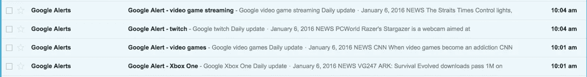
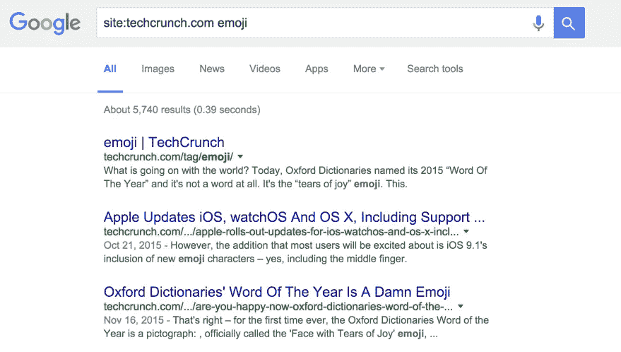
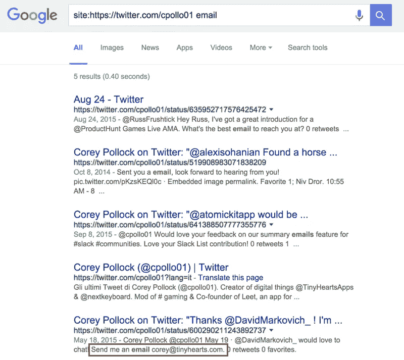
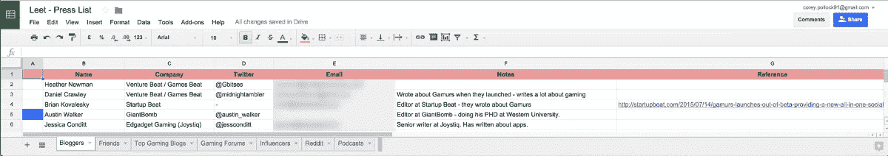

# 如何建立一个让你得到报道的媒体名单

> 原文：<https://medium.com/swlh/how-to-build-a-press-list-that-gets-you-coverage-e40233a1403d>

## 找到相关的博客，收集他们的电子邮件，并组织一个新闻列表

如果你在推广一个产品，在发布时获得关注会很难，因为你不一定有资本投资营销和推广。

在[小心脏](http://www.tinyhearts.com)工作期间，我有机会发布了许多应用程序。所有这些都是靠自力更生发展起来的，所有这些都主要是通过媒体宣传来实现增长和持续增长的。

现在，建立一个包含相关作家的有针对性的新闻列表并不能保证你得到新闻报道。但这只是增加你机会的众多步骤之一。

在这篇文章中，我将带你了解我寻找相关作者、寻找博客作者的电子邮件和联系信息，以及整理你的新闻列表的过程。

# 寻找合适的作家

找到合适的作者是获得媒体最困难的部分。任何一个出版物都有成百上千的作者，可能只有一两个作者适合写你的产品。

在你开始搜索之前设置心理过滤器是决定一个作家是否合适的快速方法。例如，当我搜索推荐我的应用程序 [Leet](http://www.leetapp.co) 的作家时，我使用了以下过滤器:

*   他们写游戏吗？
*   他们写应用程序吗？
*   他们是有影响力的人吗？
*   它们最近是活动的/发布的吗？

现在你有了你的过滤器，你可以出去找你要找的作家了。

# 寻找合适的博客

我总是先在谷歌上做一个更大的地毯式搜索——比如:*顶级游戏博客。*

我还为与我想推广的产品相关的特定关键词设置了[谷歌提醒](https://www.google.ca/alerts)。

My personal Google Alerts for Leet

谷歌快讯每天发送，包括与您输入的关键词相关的文章。这些文章是一个很好的方式来找到谁在写这些主题，并跟上你的产品所在的行业。

如果你怀疑一个博客是否与你的产品相关，使用 **Google site: query** 来查找用特定关键词写的文章。当我为我们的应用程序[表情派对](http://www.tinyhearts.com/emojiparty)搜索相关作者时，我会在博客上查询关于表情符号的文章。

Google site query for TechCrunch articles about emoji

# 找到那些邮件

好了，你已经找到了你想要报道你的产品发布会的作家，但是现在你怎么联系他们呢？

tip@bigtechblog.com 的电子邮件毫无用处，但我们可以不时地将我们推销中的技巧电子邮件抄送给某个特定的作者。

很明显，许多作家倾向于向公众隐藏他们的电子邮件，并且有很好的理由。但如果你能找到它，它会给你一张直接进入他们收件箱的单程票，这能帮助你脱颖而出。

所以我们是这样做的。

## 获得合适的工具

以下工具对于查找人们的电子邮件至关重要。

**实时拉入 LinkedIn 详细信息。这是验证电子邮件的快速方法:**

 **[## 报道

### Rapportive 在收件箱中显示联系人的所有信息。我们结合你所知道的，你的…

rapportive.com](https://rapportive.com/)** 

**[**Name2Email**](http://www.name2email.com) 是自切片面包以来最好的东西。它通过自动列出最常见的电子邮件组合，消除了查找电子邮件的猜测工作。你所要做的就是输入人名，然后输入域名。将鼠标悬停在各种电子邮件上，找到您要找的人:**

** [## 通过姓名查找任何人的电子邮件地址

### Name2Email 是一个轻量级的 Chrome 插件，可以让你直接从 Gmail 中找到任何人的电子邮件地址。简单输入…

name2email.com](http://name2email.com/) 

## 使用谷歌

谷歌网站:搜索邮件时，搜索查询也能派上用场。

许多博主在 Twitter 上发帖，并经常通过 tweet 发送电子邮件。在谷歌上快速查询一下，就会发现这些推文:

# 建立你的媒体名单

Leet Press List

现在你需要一个地方来存放你所有的潜在作家。我更喜欢用以下格式将它们保存在 Google Sheets 中:

*   **第一列:**优先级指示器
*   **第二列:**作者姓名
*   **第三列:**公司名称
*   **第四列:** Twitter 句柄
*   **第五列:**邮件地址
*   **第六栏:**备注(关于此人的有趣相关事物)
*   第七列:参考文献(让我觉得相关的文章的链接)

# 去统治世界吧

这就对了。现在你有了所有的工具、提示和技巧来寻找相关的媒体、获取电子邮件和组织你的媒体列表。

我建议你尽可能在产品发布的时候建立你的媒体名单。随着作者转向其他更相关的主题，这些列表往往会变得陈旧。

最后要记住的是，这只是拼图的一部分。下一步是拥有一个有新闻价值的可靠产品。

如果你有任何其他的技巧或诀窍，欢迎在评论中分享，或者在推特上联系我！

科里是 [Leet](http://www.leetapp.co) ( [@leet_app](https://twitter.com/leet_app) )的联合创始人，这是一款供游戏玩家分享他们最佳游戏亮点的应用。他还是产品设计师 [@TinyHeartsApps](https://twitter.com/TinyHeartsApps) 和 [#gaming](http://www.hashtaggaming.co) Slack 社区的 mod。

**