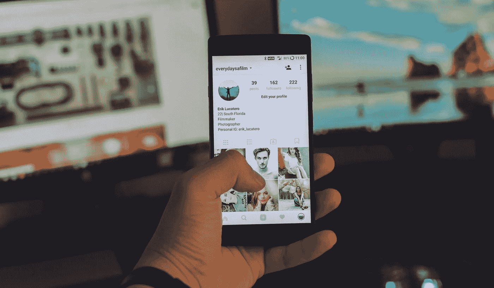

# 如今如何构建一个社交媒体应用

> 原文：<https://medium.com/swlh/how-to-build-a-social-media-app-today-5097341d0067>

Originally published on [http://www.appsterhq.com](http://www.appsterhq.com/?utm_source=CP&utm_medium=Medium)/

当我们想到社交媒体领域时，主要的网络和消息应用程序浮现在脑海中:

> 脸书、Instagram、LinkedIn、Snapchat 和微信。

这个行业很快就感觉到希望进入的新来者遥不可及。

毕竟，现有的平台提供了满足广泛需求的功能，有什么新的东西可以推出来吸引用户吗？

但或许，现在的机会在于利基市场。

以 Strava 为例——作为运动员的社交网络，该应用程序已经获得了[数千万用户](https://www.recode.net/2017/9/30/16389990/strava-social-network-athletes-sports-business-james-quarles)。

还有社交应用工作室 Swipe Labs，它被优步收购，目的是让它的应用感觉更人性化。

这些初创公司表明，即使在拥挤的社交媒体领域，T4 也有可能从市场蛋糕中分得一杯羹。

在这篇文章中，我将触及定义社交媒体应用的核心功能，并分享已被我们在 Appster 合作的初创公司和企业家证明成功的秘诀。

让我们从要点开始。

# 社交媒体应用的核心特性:

## 1.轮廓

个人资料是社交网络应用的一个关键特征；从 Statistia 的一项 2017 年研究[中可以看出，能够让用户积极推广自己账户的应用程序在用户中最受欢迎。](https://www.statista.com/statistics/579334/most-popular-us-social-networking-apps-ranked-by-reach/)

因此，应用程序制造商需要专注于开发一些功能，使用户能够快速、轻松地设置和个性化他们的个人资料，例如上传照片、添加个人信息以及插入博客和个人网站的链接。

一种方法是允许用户通过链接他们当前使用的社交应用程序来设置个人资料，这样他们的个人资料信息就可以被自动检索。

个人资料是自我表达的主要手段，因此它需要具备允许个性化的工具。

这些工具的范围从用于个人资料图片的过滤器和框架，到背景图片和颜色，以及用于个人资料的内容或布局的不同主题。

## 2.饲料

迷因、动画 gif、引人注目的图片、新闻更新——显示在新闻订阅源上的源源不断的内容是让用户参与社交媒体的原因。这些内容通常分为三类:

1.  **更新:**更新是用户分享他们在哪里或者他们在做什么的帖子，比如在 Instagram 帖子上包括他们的位置，或者在脸书地点签到。
2.  **表达:**流行的社交媒体应用通过以下方式迎合用户的自我表达需求:实现增强或使用户生成的内容显得独特的功能，使发布内容的过程尽可能简单，并使用户能够针对不同的受众发布帖子。
3.  **自尊:**这些类型的内容增强了用户的自尊，让他们看起来更好。这些帖子可以展示他们在令人愉快的情况下——比如在异国目的地度假的照片——或者让用户能够从他们的活动中获得奖励的内容。例如，LinkedIn 用户因改进个人资料而获得全明星个人资料状态，而 Swarm 则为增加应用程序签到次数的用户解锁贴纸。

## 3.关系

除了与其他用户交流之外，应用程序开发者还需要建立一些机制，让用户能够相互联系。以下是建立新联系的五种方式:

1.  搜索:搜索机制需要精心设计，以便让用户能够查找现实生活中的朋友和熟人，以及他们渴望在网上联系的个人。除了全名或用户名，还应该添加参数和过滤器，以便用户可以筛选出与他们的需求相关的结果。
2.  **群组:**脸书群组、LinkedIn 群组、Twitter 列表——这些是为了聚集具有共同兴趣和价值观的用户而策划或形成的社区。创建群组可以是一个应用程序的额外功能或关键焦点，就像 MeetUp 和 Citysocializer 这样的社交平台一样。这些面向群体的网络将用户与所在城市的社会群体和事件联系起来。
3.  **社交网络:**在您的用户同意的情况下，可以从其他现有的社交网络获得连接。
4.  **建议:**根据应用程序可以访问的信息，可以做出推荐以连接具有相似兴趣、个人资料或位置的用户。
5.  **内容:**当用户彼此交互并共享内容时，连接就建立了。然而，不同类型的用户以独特的方式接触内容。应用程序开发者需要了解每种类型的用户如何参与内容，这样他们才能更好地设计能够促进不同用户之间互动的提要。

下面显示了不同用户类型的示例，以及他们与内容交互的常见方式:

*   **发现者:**这些用户喜欢不断寻找新内容，因此展示各种内容(从用户生成的内容到趋势新闻)的多个社交媒体源会吸引他们。
*   **搜索者:**虽然发现者乐于浏览新内容，而没有任何特定的目标，但搜索者会寻找特定类型的内容。标签、过滤器和搜索参数是这些用户必不可少的机制。
*   **评论者:**这些人喜欢分享他们的观点，所以像状态更新和评论区这样的功能是让他们开始对话和讨论的关键。
*   支持者:喜欢一份脸书邮报，喜欢一条推特，为一个中等的故事鼓掌——这些人热衷于展示他们对与他们有共鸣的内容的支持。

**创建成功社交媒体应用的 4 个技巧:**

# 1.认识到竞争格局的变化，并快速适应

史蒂夫·乔布斯说，“毕加索有一句话——‘好的艺术家临摹；“伟大的艺术家偷窃”这句话在竞争激烈的移动领域听起来很真实。

应用程序制造商需要密切关注并适应主要竞争对手实施的策略和功能。

这就是像脸书这样的平台蓬勃发展的原因，而其他曾经更受欢迎的网站，如 Myspace 或 Friendster，随着时间的推移变得默默无闻。

最近，脸书通过在 Instagram 上推出故事和自拍滤镜，复制了广受欢迎的 Snapchat 功能。

在 TechCrunch [采访](https://techcrunch.com/2017/05/16/to-clone-or-not-to-clone/)中，Instagram 产品副总裁凯文·韦尔表示:

> 这就是科技行业的工作方式，坦白地说，这也是所有行业的工作方式。好的想法从一个地方开始，然后传播到整个行业。Snapchat 率先推出 Stories 值得称赞，但这是一种格式，将被许多不同的平台广泛采用。”

# 2.了解你的听众，并在他们所在的地方与他们见面

失败的社交媒体应用和网站通常会犯以下错误之一:他们改变了已经运行良好的东西，或者在有更简单的替代方案时，让用户执行额外的操作来参与他们的网站。

MySpace 定制的个人资料创造了一种令人恼火的用户体验——它们通常加载缓慢，难以阅读，设计俗气。

Ping 还强制要求用户在其网站上重建社交网络，而不是与现有网络整合。

关键在于让用户使用你的 app 毫不费力，方便快捷。

这是脸书保持其受欢迎程度的原因之一——该应用程序创建了一个框架，用户可以在不关闭应用程序的情况下执行各种操作。

例如，它在 Snapchat 上采用了广泛使用的功能，这意味着用户几乎没有理由在不同的社交媒体应用程序之间切换。

# 3.迎合特定的利基市场

虽然像脸书这样的网络提供了无数的功能和连接方式，但其广泛的吸引力可能会让用户感到有点失落。

这是小众社交应用可以介入的领域，它为用户提供与一个更小的、精选的、拥有相似兴趣、职业和抱负的群体联系的机会。

一个例子是由美国职业棒球大联盟(MLB)今年推出的社交媒体应用内场聊天。

虽然棒球迷可以很容易地通过脸书的群组或页面联系起来，但该应用填补了 Twitter 或脸书等平台所没有的空白:它为聚集在网上谈论棒球的个人提供了另一种选择，并为 MLB 球员和球迷创造了一个安全的空间，让他们可以与浏览和监管网站的团队进行互动。

# 4.领先于社交媒体趋势

在构思你的应用程序时，走在新兴趋势的前面，了解个人用户以及品牌和营销人员如何受到这些趋势的影响是值得的。

“如今有哪些受用户欢迎的功能和趋势？品牌如何利用这些特性？这些趋势将如何影响更广泛的社交媒体格局？”是你需要考虑的关键问题的例子。

我在下面概述了三种流行的社交媒体趋势:

## 消息传递正在改变社交媒体

在 Buffer 博客上的一篇文章中，内容制作人 Ash Read 指出，通讯应用和机器人的日益流行正在给我们使用社交媒体的方式带来根本性的变化。

对用户统计数据的快速概述支持了这一点:根据经济学家的说法，许多青少年现在花更多的时间在智能手机上发送即时消息，而不是浏览社交网络，WhatsApp 用户每周在该应用上花费约 200 分钟。

RadiumOne 的一项研究表明，[70%的在线推荐来自黑暗社交——这个术语指的是无法准确衡量的社交分享，例如当个人通过电子邮件、私人团体消息应用程序等私人渠道分享内容时。](https://econsultancy.com/blog/67529-the-rise-of-dark-social-everything-you-need-to-know)

随着社交活动越来越多地发生在这些渠道，用户可能会回避向新闻源发布公共帖子，而这在传统上一直是用户之间互动和发现的焦点。

这对社交媒体应用程序开发者提出了一个重要的问题:社交媒体将意味着什么，有一天它会指一种完全不同的互动形式吗？

## 短暂内容越来越受欢迎

由 Snapchat 首次推广的短暂内容指的是持续有限时间的非永久性内容或信息。

它的受欢迎程度激增，让品牌和营销人员有理由实施短暂内容营销战略，并提出新的内容创意。这些可能包括幕后的功能，如何视频和竞赛或赠品。

## 直播视频流正在成为趋势

直播领域可能还很年轻，但它已经见证了直播应用和使用的激增。

2016 年，视频直播应用 Periscope [报告称](/periscope/year-one-81c4c625f5bc)其用户播放了超过 2 亿次，每天观看超过 110 年的视频直播。

在新年前夕，脸书直播[看到了](https://media.fb.com/2017/01/04/the-live-blog-january-4-2017/)破纪录的用户数量，他们在世界各地播放他们的新年庆祝视频。

越来越多的品牌和营销人员将直播作为其社交媒体营销策略的一个关键部分。

它通常用于与无法出席的粉丝分享活动，进行产品演示，广播小组讨论或采访，并提供幕后画面。

【www.appsterhq.com】最初发表于**。**

*//*

## *感谢阅读！*

# *如果你喜欢这篇文章，请随意点击下面的按钮👏去帮助别人找到它！*

****

# *对应用程序有想法吗？[我们来聊聊](http://www.appsterhq.com/?utm_source=CP&utm_medium=Medium)。*

*在过去的几年里，我们已经帮助建立了超过 12 个数百万美元的创业公司。[查看我们如何帮助您](http://www.appsterhq.com/?utm_source=CP&utm_medium=Medium)。*

****

## *这个故事发表在 [The Startup](https://medium.com/swlh) 上，这是 Medium 最大的企业家出版物，拥有 282，454+人。*

## *在这里订阅接收[我们的头条新闻](http://growthsupply.com/the-startup-newsletter/)。*

**